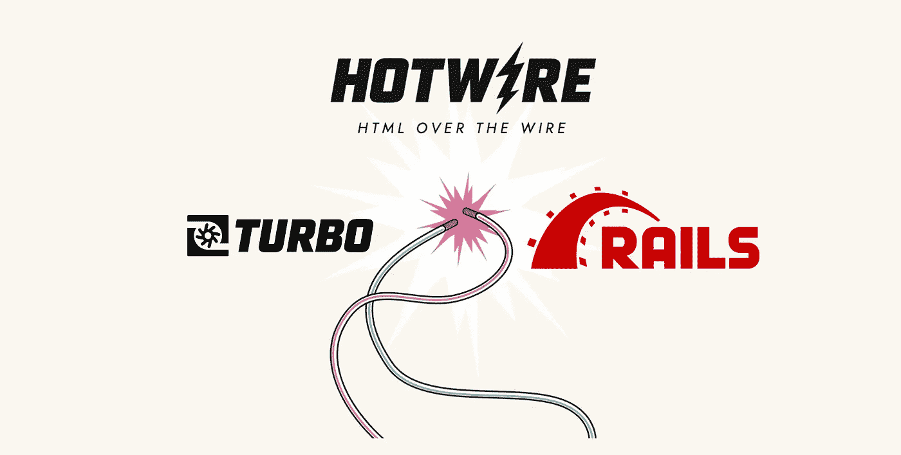
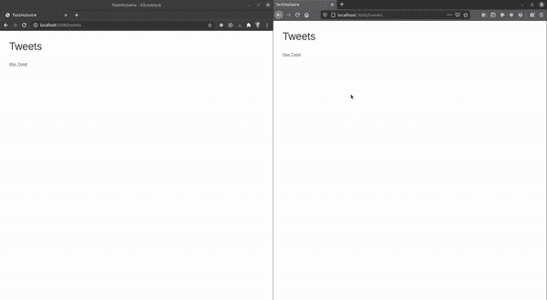

# 使用 Hotwire、ActionText 和 Rails 6 的实时应用程序

> 原文：<https://betterprogramming.pub/hotwire-actiontext-and-rails-6-be025dce7d87>

## 构建实时应用程序的最快方法



作者照片。

Hotwire 是由 Basecamp 开发的一个全新的 HTML-over-WebSocket 框架。它的目的是使用`ActionCable`和 JavaScript 执行实时 DOM 修补。你可以把它比作 Phoenix LiveView，但与 LiveView 不同的是，Hotwire 是无状态的。

我带着 Hotwire 和`ActionText`一起进行了一次试驾，并且能够在不到 30 分钟的时间内建立一个实时的 Twitter feed。你可以在 GitHub 上找到完整的[源代码。](https://github.com/donrestarone/test-hotwire-actiontext-rails)



这是我建造的。

如果你更喜欢视频，这里有一个关于 Hotwire 和 Rails 的速成课程，我可以在这里快速构建一个实时聊天应用程序:

让我们跳进来。

# 生成应用程序

我生成了一个新的应用程序，富有想象力地命名为`test_hotwire`:

```
rails new test_hotwire -d postgresql
```

接下来，我运行`ActionText`生成器来创建必要的样板文件:

```
rails action_text:install
```

将`hotwire-rails`宝石添加到`Gemfile`后，我运行了 Hotwire 的生成器:

```
rails hotwire:install
```

这个生成器做了很多事情，包括设置 Redis(所以要确保有一个`redis-server`在端口 6379 上运行)和`ActionCable`。

为了加快速度，我为 Tweets 生成了一个支架，它可以生成 HTML 模板，以及一个模型和一个控制器:

```
rails g scaffold Tweet
```

要使任何域模型可流式传输，您只需广播到一个名称空间并在视图中引用它。对于`Tweet`模型，当以下事件发生时，Rails 需要向 WebSocket 广播:

1.  推文创作
2.  推文更新
3.  推特删除

`ActiveRecord`钩子非常适合这种事情，所以我在`Tweet`模型中加入了下面的代码:

`app/models/tweet.rb`

现在，每当这些事件触发时，Rails 将广播到一个名为`“tweets”`的公共名称空间。

这些广播事件的订户由`Turbo`设置。要创建一个流，您只需将您需要的任何内容包装在一个 Turbo 帧中。所以对于 tweets 流，我做了以下事情:

app/views/tweets/index . html . erb

在第 13 行，`turbo_stream_from`将建立到`tweets`流的 WebSocket 连接。每当从后端广播事件时，`turbo_frame_tag`将包装 tweets 列表并修补 DOM。

在部分`app/views/tweets/_tweet.html.erb`中，我将每条 tweet 封装在引用其 ID 的`turbo_frame_tag`中，这样编辑和删除可以引用 DOM 上的目标 tweet。

app/views/tweets/_ tweet . html . erb

就是这样！在实际的应用程序中，您可能会为应用程序中的每个流设置名称空间，并以某种方式为它们添加前缀以进行访问控制。但是这个小例子显示了 Rails 和它的第一方库这些年来变得多么强大。

编码快乐！

[沙施克](https://www.linkedin.com/in/shashike-jayatunge/)是一名来自多伦多的软件工程师，也是 [Restarone Inc](https://www.restarone.com) 的创始人。当他不开发软件时，他在 Medium 和 YouTube 上创作内容，帮助人们过渡到技术领域。