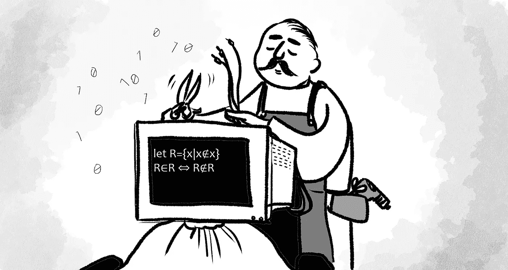
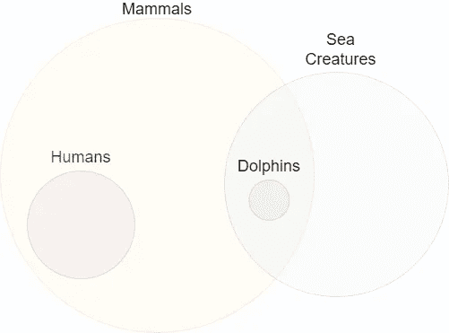

# 一个理发师如何创立计算机科学

> 原文：<https://betterprogramming.pub/how-a-barber-founded-computer-science-175c1c458794>

## 类型理论起源导论

图像由 [Elisa Chang](https://medium.com/@elisatychang) 绘制

"理发师和计算机科学有什么关系？"你可能会问自己。无论您对计算机科学感兴趣，还是已经是一名经验丰富的计算机科学家，本文不仅会回答这个问题，还会告诉您计算机科学不可或缺的一部分的起源:类型。

为了介绍名义上的理发师，考虑下面的谜语:

> 镇上有一个理发师。这个理发师给每个不刮胡子的人刮胡子，不刮别人的。理发师自己刮胡子吗？

为了更好地理解我们应该如何处理这个问题——以及为什么它很重要——我们将首先了解类型的基本原理。

# 那是什么类型的东西？

为了理解我们周围的世界，我们在不同的事物之间画出各种各样的识别线:无论是动物的种类，地震的震级，还是城市的大小。在我们周围的世界中，存在着明显不同类型的事物。狗和人明显不同，这两者都不同于树。

*但是我们如何让这些区别变得足够具体，让计算机能够理解呢？*

一个简单的方法是定义事物的集合，并在这些集合之间建立关系。您可以将器械包想象成上面贴有标签的容器或桶，有点像一个类别。例如，我们可以创建一些动物王国的基本集合，如下所示:

来源:图片由作者提供

虽然这看起来很简单，但是这种概念组织已经给了我们一些方便的功能。例如，如果我知道我的朋友鲍勃是人类，那么我也知道鲍勃一定是哺乳动物。通过将集合放入其他集合，我可以描述一个层次关系。同样，我可以描述海豚如何既是海洋生物*又是哺乳动物*。通过重叠集合，我可以描述与多个概念有共同特征的概念。

# 集合的麻烦和谜底

然而，器械包确实有一些明显的局限性。这是我们回到理发师的地方。回忆一下我们最初的谜语:

> 镇上有一个理发师。这个理发师给每个不刮胡子的人刮胡子，不刮别人的。理发师自己刮胡子吗？

好吧，我们来分析一下。如果我们在这个镇上随便问一个人，“你刮胡子吗？”他们回答“不”，那么我们知道理发师必须给他们剃毛。然而，如果我们问理发师同样的问题呢？

如果理发师说是——他会自己刮胡子，因为我们知道理发师不会给自己刮胡子的人刮胡子，所以理发师不会自己刮胡子。

如果理发师说不——他自己不刮胡子，因为我们知道理发师给所有刮胡子的人刮胡子，所以理发师确实给自己刮胡子。

> 理发师自己刮胡子自己不刮？

很明显，我们的设置有问题。任何导致这种矛盾的问题都是我们所说的悖论。

然而，这个特殊的悖论不只是任何随机的脑筋急转弯——它是计算机科学和数学史上最重要的问题之一。它是由英国著名数学家伯特兰·罗素在 1901 年发现的，被称为罗素悖论。理发师悖论是罗素用一种可以被普遍理解的方式来表达他在集合论中发现的这个问题。

# 如果不是集合，那是什么？

在一个允许像罗素悖论这样的矛盾的理论之上建立一个系统会导致各种各样的问题，那么我们能做什么来代替呢？

导致这个悖论的集合的本质问题是集合可能通过其他集合来描述，包括它们自身。

Russel 试图解决这些问题，开始给集合添加限制，使它们更加有序。这种秩序是以特定规则的形式出现的，这些新的和更复杂的集合应该如何被允许相互作用。在数学和类型理论中，我们称这些规则为公理。

随着时间的推移，随着计算机科学家的争论和合作，这些公理进化了，简单的集合变成了复杂的类型。类型理论会随着时间的推移而发展，事实上现在也是如此。现代编程语言今天依赖于类型理论——区分邮政编码和名字，或者在进行复杂计算时计算保留多少个小数点。

现代编程语言中类型的一些例子是整数:没有小数位的数字，以及字符串:类似文本的句子甚至整本书。

然而，许多计算机科学家在使用字符串、整数或其他复杂类型时可能不知道的是，它们都来自一个非常重要的理发师。