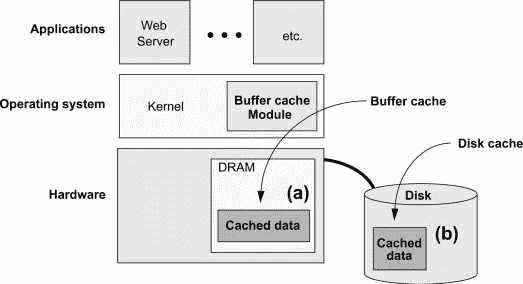
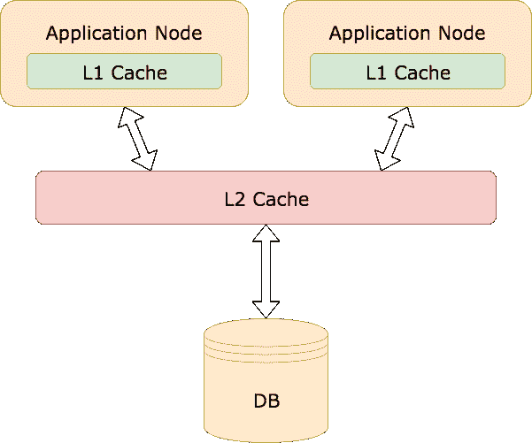
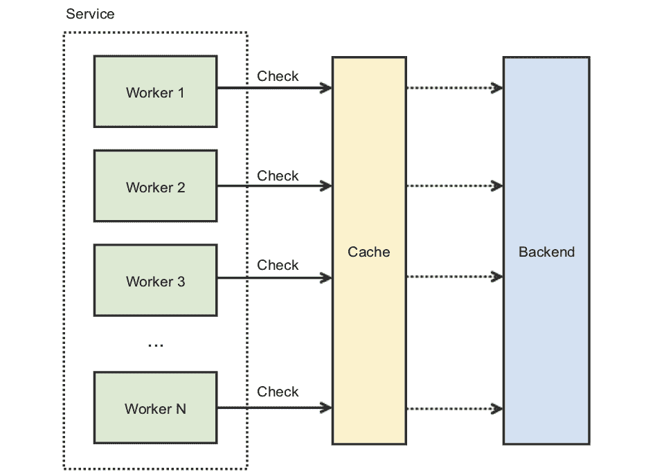
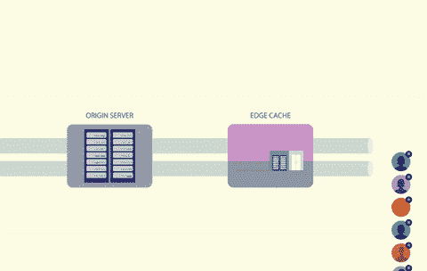
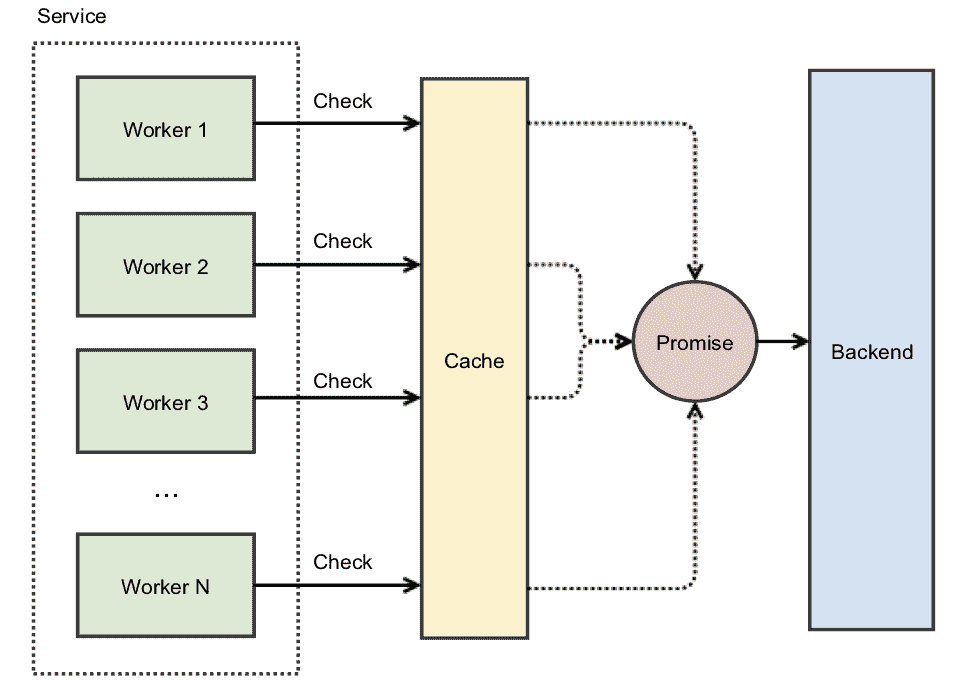
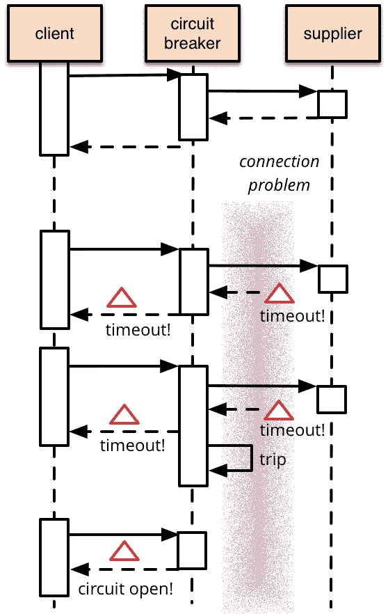
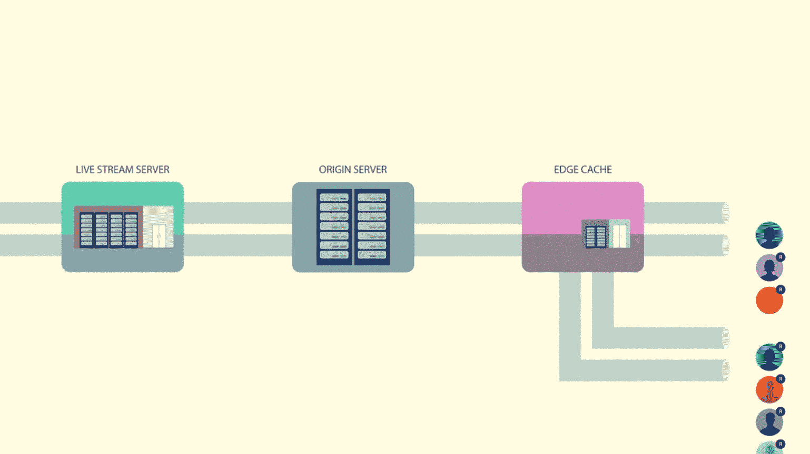

# 缓存踩踏事件如何导致脸书最大的一次停机

> 原文：<https://betterprogramming.pub/how-a-cache-stampede-caused-one-of-facebooks-biggest-outages-dbb964ffc8ed>

## 吸取十年前的工程教训，防止今天的错误


苏珊·尹在 [Unsplash](https://unsplash.com?utm_source=medium&utm_medium=referral) 上的照片

2010 年 9 月 23 日，脸书发生了迄今为止最严重的停电事故之一。网站瘫痪了四个小时。形势如此严峻，工程师们不得不让脸书离线以便恢复。

虽然脸书没有现在这么大，但它仍然有超过 10 亿的用户，它的中断也没有被忽视。人们在推特上抱怨或嘲笑这种情况。


图片来源:[https://www . business insider . com/how-we-weathed-the-great-Facebook-outage-of-2010-2010-9 # the-outage-have-深远后果-7](https://www.businessinsider.com/how-we-weathered-the-great-facebook-outage-of-2010-2010-9#the-outage-had-far-reaching-consequences-7)

那么，到底是什么导致了脸书的衰落呢？[根据事件发生后的公众尸检](https://www.facebook.com/notes/facebook-engineering/more-details-on-todays-outage/431441338919):

> 今天，我们对被解释为无效的配置值的永久副本进行了更改。这意味着每个客户端都会看到无效的值并尝试修复它。因为修复涉及到对一个数据库集群进行查询，所以该集群很快就被每秒成千上万的查询淹没了。

一次糟糕的配置更改导致大量请求涌入他们的数据库。这种请求蜂拥被恰当地称为 [**高速缓存蜂拥**](https://en.wikipedia.org/wiki/Cache_stampede) 。这是困扰科技行业的一个普遍问题。这导致了许多公司的中断，如 2016 年的[互联网档案馆](https://archive.org/index.php)。许多大规模应用每天都在与它斗争，如 Instagram 和 DoorDash。

# 什么是缓存踩踏？

当几个线程试图并行访问一个缓存时，就会发生缓存拥挤。如果缓存的值不存在，线程将同时尝试从原点获取数据。来源通常是数据库，但也可以是 web 服务器、第三方 API 或任何返回数据的东西。

缓存踩踏事件之所以如此具有破坏性，主要原因之一是它会导致恶性故障循环:

1.  大量并发线程会出现缓存未命中，导致它们都调用数据库。
2.  由于巨大的 CPU 峰值，数据库崩溃并导致超时错误。
3.  接收到超时，所有线程重试它们的请求——导致另一个踩踏事件。
4.  周而复始，循环往复。

你不需要像脸书那么大的规模才会患上这种病。它与规模无关，困扰着初创公司和科技巨头。


图片鸣谢:[https://engineering . FB . com/2015/12/03/IOs/under-the-hood-broadcasting-live-video-to-millions/](https://engineering.fb.com/2015/12/03/ios/under-the-hood-broadcasting-live-video-to-millions/)

# 如何防止缓存踩踏事件？

这是一个非常好的问题。这是我在得知脸书停电后问自己的问题。不出所料，自 2010 年以来，已经有大量研究投入到防止缓存踩踏事件中。我通读了一遍。

在本文中，我们将探讨防止和减轻缓存踩踏的不同策略。毕竟你不想等自己停电了才知道有什么安全措施存在。

# 添加更多缓存

一个简单的解决方案就是增加更多的缓存。虽然这似乎有悖常理，但这与操作系统的工作方式类似。

操作系统利用[缓存层次](https://en.wikipedia.org/wiki/Cache_hierarchy)，其中每个组件缓存自己的数据以实现更快的访问。



操作系统缓存(图片来源:【https://www.sciencedirect.com】T4

您可以在您的应用程序中采用类似的模式，通过合并内存缓存，这可以称为第 1 层(L1)缓存。任何远程缓存都将被视为第 2 层(L2)。



图片鸣谢:[https://medium . com/@ door dash/avoiding-cache-stampede-at door dash-55 bbf 596d 94 b](https://medium.com/@DoorDash/avoiding-cache-stampede-at-doordash-55bbf596d94b)

这对于防止频繁访问的数据流失特别有用。即使第 2 层缓存密钥上的密钥过期，几个第 1 层缓存可能仍然存储有该值。这将限制需要重新计算缓存值的线程数量。

然而，这种方法也有一些值得注意的缺点。如果不小心的话，在应用服务器的内存中缓存数据会导致内存不足的问题。尤其是在缓存大量数据的情况下。

此外，这种缓存策略仍然容易受到我所说的跟随者踩踏的影响。


图片鸣谢:[https://engineering . FB . com/2015/12/03/IOs/under-the-hood-broadcasting-live-video-to-millions/](https://engineering.fb.com/2015/12/03/ios/under-the-hood-broadcasting-live-video-to-millions/)

追随者蜂拥的一个例子是当一个名人上传一张新照片或视频到他们的社交媒体账户。当他们的所有追随者都被告知新内容时，他们会争先恐后地观看。由于内容太新，还没有被缓存，导致可怕的缓存踩踏。

那么，我们能对跟随者踩踏事件做些什么呢？

# 锁和承诺

从本质上来说，缓存踩踏是一种竞争情况——多个线程争夺一个共享资源。在这种情况下，共享资源就是缓存。



图片鸣谢:[https://insta gram-engineering . com/thundering-sheets-promises-82191 c8 af 57d](https://instagram-engineering.com/thundering-herds-promises-82191c8af57d)

正如在高度并发的系统中常见的那样，防止共享资源竞争的一种方法是使用锁**。**虽然锁通常用于同一台机器上的线程，但也有办法将[分布式锁](https://redis.io/topics/distlock)用于远程缓存。

通过在缓存键上锁，一次只有一个调用者能够访问缓存。如果密钥丢失或过期，调用者可以生成并缓存数据，同时保持锁定。任何试图从同一个键读取的其他进程都必须等到锁被释放。



图片鸣谢:[https://engineering . FB . com/2015/12/03/IOs/under-the-hood-broadcasting-live-video-to-millions/](https://engineering.fb.com/2015/12/03/ios/under-the-hood-broadcasting-live-video-to-millions/)

使用锁解决了竞争条件问题，但是它又产生了另一个问题。如何处理所有等待锁释放的线程？

你是否使用了一个[自旋锁](https://en.wikipedia.org/wiki/Spinlock)模式，并让线程持续轮询锁？这将创建一个[忙等待](https://en.wikipedia.org/wiki/Busy_waiting)场景。

您是否让线程在检查锁是否空闲之前休眠任意长的时间？现在你手上有了[雷鸣般的羊群问题](https://en.wikipedia.org/wiki/Thundering_herd_problem)。

你是否引入了[回退和抖动](https://www.baeldung.com/resilience4j-backoff-jitter)来防止蜂拥而至？这可能行得通，但眼下有一个更普遍的问题。带有锁的线程必须在释放锁之前重新计算值并更新缓存键。

这个过程可能需要一段时间。尤其是在计算该值很昂贵或者存在网络问题的情况下。如果缓存耗尽了它的可用连接池，并且用户请求被丢弃，这仍然会导致中断。

幸运的是，一些顶级工程组织正在使用一个更简单的解决方案:承诺**。**

## 承诺如何防止自旋锁

引用 Instagram 的工程博客[*&承诺*](https://instagram-engineering.com/thundering-herds-promises-82191c8af57d) :

> 在 Instagram 上，当打开一个新的集群时，我们会遇到一个[缓存踩踏]问题，因为集群的缓存是空的。然后我们使用 promises 来帮助解决这个问题:**不是缓存实际值，而是缓存一个最终将提供值**的 promises。当我们原子性地使用我们的缓存并得到一个未命中时，我们不是立即去后端，而是创建一个承诺并将其插入缓存。这个新的承诺然后开始针对后端的工作。这样做的好处是，其他并发请求不会错过，因为它们会发现现有的承诺——并且所有这些并发的工作机会等待单个后端请求。



图片鸣谢:[https://insta gram-engineering . com/thundering-sheets-promises-82191 c8 af 57d](https://instagram-engineering.com/thundering-herds-promises-82191c8af57d)

通过缓存承诺而不是实际值，不需要自旋锁。第一个获得缓存未命中的线程将使用原子操作(如 Java 的`[computeIfAbsent](https://docs.oracle.com/javase/8/docs/api/java/util/Map.html#computeIfAbsent-K-java.util.function.Function-))`)创建并缓存异步承诺。所有顺序提取请求将立即返回承诺。

您仍然需要使用锁来防止多个线程访问缓存键。但是假设创建一个承诺是一个近乎瞬时的操作，线程在自旋锁中停留的时间长度可以忽略不计。

[这正是 DoorDash 避免缓存踩踏的方法。](https://doordash.engineering/2018/08/03/avoiding-cache-stampede-at-doordash/)

但是如果重新计算缓存的值需要相对较长的时间呢？即使线程能够立即获取缓存的承诺，它们仍然需要等待异步进程完成，然后才能返回值。

虽然这种情况不一定算停机，但它会影响尾部延迟和整体用户体验。如果保持较低的尾部延迟对您的应用程序很重要，那么还有另一个策略可以考虑。

# 早期重新计算

提前重新计算(也称为提前终止)背后的想法很简单。在缓存键正式过期之前，会重新计算值并延长过期时间。这确保了缓存总是最新的，并且永远不会发生缓存未命中。

早期重新计算最简单的实现是后台进程或 cron 作业。例如，假设有一个缓存键的生存时间(TTL)将在一小时后到期，计算该值需要两分钟。cron 作业可以在一个小时结束前五分钟运行，并在更新后将 TTL 延长一个小时。

虽然这个想法在理论上很简单，但有一个明显的缺点。除非您确切知道将使用哪些缓存键，否则您需要重新计算缓存中的每个键。这可能是一个非常费力和昂贵的过程。它还需要维护另一个运动部件，如果该部件出现故障，则没有简单的求助手段。

由于这些原因，我在生产环境中找不到任何这种早期重新计算的例子。但是有一种*是*用的。

## 概率早期重新计算

2015 年，一组研究人员发布了一份名为[最佳概率缓存踩踏预防](https://cseweb.ucsd.edu/~avattani/papers/cache_stampede.pdf)的白皮书。在这篇文章中，他们描述了一种算法，用于最佳地预测在缓存到期之前何时重新计算缓存值。

研究论文中有很多数学理论，但算法归结起来是这样的:

```
currentTime - ( timeToCompute * beta * log(rand()) ) > expiry
```

*   `currentTime`是当前时间戳。
*   `timeToCompute`是重新计算缓存值所需的时间。
*   `beta`为大于 0 的非负值。它默认为 1，但可以配置。
*   `rand()`是一个返回 0 到 1 之间的随机数的函数。
*   `expiry`是缓存值设置为过期的未来时间戳。

这个想法是，每次线程从缓存中取数据时，它都会运行这个算法。如果它返回 true，那么该线程将自愿重新计算值。越接近到期时间，该算法返回 true 的几率就会显著增加。

虽然这种策略不是最容易理解的，但它实现起来相当简单，并且不需要任何额外的活动部件。它也不需要重新计算缓存中的每个值。

在 2016 年总统辩论期间的一次中断后，[互联网档案馆](https://archive.org/index.php)开始使用这种方法。这个来自 RedisConf17 的[演讲更深入地讲述了这个故事，并且很好地概述了概率早期重新计算是如何工作的。我*高度*推荐送它一块手表:](https://www.youtube.com/watch?v=1sKn4gWesTw)

然而，早期的重新计算假设有一个值需要重新计算——它本身并不能防止追随者蜂拥而至。为此，你需要将它与锁和承诺结合起来。

# 如何阻止正在发生的踩踏事件

脸书的缓存踩踏事件如此具有破坏性的原因之一是，即使工程师们找到了解决方案，他们也无法部署它，因为踩踏事件仍在继续。

从[死后](https://www.facebook.com/notes/facebook-engineering/more-details-on-todays-outage/431441338919):

> 更糟糕的是，每次客户机在查询数据库时出错，它都会将其解释为无效值，并删除相应的缓存键。这意味着即使在最初的问题被修复后，查询流仍会继续。只要数据库无法满足某些请求，它们就会给自己带来更多的请求。我们进入了一个不允许数据库恢复的反馈循环。

现实是，没有人能保证预防总是有效的。你也需要缓解。防御程序表明，应该有一个计划，以防踩踏事件绕过你的障碍。

幸运的是，有一个已知的模式来处理这个问题。

## 断路

编程中断路器的想法并不新鲜。它在迈克尔·尼加德出版了 [*之后开始流行起来！*2007 年](https://www.amazon.com/gp/product/0978739213)。正如马丁·福勒在他的文章 [*断路器*](https://www.martinfowler.com/bliki/CircuitBreaker.html) *:* 中所写的

> 断路器背后的基本思想非常简单。您将受保护的函数调用包装在断路器对象中，断路器对象监视故障。一旦故障达到某个阈值，断路器就会跳闸，对断路器的所有进一步调用都会返回一个错误，而根本不会进行受保护的调用。



图片来源:[https://www.martinfowler.com/bliki/CircuitBreaker.html](https://www.martinfowler.com/bliki/CircuitBreaker.html)

断路器是反应性的，这意味着它们不能防止断电。但它们将防止连锁故障。当事情失去控制时，它提供了一个终止开关。如果脸书使用了断路器，他们就可以避免让整个网站离线。

诚然，断路器在 2010 年没有那么受欢迎。现在有几个自带断路烘焙的库，比如 [Resilience4j](https://resilience4j.readme.io/) 、 [Istio](https://istio.io/) 、 [Envoy](https://www.envoyproxy.io/) 。一些组织在生产中使用这些服务，比如网飞和 Lyft。

# 脸书吸取了什么教训？

我在这篇文章中谈了很多解决缓存踩踏的不同策略，以及其他科技公司是如何使用它们的。但是脸书本身呢？

他们从停机中吸取了什么教训？他们采取了什么保护措施来防止这种情况再次发生？

他们的工程帖子， [*Under the hood:向数百万人直播视频*](https://engineering.fb.com/2015/12/03/ios/under-the-hood-broadcasting-live-video-to-millions/) ，讨论了他们对其架构所做的改进。它讨论了我们已经讨论过的内容，比如缓存层次结构，但也包括一些新颖的方法，比如 HTTP 请求合并。这篇文章值得一读，但是如果你时间不够，这个[视频提供了一个全面的概述](https://www.facebook.com/Engineering/videos/10153675295382200/?t=0)。

只要说脸书已经从过去的错误中吸取了教训就够了。



图片鸣谢:[https://engineering . FB . com/2015/12/03/IOs/under-the-hood-broadcasting-live-video-to-millions/](https://engineering.fb.com/2015/12/03/ios/under-the-hood-broadcasting-live-video-to-millions/)

# 离别的思绪

虽然我相信了解缓存踩踏如何对系统造成破坏，但我不认为每个技术团队都必须立即添加这些措施。您选择如何处理缓存拥挤将取决于您的用例、架构和流量负载。

但是，如果你发现自己正在与自己的庞大群体作战，意识到缓存踩踏事件并了解可能的解决方案将对你有所裨益。

[*订阅我的个人资料*](https://medium.com/subscribe/@SunnyB) *如果你想在我上传新故事时得到通知。*