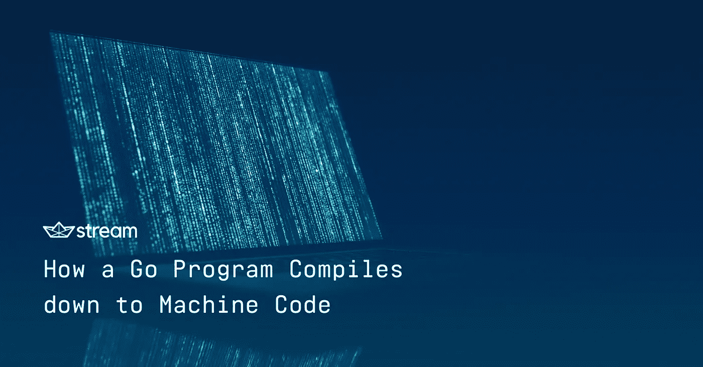
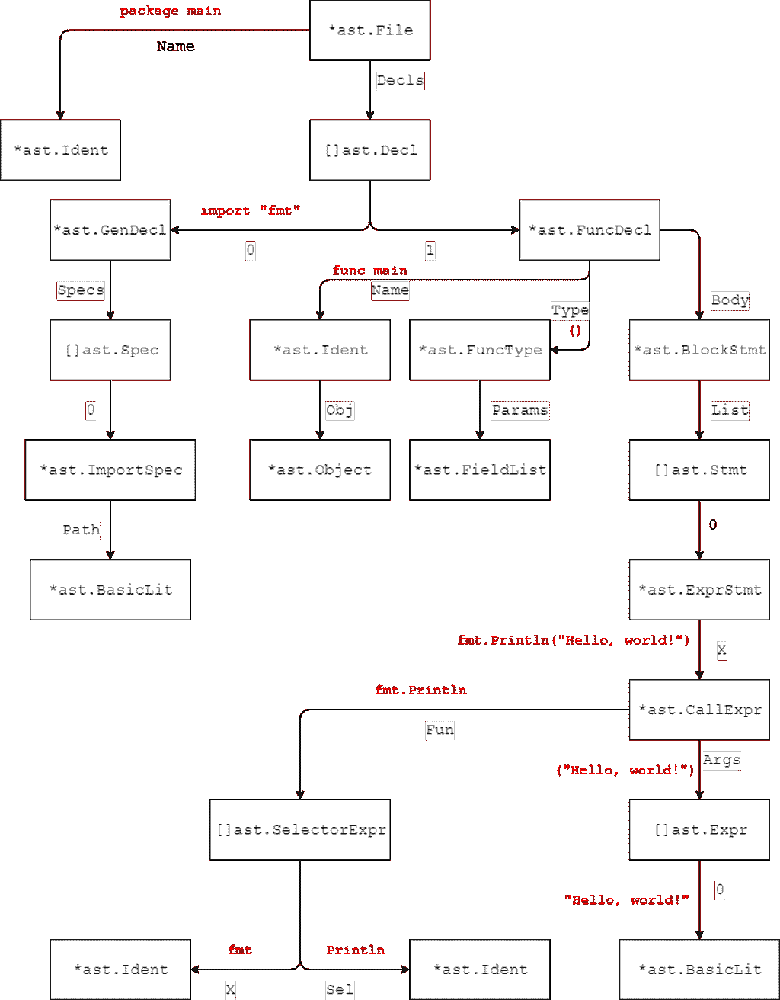
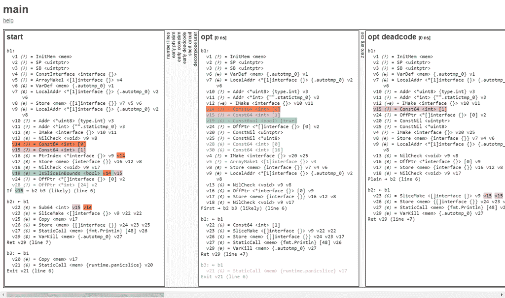

# Go 程序如何编译成机器代码

> 原文：<https://betterprogramming.pub/how-a-go-program-compiles-down-to-machine-code-e4532dc8b8ca>

https://getstream.io/blog

## 深入了解编译器的扫描器、解析器和代码生成阶段

在 [Stream](https://getstream.io) 这里，我们广泛使用围棋，它极大地提高了我们的生产力。我们还发现，通过使用 Go，速度非常快，而且自从我们开始使用它以来，我们已经实现了堆栈中的关键任务部分，例如由 gRPC、Raft 和 RocksDB 支持的内部存储引擎。

今天我们将看看 Go 1.11 编译器，以及它如何将 Go 源代码编译成可执行文件，以了解我们日常使用的工具是如何工作的。我们还将看到为什么 Go 代码如此之快，以及编译器如何帮助。我们将看看编译器的三个阶段:

*   扫描器将源代码转换成标记列表，供解析器使用。
*   解析器，它将标记转换成抽象语法树，供代码生成使用。
*   代码生成，将抽象语法树转换成机器代码。

*注意:我们将要使用的包(* `*go/scanner*` *，* `*go/parser*` *，* `*go/token*` *，* `*go/ast*` *等)。)并不由 Go 编译器使用，而是主要提供给工具使用，以对 Go 源代码进行操作。然而，实际的 Go 编译器具有非常相似的语义。它不使用这些包，因为编译器曾经是用 C 编写的，并被转换成 Go 代码，所以实际的 Go 编译器仍然会让人想起那个结构。*

# 扫描仪

每个编译器的第一步是将原始源代码文本分解成标记，这是由扫描器(也称为 lexer)完成的。标记可以是关键字、字符串、变量名、函数名等。每个有效的程序“单词”都由一个令牌表示。用 Go 的具体术语来说，这可能意味着我们有一个令牌“package”、“main”、“func”等等。

每个标记都由它在 Go 中的位置、类型和原始文本来表示。Go 甚至允许我们通过使用`go/scanner`和`go/token`包在 Go 程序中自己执行扫描仪。这意味着我们可以检查我们的程序在被扫描后在 Go 编译器看来是什么样子。为此，我们将创建一个简单的程序来打印“Hello World”程序的所有令牌。

该程序将如下所示:

我们将创建我们的源代码字符串并初始化`scanner.Scanner` 结构，它将扫描我们的源代码。我们尽可能多地调用`Scan()`,并打印令牌的位置、类型和文字字符串，直到到达文件结尾(EOF)标记。

当我们运行该程序时，它将打印以下内容:

这里我们可以看到 Go 解析器在编译程序时使用了什么。我们还可以看到，扫描器在 c 等其他编程语言中通常放置分号的地方添加了分号。这解释了为什么 Go 不需要分号:它们是由扫描器智能放置的。

# 句法分析程序

扫描完源代码后，它将被传递给解析器。解析器是编译器的一个阶段，它将标记转换成抽象语法树(AST)。AST 是源代码的结构化表示。在 AST 中，我们将能够看到程序结构，比如函数和常量声明。

Go 再次为我们提供了解析程序和查看 AST 的包: **go/parser** 和 **go/ast** 。我们可以像这样使用它们来打印完整的 AST:

**输出**:

在这个输出中，您可以看到关于这个程序的很多信息。在 **Decls** 字段中，有一个文件中所有声明的列表，比如导入、常量、变量和函数。在这种情况下，我们只有两个:我们导入的 **fmt** 包和 main 函数。

为了进一步理解它，我们可以看一下这个图表，它是上述数据的一个表示，但只包括类型和对应于节点的红色代码:

主函数由三部分组成:名称、声明和主体。该名称用值为 main 的标识符表示。由 Type 字段指定的声明将包含一个参数和返回类型的列表，如果我们指定了任何类型的话。主体由一个包含程序所有行的语句列表组成，在本例中只有一行。

我们的单个`fmt.Println`语句由 AST 中的几个部分组成。该语句是一个`ExprStmt`，它表示一个表达式，例如，它可以是一个函数调用，就像这里一样，或者它可以是一个文字、一个二元运算(例如加法和减法)、一个一元运算(例如对一个数字求负)等等。任何可以在函数调用的参数中使用的东西都是表达式。

我们的`ExprStmt`包含一个`CallExpr`，这是我们实际的函数调用。这也包括几个部分，其中最重要的是`Fun`和`Args`。Fun 包含对函数调用的引用，在本例中，它是一个`SelectorExpr`，因为我们从`fmt`包中选择了`Println`标识符。然而，在 AST 中，编译器还不知道`fmt`是一个包，它也可能是 AST 中的一个变量。

Args 包含作为函数参数的表达式列表。在本例中，我们向函数传递了一个文字字符串，因此它由类型为`STRING`的`BasicLit`表示。

很明显，我们能够从 AST 中推断出很多东西。这意味着我们还可以进一步检查 AST，例如找到文件中的所有函数调用。为此，我们将使用 ast 包中的`Inspect`函数。这个函数将递归遍历树，并允许我们检查来自所有节点的信息。

为了提取所有函数调用，我们将使用以下代码:

我们在这里所做的是寻找所有节点，以及它们是否属于类型`*ast.CallExpr`，我们刚刚看到它代表了我们的函数调用。如果是，我们将使用打印机包打印该函数的名称，它出现在`Fun`成员中。

此代码的输出将是:

`fmt.Println`

这确实是我们简单程序中唯一的函数调用，所以我们确实找到了所有的函数调用。

在构建了 AST 之后，所有的导入都将使用 GOPATH 进行解析，或者对于 Go 1.11 和更高版本的[模块](https://github.com/golang/go/wiki/Modules)。然后，将检查类型，并应用一些初步优化，使程序的执行更快。

# 代码生成

在解析了导入并检查了类型之后，我们确定程序是有效的 Go 代码，我们可以开始将 AST 转换为(伪)机器码的过程。

这个过程的第一步是将 AST 转换成程序的低级表示，特别是转换成静态单次分配(SSA)形式。这个中间表示并不是最终的机器码，但它确实更多地表示了最终的机器码。SSA 有一组属性，使得应用优化变得更加容易，其中最重要的是，变量总是在使用之前就被定义，并且每个变量只被赋值一次。

在 SSA 的初始版本生成之后，将应用大量的优化过程。这些优化应用于某些代码，可以使处理器执行起来更简单或更快。例如，死代码，如`if (false) { fmt.Println(“test”) }`可以被消除，因为这将永远不会执行。优化的另一个例子是，某些零校验可以被删除，因为编译器可以证明这些不会为假。

现在让我们看看 SSA 和这个简单程序的一些优化过程:

如您所见，这个程序只有一个函数和一个导入。运行时将打印 2。然而，这个示例将足以查看 SSA。

*注意:只显示主函数的 SSA，因为这是有趣的部分。*

为了显示生成的 SSA，我们需要将环境变量`GOSSAFUNC`设置为我们想要查看 SSA 的函数，在本例中是 main。我们还需要将`-S`标志传递给编译器，这样它将打印代码并创建一个 HTML 文件。我们还将为 Linux 64 位编译该文件，以确保机器代码与您在这里看到的代码相同。因此，为了编译这个文件，我们将运行:

`$ GOSSAFUNC=main GOOS=linux GOARCH=amd64 go build -gcflags “-S” simple.go`

它将打印所有的 SSA，但也会生成一个交互式的`ssa.html`文件，所以我们将使用它。

当你打开`ssa.html`时，会显示多个通道，其中大部分是折叠的。开始阶段是从 AST 生成的 SSA 下一步将非机器专用 SSA 转换为机器专用 SSA，并且`genssa`是最终生成的机器代码。

开始阶段的代码如下所示:

这个简单的程序已经生成了相当多的 SSA(总共 35 行)。然而，很多都是样板文件，很多都可以删除(最终的 SSA 版本有 28 行，最终的机器码版本有 18 行)。

每个 v 都是一个新变量，可以点击查看它的使用位置。 **b 的**是块，所以在这种情况下，我们有三个块: **b1、b2** 和 **b3。b1** 将一直被执行。 **b2** 和 **b3** 是条件块，如果 v19 → b2 b3(可能)在 **b1** 结束时，可以通过**看到。我们可以点击那一行的 **v19** 来查看 **v19** 是在哪里定义的。我们看到它被定义为`IsSliceInBounds`**<bool>v14v 15**，通过[查看 Go 编译器源代码](https://github.com/golang/go/blob/3fd364988ce5dcf3aa1d4eb945d233455db30af6/src/cmd/compile/internal/ssa/gen/genericOps.go#L411)我们可以看到`IsSliceInBounds`检查那个`0 <= arg0 <= arg1`。我们还可以单击 **v14** 和 **v15** 来查看它们是如何定义的，我们会看到`v14 = Const64 <int> [0]; Const64`是一个恒定的 64 位整数。 **v15** 的定义与 **1** 相同。所以，我们本质上有 0 < = 0 < = 1，这显然是对的。**

编译器也能够证明这一点，当我们查看 **opt** 阶段(“独立于机器的优化”)时，我们可以看到它已经将 **v19** 重写为`ConstBool <bool> [true]`。这将用于`opt deadcode`阶段，其中 **b3** 被移除，因为来自之前所示条件的 **v19** 始终为真。

我们现在来看看另一个更简单的优化，它是由 Go 编译器在 SSA 被转换成特定于机器的 SSA 之后进行的，所以这将是 amd64 架构的机器代码。为此，我们将比较较低的死码和较低的死码。这是下一阶段的内容:

在 HTML 文件中，一些行是灰色的，这意味着它们将在下一个阶段被删除或更改。例如， **v15** ( `MOVQconst <int> [1]`)灰显。通过点击进一步检查 **v15** ，我们看到它没有在其他地方使用，并且`MOVQconst`本质上与我们之前看到的指令 **Const64** 相同，只是对于 **amd64** 是机器专用的。因此，我们将 **v15** 设置为 **1** 。而 **v15** 在其他地方都没用，所以是无用(死)代码，可以淘汰。

Go 编译器应用了很多这样的优化。因此，虽然来自 AST 的第一代 SSA 可能不是最快的实现，但是编译器将 SSA 优化为一个更快的版本。HTML 文件中的每个阶段都有可能加速。

如果你有兴趣了解更多关于 Go 编译器中的 SSA，请查看 [Go 编译器的 SSA 源代码](https://github.com/golang/go/tree/master/src/cmd/compile/internal/ssa)。这里定义了所有的操作和优化。

# 结论

Go 是一种非常高效和高性能的语言，受其编译器和优化的支持。了解更多关于 Go 编译器的知识，[源代码](https://github.com/golang/go/tree/master/src/cmd/compile)有一个很棒的`README`。

如果你想了解更多关于为什么 Stream 使用 Go，特别是为什么我们从 Python 转向 Go，请查看[我们关于切换到 Go 的博客文章](https://getstream.io/blog/switched-python-go/)。