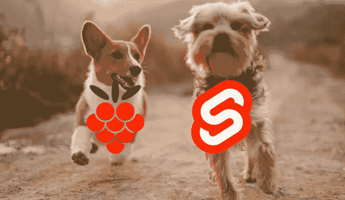
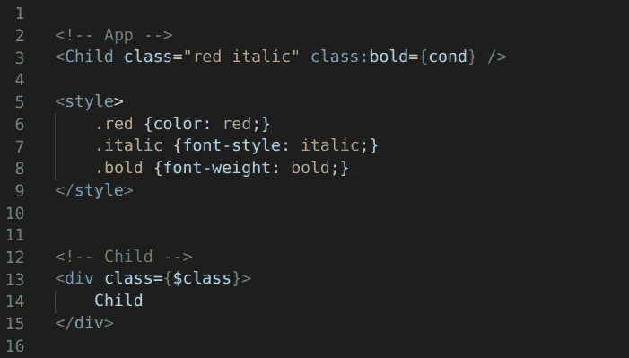
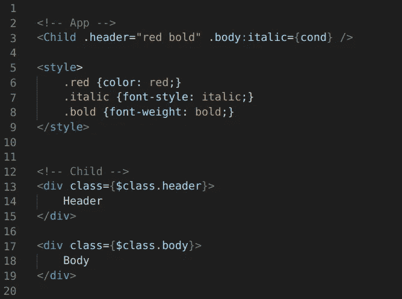
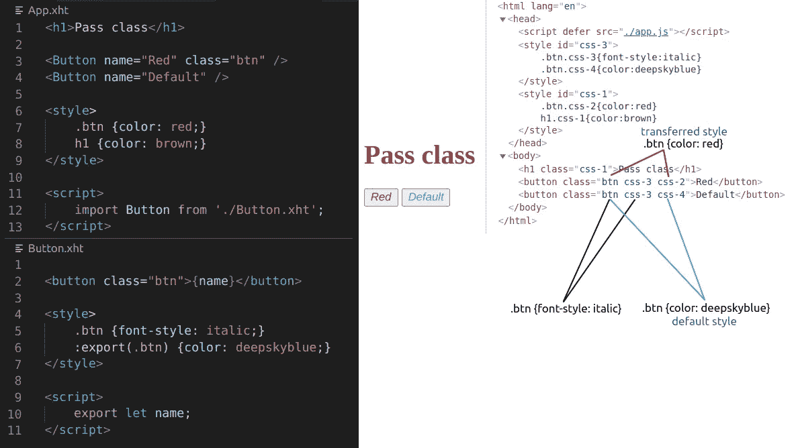
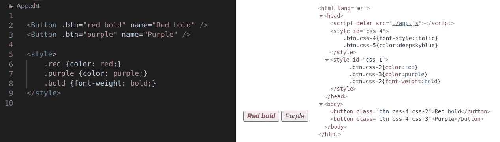
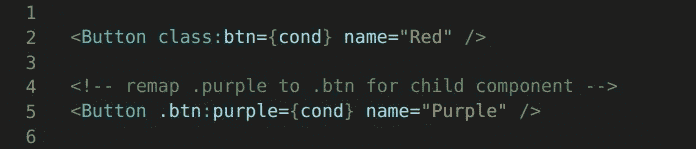

# 一个受欢迎的特色节目如何在 Malina.js 上线

> 原文：<https://betterprogramming.pub/how-a-popular-feature-declined-by-svelte-went-live-in-malina-js-1a08fdb9dbc4>

## 如何将 CSS 类传递给子组件



在 [Unsplash](https://unsplash.com/) 上由 [Alvan Nee](https://unsplash.com/@alvannee) 拍摄的照片。

我发现在 [Svelte](https://svelte.dev/) 社区中的开发人员经常谈论将类传递给子组件，父组件如何影响子组件的样式，以及改变边距、颜色和其他样式。除此之外，Svelte 还有一系列与此相关的问题:

*   [将类传递给组件#2870](https://github.com/sveltejs/svelte/issues/2870)
*   [允许作用域类传递给子组件#4843](https://github.com/sveltejs/svelte/issues/4843)
*   [部件#5236 的分类指令](https://github.com/sveltejs/svelte/issues/5236)
*   [允许父组件影响子组件 CSS #22](https://github.com/sveltejs/rfcs/pull/22)
*   [部件#4749 的分类指令](https://github.com/sveltejs/svelte/pull/4749)

使用`:global`可以解决一些情况，但是这不是一个非常方便的方法，并且会对其他组件产生不必要的影响。

所以我们在 [Malina.js](https://github.com/malinajs/malinajs) 社区(是的，我们有一个小社区)尝试了一些东西，并决定尝试将一个类传递给一个组件。

# 属性$class

因此，我们想到的第一种方法是创建一些`$class` -object/string，其中包含带有父组件的 CSS-hash 的转移类。但是使用父散列会产生不必要的效果，CSS 类可能会流出。为了使这些类相互隔离，它们应该有自己的 CSS-hash。因此，除了父组件和子组件有自己的 CSS-hash 之外，被转移的类也必须有自己的 CSS-hash，以便与父组件隔离开来，并且只影响某些组件。

结果，一个父组件收集了所有的类，并通过*和*将它们传输到一个`$class`中的子组件。



将类传递给子组件的$class。

*   [活生生的例子](https://malinajs.github.io/repl/#/gist/df8f752ffdbd5531b2ff9449d93a186b&version=0.5.24)

# 名为$class

但是只有一个`**$**class`可能还不够。如果一个组件有头和体怎么办？在本例中，我想传递 2 个类属性。为此，您可以在子组件中使用`$class.header`和`$class.body`。对于一个父组件，应该可以指定一个子类名称和父类名称，但是我们还没有找到一个好的语法。
`<Child class.header:parentclass={cond} />`长得很丑，所以我们就把它截成了`<Child .header="parent" />`。对于类指令:

```
<Child .header:parent={cond} />
```



传递 class.header 和 class.body

*   [实例](https://malinajs.github.io/repl/#/gist/3f0c69dffaaaae04695cce521670cbf1&version=0.5.24)

如果你对什么语法更合适有任何想法，请在评论中留下。

# 导出或导入类

在模板中使用`$class`看起来不太自然，所以我们可以从父类中采用一个类，这样就可以像普通类一样使用它，并使用类指令。

在 Svelte 中，我们使用关键字`export`来接受来自父组件的属性/属性以及特定的 CSS 语法`:global`。因此，我们制定了一个类似的语法来接受来自父类的 CSS 类:

```
:export(.class-name) {…default-style…}
```

对此可能有一个更好的关键词。你也可以在评论中提出建议。

示例:我们在子组件中有一个按钮。它有一个`.btn`类，所以在样式中，我可以将`.btn`分成两个规则:

```
.btn {font-style: italic}
:export(.btn) {color: deepskyblue}
```

在这种情况下，第一个规则(使用`font-style`)总是应用于按钮，但是第二个规则(使用`color`)仅在父类没有通过`btn`类时才应用。否则，父类中的类将应用于按钮。



如何从父类中继承类的示例

*   [活生生的例子](https://malinajs.github.io/repl/#/gist/8943e3b6ce77ce38125072033e7e6560&version=0.5.24)

示例中的散列(`css-1, css2…`)由选项`cssGenId`设置，看起来更简单。你可以为一个散列指定任何样式(不在苗条[问题](https://github.com/sveltejs/svelte/issues/2900))。

如果您想在父组件中使用另一个名称的类，很容易重新映射它。在下面的例子中，我将类`red + bold`转发到一个按钮，将`purple`转发到另一个按钮。



重映射类:红色+粗体-> btn

*   [实例](https://malinajs.github.io/repl/#/gist/dd1727edd04661badb535caa0a88b8fa&version=0.5.24)

此外，您可以使用类指令。



用类指令传递类。

# 隔离

js 为传递类创建了一个额外的 CSS-hash。它可以让你隔离这些类，以免影响其他组件，就像使用`:global`一样。另外，这并不意味着父类可以将任何类转发给你的组件。通过使用关键字`:export`，您可以指定想要接受哪些类，这就像是父组件和子组件之间的契约。这类似于`export`对房地产所做的。

# 结论

*   这个解决方案没有创建新的样式(规则)。它只是将新的选择器附加到现有的样式上，所以 CSS 不会快速增长。
*   几乎所有的工作都是在编译时完成的。运行时相当轻便。
*   `Transfer-hash`确保课程不会外流。
*   `:export`关键字让你只接受期望的类，所以你仍然有一个子组件中的控件。

这些要点表明，将类传递给组件是安全的、轻量级的，并且为设计可重用的组件提供了一定的灵活性。

此外，你可以阅读一篇关于片段的文章。

我们应该尝试的下一个功能是什么？感谢阅读。

# 链接

*   [Malina.js](https://github.com/malinajs/malinajs)
*   [REPL 为 Malina.js](https://malinajs.github.io/repl/)