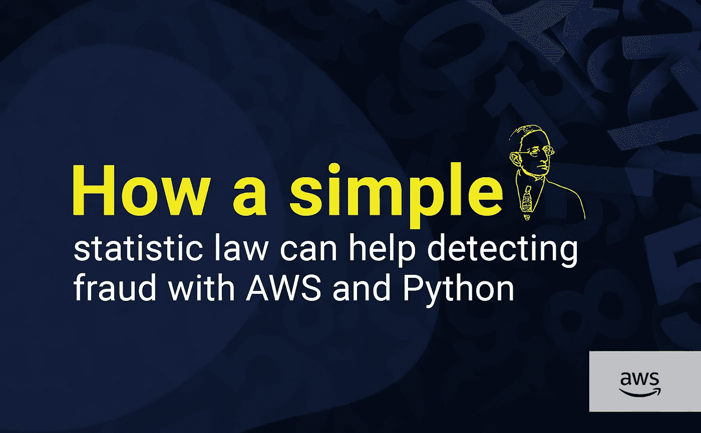
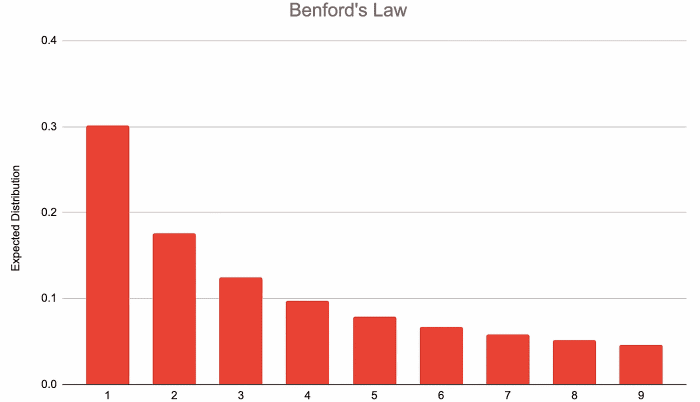
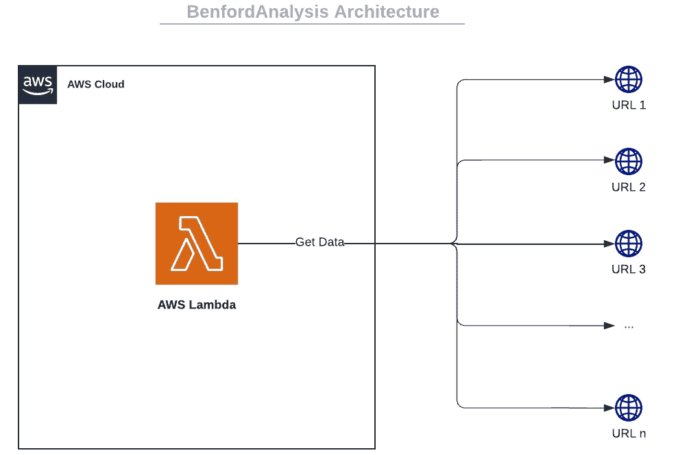
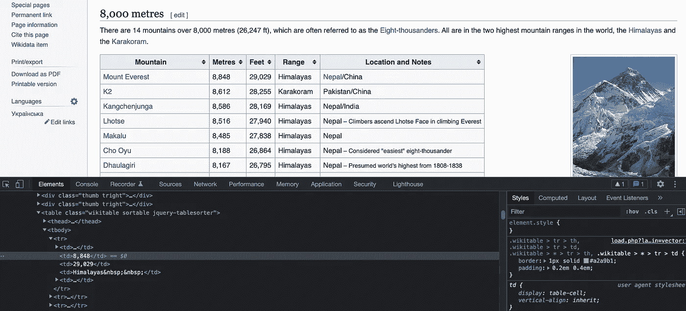
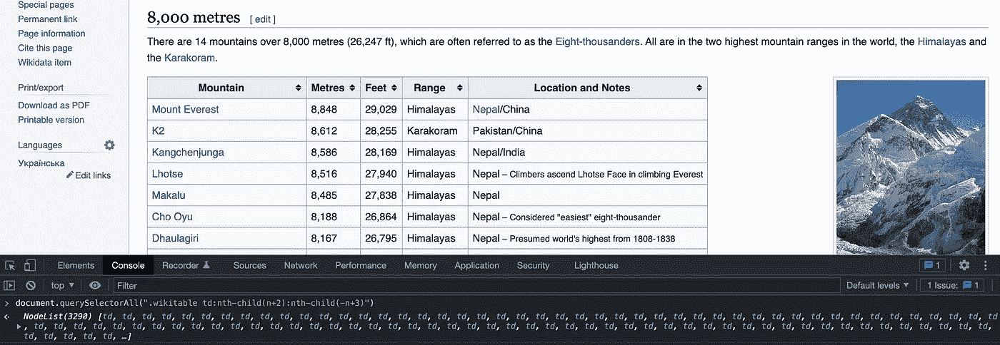
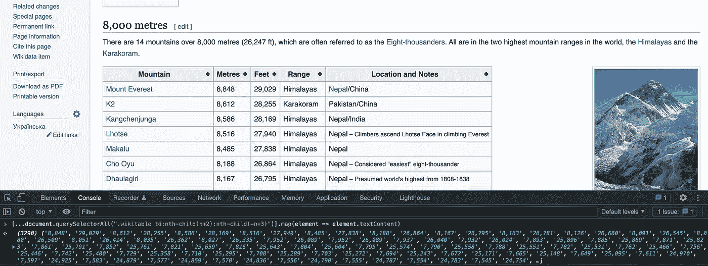
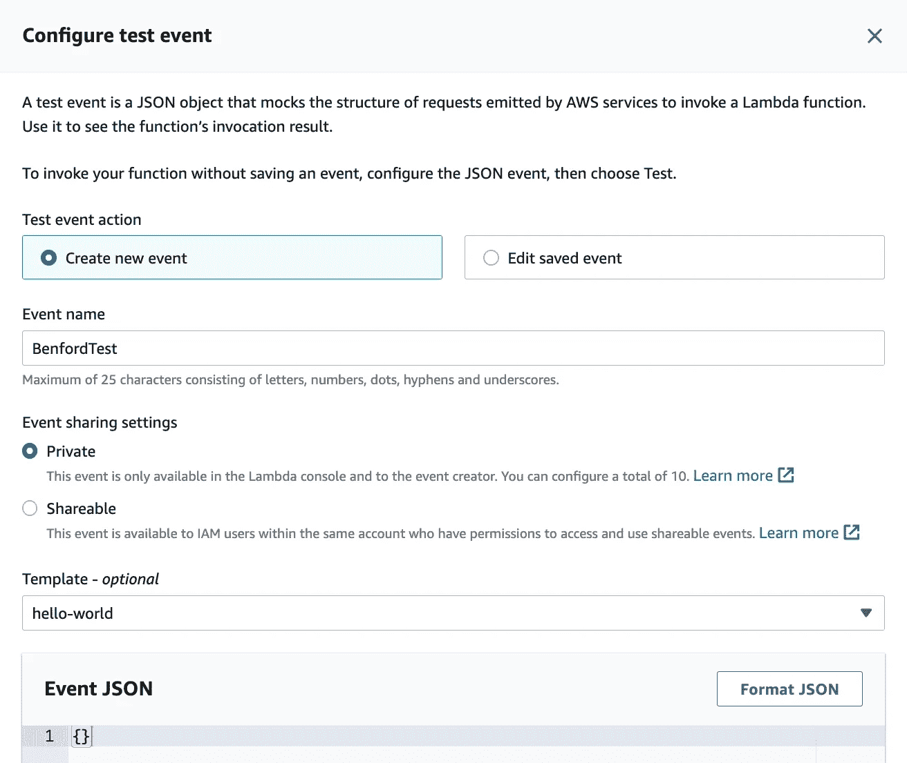
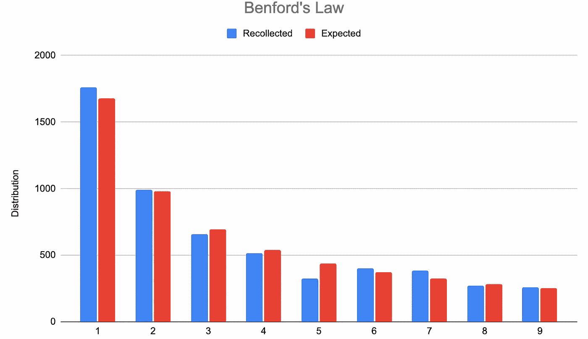
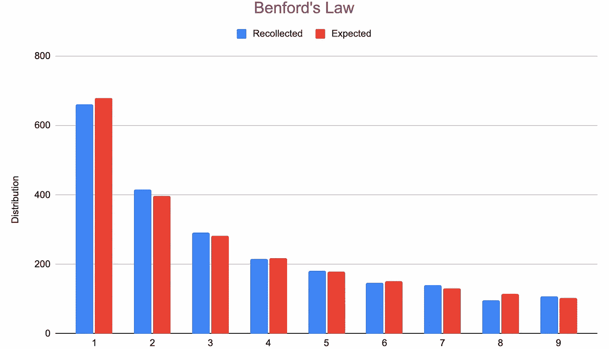

# 本福德定律如何帮助利用 AWS 和 Python 检测欺诈

> 原文：<https://betterprogramming.pub/how-a-simple-statistic-law-can-help-detecting-fraud-with-aws-and-python-ccf4e5a037a0>

## 用 Amazon Web Services 和 Python 检验统计法的有效性



插图由[吉安卡·查瓦斯特](https://www.instagram.com/niimde/)

弗兰克·本福特是一名电气工程师，他因重新发现了数据列表中数字出现的统计学好奇心而闻名。这种好奇心被称为[本福德定律](https://en.wikipedia.org/wiki/Benford%27s_law)或异常数字定律，在会计欺诈检测、刑事审判、选举数据等方面都有应用。

# 异常是什么？

这个很简单。列出你能找到的日常数字，比如你最喜欢的书的页数，你家附近河流的长度，你所在城镇的居民人数，你所在国家的土地面积等等。

然后，计算这些数字中有多少是以 1、2 等开头的。常识告诉我们，每个前导数字的分布都是相似的，但事实并非如此。分布是对数的，如下所示:



公式如下:

```
P(d) = log(1 + 1 / d)
d ∈ [1, ..., 9]
```

**注意事项**:

*   `**d**`是 1 到 9 之间的整数(不考虑 0)。
*   `**P(d)**`代表`**d**`是首位数字的概率。
*   `**log**`是指[以 10 为底的对数](https://en.wikipedia.org/wiki/Common_logarithm)。

换句话说，你的城市有 10 万或 100 万居民的可能性比有 90 万或 900 万居民的可能性更大。听起来很不可思议吧？让我们检查一下！

# 工作区

首先，我们需要建立一个庞大的日常生活数字列表。这些数字很容易在互联网上找到，我们只需要从网站上复制它们，然后分析它们。但是天啊，这听起来太无聊了！我们想处理大量数据，这可能需要几个小时！

另一个解决方案是与拥有像 Reddit 这样的 API 的网站或平台合作。然而，这是相当有限的:不是所有的网站都有 API，我们必须实现每个网站一个集成，这是费力的，最终令人厌烦。

希望有更好的解决方法。你还记得我之前的一篇关于 PDF 生成系统的文章吗？我们将重用主要组件来创建一个自动化的数据提取系统。

[](/generating-stunning-pdf-reports-with-aws-and-python-a47274afe03d) [## 使用 AWS 和 Python 生成令人惊叹的 PDF 报告

### 用 Amazon Web Services 和 Python 构建一个完整的 PDF 生成系统

better 编程. pub](/generating-stunning-pdf-reports-with-aws-and-python-a47274afe03d) 

我们将这样做:在 Lambda 上运行一个 Chromium 实例，访问一系列网站，并从中检索相关数据。然后我们将处理数据，并与预期结果进行比较。



本文将关注 Lambda 部分和数据提取。如果您想与 Cognito、API Gateway + Authorizer 和 RDS 数据库进行很好的集成，我邀请您阅读下面的文章:

[](/how-i-built-a-hotel-platform-with-unity3d-and-aws-22bd3c315d81) [## 我如何使用 Unity3D 和 AWS 构建酒店平台

### 使用 Amazon Web Services 构建一个完整的可扩展云架构

better 编程. pub](/how-i-built-a-hotel-platform-with-unity3d-and-aws-22bd3c315d81) 

# 选择网站

现在，我们需要找到包含我们实验相关数据的网站。我强烈推荐以下内容:

*   避免下载缓慢的网站或带有某种类型的[验证码](https://en.wikipedia.org/wiki/CAPTCHA)或 [CloudFlare](https://en.wikipedia.org/wiki/Cloudflare) 保护的网站。
*   此外，确保所提供的数据是一致的和有参考价值的:我们需要高质量的数据来检验本福特定律的有效性。
*   如果可能的话，最好是包含格式良好的数据的网站，包含在 HTML 表格中。

# 选择器和 JavaScript 表达式

让我们从这篇伟大的维基百科文章开始:[按海拔排列的山脉列表](https://en.wikipedia.org/wiki/List_of_mountains_by_elevation)。

我们可以算出文章的相关数据(每座山的海拔以米和英尺为单位)位于几个带有`**wikitable**`类的 HTML 表格的第二列和第三列:



我们知道数据在哪里，现在可以通过`[querySelectorAll](https://developer.mozilla.org/en-US/docs/Web/API/Document/querySelectorAll)` JavaScript 方法提取数据。我们使用 CSS 选择器`**.wikitable**`和`**td**`以及`[**:nth-child**](https://developer.mozilla.org/en-US/docs/Web/CSS/:nth-child)` CSS 伪类。



还不错！我们找回了所有我们需要的元素。现在我们将根据[展开语法](https://developer.mozilla.org/en-US/docs/Web/JavaScript/Reference/Operators/Spread_syntax)、[映射方法](https://developer.mozilla.org/en-US/docs/Web/JavaScript/Reference/Global_Objects/Array/map)和`[**textContent**](https://developer.mozilla.org/en-US/docs/Web/API/Node/textContent)`属性提取每个元素的值:



厉害！我们的选择器和 JavaScript 表达式已经准备好了，让我们来看看服务器端。

# λ层

我们将重用与我的[前一篇文章](/generating-stunning-pdf-reports-with-aws-and-python-a47274afe03d)中相同的 Lambda 层。它包含了 headless Chromium、`Pyppeteer`库和其他依赖项。


# λ函数

## 配置文件

在一个配置文件中，我们设置了一个包含相关数据的网站列表和它们对应的选择器。

**注意**:这个列表可以存储在 DynamoDB 表中，如果你想与其他 AWS 服务进行很好的集成，你可以查看下面文章中的[。](/how-i-built-a-hotel-platform-with-unity3d-and-aws-22bd3c315d81)

# 代码

现在，让我们编写函数代码！🚀

**注意事项**:

*   我们创建了一个包含 9 个键的字典，对应于 9 个允许的前导数字(从 1 到 9)，以及它们的相关值 0。
*   我们循环使用`**websites**`变量，访问每个 URL 并提取相关数据。
*   为了实现提取，我们使用了`Pyppeteer`的`[evaluate](https://miyakogi.github.io/pyppeteer/reference.html#pyppeteer.page.Page.evaluate)`函数以及我们之前定义的 JavaScript 表达式和选择器。
*   我们循环提取的值数组，并删除不相关的值(负数或以 0 开头，空值等。).
*   我们通过增加相应的值来更新字典。
*   我们统计了出于信息目的删除了多少值。

## 测试

在本文中，我们将在服务器端执行该函数。所以我们用一个空的身体创建了一个新的测试:



# 结果

使用我们设置的配置文件，我们运行测试，并获得以下结果:

这是巨大的！我们得到了超过 5000 个值。下面是一个图形表示:



杰出！！本福德定律是真实的，我们得到了一个非常接近预期的结果！

# 会计欺诈检测

我们之前描述的异常可以在公司的财务报表中找到。听起来很疯狂，对吧？如果不能发现异常，这可能意味着报表是人为创建的，这将是一种欺诈。

让我们用 4 家大公司的损益表、资产负债表和现金流量表来核对一下:亚马逊、苹果、谷歌和微软。这些信息可以在像市场观察或 T2 雅虎财经这样的网站上找到。

我们得到了以下结果:

我们得到了 2000 多个值，这是一个巨大的实验！下面是一个图形表示:



这是一个令人敬畏的结果！本福特定律适用于财务报表，显然，这 4 家公司都没有欺诈(我们希望如此！).

# 结束语

本文向您展示了如何从 AWS Lambda 网站上提取数据，并对其进行处理。我们也学到了令人难以置信的本福特定律，我们可以用大量的实验来检验它。

如果你尝试数据提取来检查本福特定律，请告诉我你使用了哪些数据，并在评论中给我看你的结果，我会很高兴看到它们！

本福特法则在会计欺诈检测中的应用在电影《会计师 T4》中有精彩的解释，如果你喜欢我的文章，我强烈推荐你去看。

特别感谢 [Gianca Chavest](https://www.instagram.com/niimde/) 设计了这个令人敬畏的插图。