# 广告拦截器如何工作

> 原文：<https://betterprogramming.pub/how-ad-blockers-work-and-what-they-mean-for-web-developers-f151fd73ec28>

## 以及它们对 Web 开发人员的意义

别在我家！

网络广告之争让每个人都感到沮丧。用户已经厌倦了被广告密集的网站轰炸，随着自动播放视频和光标跟踪技术使广告变得更具侵略性，一些用户说:“够了”只是时间问题

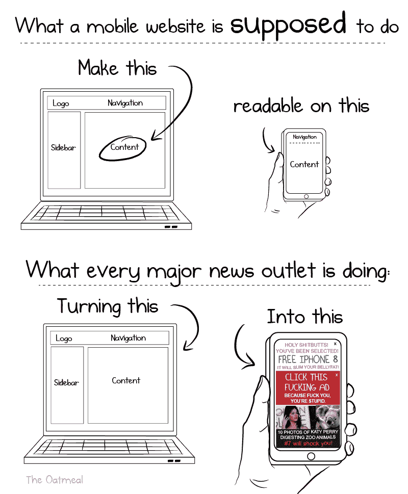

对着燕麦片大喊

另一方面，内容创作者正面临严峻的财务形势。到目前为止，广告是从一个拥有大量流量的成功网站上赚钱的最有效方式，现在，仅仅因为一些坏蛋过度使用广告，他们就有望想出新的赚钱方式？难怪这么多受人喜爱的独立网站最近不得不关闭。

这场战斗的中心是广告拦截器。如果你自己不用，很可能你的一个朋友会用。根据[最近的德勤调查](https://www2.deloitte.com/content/dam/Deloitte/global/Images/infographics/technologymediatelecommunications/gx-deloitte-tmt-2018-adblocking-media-report.pdf)，2017 年，31%的美国人在电脑上使用某种形式的广告拦截器，高于 2016 年的 24%。随着广告拦截器越来越受欢迎，有必要调查一下:广告拦截器*实际上*在做什么？

为简单起见，本文余下部分我将着眼于 Adblock Plus。它是世界上最受欢迎的广告拦截器之一，下载量超过 5 亿次，也是我个人使用的。

# Adblock Plus 是做什么的？

在最基本的层面上，Adblock Plus 可以过滤掉网站的元素，使其不被加载或显示。

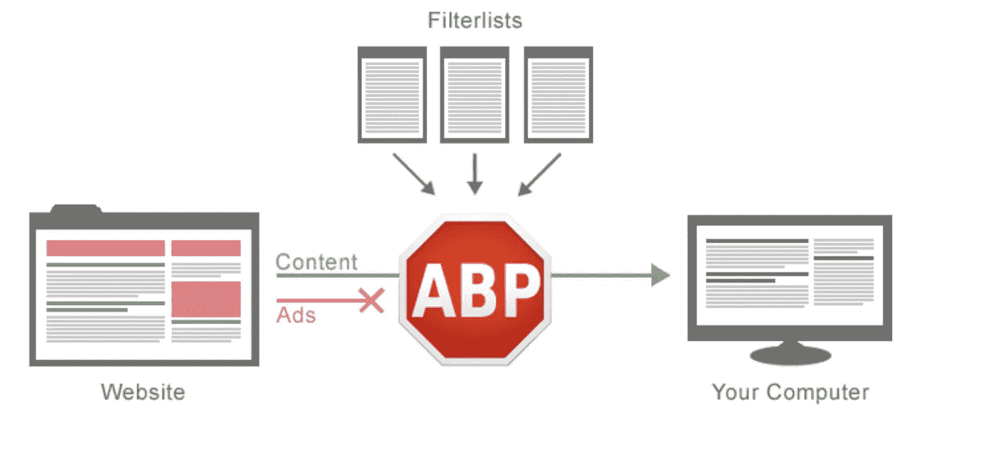

# AdBlock Plus 如何确定要拦截的内容？

Adblock Plus 表示，他们不会屏蔽所有的广告，在 2009 年的一项调查中，只有 25%的 Adblock Plus 用户表示他们严格反对所有的广告。因此，该扩展的默认功能仍然允许被认为可以接受的广告在网站上显示。如果这让你作为一个用户踌躇不前，考虑一下[他们的规则列表](https://adblockplus.org/en/acceptable-ads)相当严格:

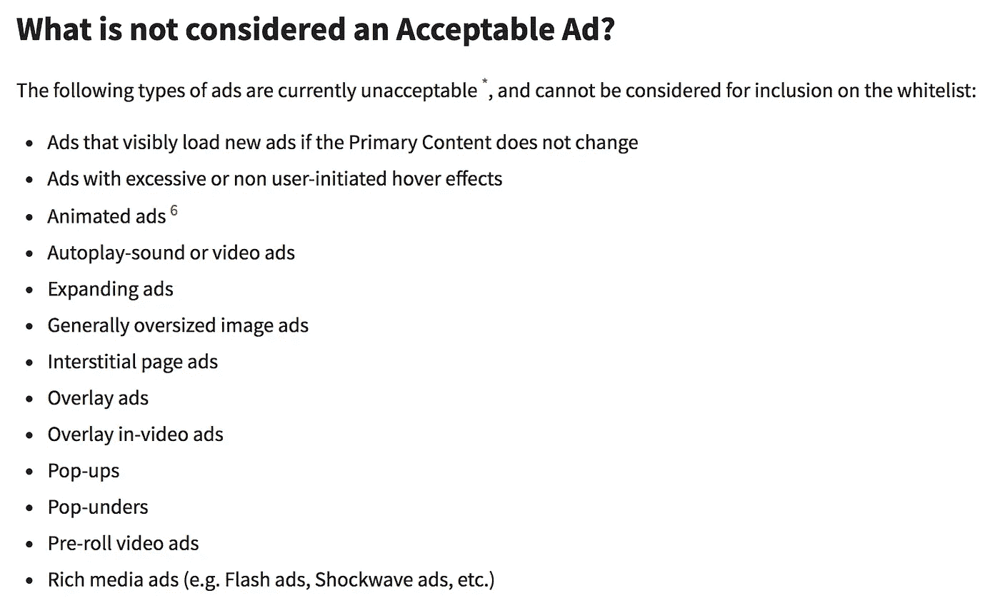

基本上，所有用户讨厌的烦人的东西

其中一些限制是基于元素本身的性质和它在页面上的表现，而另一些，如下图所示，只是简单地说明广告只能占据页面的一定比例，并且只能以不分散页面主要内容的方式这样做。

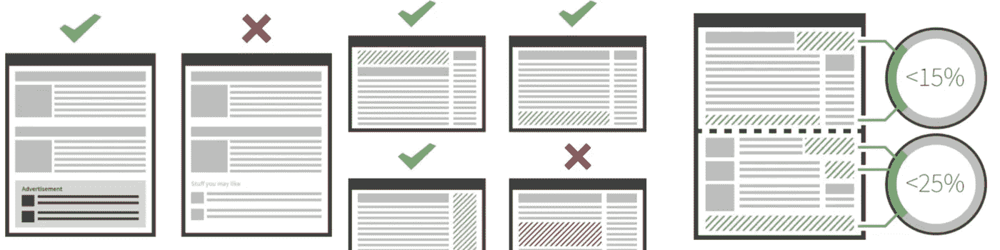

# Adblock Plus 实际上是如何屏蔽广告的？

Adblock Plus 用来阻止广告加载到您的页面上的两种机制是 HTTP 请求阻止和元素隐藏。HTTP 请求阻塞完成了这两者的大部分工作。许多广告存储在另一个服务器上，如果一个网站试图从一个被禁止的域加载元素或使用错误的关键字，Adblock Plus 将阻止 HTTP 请求，并阻止元素加载到页面上。这可以让广告远离你的网页，减少网页加载的时间。

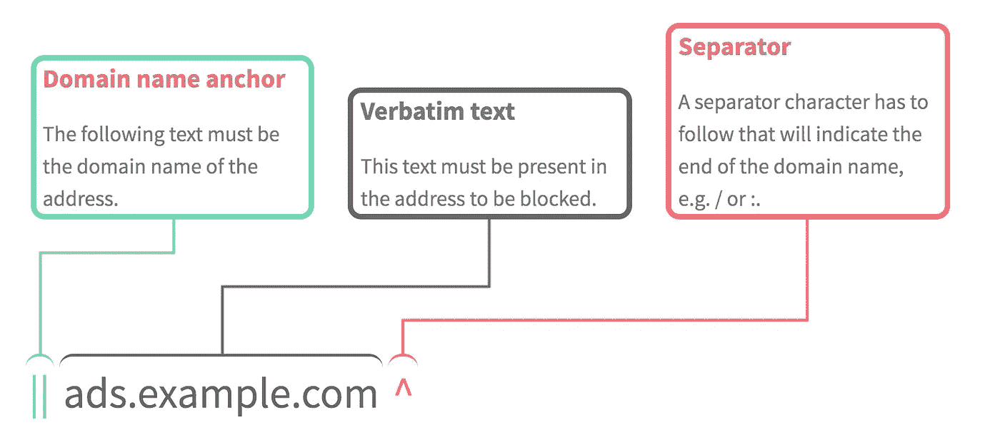

如果广告存储在网站上，Adblock plus 将应用 CSS 过滤器，使其不显示。这些显示过滤器位于用户样式表中，Adblock Plus 使用样式表服务 nsIStyleSheetService 将其加载到网站上。由于用户样式表可能具有最高的重要性，它们将覆盖相关站点的现有 CSS。

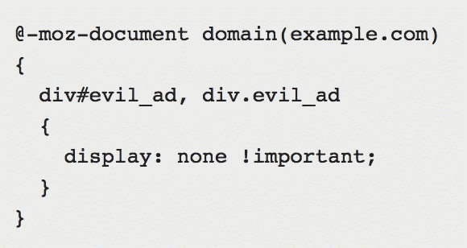

再见，阿德。

# 这一切怎么会发生得这么快

广告拦截器的一个关键卖点是更快的页面加载速度，因此 Adblock Plus 的创建者 Wladimir Palant 痴迷于哪种算法将最大程度地简化该工具的过滤匹配过程是有道理的，正如本文中的[所详述的。正如帕兰特概述的那样，当他实现了一种改进的](https://adblockplus.org/blog/investigating-filter-matching-algorithms)[博耶-摩尔算法](https://adblockplus.org/blog/investigating-filter-matching-algorithms)时，过滤匹配过程是最有效的。该算法结合了两种更有效的模式匹配方法:坏字符启发法和好后缀启发法。不良字符探试法将采用第一个不匹配的字符(从右到左)，并在模式中进一步寻找匹配的字符。

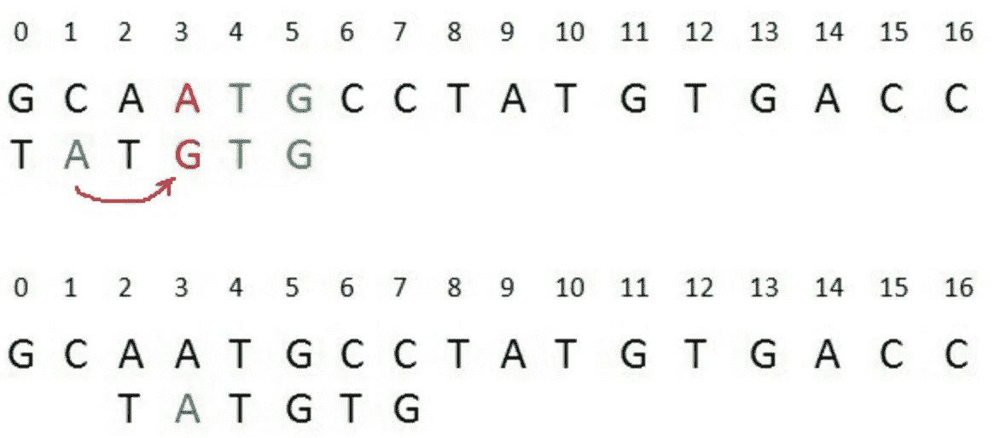

因为如果字符没有出现在模式中的任何地方，就不可能有匹配，所以如果没有找到匹配的字符，整个模式将被移动到不匹配的字符之外。这在搜索匹配时节省了时间。

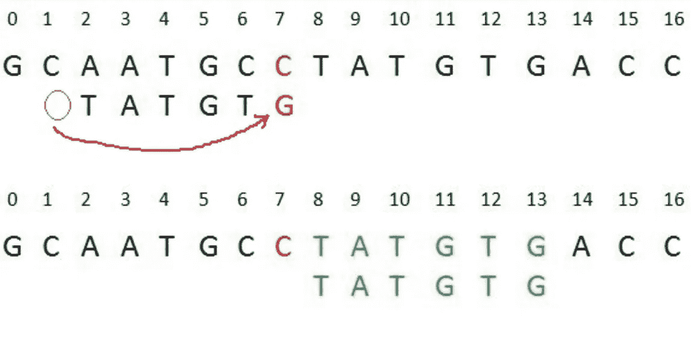

行动中的不良角色启发。

算法中使用的另一种技术是好后缀启发式算法。如果模式和字符串之间有几个字符匹配(同样，从右到左扫描)，这将查看匹配的后缀是否出现在模式中的其他地方。如果是这样，它会将模式下移，将模式中“good suffix”的另一个实例与文本对齐，以测试是否匹配。

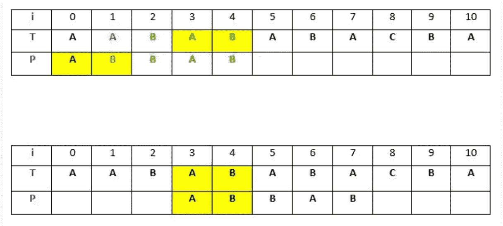

当您使用强好后缀启发式时，这变得更加有效。这将排除模式中前面有相同不匹配字符的任何“好后缀”，以避免浪费时间检查相同的不匹配。

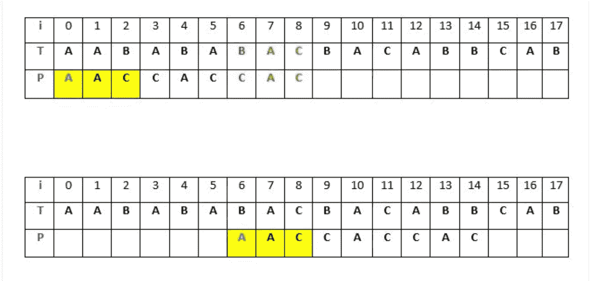

如果没有“好后缀”的其他实例，该模式将被移过被检查的文本部分以节省时间。

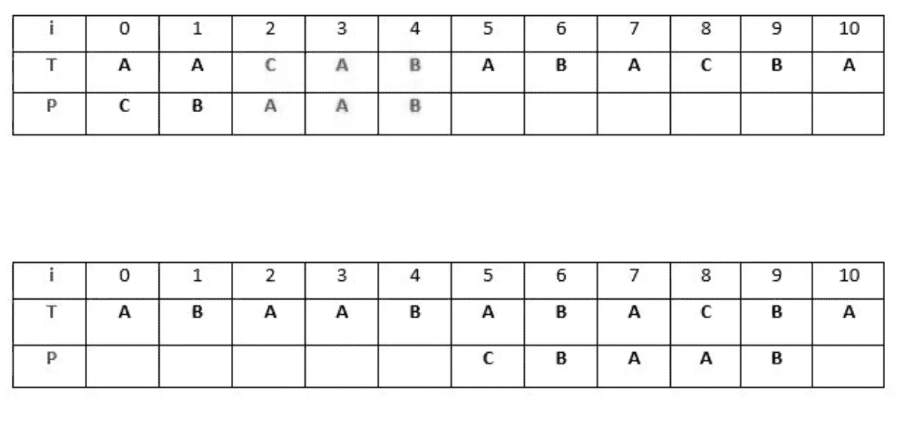

以下是 Adblock Plus 代码中 Javascript 的实际情况。

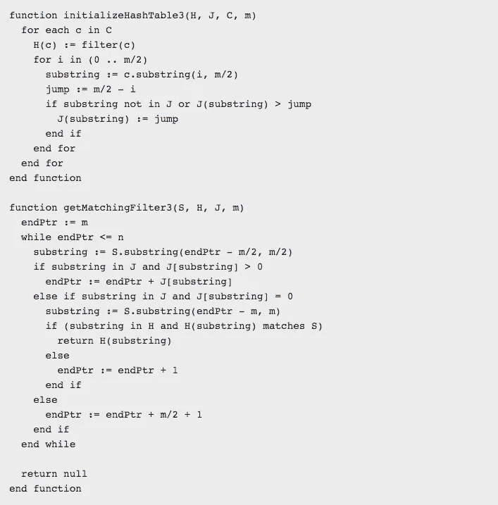

# 开发者该怎么做？

虽然大多数用户仍然不使用广告拦截器，但采用率正在上升，没有理由怀疑这一趋势会放缓。在这一点上，看起来确保你的网站上的广告到达你的网站的访问者的最高百分比的最好的方法是理解被 Adblock Plus 和其他流行的广告拦截器使用的最流行的标准。也许并不总是有可能在这些指导方针下工作，但是在可能的情况下这样做将会创造一个好的用户体验，让你的网站赚钱并避免被屏蔽。