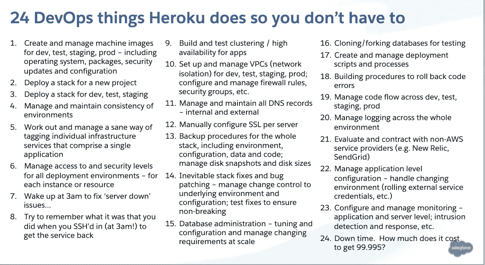

# 采用平台即服务(PaaS)将如何改变您的团队

> 原文：<https://betterprogramming.pub/how-adopting-paas-will-change-your-team-f52f587d2a0f>

## 节省时间，降低复杂性，提高工作效率

由[路](https://unsplash.com/s/photos/team?utm_source=unsplash&utm_medium=referral&utm_content=creditCopyText)上[车头](https://unsplash.com/@headwayio?utm_source=unsplash&utm_medium=referral&utm_content=creditCopyText)拍摄

平台即服务(PaaS)是一个基于云的部署和开发平台。PaaS 提供商，如 [Heroku](https://www.heroku.com/) 、 [Oracle Cloud](https://www.oracle.com/cloud/) 和 [Microsoft Azure](https://azure.microsoft.com/en-us/) 允许团队开发、部署和运行应用程序，而无需复杂地创建和维护您的基础设施。

换句话说，通过使用 PaaS，团队经常发现他们可以专注于业务逻辑，而不是基础设施。

如果您的项目正在考虑 PaaS，那么您可能会担心这种变化会如何影响您的团队——这是理所当然的。转向 PaaS 通常会导致角色和职责的重大转变。

在本文中，我们将探讨一些最常见的变化，以帮助您和您的团队为这一转变做好准备。

(如果您还没有决定使用 PaaS，并且您对探索 PaaS、IaaS 和本地之间的差异感兴趣，您可能想要[查看这篇文章](https://dev.to/mmbogan/paas-vs-iaas-choosing-the-right-technology-for-your-project-4ln4)来帮助您做出决定。)

一般来说，迁移到 PaaS 意味着您项目的大部分技术复杂性将由供应商来处理。

亚马逊网络服务公司(Amazon Web Services)的沃纳·沃格尔斯博士写了大量关于消除“无差别的重担”的文章，这样你就可以专注于对你的业务至关重要的核心竞争力。然而，这一重大变化影响了团队成员的角色和职责。

让我们看看这个变化将如何影响开发人员、软件开发人员、工程人员和业务经理。

# DevOps:提高工作效率

也许受 PaaS 转变影响最大的角色是 DevOps。毕竟，供应商管理的开发运维是 PaaS 的主要优势。如果您的角色是 DevOps，那么 PaaS 可以让您的大部分日常工作变得更加轻松。

PaaS 现在运行着基础设施，这意味着半夜的页面会更少。

您可以管理一个更大的系统，而无需成比例地增加工作量，在不增加更多职责的情况下达到更多的指标，提高对安全性的信心，并更专注于其他关键的业务优先级。

那么，PaaS 将管理哪些 DevOps 职责？

大多数 PaaS 解决方案将为您管理硬件和软件。下面的图表概述了 PaaS 供应商(在本例中为 [Heroku](https://www.heroku.com/) )可以为您管理的一些最常见的 DevOps 职责:

图片来源:Salesforce

# 开发人员:关注让你的项目独一无二的代码

如果您是一名开发人员，转换到 PaaS 意味着您可以腾出时间专注于对您的项目真正重要的代码——业务逻辑。

由于您的 PaaS 供应商将处理您的平台技术，您应该会发现自己在样板基础设施、扩展、部署和所有项目共有的其他问题上花费的时间更少(如果有的话)。

相反，你应该能够更加关注是什么让你的团队(和产品)独一无二。因为平台的大部分复杂性都是为您处理的，所以您应该会看到需要编写的代码量显著减少。

了解 PaaS 如何通过自动化尽可能多的步骤使 [DrivenData 实现“最小可行流程”](http://drivendata.co/blog/minimum-viable-process)。

更少的复杂性和代码也意味着您将有更多的时间进行实验。您的 PaaS 解决方案可能附带了已经与您的平台集成(或作为插件/附件提供)的各种技术。

例如，Heroku 可以轻松添加额外的平台服务作为“附加组件”。你可以很快[尝试 Papertrail 作为你的日志解决方案](https://elements.heroku.com/addons/papertrail)，或者 [Redis 作为内存数据存储](https://elements.heroku.com/addons/heroku-redis)。

这些技术可供您使用，并且经过预先配置，可用于快速实验和探索。因此，你不仅会有更多的时间来尝试新的想法，还会让尝试新的想法变得更容易。

当然，重要的是要记住，你将会为了简单性而牺牲灵活性。只要您的用例与供应商提供的内容紧密匹配，您需要做出的决策就会更少。

如果您有独特的用例，那么您可能需要花时间来集成它们。

在极少数情况下，您可能无法利用供应商的平台实现您的目标。因此，在使用特定平台之前，一定要做好尽职调查，并建立概念证明。

# 工程经理:关注人和过程

如果您是一名工程经理，当您的团队迁移到 PaaS 时，您也会看到变化。PaaS 解决方案通常通过处理耗费时间的机械任务，如分析、报告、成本估算和成本监控，让您的管理工作变得更加轻松。

由于存在多个区域或可用性区域，PaaS 平台可以为您的客户提供高可用性和更好的性能。因此，您应该看到服务质量的提高，而无需自己管理基础架构。

由于 PaaS 处理扩展，您应该会看到那些可怕的“死亡拥抱”警报减少了。当你的产品成功时，你就不需要去争夺了。你的应用程序已经为更多的客户做好了准备。

然而，PaaS 会给管理者带来一些新问题。在考虑专有解决方案时，要考虑供应商锁定的风险。一些 PaaS 解决方案提供基于开源技术的完全托管系统，如 [PostgreSQL](https://www.postgresql.org/) 或 Redis，可以降低这种风险。

此外，寻找能够观察系统运行的供应商，这有助于诊断问题。

例如，Heroku 为其服务提供仪表板，以监控 CPU、内存使用等。第三方供应商可以通过 APM、日志记录等附加组件提供更多见解。

正如我们前面提到的，在进行转换之前，您还需要调查平台，以确定它对您的技术和业务需求的支持程度。

这将需要在做出转换承诺之前，定义关键目标、指标并进行概念验证。

总的来说，有了合适的 PaaS 解决方案，您可以在管理任务和技术会议上花费更少的时间，而将更多的时间花在您擅长的事情上:管理人才和资源、改进流程以及为您的客户提供出色的体验。

这就是为什么 TriFin Labs，一家应用开发咨询公司，向超过 90%的公司推荐 PaaS。根据[他们的案例研究](https://trifinlabs.com/heroku-vs-aws):

> “对于新产品，你需要保持敏捷，你必须保持低成本，让你有足够的时间找到适合市场的产品，你需要将所有精力投入到创造用户会喜欢的令人惊叹的产品上，所有迹象都表明 Heroku(PaaS)是正确的选择。”

# 业务经理:提高业务敏捷性和运营支出

对于团队中的每个人来说，转向 PaaS 通常会带来更快的发布周期和更快的整体上市时间。因为 PaaS 处理如此多的复杂性和如此多的技术细节，它倾向于减少花费在管理、维护、人员配备和培训上的成本和时间。

例如，英特尔[从 IaaS 迁移到 PaaS](https://www.intel.com/content/dam/www/public/us/en/documents/best-practices/utilizing-paas-for-business-agility-and-it-efficiency-paper.pdf) 后，节省了近 70%的应用实例成本。PaaS 通常会让你的团队更精简、更专注。

[根据视频共享服务 dubssmash](https://www.heroku.com/customers/dubsmash)的案例研究，如果没有 PaaS，他们将不得不“雇佣至少四名全职开发人员来大规模运营像 dubssmash 这样的服务。相反，Heroku [PaaS]让[他们的]精益团队更容易管理运营，并为[他们的]用户保持高标准的质量。”

# 结论

将您的团队转移到 PaaS 解决方案将意味着巨大的变化。

然而，您的团队应该看到总体成本和复杂性的降低，以及团队成员专注于他们的独特技能和他们为产品和业务整体带来的价值的能力的提高。