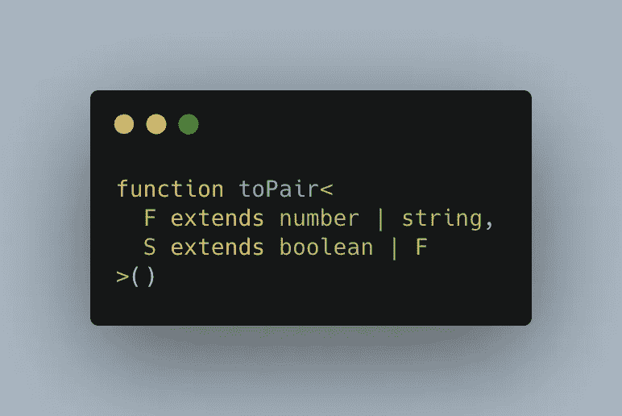

# 像我这样的反类型脚本“JavaScript 开发人员”是如何成为类型脚本爱好者的

> 原文：<https://betterprogramming.pub/how-an-anti-typescript-javascript-developer-like-me-became-a-typescript-fan-a4e043151ad7>

## 我从不喜欢 TypeScript 到喜欢它的旅程

在 [Unsplash](https://unsplash.com?utm_source=medium&utm_medium=referral) 上由 [Jantine Doornbos](https://unsplash.com/@jantined?utm_source=medium&utm_medium=referral) 拍摄的照片。

在本文中，我将讨论我从一名反类型脚本开发人员到现在不想回到普通 JavaScript 世界的开发人员的旅程。也许我的想法可以帮助几年前和我处境相同的人。

# 为什么我反对打字稿？

我总觉得给函数/变量添加类型并满足 TypeScript 编译器是过度工程化的，并没有提供任何有意义的好处。此外，工作起来感觉很慢，因为我总是会遇到难以理解的编译错误。我会挠头试图找出问题所在。这引起了一些挫折，我开始讨厌 TypeScript。

另一个原因是高级的打字稿概念，如[泛型](https://www.typescriptlang.org/docs/handbook/generics.html)。它们很难理解，我开始觉得自己好像置身于 Java 世界，每一段代码都是强类型的，令人不知所措。当我开始学习 TypeScript 时，即使像下面这样简单的代码片段也让我感到害怕:

TypeScript 泛型示例

由于这些原因，即使我通过观看教程或阅读书籍来学习 TypeScript，我也从未从事过任何用 TypeScript 编写的企业应用程序。事实上，作为公司面试过程的一部分，我曾经选择 JavaScript 而不是 TypeScript(如果有选择的话)作为带回家的作业。

然而，当我转到目前的角色时，JavaScript 工作不是一个选项，因为我要工作的所有应用程序都是用 TypeScript 编写的(只有 JavaScript 的遗留代码)。不出所料，它最初让我不知所措，我对 TypeScript 的厌恶与日俱增。但是几个月后，我终于明白了为什么有人应该更喜欢 TypeScript 而不是 JavaScript 的好处和原因。我在下面的部分列出了它们。

# 我成为打字爱好者的三大原因

## 1.使不可能的状态成为不可能，并进行详尽的检查

这是我喜欢打字稿的主要原因。如果你想进一步了解这个概念，我推荐你看下面的视频。它谈到了 Elm 语言，但是这个概念对于类型脚本世界也是有效的:

如果您想看一些如何在 React 应用程序中利用 TypeScript 来避免不可能状态的例子，我建议您阅读以下文章:

1.  [交通灯系统如何处理不可能状态的真实例子](https://zohaib.me/leverage-union-types-in-typescript-to-avoid-invalid-state/)
2.  [具有加载、已加载和错误状态的 React 组件](https://dev.to/housinganywhere/matching-your-way-to-consistent-states-1oag)

## 2.尽早发现漏洞

在处理 JavaScript 的时候，我遇到了很多这样的例子，由于前端没有类型检查，所以在生产中发现了一些错误。TypeScript 编译器可以在编译时避免和捕获这些错误，这将节省您在开发-质量保证周期中的时间。

有了 TypeScript，一切都保持最初定义的样子。如果一个变量被声明为布尔值，它将永远是布尔值，不会变成数字。这增加了代码按照最初设计的方式工作的可能性。简而言之，代码是可预测的！

## 3.丰富的 IDE 支持和易于重构

> “有关类型的信息使编辑器和集成开发环境(IDE)更有帮助。它们可以提供代码导航和自动完成等功能，提供准确的建议。您还可以在输入时获得反馈:编辑器会标记错误，包括一出现的与类型相关的错误。所有这些都有助于您编写可维护的代码，并显著提高生产率。”— [AltexSoft](https://www.altexsoft.com/blog/typescript-pros-and-cons/)

如果我们在谈论重构，比如引入一个新的状态或者去掉一个在整个应用程序中使用的不需要的状态，如果你忘记更新一些引用，TypeScript 编译器就会抱怨。您可以对您的重构充满信心，并且该应用程序将像重构前一样工作。

# 结论

迁移到 TypeScript 还有许多其他好处(如果您还没有这样做的话)，但是这些是使我成为 TypeScript 爱好者的主要原因。

如果你是一个打字初学者或者想提高你的知识，这里有一些书我可以推荐:

1.  50 课的打字稿
2.  [处理打字稿](https://exploringjs.com/tackling-ts/)

干杯！