# 如何(以及何时)优化 React 应用程序的性能

> 原文：<https://betterprogramming.pub/how-and-when-to-optimize-performance-in-your-react-application-b0b8c8c66bb3>

## 使用备忘录、使用回调、使用备忘录、利用上下文等等


由 [TETrebbien](https://unsplash.com/@tetrebbien?utm_source=medium&utm_medium=referral) 在 [Unsplash](https://unsplash.com?utm_source=medium&utm_medium=referral) 上拍摄的照片

我喜欢让应用程序更好更快，尽可能为用户提供最好的体验。发表过 [Play BANG 等几个项目！在线](https://playbanggame.online/)、[React 手册](https://react-handbook.danajanoskova.sk/)、 [vuex-but-for-react](https://vuex-but-for-react.netlify.app/) 、 [Blokep](https://blokep.netlify.app/) 等。

在我的职业生涯中，我曾多次被分配任务，以确定 React 应用程序中的性能瓶颈，并重写这些部分以使它们更快。这篇文章将总结出一些技巧，让你也能做到这一点。

# 渲染瀑布

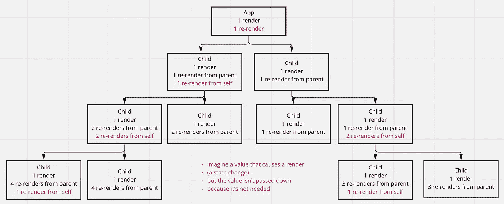

用渲染反应组件树

React 组件一直在渲染。如果组件的父组件渲染，那么它的所有子组件也会渲染。如果父对象渲染 30 次，那么每个子对象也会渲染 30 次——即使他们与最初导致父对象渲染的数据完全无关。

即使渲染只是一个虚拟 DOM 比较，如果不必要的话，它仍然会降低用户的性能。

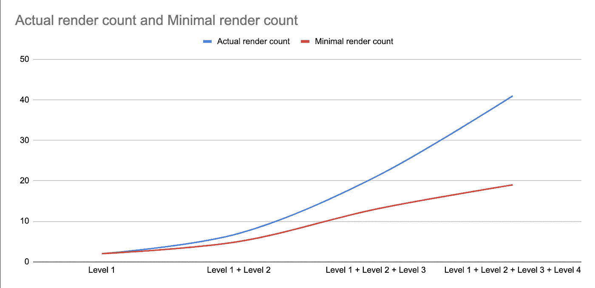

然后想象一下——如果你不优化你的应用程序的性能，你的组件树越大,“实际渲染计数”的曲线就越陡。

在这个例子中，我们创建了一个非常平坦的树，有一些渲染，在这个图表中，你已经可以看到，如果我们要保护组件免受不必要的渲染，我们将执行渲染的值减少了一半。你的应用程序规模越大，你就能通过正确使用`memo`*来减少更多不必要的渲染。*

*在现实世界中，仅仅将每个组件包装在`memo`中并完成它是不明智的。重要的是您选择哪个组件和数据来记忆，这些图像仅仅是指数瀑布的一个简单的可视化演示。*

*让我先说:早期优化很重要*

> *“使用 useMemo 是一种不成熟的优化”
> “使用 useMemo 可能会损害应用程序的性能”
> -有些人，总是这样*

*优化总是“过早”的，直到为时已晚。
不使用 memo、useMemo、useCallback 比使用更伤性能。*

*总会有一些“我们没有预料到”和“我们不可能知道”的事情，会有一个巨大的数据集使你的 UI 渲染和反应极其缓慢，会有一个用户的机器不是最具性能的，他们会感谢你尽早优化。*

*事实是，在正确的地方做这些检查并不会像不做那样让你付出更多的代价。一旦您开始在 useMemo 或 useCallback 中没有包装的部分中实现性能改进，您将不得不经历无数层未包装的功能，并且您将更有可能在已经存在的功能中引起错误。这需要花费精力和开发人员的时间，而且风险很大——如果这个应用程序是以 UX 为中心编写的，这是可以很容易避免的。*

*当我加入一个已经在运行的项目时，这是我必须做好几次的事情，而且总是同样的故事。我写这些指南是希望它能帮助你在正确的地方进行合理的优化。*

*本文将介绍以下各项的正确用法:*

*   *`React.memo` —将其用作组件(高阶组件)的包装器*
*   *`React.useMemo` —用它来记忆*功能组件的*体中的*值**
*   *`React.useCallback` —用它来记忆*功能组件的*体中的*方法**
*   *`React.createContext` —使用它向树中较低的组件*提供值，作为使用 props 的替代方法**
*   *`React.useContext` —使用它来消耗所提供的上下文的值*

# *何时使用 React.memo*

*`React.memo`是一个更高阶的组件，它实现了一个组件的 props 值的浅层比较，检查它们是否改变了，如果改变了就重新渲染。*

*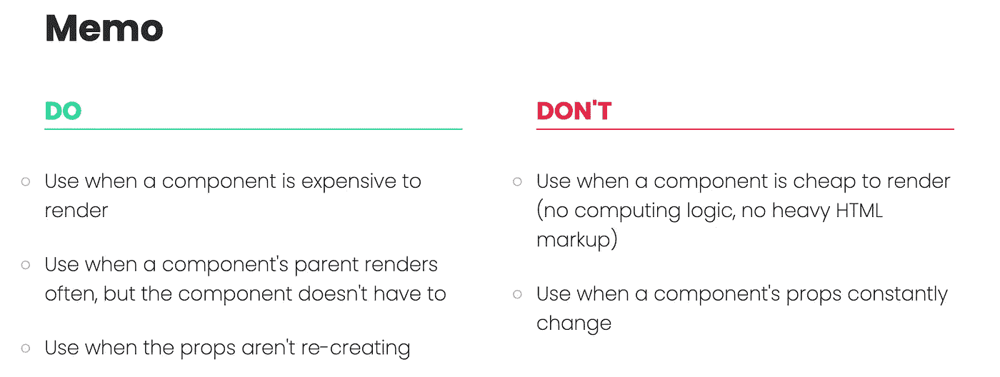*

*何时使用 React.memo*

*如果您不确定组件何时重新呈现，您可以将 console.log 直接放在其主体中。当您检测到组件中的某个操作导致显著延迟时，通常会这样做，以调试组件(及其子组件)渲染的次数。*

*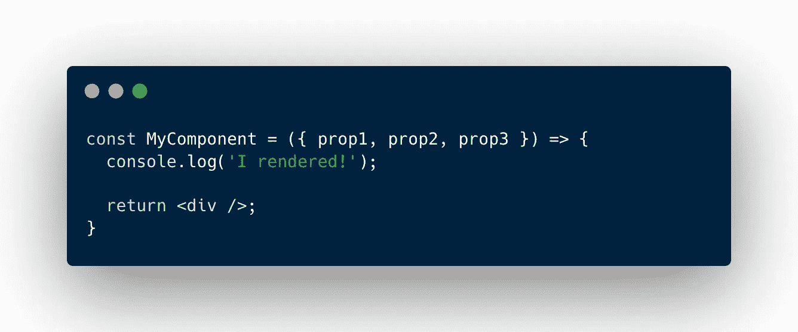*

## *我使用备忘录*的经验法则是:**

*   *在一个组件上使用它，该组件的父组件会重新渲染很多次(应该的，可能会有一些状态更新)，但是你的组件不会受到这些变化的影响*
*   *只有当组件的属性是原始值或记忆值时才使用它，否则它不会产生积极的影响*
*   *当不必要的重新渲染会导致子组件的瀑布渲染时，在组件树的顶部使用它*

*需要记住的一些提示:*

*   *默认情况下，只要父组件渲染，组件就会渲染，即使它不包含任何属性。这意味着在组件中触发状态更新将(试图)呈现它的所有子组件，即使它们没有继承这个更新的数据实例。*
*   *不能因为一个通过 props 继承的数据是“相同的”，就说明它在内存中没有变化。当传递非原始数据类型时，比如数组、对象或函数，您必须确保它们不会被重新创建。如果这个数据是在我们组件的父组件中创建的，那么它需要包装在一个`useMemo`或`useCallback`中以确保记忆。如果非原始数据类型没有被包装，那么在我们的组件上使用`memo()`不会有什么不同，只要它的父元素有所表现，它就会有所表现，因为那些道具会被重新创建。*

*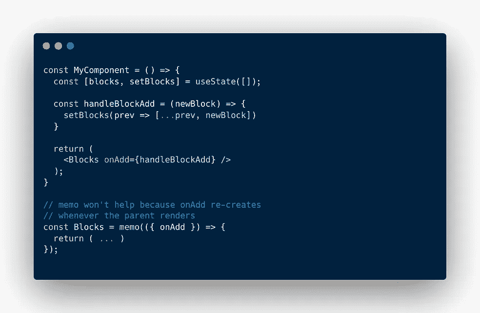**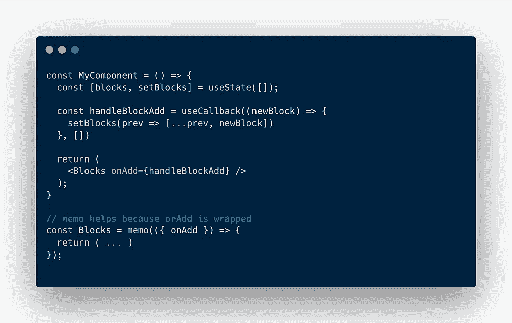*

*左:memo()对非记忆道具没有帮助。正确:记忆道具是正确的选择！*

*   *当您使用 React profiler 并检查临界值时，或者只是在 UI 中单击并注意到某个动作的延迟时，您就会知道组件的渲染是昂贵的。*
*   *这个缓慢的动作很可能会在不直接依赖于这个动作结果的地方触发一个渲染瀑布。*

*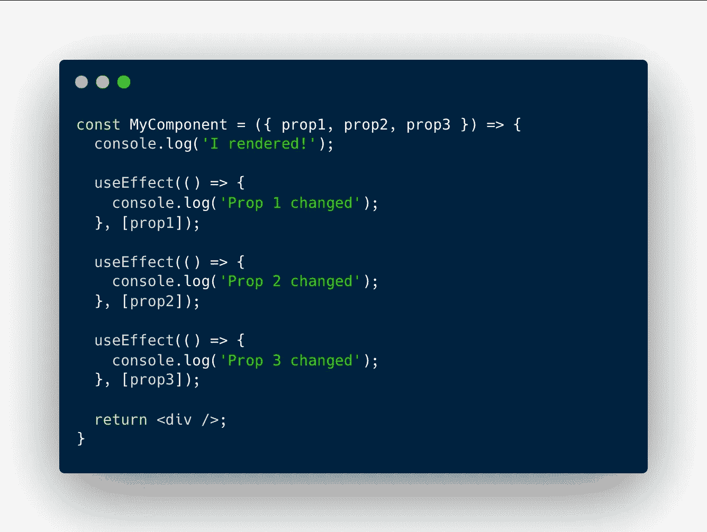*

*你可以通过创建一个单独的`useEffect`来调试一个道具是否改变。`useEffect`会在依赖关系发生变化时通知您。*

> *"我的道具没有改变，我的组件被包装在 memo()中，当我更新父组件时，它仍然会重新呈现！"*

*如果发生这种情况，请确保您的组件没有收到它不需要的其他道具。使用 spread 运算符时，有时会出现这种情况。*

*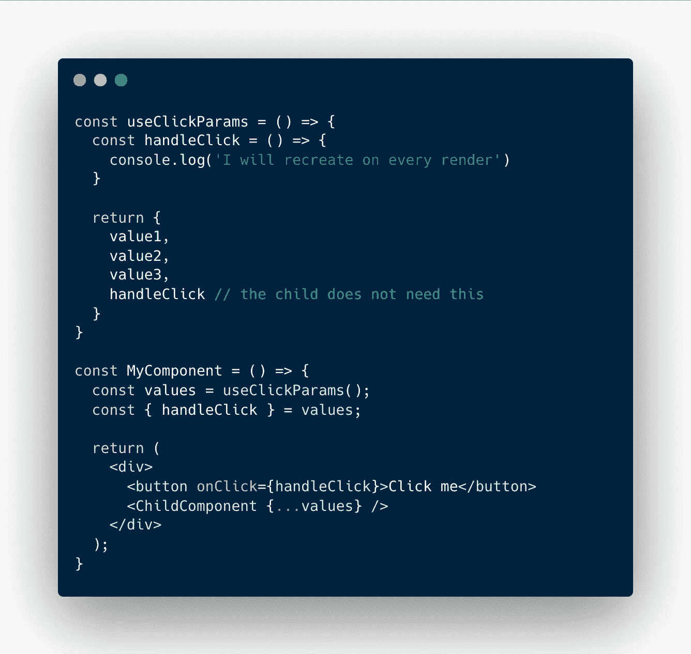*

*传播道具时要小心，你可能会传递孩子不需要或不期望的价值*

# *何时使用 React.useMemo*

*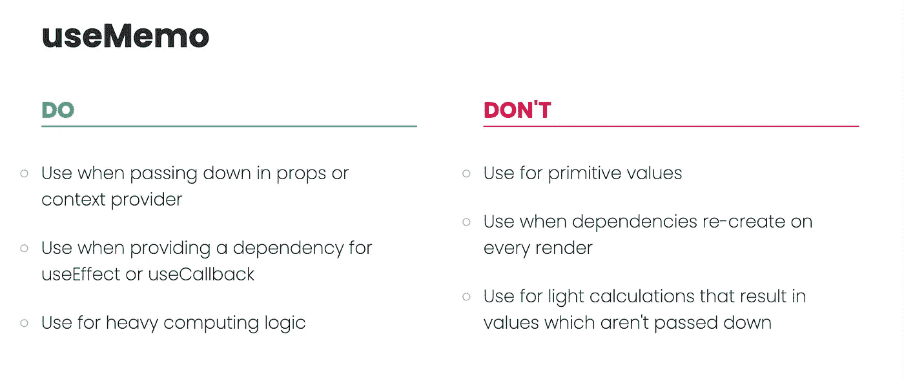*

*何时使用 React.useMemo*

*使用 React 的 useMemo 来记忆*值*。*

```
*import { someHeavyFilteringLogic } from './helpers/filtering'const filteredUsers = useMemo(() => {
  const users = someHeavyFilteringLogic(data, filter);
  return users;
}, [data, filter])*
```

**在这种情况下，我们依靠* `*data*` *和* `*filter*` *存储状态值，因此除非它们改变，否则不会重新创建。* `someHeavyFilteringLogic` *是外部导入，所以不必作为依赖项提供。但是，如果你从一个道具中获得功能，它需要自己提供和记忆。**

## *我使用*使用备忘录的经验法则是:**

*   *使用它来计算除非必要否则不会改变的依赖关系*
*   *当您将值作为道具或在上下文的提供者中传递时使用它*
*   *当您将值作为 useCallback、useEffect、useMemo 的依赖项提供时，请使用它*

> *"我不能用 memo()包装组件，而不是对其值使用 useMemo 吗？"*

*如果你完全确定用`memo`包装你的组件可以防止所有不必要的渲染，从技术上来说，你可以。*

*但是如果你在一个公司环境中工作，你不能指望人们将来不扩展你的组件，也许提供一些会改变的适当值，这将触发一个渲染，这将触发你的计算值的重新创建。如果你向下传递，你会发现自己有一个渲染瀑布，即使你的组件被包装在`memo`中。*

*如果你需要这个值而不是不必要的重新创建，因为其他组件依赖它(被记忆)，使用`useMemo`总是正确的选择。*

# *何时使用 React.useCallback*

*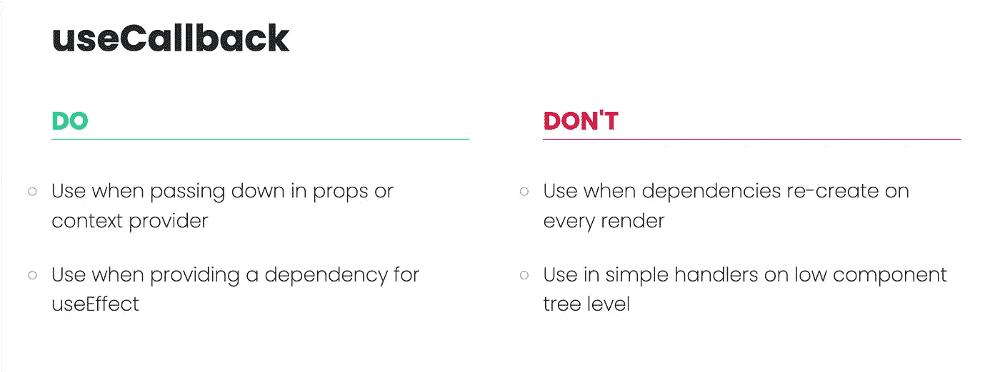*

*何时使用 React.useCallback*

*使用 React 的`useCallback`来记忆*方法*。*

*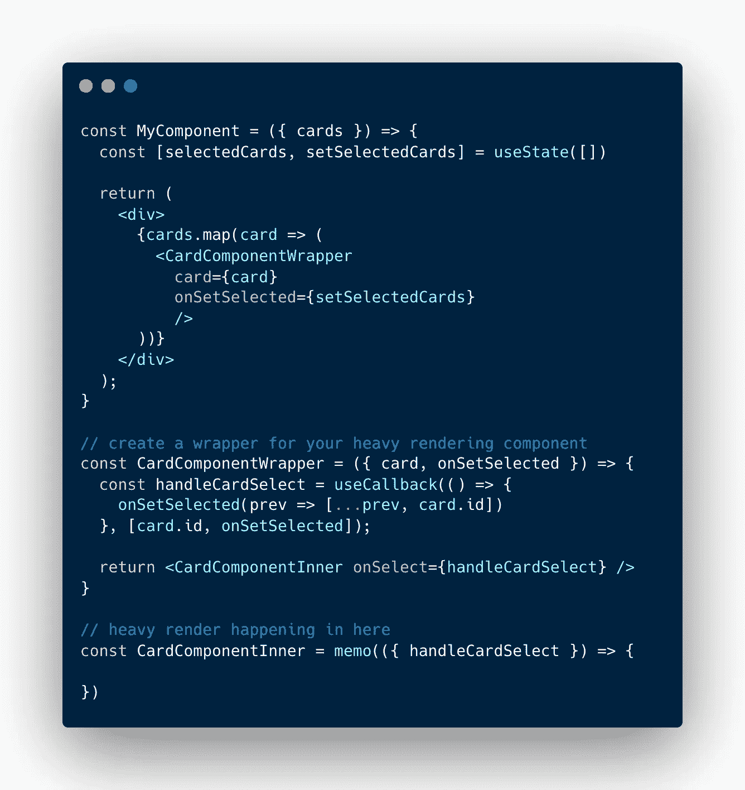*

## *我使用`useCallback`的经验法则是:*

*   *当您在上下文的提供者中向下传递方法时使用它*
*   *当你把这个方法作为一个道具传递下去的时候使用它，如果需要的话，这会让在`memo`包装孩子变得更简单*
*   *在多个深度级别中将该方法作为道具向下传递时使用它，以避免瀑布式重新渲染*
*   *当您在另一个`useCallback`或`useEffect`中将方法作为依赖项传递时使用它*

*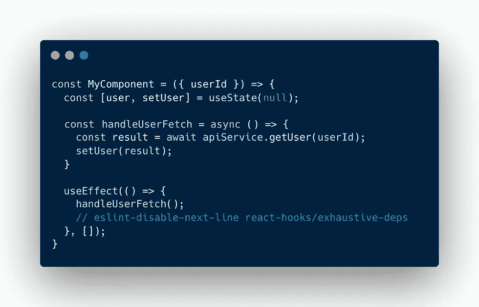**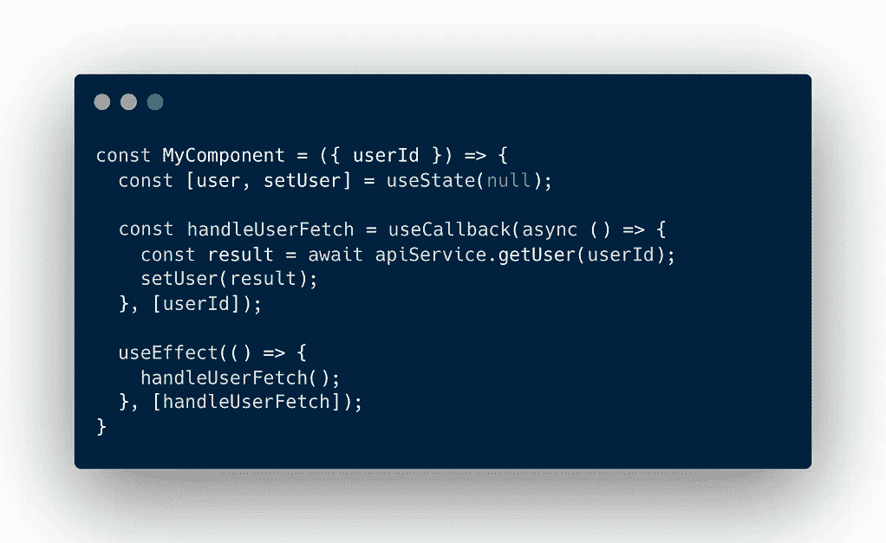*

*不正确的 useEffect 用法(左)和正确的 useEffect + useCallback 用法(右)*

*如果您专业地从事 React 应用程序的工作，那么您有可能见过(并写过？)类似左边的`useEffect`，这里缺少依赖项，eslint 规则被有意注释掉了。*

> *“但是在这种情况下使用 useCallback 是一种矫枉过正/过早的优化”*

*在这种情况下，使用`useCallback`与`useEffect`结合并不是“过早优化”，这是正确的用法(线程链接在文章底部)。React 的创建者和贡献者不鼓励错误地使用`useEffect`并忽略依赖关系——这是有充分理由的。*

*右边的例子显示了`useCallback`和`useEffect`组合的正确用法，并提供了调用所依赖的`userId`变量作为依赖项。如果`userId`改变，获取用户功能将被再次调用——*,对于不同的用户使用不同的 id。**

*有时候，你的`useEffect`太复杂和纠结，无法提供所有需要的依赖，违反规则似乎更容易。从长远来看，它将更难调试，并且将成为神奇代码的来源，并让您的后继开发人员感到沮丧。通常，这些难题可以通过正确的数据架构来解决——并且只需一点点`useCallback`。*

# *何时使用上下文*

*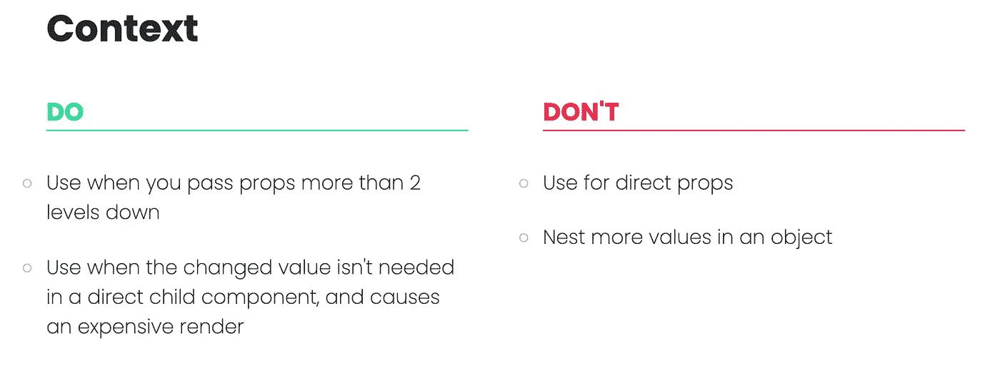*

*何时使用 React。语境*

*使用 React 的上下文 API*将值向下传递给子节点*。*

## *我使用`Context`的经验法则是:*

*   *使用它将当前组件的值提供给树中的深层组件*
*   *当属性钻取(将属性向下传递几层以将其传播给需要它的子对象)导致性能问题时使用它—当我们更改一个值时，它会触发对该值不感兴趣的组件的渲染，并且接收它只是为了将其进一步向下传递*
*   *当通过一个上下文的提供者提供一个非原始的计算值时，确保对它进行记忆，这样消耗它就不会导致重新呈现*
*   *不要将多个不相关的属性嵌套到一个上下文中——为每个逻辑片段创建一个新的上下文，以避免不必要的重新创建和重新呈现(不要将“当前登录用户”的上下文与“获取的博客文章”的上下文混合在一起)*

*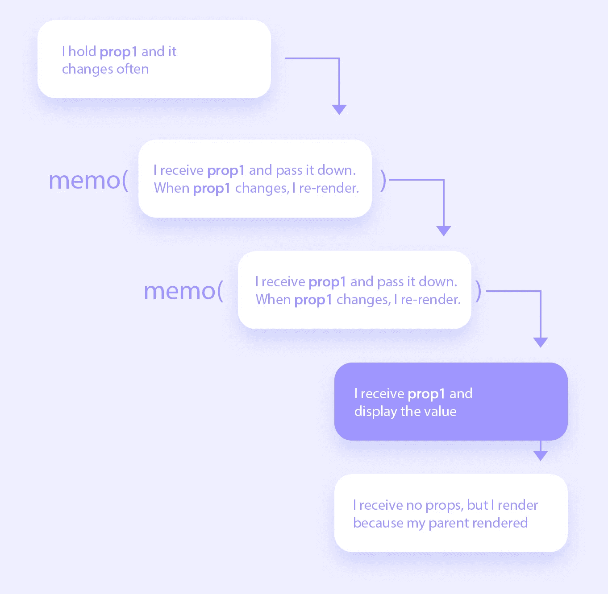*

*如果你正在进行道具训练，使用 memo()是低效的*

*如果你有因为性能问题而想要`memo()`的组件，确保它们不会仅仅为了传递它们而接受不必要的道具(道具训练)。*

## *提示:*

*如果您有一个保存状态值和该值的 setter 的组件，并且您希望将它们都提供给树中的一个子组件，那么为每个组件创建一个单独的上下文——setter 不会重新创建，但是值会改变！将它们组合成一个单独的对象，然后向下提供，会导致只需要 setter 的组件也需要重新创建。*

# *示例时间*

*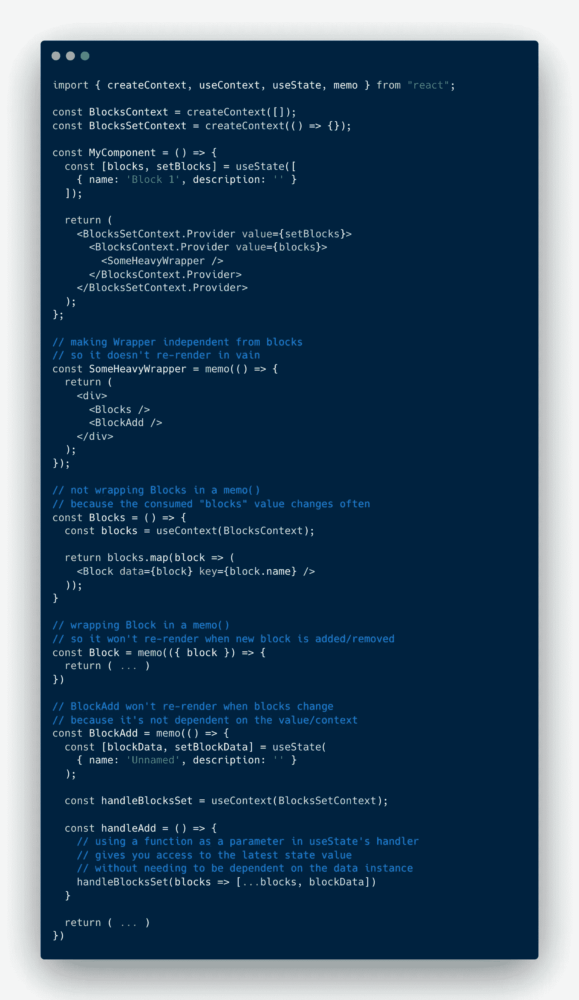*

*在这个例子中，组件`<MyComponent />`存储了一个*块*的数组，并且为这些块设置了一个 setter。*

*这些块被包装在一个很重的包装里。我们没有把它们作为道具传递，而是把它们传递给`BlockContext`的提供者，这样它们就可以在需要的地方被消耗掉。沉重的渲染包装，没有任何重新创建的道具，准备在`memo()`中包装。*

*我们为状态设置器创建一个新的上下文，一个`BlocksSetContext`。我们将 setter 传递给这个上下文的提供者，因此当需要时，它可以在较低的级别上被使用，独立于*块*的改变。*

*然后`<Blocks />`组件消耗`BlockContext`。我们没有用`memo()`包装它，因为它没有道具，而且`blocks`值会经常改变。这意味着这种检查将是徒劳的，因为我们肯定知道无论什么时候*阻塞*变化，`<Blocks />`组件也是如此。*

*然而,`<BlockAdd />`组件将被包装在一个 memo()中，因为它没有接收任何道具，而且很难呈现，因为用户正在那里搭建积木。它使用的`BlocksSetContext`包含了状态设置器，它的引用在我们的渲染中不会改变。
https://reactjs.org/docs/hooks-reference.html#usestate*

# *摘要*

*   *将`useCallback`用于**功能***

```
*const handleClick = useCallback(() => {
  console.log('Yay!')
}, [])*
```

*   *使用`useMemo`作为数值*

```
*import { heavyFilteringFunction } from '../externalFile'const filteredPosts = useMemo(() => {
  return heavyFilteringFunction(posts, filter)
}, [posts, filter])*
```

*   *将`memo`用在重渲染或渲染次数过多的组件上，并且它们的道具是静态的或记忆的*
*   *将一个`console.log()`放入组件的主体中，看它何时重新呈现*
*   *将组件分解成尽可能小的部分，确保它们不会继承它们不需要的道具*
*   *当您想要验证依赖关系何时改变时，创建一个包含控制台日志的`useEffect`*

```
*useEffect(() => {
  console.log('Blocks changed!')
}, [blocks])useEffect(() => {
  console.log('User changed!')
}, [user])*
```

*   *如果有可能在组件之外定义一个方法(当它不直接依赖于组件的状态时)，这是确保它不会被重新创建的最简单的选择*

```
*const handleUsersFilter = (users, filter) => {
  return ...
}const Users = ({ filter }) => {
  const [users, setUsers] = useState([...]) // it only makes sense that when users or filter change,
  // we want to re-compute the value const filteredUsers = useMemo(() => {
    return handleUsersFilter(users, filter)
  }, [users, filter]) return (<div />)
}*
```

*   *如果你的组件渲染很重，并且它的道具改变了，你仍然可以将组件分割成多个部分，并且`memo()`继承非重新创建道具的部分*
*   *如果你通过 props 或 Context 提供了一个非原语数据实例(一个数组，一个对象，一个函数)，把它包装在一个`useCallback`或`useMemo`中(除非它一直在变化:)*
*   *为单独的逻辑片段创建单独的上下文*
*   *为`useCallback`、`useMemo`和`useEffect`提供非原语依赖时要小心——它们也必须被记忆，这就是为什么在应用程序早期开始是好的*
*   *不要害怕使用依赖数组。如果您的实现在架构上是正确的，那么重新创建/重新执行是有意义的。*

```
*import { apiCallUser } from './api'const UserView = ({ userId }) => {
  const [user, setUser] = useState(null) // when the userId changes, we will re-create the function const handleUserFetch = useCallback(async () => {
    const result = await apiCallUser(userId)
    setUser(result)
  }, [userId]) // when the dependency re-creates, we will execute the body again useEffect(() => {
    handleUserFetch()
  }, [handleUserFetch])
}*
```

*   *React 中没有过早优化这回事。当你的用户抱怨的时候，已经太晚了。*
*   *优化的时候，从顶层开始。未优化的组件越高，渲染瀑布的指数越大。*
*   *没有一个用例需要在你的`useEffect`或`useCallback`中写
    `// eslint-disable-next-line react-hooks/exhaustive-deps`* 

*还没有筋疲力尽，并好奇为什么你不应该注释掉依赖？从比我聪明的人那里看看吧；*

*[](https://github.com/facebook/create-react-app/issues/6880) [## 如何禁用 react-hooks/exhaustive-deps 规则？问题#6880 facebook/create-react-app

### 此时您不能执行该操作。您已使用另一个标签页或窗口登录。您已在另一个选项卡中注销，或者…

github.com](https://github.com/facebook/create-react-app/issues/6880)*