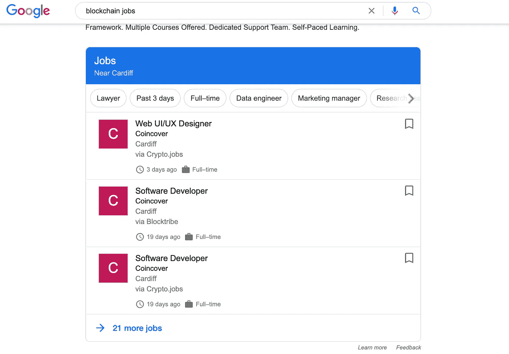

# 如何以及在哪里申请区块链工作

> 原文：<https://betterprogramming.pub/how-and-where-to-apply-to-blockchain-jobs-60e2c9e53909>

## 在 crypto 找到你梦想的工作

图片由[穆罕默德·哈桑](https://pixabay.com/users/mohamed_hassan-5229782/?utm_source=link-attribution&utm_medium=referral&utm_campaign=image&utm_content=3681036)拍摄，来自[皮克斯拜](https://pixabay.com/?utm_source=link-attribution&utm_medium=referral&utm_campaign=image&utm_content=3681036)

申请一份新工作可能会很难。在你*特别瞄准的行业申请工作更难。如果你正在寻求[将你的开发生涯引向区块链](https://medium.com/better-programming/how-to-become-a-blockchain-developer-7a6d643d1d4d)但不知道如何或在哪里申请工作，这篇文章将介绍区块链公司寻找什么以及如何找到它们。*

# 公司寻找什么

区块链公司在技术前沿工作。他们寻找的是那些对各种技术都很适应，并在不适应中茁壮成长的开发人员。作为一名开发人员，拥有几年使用多种技术堆栈的经验非常有帮助。这表明你已经专业地跳出了你的舒适区几次，你能够在不同的环境中工作。

这是公司寻找的第一件事。**体验**。

由于区块链现在是一个小众市场，招聘经理希望看到有能力在区块链发展的人。展示你拥有他们所需要的技能的最有效的方式是拥有一个公开的投资组合。

这听起来有点吓人，但是不要慌。你不需要为客户创造区块链 DApps。一个投资组合可以由一堆你自己做的、修补技术的附带项目组成。这有时会更加令人印象深刻。这表明你对这项技术非常感兴趣，以至于你用业余时间来学习它。

写下一些 DApp 想法的清单，并从头到尾致力于创造其中的一个。你甚至可以使用 Testnets 和 Github Pages 和 Heroku 等免费虚拟主机服务免费部署你的 DApp。

因此，公司下一步要找的是区块链。

这是我最不喜欢的部分，但必须完成。这是你在求职时给招聘经理的第一印象:**更新** **你的简历。**

如果你有几年的软件开发经验，你可能会在电脑的某个文件夹里放着一份旧简历。你需要更新它，以便它是特定于区块链的，同时也参考你作为其他领域的开发者的经验。

这通常取决于招聘广告本身，但确保你已经更新了它，以包括你目前的所有经验，你对区块链的兴趣，你的投资组合的参考，以及所有你想参与加密的流行语和技术。“可靠性”、“智能合同”、“Web3”、“Hyperledger”等。

使它简短，视觉上好看。我的只有一页，上面还有我的照片。任何雇主一看就应该完全了解你能做什么。

# 去哪里找工作

我不会告诉你在区块链找工作和找其他发展工作一样容易——事实并非如此。正如我所说的，这个行业现在是小众的。尽管技术在进步，大玩家也越来越感兴趣，但离成为主流还有很长的路要走。你得出去给自己找机会。

幸运的是，区块链是一个前瞻性的行业，所以找到一家远离你居住地的公司并不是一个大问题，因为它们大多数都有很好的远程工作选项。许多都是 100%远程的，这意味着他们没有物理办公室。如果你不住在硅谷这样的大型科技中心附近，这就更容易了。

## 区块链专用广告板

你找工作的第一站应该是区块链特有的广告牌。Blocktribe.com、[、cryptojobslist.com](http://cryptojobslist.com)和[cryptocurrencyjobs.co](https://cryptocurrencyjobs.co/)是专注于区块链独有角色的董事会的好例子。从这里开始，申请每一份最近发布的适合你的工作。

## 主流广告板

下一站是更主流的板。这些角色可能会有更多的噪音，所以多花一点时间筛选并找到最吸引你的角色。

信不信由你，谷歌是一个非常好的招聘广告积累器。[搜索“区块链工作”](https://www.google.com/search?q=blockchain+jobs&oq=blockchain+jobs)会返回一个小工具，显示你附近区块链行业的热门工作。

谷歌搜索区块链工作

科技界最受欢迎的问答平台 StackOverflow 有一个面向寻找工作的开发人员的求职板。

[**AngelList**](https://angel.co/jobs) 是一个很棒的网站，主要面向寻找商业伙伴，但创始人经常用它来寻找寻找工作的高技能工程师。

然后就是各行业招聘人员使用的比较通用的求职板: [**LinkedIn**](https://www.linkedin.com/jobs/) ， [**的确**](https://www.indeed.co.uk/) 等。

值得每天关注所有这些网站。你可以在 LinkedIn 等网站上设置提醒，当有符合特定搜索条件的新职位发布时，它会给你发电子邮件。例如，任何包含“以太坊”一词的新招聘广告。

## 聚会

这并不是每个开发人员都喜欢的，但是社交网络是你在区块链找到工作的最有前途的方式之一。这个行业的大部分都非常注重技术，并不特别擅长招聘。这意味着他们在传统工作论坛上的影响力不会像拥有招聘团队的大型传统企业那样大。

大多数区块链公司往往只有很少的内部招聘人员。这就是为什么参加区块链聚会是必要的。你不仅会发现以前不知道存在的新公司，还会在当地的区块链爱好者中传播你的名字，成为“我们认识的区块链开发商”。

前往 meetup.com，搜索你附近的比特币、以太坊和区块链聚会。大多数城市每周或每月都有常客聚会，如果没有，就去更远的地方。特意赶一趟 40 分钟的火车，只为听一场关于区块链的演讲，并告诉你细节。这显示了你是多么致力于成为区块链社区的一员，也是一种非常有效的找工作的方式

额外提示:给自己准备一些名片来分发。我知道这听起来很老套，也很老套，但是有一些实物来记住你比你想象的更有力量。

## 直接的

如果所有这些都失败了，直接给你喜欢的公司发邮件。告诉他们关于你自己的事情——要个性化。附上你的简历和任何与你的工作和你做的事情相关的链接。

即使他们的网站上没有空缺，也要发送你的详细信息。这显示了很多主动性，我保证招聘经理会对你有多想和他们一起工作印象深刻。你永远不知道你会遇到什么。

# 继续

不要因为没有回复而沮丧。继续前进，继续申请，把你的电话开大。一开始你可能看不到任何吸引力，但你会开始从很多招聘人员那里听到你甚至不记得申请过的工作。

保持积极、乐观和诚实。

你在招聘开发人员吗？ [**在这里发帖求职！**](https://cryptojobslist.com/hire-blockchain-talent?a=rpeap)

# 进一步阅读

如果你对区块链开发感兴趣，我会写一些教程、演练、提示以及如何开始和建立投资组合的技巧。查看以下资源:

 [## 区块链开发资源马上跟进

### 学习区块链、以太坊和 DApp 开发的资源列表

medium.com](https://medium.com/blockcentric/blockchain-development-resources-b44b752f3248)