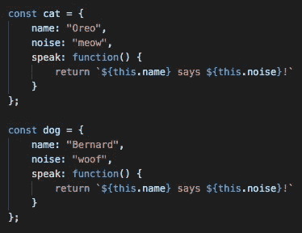
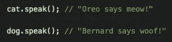
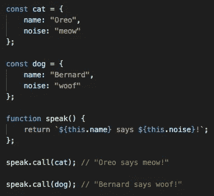
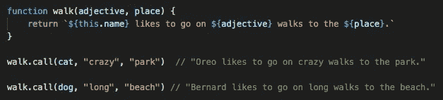
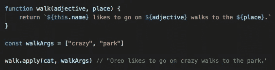
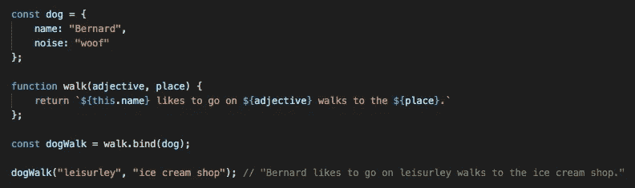

# 如何以及为什么在 JavaScript 中使用调用、应用和绑定

> 原文：<https://betterprogramming.pub/how-and-why-to-use-call-apply-and-bind-in-javascript-17d50d5a1eb0>

## 带示例

简单地说，`call`、`apply`和`bind`是 JavaScript 方法，允许在多个对象上使用单个函数。

虽然`call`、`apply`和`bind` 的行为类似，但是在您开始使用这些强大的工具编写更少重复、更易于维护、更易于调试的代码之前，了解它们之间的细微差别是很重要的。

每次在 JavaScript 中调用一个函数时，它都会寻找它的执行上下文。Javascript 的`this`关键字指向并返回执行上下文。

我们可以通过在函数中使用`this`来利用它，然后我们可以将`call`、`apply`，或者，你猜对了，`bind`用于不同的对象；从而允许我们明确地定义函数的执行上下文。

让我们来看几个例子…

# 1.硬编码到单个对象中的函数

假设我们有两个对象，一个`cat`和一个`dog`。我们的两只宠物都有名字，它们发出的声音，以及一个名为`speak`的函数，该函数将返回一串它们的名字和它们发出的声音。我们可以像这样对每个对象调用`speak`:

这是可行的，但是显然我们的代码是重复的。当我们的代码重复时，大多数时候我们可以做得更好。输入`call`、`apply`和`bind`的功率！

# 2.用“调用”在对象上执行功能

在上面的代码中，我们从我们的每个对象中取出重复的`speak`函数，单独声明它，然后使用`call`方法动态传入我们想要执行函数的对象作为参数。

我们也可以使用`call`来执行一个有多个参数的函数。为此，我们将对象作为第一个参数传入，后面是用逗号分隔的函数参数:

# 3.使用“应用”在对象上执行功能

好消息是——如果你理解`call` , `apply`的工作方式基本相同。

唯一的区别是，当您正在执行的函数有多个参数时，`apply`希望它们包含在一个数组中，而不是用逗号分隔。

我们编写的用`call`在我们的 cat 对象上执行`walk`函数的相同代码使用`apply`看起来像这样:

# 4.使用“绑定”在对象上执行函数

`bind`有一点不同，因为它创建了一个全新的函数，并附加或“绑定”了对象。

这里，我们创建了一个名为`dogWalk`的新函数，它包含了我们的`dog`对象的属性。这个函数仍然需要在以后执行，但是我们不再需要将对象作为参数传入。

# 结论

在 JS 中使用`call`、`apply`和`bind`似乎有很多困惑，我自己在学习使用这些方法时也努力寻找一个易于遵循的指南。

希望这篇文章有助于解开一些谜团！请在下面的评论区分享任何建议或问题。