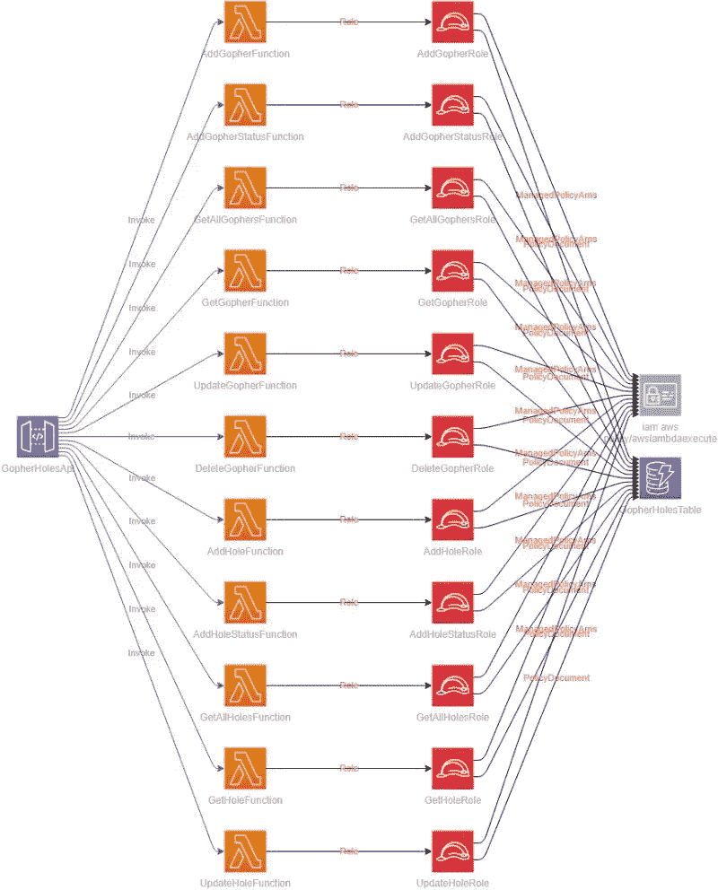

# 您应该如何(以及为什么)开始生成您的无服务器基础架构图

> 原文：<https://betterprogramming.pub/how-and-why-you-should-start-generating-your-serverless-infrastructure-diagrams-49cfd4568935>

## 您知道您可以在 CI 渠道中自动构建基础架构图吗？


图片由[皮克斯拜](https://pixabay.com/?utm_source=link-attribution&amp;utm_medium=referral&amp;utm_campaign=image&amp;utm_content=1935737)的[奥拉勒坎·奥拉迪普](https://pixabay.com/users/lakexyde-2489063/?utm_source=link-attribution&amp;utm_medium=referral&amp;utm_campaign=image&amp;utm_content=1935737)拍摄。

上周，我给公司的技术支持团队上了一堂关于我们正在开发的新产品的入门课。

新产品与我们以前生产的任何产品都完全不同。技术堆栈、编程语言、部署方法，凡是你能想到的，都是不同的。

当我在我们的仓库结构中走来走去时，支持工程师问我，“当它被部署时，有什么图表显示它是什么样子的吗？”

我想了一会儿这个问题。我有大约 30 个不同的图表来描述应用程序的不同架构部分，但没有太多的图表来描述实际部署的内容。

*如果我有，它们肯定是不新鲜的。*

构建图表可能很耗时——尤其是当您正在构建一个[基础设施图表](/solutions-architect-tips-the-5-types-of-architecture-diagrams-eb0c11996f9e#36df)时。基础设施图应该描述微服务或应用中包含的所有内容。随着时间的推移，图表应该与代码一起发展。

它们对技术支持团队很有价值，因为它们提供了服务的概要。它帮助其他人更容易地完成他们的工作。

但这可能是一个负担。在任何大规模的微服务中，几乎不可能跟踪基础架构图中包含和不包含的内容。

于是我开始头脑风暴。一定有更简单的方法。

我总是推[自动化](https://levelup.gitconnected.com/automate-your-automation-with-cloudformation-macros-e3dc36f62ade)。尽你所能把人的因素排除在外，以确保不会犯愚蠢的错误。如果有一种方法可以自动构建一个基础设施图，我们将总是有一个最新的规范，并且不会增加开发人员的工作量。

原来可以！添加到 CI 管道中相对简单，它使得描述部署的[无服务器应用](/serverless-you-keep-using-that-word-i-do-not-think-it-means-what-you-think-it-means-c7d5516a5ecc)变得毫不费力。通过简单地添加到 CI 管道中，您可以获得一个显示在存储库自述文件中的基础设施图，并在每次构建时更新它。

# 开源软件包

为了从[山姆](https://docs.aws.amazon.com/serverless-application-model/latest/developerguide/sam-specification.html)、 [CDK](https://aws.amazon.com/cdk/) 或[云形成](https://docs.aws.amazon.com/AWSCloudFormation/latest/UserGuide/template-guide.html)模板生成图表，我们使用了一个名为 *cfn-dia* 的开源包。

这个包将遍历一个完全定义的模板，识别所有的 AWS 资源，并创建一个包含它所找到的所有内容的图表。出于 CI 自动化的目的，我们将遵循两步流程:

1.  创建一个 draw.io 图。
2.  从图中生成一个 PNG。

*cfn-dia* 包会自动为我们构建 draw.io 图。由于我们的目标是将图表保存在自述文件中，因此我们必须将该格式转换为图像。为了便于转换，我们将使用另一个名为[*draw . io-export*](https://www.npmjs.com/package/draw.io-export)的开源应用。

*draw.io-export* 包将获取一个`.drawio`文件并将其转换成 PNG。一旦我们有了 PNG，我们可以很容易地将它添加到 README 中，并通过替换图像来更新它。

这个过程呈现了一个漂亮的微服务图，并且用资源类型和名称标记了所有组件。



作者照片。

# CI 渠道更新

本文假设您已经在使用某种 CI 管道。如果你不是，那也许是开始的一天！我已经能够在 AWS 中用 5 分 58 秒设置一个。

自动化图生成的第一步是更新您的构建映像。这是可选的，但强烈推荐。

为了防止每次运行构建时安装 *cfn-dia* 和 *draw.io-export* ，在构建映像中安装这些包是很重要的。

如果您无法控制您的构建映像，或者不关心每次运行时安装软件包，那么我们可以不做这个先决条件的更改。

我们编写的构建脚本中会有一个小的更新来处理它。但是如果你想更新它，Docker 有一些你可以遵循的指示。

我们必须添加到管道中的构建脚本是:

```
cfn-dia draw.io -t template.yaml -c -o diagrams/diagram.drawio 
drawio diagrams/diagram.drawio -o diagrams/diagram.png 
git add -u 
git commit -m "[skip ci] Updating infrastructure diagram with latest changes." 
git push
```

第一个命令是从存储库中的模板文件构建 draw.io 图。如果由于某种原因，您的模板有您不希望包含在图中的资源类型，您可以通过使用一个`-e`命令来指定要排除的类型。例如，如果我不想在图表中显示托管策略，我可以将命令更新为:

```
cfn-dia draw.io -t template.yaml -c -o diagrams/diagram.drawio -e AWS::IAM::ManagedPolicy
```

脚本中的下一个命令将 draw.io 图转换成 PNG，并将其添加到一个`diagrams`文件夹中。

最后，我们将自动将更新的文件添加到源代码控制中。请注意，在提交消息中，我们包含了短语`[skip ci]`。在提交消息中包含这些单词将告诉您的构建不要再次触发，防止您进入无限的构建循环。*唷！*

*注意:如果您选择不在您的构建映像上安装* `*cfn-dia*` *和* `*draw.io-export*` *，那么您必须更新这个构建脚本。开头包括* `*npm install -g cfn-dia*` *和* `*npm install -g draw.io-export*` *。*

# 更新自述文件

现在您已经有了您的图表和存放它的已知目录，您可以更新您的存储库的 README 文件来包含它。下面是一个自述文件示例，显示了如何显示本地图像:

```
# My Example Microservice ## Description 
This is an example README for **Gopher Holes Unlimited** - a fake business but real API that tracks two things: 
1\. Gophers 
2\. Holes ## Infrastructure  *Resources currently deployed in Production. This diagram was automatically generated in the CI pipeline* ## Source If you want to check out the source, please visit our [GitHub page](https://github.com/allenheltondev/gopher-holes-unlimited)
```

当自述文件指向存储库中的文件时，每当图表被更新时，自述文件将会自动反映这一变化。因此，每次构建运行时，图表都会更新，您的自述文件也会更新！

# 可选择的

由于我们没有使用 draw.io 文件，您可以选择将它添加到您的`.gitignore`中。这将确保它不是一个不包括在您的回购中的艺术品。

此外，如果您希望手动构建图表，而不是在 CI 管道中构建，也没问题。在 [my repo](https://github.com/allenheltondev/gopher-holes-unlimited) 的`package.json`中，我包含了构建脚本，这样我就可以按需构建它，以便快速浏览我当前正在构建的内容。

```
"scripts": { 
  "diagram": "cfn-dia draw.io -t template.yaml -o diagrams/diagram.drawio -c && drawio diagrams/diagram.drawio -o diagrams/diagram.png" 
}
```

使用包含在`package.json`中的脚本，我可以运行命令`npm run diagram`来手动构建基础设施图并将其添加到 diagrams 文件夹中。

# 结论

基础设施图可以帮助所有关心你的应用的技术人员。以视觉形式看到回购协议包含的内容可能会改变游戏规则。

众所周知，SAM 和 CloudFormation 模板可以长达数千行。有什么比在构建管道中为您自动构建一个图表更好的可视化方式呢？

我希望这有助于澄清您正在构建的内容，并为任何需要的人提供有用的文档。

祝你好运！