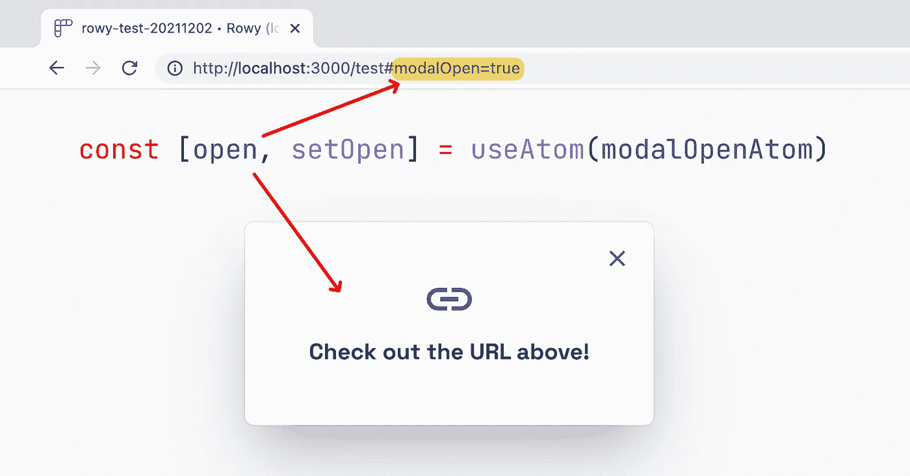
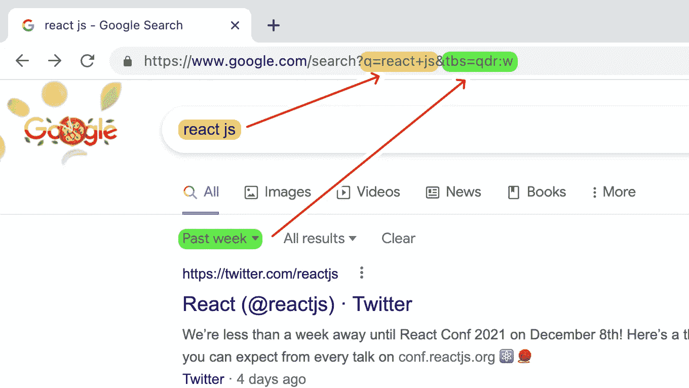
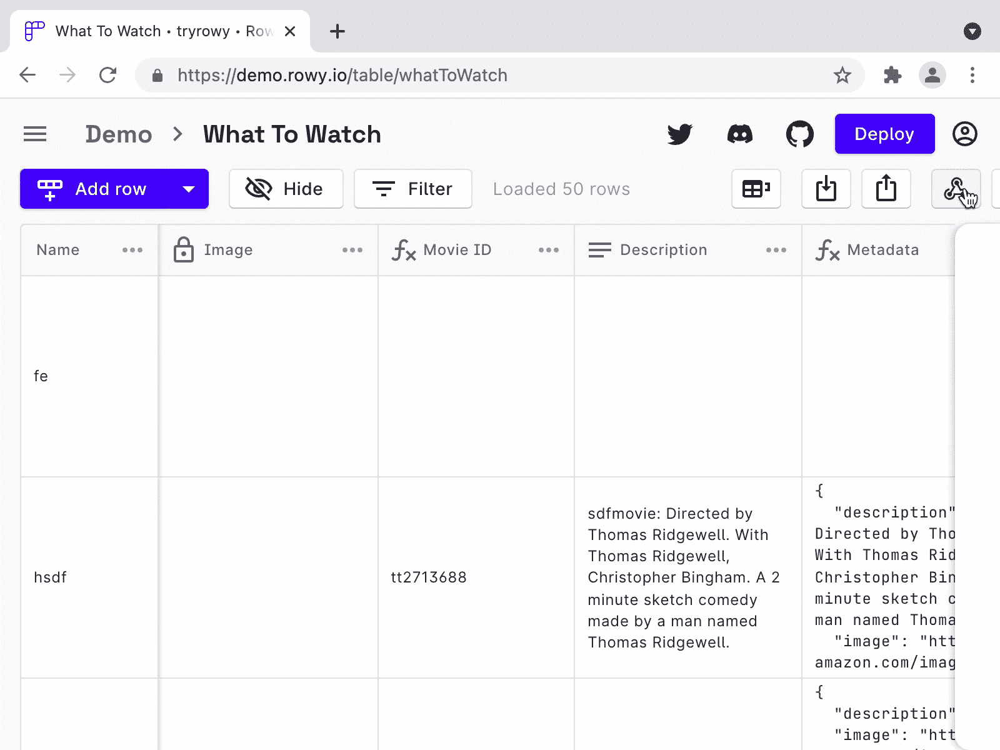
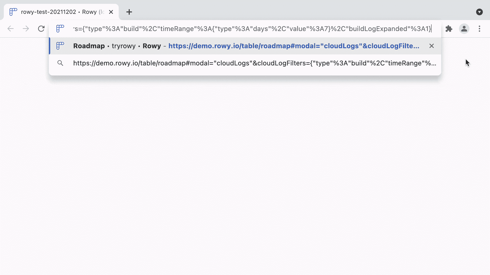
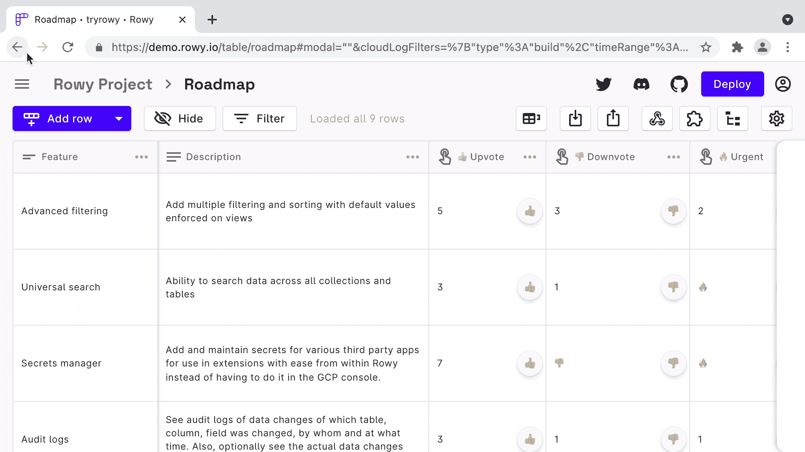

# 如何以及为什么应该在 URL 中存储 React UI 状态

> 原文：<https://betterprogramming.pub/how-and-why-you-should-store-react-ui-state-in-the-url-f2013a204cb2>

## React 中的深度链接，就像 useState 一样简单



作者照片。

你曾经使用过一个复杂的 web 应用程序，它有许多功能、模态窗口或侧面板吗？在不同的屏幕上点击几次后，你达到了屏幕上只有正确信息的完美状态，但随后你不小心关闭了标签。(还是 Windows 决定更新？)

如果有一种方法可以回到这种状态，而不用经历同样繁琐的过程，那就太好了。或者能够分享这种状态，这样队友就可以和你做同样的事情。

这个问题可以通过深度链接来解决，深度链接目前在移动应用程序中用于打开应用程序到特定的页面或 UI 状态。但是为什么很多 web apps 都没有这个呢？

[点击这里跳到解决方案和代码片段。](#694f)

# 带回网络上的深层链接

单页应用程序(SPAs)的出现使我们能够创造新的用户体验，在网络上即时互动。通过在客户端使用 JavaScript 做更多的事情，我们可以立即响应用户事件，从打开定制的对话窗口到像 Google Docs 这样的实时文本编辑器。

传统的服务器渲染网站每次都会发送一个请求来获取一个新的 HTML 页面。一个很好的例子是 Google，它用 URL: `[https://www.google.com/search?**q=your+query+here**](https://www.google.com/search?q=your+query+here)`中的用户搜索查询向其服务器发送请求。这个模型的伟大之处在于，如果我通过过去一周的结果进行过滤，我可以通过简单地共享 URL 来共享同一个搜索查询:`[https://www.google.com/search?q=react+js&**tbs=qdr:w**](https://www.google.com/search?q=react+js&tbs=qdr:w)`。这种模式对网络用户来说是完全自然的——自从它被发明以来，共享链接已经成为万维网的一部分！



当 SPAs 出现时，我们不需要在 URL 中存储这些数据，因为我们不再需要向服务器请求改变屏幕上显示的内容(因此有了*单页*)。但是这很容易失去一个独特的网络体验，一个可共享的链接。

桌面和移动应用从来没有真正的标准化方法来链接到应用的特定部分，深度链接的现代实现依赖于网络上的 URL。那么，当我们构建功能更像本地应用的网络应用时，我们为什么要抛弃已经使用了几十年的 URL 深层链接功能呢？

# 非常简单的深度链接

当构建一个有多个页面的 web 应用程序时，你最起码应该做的是在显示不同页面时改变 URL，比如`/login`和`/home`。在 React 生态系统中， [React 路由器](https://reactrouter.com/)非常适合这样的客户端路由， [Next.js](https://nextjs.org/) 是一个优秀的全功能 React 框架，也支持服务器端渲染。

但是我说的是深度链接，只需点击几下鼠标和键盘输入就能进入 UI 状态。对于注重效率的 web 应用程序来说，这是一个杀手级的功能，因为它允许用户在关闭应用程序或与其他人共享应用程序之后，立即返回到他们所在的位置，这样他们就可以毫无摩擦地开始工作。



请注意，当模式打开时，URL 如何更新以添加#modal="webhooks"。

您可以使用 npm 包，如 [query-string](https://www.npmjs.com/package/query-string) 并编写一个基本的 React Hook 来同步 URL 查询参数到您的状态，并且有很多[的](https://medium.com/swlh/using-react-hooks-to-sync-your-component-state-with-the-url-query-string-81ccdfcb174f)[教程](https://www.npmjs.com/package/use-query-params)针对[这个](https://dev.to/gaels/an-alternative-to-handle-global-state-in-react-the-url--3753)，但是有一个更直接的解决方案。

在探索 React 的现代状态管理库以重写 React 应用程序 [Rowy](https://rowy.io/?utm_source=medium.com&utm_medium=blog&utm_campaign=How%20and%20why%20you%20should%20store%20React%20UI%20state%20in%20the%20URL) 的架构时，我遇到了 [Jotai](https://jotai.org/) ，这是一个基于原子的微型状态库，灵感来自 React 团队的[反冲](https://recoiljs.org/)库。

这种模型的主要好处是状态原子被声明为独立于组件层次结构，并且可以在应用程序的任何地方操作。这解决了 React 上下文导致不必要的重新渲染的问题，我之前用 `[useRef](/how-to-useref-to-fix-react-performance-issues-4d92a8120c09)`解决了这个问题。你可以在 Jotai 的文档中读到更多关于原子状态的概念，在反冲的文档中可以读到更技术性的版本。

# 代码

Jotai 有一种叫做`[atomWithHash](https://jotai.org/docs/api/utils#atom-with-hash)`的原子，它将状态原子同步到 URL 散列。

假设我们希望一个模态的打开状态存储在 URL 中。让我们从创建一个原子开始:

然后在模态分量本身，我们可以像`useState`一样使用这个原子:

这是它的样子:


就是这样！就这么简单。

Jotai 的`atomWithHash`的奇妙之处在于，它可以存储`useState`可以存储的任何数据，并且它自动对要存储在 URL 中的对象进行字符串化。所以我可以在 URL 中存储一个更复杂的状态，使它可以共享。

在 [Rowy](https://rowy.io/?utm_source=medium.com&utm_medium=blog&utm_campaign=How%20and%20why%20you%20should%20store%20React%20UI%20state%20in%20the%20URL) 中，我们使用这种技术为云日志实现了一个 UI。我们正在建立一个开源平台，使后端开发更容易，并消除常见工作流的摩擦。因此，减少共享日志的摩擦对我们来说是完美的。您可以在我们的演示中看到这一点，我可以将您链接到一个特定的部署日志:

```
[https://demo.rowy.io/table/roadmap#modal="cloudLogs"&cloudLogFilters={"type"%3A"build"%2C"timeRange"%3A{"type"%3A"days"%2C"value"%3A7}%2C"buildLogExpanded"%3A1](https://demo.rowy.io/table/roadmap#modal=%22cloudLogs%22&cloudLogFilters=%7B%22type%22%3A%22build%22%2C%22timeRange%22%3A%7B%22type%22%3A%22days%22%2C%22value%22%3A7%7D%2C%22buildLogExpanded%22%3A1)}
```



解码 URL 组件揭示了 React 中使用的确切状态:

`atomWithHash`的一个副作用是，它默认将状态推送到浏览器历史，这样用户可以点击后退和前进按钮在 UI 状态之间切换。



该行为是可选的，可使用`[replaceState](https://jotai.org/docs/api/utils#atom-with-hash)` [选项](https://jotai.org/docs/api/utils#atom-with-hash)禁用:

感谢阅读！我希望这已经说服你在 URL 中暴露更多的 UI 状态，使其易于共享并减少用户的摩擦——特别是因为它实现起来毫不费力。

```
**Want to Connect With the Author?**You can follow me on Twitter [@nots_dney](https://twitter.com/nots_dney) for more articles and Tweet threads about front-end engineering.
```