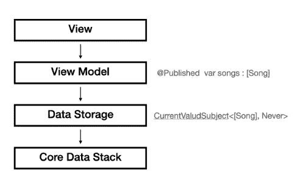

# 苹果如何把 SwiftUI 和核心数据搞在一起

> 原文：<https://betterprogramming.pub/how-apple-screwed-up-with-swiftui-and-core-data-9775eeb7f157>

## 以及我们如何重建它

来源:Unsplash

# 介绍

几个月前，我决定我的第三本 iOS 开发书将专注于核心数据，这是苹果旧的(但很棒的)对象图和持久化框架。

核心数据有多老？

我想第一粒种子播下的时候我还在上高中(今天我已经不是小孩子了)。

核心数据效率极高，是众多应用基础设施的一部分，所以苹果看起来不会很快抛弃它。

因此，对我来说，调查核心数据如何与新的、闪亮的 UI 框架— SwiftUI 集成是很自然的。

天哪，我非常失望。

# 我不能说他们没有尝试过

是啊！这并不是说他们忽略了 UI 层需要始终更新当前的持久数据状态。

他们甚至做了一些调整(我现在就要展示)，在他们的文档中看起来非常干净。

我先从`NSManagedObject`说起。

你知道启动 iOS 13，`NSManagedObject`符合 ObservableObject 协议吗？

这意味着您可以将 UI 组件直接绑定到托管对象:

对，就这样！

顺便说一下，您也可以在 UIKit 中使用它:

苹果还提供了一个名为`@FetchRequest`的新属性包装器，它是`NSFetchedResultsController`的简化版本(记住`NSFetchedResultsController`——我们几分钟后会回到它)。

在上面的例子中，`@FetchRequest`属性有三个参数——我们获取的实体、一个排序描述符数组和一个谓词。提取结果存储在名为“songs”的变量中。

此时，您不需要做任何事情。只需将 songs 变量连接到 UI(以下是完整代码):

从上面的例子中，我们可以学到另外两件事。首先，每当获取结果发生变化时，songs 变量会自动重新加载。

其次，我们需要将相关的上下文作为环境传递给视图。

# 那么，有什么问题呢？看起来棒极了！

有什么问题？我告诉你有什么问题。

苹果多年前就决定 MVC 是我们需要在应用中使用的设计模式。这是 iOS 开发初期学校、文章、书籍对我们所有人的训练。

但自那以后，情况发生了变化。

移动开发经历了多年的发展，将 MVC 远远抛在了身后。

今天，我们都知道，如果我们想要管理一个国家并连接到我们的数据或网络，我们应该使用 MVVM。

还有一个秘密——苹果也知道。

这就是为什么在 SwiftUI 中，我们不再有“控制器”——只有“视图”。

这也是我们有`@ObservedObject`和`@StateObject`的原因——帮助我们更好地分离代码。

“视图”不需要知道核心数据、获取、上下文或任何其他东西。

当然，在例子中它看起来很棒，干净优雅——但是我们都知道生活远比这复杂。

不幸的是，`@FetchRequest`必须只出现在视图中——真糟糕！

# 不要放弃——我们可以重建它

为了适应我们的时代和我们想要的标准，我们需要重新设计我们的架构，并构建更加现代化的新工具。

请看下图:

我们要做的是添加一个名为“数据存储”的组件。数据存储器有一个`NSFetchedResultsController`(告诉过你)根据特定的获取请求观察变化。

数据存储还有一个发布器，它将这些更改发布到视图模型，视图模型将这些更改转发给视图。

看看代码是什么样子的:

和视图模型:

我们可以在不同的视图模型之间共享数据存储，这也意味着不同的视图。

我们可以为不同的需求创建多个数据存储类，甚至不需要将它们绑定到 UI 层——我们也可以在应用程序的其他地方使用它们，比如同步服务或只是业务逻辑类。

这种架构非常灵活，甚至连娜迪亚·科马内奇都嫉妒它(秀才告诉我的，真的)。

# 摘要

如果你对 iOS 开发和设计模式很认真的话，`NSManagedObject`符合`ObservableObject`的事实不过是好消息，而`@FetchRequest`则毫无用处。

我给了你一个如何利用 SwiftUI + Combine +核心数据的例子，你可以在你的项目中使用。

我希望苹果能为我们提供更好的工具，帮助我们构建现代应用，而不仅仅是教程示例。