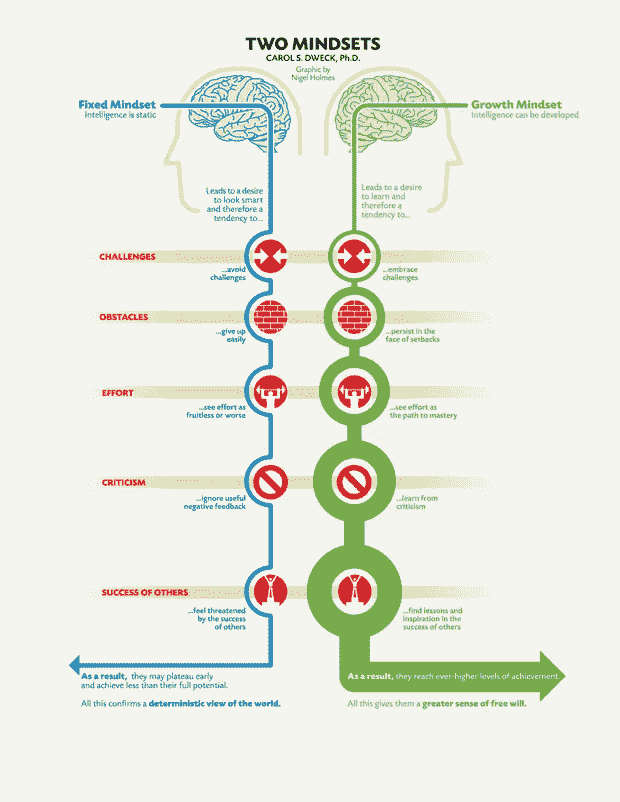

# 改变你的想法如何让你成为一个更好的程序员

> 原文：<https://betterprogramming.pub/how-changing-your-thoughts-can-make-you-a-better-programmer-2e627fdf2ef9>

## 简短的鼓舞士气的讲话

[数码师](https://pixabay.com/illustrations/brain-blueprint-thinking-analysis-1845941/)在 [Pixabay](https://pixabay.com/) 拍摄的照片。

作为一名开发人员，在你自己的旅程中积极思考的一个框架是拥有成长心态的概念。拥有一个成长的心态意味着坚信*任何事情*都是可以学习的。作为一名程序员，这有助于成倍地推动我们的职业生涯，因为我们的思想塑造了我们的行动。

# 什么是成长心态？

这是著名心理学家卡罗尔·s·德韦克创造的一个术语。根据她的 TED 演讲，我们可以提高大脑学习和解决问题的能力。 *"* 这意味着我们的技能和知识可以发展，而我们的挑战可以激励成长。它注重进步，推动更高水平的成就。

更重要的是，要认清自己什么时候有了固定的心态。有一个固定的心态意味着你可能对一个情况有一个确定的看法，把失败视为对你能力的限制，而不是成长的机会。固定的思维模式会让你停滞不前，阻止你探索新的想法、方法和解决问题的方式。你可能会在挑战面前退缩。

奈杰尔·霍姆斯通过[最佳语录](https://bestquotes.name/pin/96888/)拍摄的照片。

## 固定思维模式

“让我坚持我所知道的。那不是我的强项。”

## **成长心态**

“我对这个还不熟悉。然而，我可以花时间去了解更多。有大量的信息、社区和教育手段可以帮助我加强这方面的技能。如果我一路上面临挑战，这可以帮助我成长。”

# 然而的力量

“然而”是一个我一直喜欢使用的小而具有变革意义的词！它让任何一句话都更有希望，同时让说话者对自己更有信心。它表达了在困难的情况下需要耐心，并允许你培养更多的雄心壮志，同时期待自己随着时间的推移而变得伟大。它强调过程而不是结果。

作为一名程序员，无论你身在何处，这种训练思维的实践都能给你额外的动力。这是一个积极的习惯，有助于你对挑战和解决问题保持热情。

# 对此半信半疑

> “生活或奋斗没有秘诀。没有一个框架在任何时候、任何地方都有效。在一种情况下具有变革性的东西，在另一种情况下可能是无用或令人窒息的。”——[卡拉·伯格曼和尼克·蒙哥马利谈快乐的战斗性](https://joyfulmilitancy.com/2017/09/04/intro/)

同样重要的是，要把成长心态当成一个有细微差别的概念。没必要事事都抱着成长的心态。我们一直在协商我们能付出多少时间和精力。

当我们陷入消极的想法时，固定心态的问题就出现了。对失败的恐惧是真实的**。当我们面对批评或挫折时，这可能会让我们陷入一种固定的思维模式。在这种情况下，我们可以问自己，“在这种情况下，这是否会长期停滞我的个人成长？我现在的思维对我来说健康吗？”**

我们生来就不知道如何编码！随着领域的发展，我们一直在发展自己的技能。我们处于终身学习的状态。拥有一个成长的心态可以帮助我们进步，并有助于我们的开发人员职业生涯。

感谢您的阅读！

# **资源**

 [## 驯服固定心态:持续成长和改变的 4 个步骤

### 在耶鲁音乐学院的这些年里，我向我的学生们介绍了成长思维，相信你可以…

www.astridbaumgardner.com](https://www.astridbaumgardner.com/blog-and-resources/tame-the-fixed-mindset-in-4-steps-to-adopt-a-growth-mindset-approach/)