# ChatGPT 的编码技巧如何让我沉醉

> 原文：<https://betterprogramming.pub/how-chatgpt-got-me-drunk-614d72d37f6f>

## ChatGPT 帮我搜集了鸡尾酒网站，创建了一个通用的饮料指数。


这张图片显然是由 DALL-E 生成的。

最近，我成了调制鸡尾酒的爱好者。在得到金钱可以买到的最好的设备和酒后，我意识到对我来说最大的障碍是鸡尾酒配方。我想要一个平台，在那里我可以输入我家里的配料，输出的将是我可以制作的鸡尾酒列表。有几个应用程序可以做到这一点，但它们的种类有限，除非你为应用程序付费。因为除了鸡尾酒，我唯一更喜欢的是免费的鸡尾酒，所以我在寻找一种替代品。

大约在 [ChatGPT](https://openai.com/blog/chatgpt/) 发布一周后，它已经成了我最好的朋友。也会是我的酒友吗？我意识到网上有很多食谱，我只需要正确地索引它们。ChatGPT 能为我自己建立一个索引它们的工具吗？

TLDR——是的，[这里是 GitHub 回购](https://github.com/galbash/drinkindex)。甚至还有 ChatGPT 生成的 READMEs。

# 这个计划

我决定试一试。我想使用 ChatGPT 构建一个简单的系统，从 web 上检索鸡尾酒。该解决方案包括两个部分:

1.  Crawler —获取要爬行的域并将看似鸡尾酒配方的 URL 输出到队列的过程。它还递归地跟踪页面上的其他 URL 来搜索其他包含食谱的页面。这似乎是一个足够简单的任务，让 ChatGPT 自己编写代码
2.  索引器(indexer)—该组件用于获取 URL，确定页面是否包含鸡尾酒配方，并将其存储在数据库中。问题是，有鸡尾酒配方的博客是高度非结构化的，在到达重点之前有很多不必要的文字。ChatGPT 能帮我理出这个乱七八糟的东西吗？

有了计划，我开始着手建设。我从建立架构开始，必须决定使用什么队列。ChatGPT 前来救援:

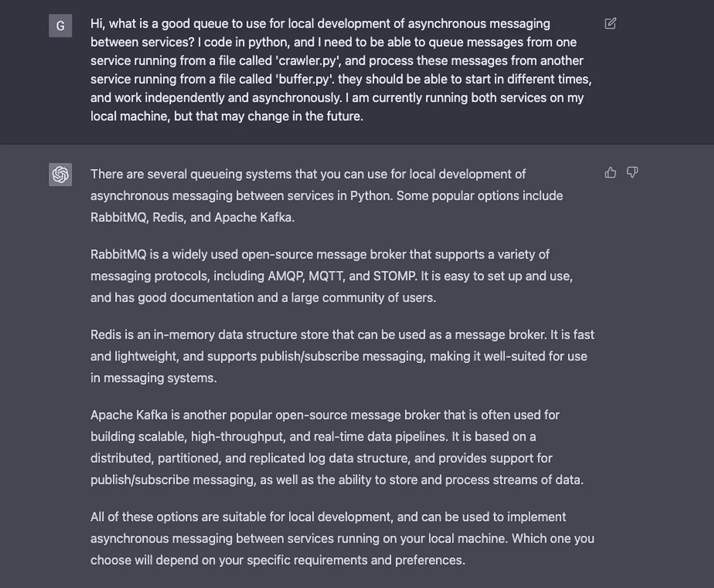

在回顾了它的建议之后，我决定使用 RabbitMQ，因为我有一些使用它的经验。我请 ChatGPT 为我奠定基础:

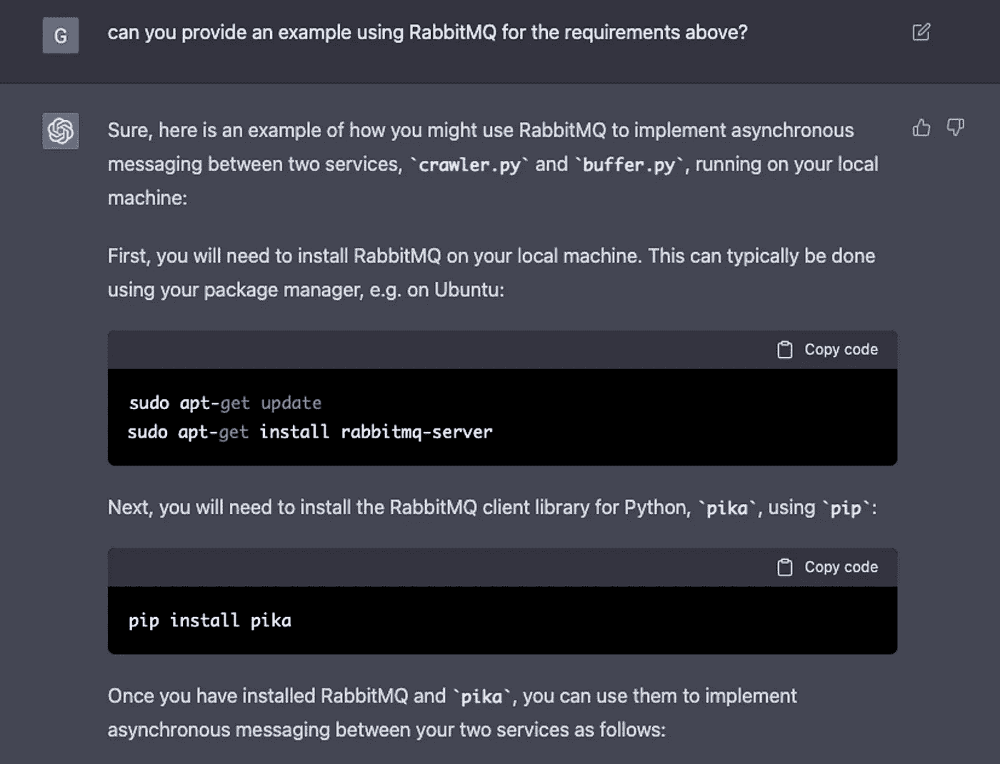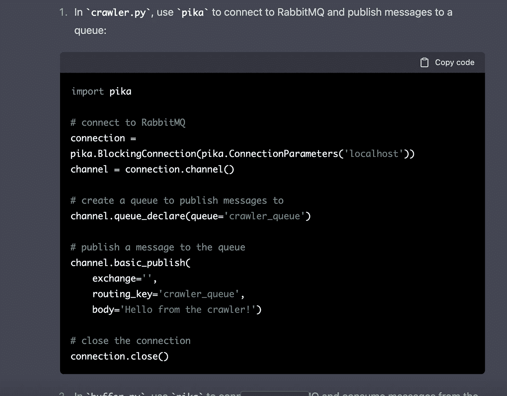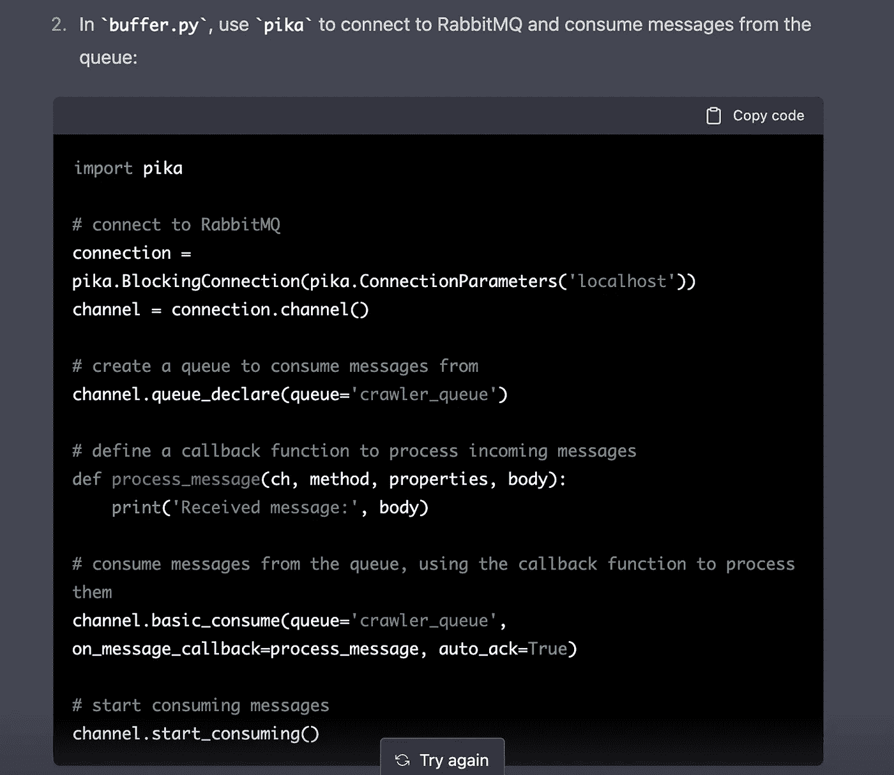

随着项目的建立，ChatGTP 的下一步是开发爬虫。

# 爬虫

我请 ChatGPT 为我做这项工作，好家伙，它做到了:

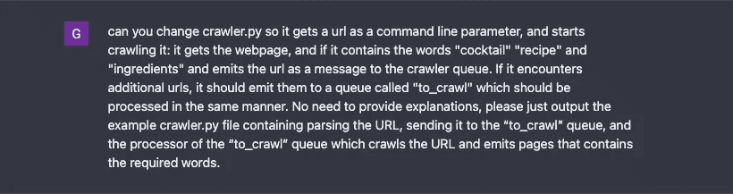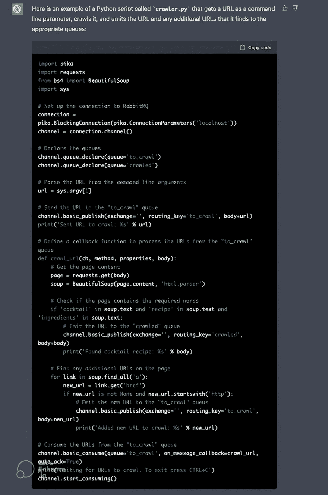

当我运行这个程序时，我遇到了两个问题。首先，被访问的 URL 没有被缓存，因为几乎所有的页面都链接到了主页，我们最终陷入了一个无限循环。我让 ChatGPT 来处理这个问题，它正确地修改了代码:

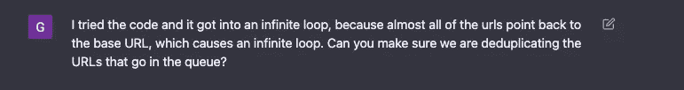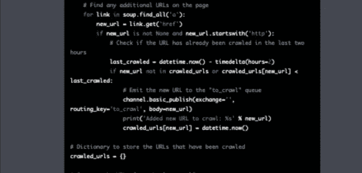

遗憾的是，我无法以更好的分辨率重现这一响应。

第二个问题是它也开始爬行其他域——例如，对于包含视频的页面，爬虫也开始爬行 youtube。我要求 ChatGTP 也解决这个问题，它答应了:

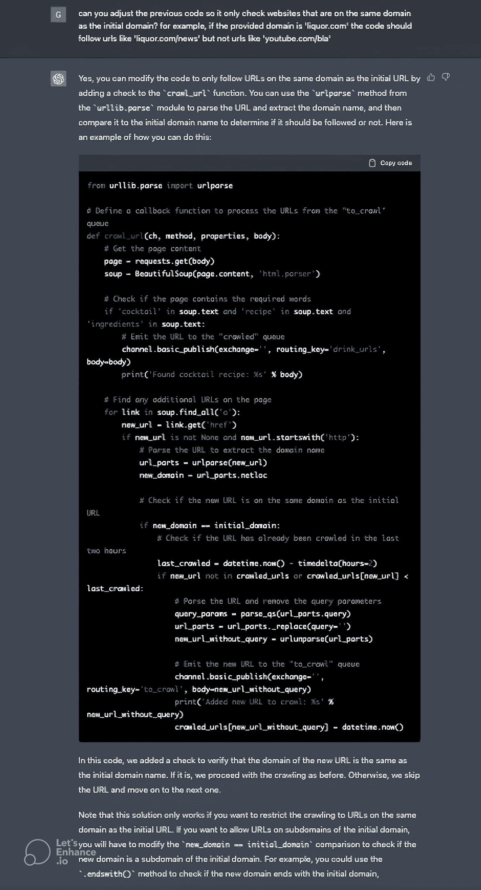

就这样了！爬虫已经准备好了，下一步是编写索引器。

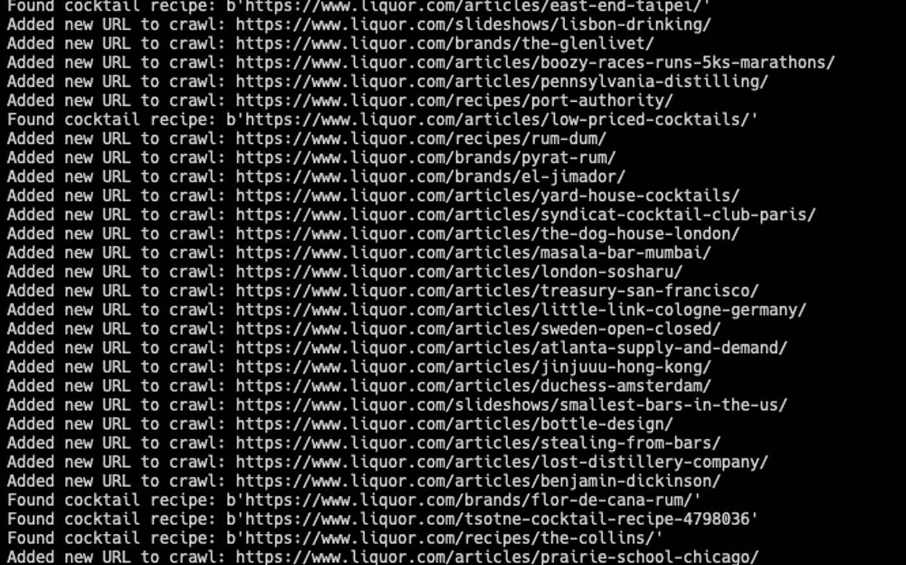

爬虫输出。在识别食谱时有一些错误——下一步将处理这些错误。

# 索引器

正如我之前提到的，解析网页内容以识别它是否描述了鸡尾酒配方是一项挑战。这是一个鸡尾酒配方网页的例子:

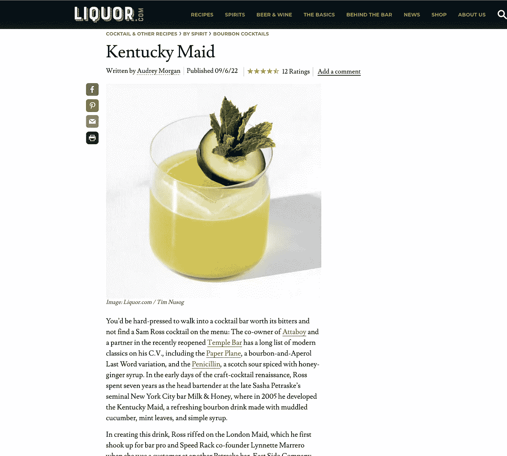

处理所有不同的用例来解析页面和提取成分几乎是不可能的。再一次——ChatGPT 来拯救我们！

我偶然发现了 ChatGPT API 的[非官方 python 实现，并决定在我的索引器中使用它。想法很简单，使用一个精心制作的提示，我应该能够使用 ChatGPT 从鸡尾酒页面提取配料。由于 ChatGPT 无法访问互联网，它无法编写这部分代码，但它确实帮助了我编写通用组件。以下是我使用的代码:](https://github.com/acheong08/ChatGPT)

```
import pika
import time
import sys
import requests
from bs4 import BeautifulSoup
from revChatGPT.revChatGPT import Chatbot
from db import CocktailRecipe, Ingredient, session
import traceback

print(sys.argv)
config = {
    "session_token": sys.argv[1],
    "cf_clearance": sys.argv[2],
    "user_agent": sys.argv[3]
}

chatbot = Chatbot(config, conversation_id=None)

# connect to RabbitMQ
connection = pika.BlockingConnection(pika.ConnectionParameters('localhost'))
channel = connection.channel()

# create a queue to consume messages from, if it does not already exist
channel.queue_declare(queue='drink_urls', durable=True)

QUESTION = """
    From the following text below, please understand if it is an article
    describing a cocktail recipe. If it is, output the following: The first
    line should be: "<cocktail name>: <ranking>". If the ranking doesn't exist
    output "-". use only lowercase letters and the generic name of the cocktail
    , without mentioning brands. the following lines contain the ingredients:
    each line should contain one ingredient and it's amount in the format
    "<ingredient>: <amount>". The ingredient part (before the semicolon)
    should contain only the ingredient name, not the amount. If it is not a
    cocktail recepie, output only the word "no". Output the ingredients in 
    their generic name, and don't include a brand. For example, instead of 
    "bacardi white rum" output "white rum". All of the output should be lower
    cased, don't capitalize any word. The text is: %s"""

# define a callback function to process incoming messages
def process_message(ch, method, properties, body):
    time.sleep(5)
    try:
        print(body)
        page = requests.get(body)
        soup = BeautifulSoup(page.content, "html.parser")

        response = chatbot.get_chat_response(QUESTION % soup.text, output="text")['message']
        if response == "no":
            print("not a cocktail")
            return
        print(response)
    except Exception:
        print(traceback.format_exc())

# consume messages from the queue, using the callback function to process them
channel.basic_consume(queue='drink_urls', on_message_callback=process_message, auto_ack=True)

# start consuming messages
channel.start_consuming()
```

这非常有效。ChatGPT 很好地理解了一个页面是否包含鸡尾酒配方，如果包含，输出几乎总是正确的格式。我曾经认为用 Python 编码是显而易见的，但是从来没有*接近过。*

现在我只需要将它存储在数据库中。我让 ChatGPT 为我创建数据库:

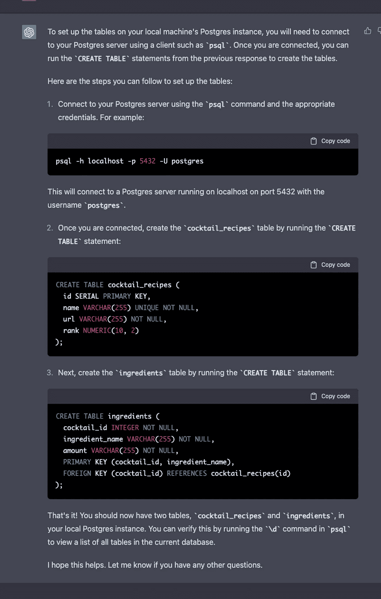

然后，我给了它一个自己生成的样本输入，并让它编写将信息插入数据库的代码。它提供的最初实现是使用`psycopg2`。我让它使用`SQLAlchemy`,因为我发现使用 ORM 更容易:

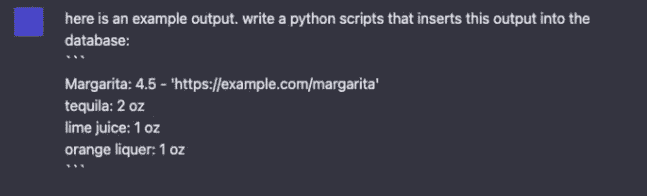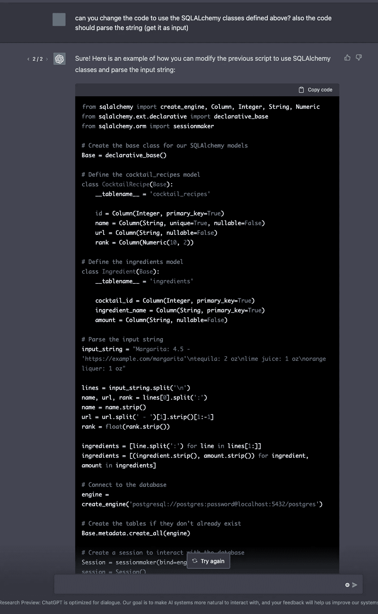

注意，ChatGPT 也为我编写了响应的解析逻辑

我将这段代码集成到索引器中，终于有了我梦想中的鸡尾酒数据库！

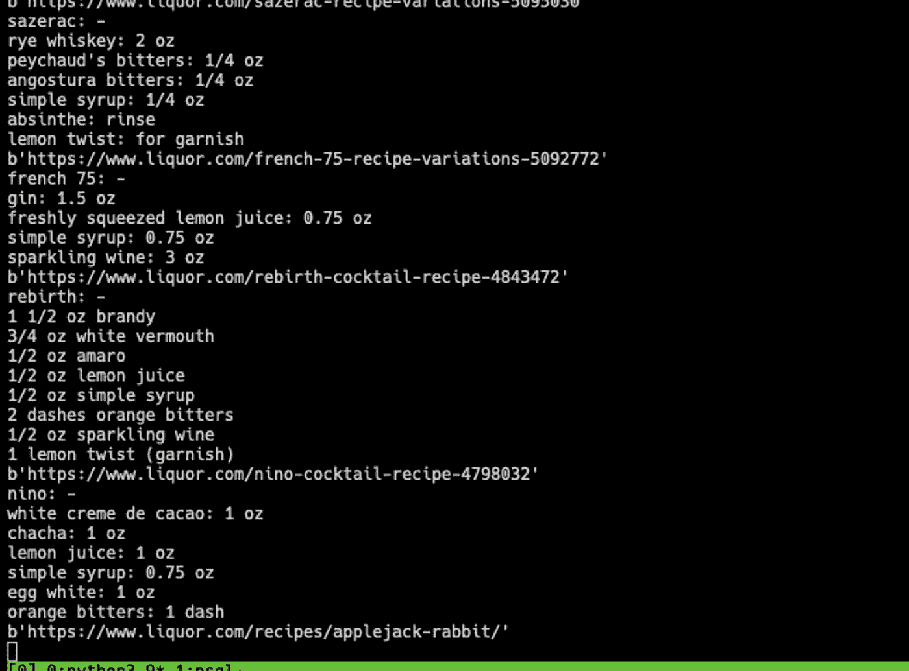

索引器进程的输出示例

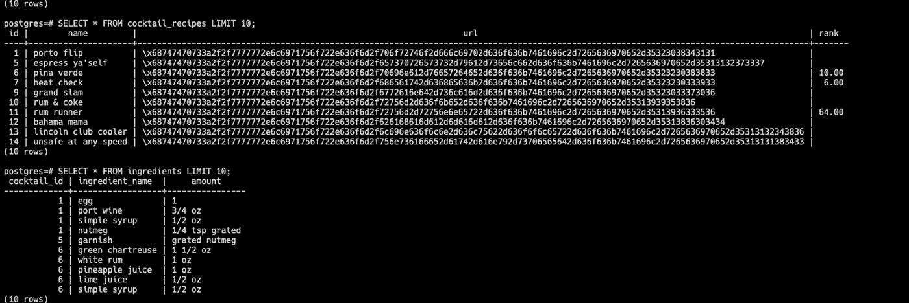

我的鸡尾酒数据库视图

接下来，我将使用 ChatGPT 来帮助我创建一个 API 和 UI 来浏览鸡尾酒数据库，并选择我今天想要制作的鸡尾酒。

# 结论

整个项目从头到尾花了我大约 3 个小时。ChatGPT 加速我开发过程的能力让我大吃一惊。最大的胜利是 ChatGPT 提供的文本解析，这是我自己做不到的，ChatGPT 使它变得简单了。

然而，任务越复杂，ChatGPT 正确完成任务的几率就会急剧下降。当与 ChatGPT 配对时，开发人员的工作仍然是将工作分解成足够小的任务，至少目前是这样。

我很期待接下来会发生什么！

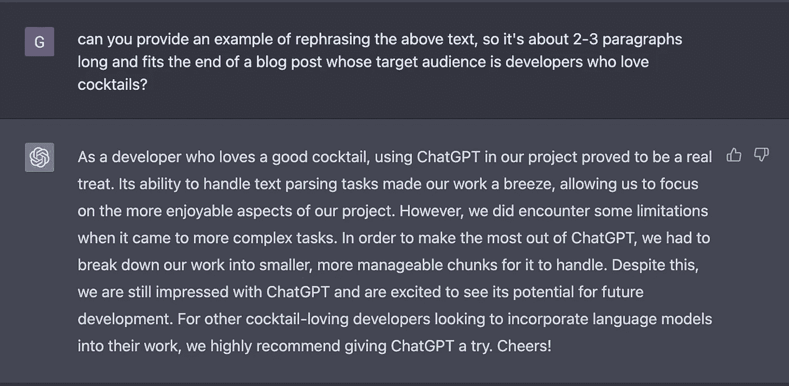

我要求 ChatGPT 重写结论。谁做得更好？

DrinkIndex 第二部出来了！点击这里查看。