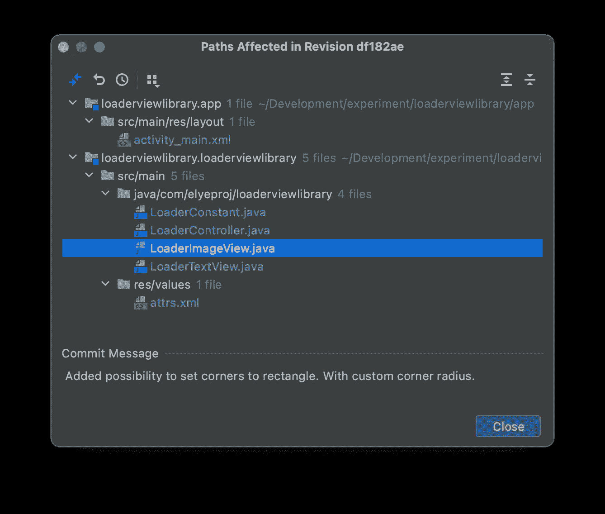

# 代码注释是如何过时的

> 原文：<https://betterprogramming.pub/how-code-comments-are-obsoleting-333d5ca256d0>

## 除了代码注释，还有更多方法可以让代码变得可理解


Daria Nepriakhina 在 [Unsplash](https://unsplash.com?utm_source=medium&utm_medium=referral) 上拍摄的照片

有一次，我有机会与总部的高级软件主管进行一对一的面谈。他问我有什么可以改进的地方。

远程工作，我想从代码中得到更多的上下文，而不需要从总部给工程师发电子邮件。作为一个天真的初级工程师，我告诉高级软件主管，我们可以通过对代码进行更多更好的评论来改进。

他礼貌地对我说，“也许，最好的评论是代码本身。”

在那个时候，我不同意。现在回想起来，这开始变得有意义了。

如果我们看看我们在代码中注释的最初原因，也许这将帮助我们更好地解释为什么它现在不那么流行了

# 注释是解密和划分代码

让我们看看早期的编程语言。

**ASM 代码:**操作符固定为 3-4 个字母，变量固定为几个字符。有了评论，就很难解密它的意思了。

```
forlp   i, 0, 3
forlp   j, 0, 3
mov     bx, i           **;Compute address of a[i][j] using**
shl     bx, 2           **; row major ordering (i*4 + j)*2.**
add     bx, j
add     bx, bx
lea     bx, a[bx]
push    bx             ** ;Push address of a[i][j] onto stack.**
```

> 来源于[汇编语言风格指南—注释](http://www.sourceformat.com/standard/asm-coding-standard-assembly-6.htm)

**Cobol 代码:**需要分成不同的分部。它使用注释来使划分更加清晰:

```
************************************************
**  P R O C  D I V I S I O N               ***     **********************************************
 ** Procedure Division.
  000-Main-Logic.
     Perform 100-Say-Hello.
     Perform 200-Get-Date.
     Perform 300-Say-Goodbye.
     Stop Run.
 ** **
  ** Setup initial values and say we are starting.
  **
 ** 100-Say-Hello.
     Move 80 to Stringlen.
     Move 02 to Dest-output.
     Move Start-Msg to Str.
     CALL "CEEMOUT" Using Msg   Dest-output Feedback.
```

> 来源于 [IBM COBOL 代码示例](https://www.ibm.com/docs/en/zos/2.1.0?topic=routines-sample-cobol-program)

**GW-Basic 代码:**这里，我们使用行号来帮助程序的流程。没有将有意义的上下文组合在一起的函数作用域。需要注释来帮助更好地理解它。

```
10 REM Calculate the area of given radious repeatedly
20 READ R
30 PRINT "R ="; R;
40 A = 3.14*R^2
50 PRINT "AREA ="; A
60 GOTO 10:   REM repeat the process again until no data
70 DATA 5, 7, 12
```

> 来源于 [GW 基本 GOTO 语句](https://hwiegman.home.xs4all.nl/gw-man/GOTO.html)

上述语言确实限制了开发者清楚地表达他们的意图。因此，注释需要通过解释代码的用途和它们的结构来说明。

如今的语言更富于表现力。如今代码本身可读性更好了，我们可以更好地对它们进行组织和命名，取代了注释的需要。

# 注释是为了提供可追溯性或上下文

当我第一次成为一名软件工程师时，我在下面看到了一些关于每个课程的评论。原因是“*注释提供了从需求到代码修改的可追溯性*

```
*// ******************************************************************
*// * Logger helper                                                 **
*// *                                                               **
*// * 2005-03-01 First Version, Anders Abel                         **
*// * 2007-08-17 Added Console Output, Anders Abel                  **
*// * 2009-12-15 Removed file output, John Doe                       **
*// *                                                               **
*// * Usage: Call Logger.Write() with string to be logged.          **
*// ******************************************************************
**public** **static** **class** Logger
```

> 来源于[的注释不受版本控制](https://coding.abel.nu/2012/07/comments-are-not-version-control/)

它确实提供了一个很好的类如何变化的历史，但是我不确定我是否需要在每次读类的时候都看到它。

如今，所有代码都存储在版本控制中(例如 Git)。所有这些信息都已经存储在源代码版本控制工具中。我们不需要代码中的重复数据。

> 更多讨论[在这个堆栈中](https://stackoverflow.com/questions/648972/configuration-management-history-in-code-comments)

除了显示历史更改之外，源代码版本控制还允许一次提供所有文件中代码更改的更好的上下文，如下图所示的示例。



> 每当我发现一行有问题的代码时，我通常会执行 git-fall 来查找 Git 注释，这样我就可以看到整个上下文以及整个过程中文件的变化，而不是希望在代码行上方或函数中找到注释。

版本源代码管理注释是及时和相关的。它不仅仅涵盖文件中的代码部分。它不仅取代了一些传统的评论，而且更好。

在让代码显示“如何”的同时，陈述“为什么”是一个更好的地方，因为许多人提倡代码注释的目的。

所以，也许这样说没有错，[更喜欢 Git 注释而不是代码注释](/7-unconventional-pieces-of-coding-advice-17f0cfc0220f)。它提供了更好的可追溯性和时间精确的上下文，进一步减少了注释的需要。

> Git 评论很棒。尽可能多的在那里注释，因为它及时链接到所有相关的变更代码。我喜欢丹尼尔·卢(Daniel Lew)的说法:“我从来没有后悔在提交消息(commit message)中写了太多(T10)
> 
> 注意:这里的 Git comment 指的是 commit comment，以及制作 PR 时的 comment。

# 新的编程语言更具表现力

现代语言现在有能力让一个命名，并把代码和有意义的名字组合成函数、类等。

下面给出了一些例子。

## 更好的变量命名

不要这样做:

```
# convert to cents
a = x * 100# avg cents per customer 
avg = a / n
```

我们可以更好地命名变量并去掉注释:

```
total_cents = total * 100
average_per_customer = total_cents / customer_count
```

## 具有有意义名称的代码分组

假设代码具有如下各种注释，每个部分都有注释:

```
// This function will generate something from the parameters, 
function myFunction(parameters) {
    // It will do some things to get started. // It will do more with the stuff. // It will end doing things with the stuff.
}
```

更好的方法可能是正确命名函数，并将代码提取到函数中:

```
function generateSomething(parameters) {
  var someThing = initializedWithSomething;    
  doSomethingWith(someThing);
  doMoreWith(someThing);
  endDoingThingsWith(someThing);
  return someThing;
}
```

一个真实的 Kotlin 代码示例:

这不太难读。但是我们仍然可以通过将代码中有意义的部分组合成有意义的函数名来提高可读性。

## 引入了更好的代码语法

如今阅读代码变得更加顺畅。例如，下面给出了一种遍历数组中各项的方法:

```
for (int i = 0; i < array.size; i++) {
    println(array[i])
}
```

今天，代码甚至可以更有意义:

```
for (item in array) { println(item) }
// or
array.forEach { println(it) }
```

一个很好的真实科特林代码的例子是:

```
*for (****everyday in this year 2017****) {
     // do some with everyday
}*
```

[](https://medium.com/mobile-app-development-publication/iterate-through-everyday-in-this-year-in-kotlin-5b0a828ef23) [## 科特林这一年每天都在迭代

### 下面的‘2017 年的每一天’不是伪代码，而是真正的 Kotlin 代码！！如此自然不是吗？

medium.com](https://medium.com/mobile-app-development-publication/iterate-through-everyday-in-this-year-in-kotlin-5b0a828ef23) 

Swift 语言中参数标签功能的另一个示例如下:

```
**func** setAge(person: String, age: Int) {
    print("\(person) is now \(value)")
}
```

当一个人在使用它时，我们现在可以清楚地理解第一个参数是`name`，而第二个参数是`age`，而不仅仅是一个`String`和一个`Integer`。

```
setAge(**person**: "Jason", **age**: 10)
```

或者更好:

```
**func** setAge(**for** person: String, **toAge** age: Int) {
    print("\(person) is now \(value)")
}
```

我们现在能把它设置得更像英语，听起来更像评论本身吗？方法如下:

```
setAge(**for**: "Jason", **toAge**: 10)
```

以上只是几个例子。我相信你可以从新语言的各种不同改进中想出更多的例子，这些改进有助于使今天的代码比它们的前辈更具可读性。

> 更多例子在 [Swift —编写自文档代码](https://www.swiftbysundell.com/articles/writing-self-documenting-swift-code/)。

## 仅用于替换注释的功能

为了做一个好的测试，我们使用注释来排列它们。

```
public void myTest() {
    **// Arrange**
    **// Act**
    **// Assert**
}
```

相反，我们可以用本地函数进行模板化的[测试，这将保证它的实现。](http://dontcodetired.com/blog/post/Using-Local-Functions-to-Replace-Comments)

```
public void myTest() {
 **Arrange();
    Act();
    AssertResults();**

    void Arrange()       { throw new NotImplementedException(); }
    void Act()           { throw new NotImplementedException(); }
    void AssertResults() { throw new NotImplementedException(); }
}
```

在 Swift 中，可以使用测试断言来避免注释。请参考下面的示例，并附上注释:

可以改成下面。当测试失败时，注释会显示出来。

# 通过更少的低级手动代码工艺优化来降低复杂性

## 代码管理和优化的改进

当我学习 C 语言时，我记得我必须自己分配和释放内存。我们必须手动跟踪内存分配计数，否则我们将面临内存泄漏的风险。

这种低级代码管理增加了编码的复杂性，因此很难避免注释。

对于现代语言，如基于 JVM 的语言(如 Java)，内存释放是自动完成的。这大大简化了编码的方式。

类似地，不再需要低级代码优化，例如:

```
// Using shift 1 as divide 2 for faster processing
int dividedValue = originalValue >> 1;
```

但是随着更好的代码编译优化，[下面的代码这些天也会执行相同的](https://stackoverflow.com/a/4072724/3286489)。不需要评论。干净简单。

```
int dividedValue = originalValue / 2;
```

## 如今的编码水平更高了

如果你学过 C 或 C++，学习如何管理指针是有效管理数据结构的关键。我们用它来遍历数据并管理它们。水平低，复杂。感谢[标准模板库](https://www.geeksforgeeks.org/the-c-standard-template-library-stl/)简化了其中一些。还是很复杂。

随着更高级编程语言的出现，大量库的出现，以及函数式反应式编程的引入，许多软件开发都在更高级别上完成。

例如，Kotlin 语言提供了数百个集合函数，人们可以使用这些函数更容易地操作数据。

[](https://medium.com/mobile-app-development-publication/kotlin-collection-functions-cheat-sheet-975371a96c4b) [## Kotlin 集合函数备忘单

### 使学习和查找相关收藏功能变得更加容易

medium.com](https://medium.com/mobile-app-development-publication/kotlin-collection-functions-cheat-sheet-975371a96c4b) 

> 而集合函数的整洁部分，[当函数追加了【to】、【by】或【with】](https://proandroiddev.com/kotlin-collections-appended-to-by-and-with-205d9540208)时，它才使其函数有意义。从而使函数名更加不言自明。

我们不需要编写逻辑的详细算法类型，注释的需求也变得更少。

# 上述方法的组合…

有时，我们可以将上述方法结合起来。

在这个 [StackOverflow](https://softwareengineering.stackexchange.com/a/26828/373333) 中，有人陈述了下面的代码:

```
response.contentType="text/html"
render '{"success":true}'
```

虽然很清楚，但可以做得更好:

```
// must be text/html so the browser renders the response 
// within the invisible iframe, where ExtJS can access it
response.contentType="text/html"// ExtJS expects that, otherwise it will call the failure 
// handler instead of the succss handler
render '{"success":true}'
```

我想我们可以进一步改变它。

## 1.将细节注释移动到 Git 注释

```
response.contentType="text/html"
render '{"success":true}'
```

在 Git 注释中，放入下面的。

```
The response.contentType must be text/html so the browser renders the response within the invisible iframe, where ExtJS can access itExtJS expects that the render is success and true, otherwise it will call the failure handler instead of the succss handler
```

## 2.为设置创建一个本地函数

使用一个函数名来更清楚地描述这一点。

```
def essentialDoNotRemoveSetting() {
    response.contentType="text/html"
    render '{"success":true}'
}
```

> 如果我的 groovy 函数语法不正确，我很抱歉，我只是想说明使用函数来提供一些意义。

现在我们在代码中没有注释，但是仍然保留了所有的上下文，包括函数名和 git 注释。

# 代码注释还没有过时……也许永远不会过时

已经展示了上面所有的例子，我仍然不能否认，在我们拥有一种不需要注释特性的编程语言之前，还有很长的路要走。

对代码注释的需求已经显著减少，但它仍然是不时出现的必要之恶。它仍然是需要的，因为…

1.  一些需要的仪式，如文案声明等。或者甚至需要完成一些基本的高级文档，例如 JavaDoc。或者作为教程讲解帮助学生作为学习指导。
2.  这种语言还不能让人很好地表达意图。例如 ASM、COBOL 等。这甚至适用于较新的语言，因为没有一种语言可以声称自己是完全表达的。
3.  超级复杂的代码算法，需要绑定到一些核心库的一些底层实现，或者一些数学或学术研究工作。那些需要解释很多为什么的代码。理想情况下，这样的实现值得链接到更完整的文档，清晰地解释它们(用图表)，而不是把它们都作为代码注释(这将非常冗长)。
4.  一些立即引人注目的注意细节。也就是说，写评论总是令人惊讶，会使人更加关注那篇文章。(这就是为什么我们应该显著减少代码中的建议，这样任何代码注释的存在都会立即引起注意)。一些例子:黑客攻击、库错误解决方法、待办事项或代码更详细解释的参考链接(例如，代码是从哪里复制的)
5.  嗯，……有时由于交付的时间压力，对“不太理想”的代码进行评论可能有助于加快交付。业务优先第一。

在完美的世界里，代码不需要任何注释。代码应该是真理的唯一来源。手动维护与代码相关的东西，而没有与代码相关的时间戳，可能有一天会伤害到我们。

> 对代码进行注释就像一个重复的代码，总是需要手动维护两者之间的一致性。改变其中一个而不改变另一个可能会引起混乱。三思而后行。

不幸的是，我们今天生活在一个不完美的世界。因此代码注释仍然是允许的(但希望不要被接受)。每当我们需要写一个的时候，我们应该思考罗伯特·c·马丁下面说的话。

> “每次写评论都要做鬼脸，感受自己表达能力的失败。”罗伯特·马丁

# 参考

1.  评论历史:【http://www.gavilan.edu/csis/languages/comments.html 
2.  评论是码闻:【https://softwareengineering.stackexchange.com/questions/1】T4
3.  评论就是道歉:[http://butunclebob.com/ArticleS.TimOttinger.ApologizeIncode](http://butunclebob.com/ArticleS.TimOttinger.ApologizeIncode)
4.  XP —需要评论:[http://wiki.c2.com/?ToNeedComments](http://wiki.c2.com/?ToNeedComments)