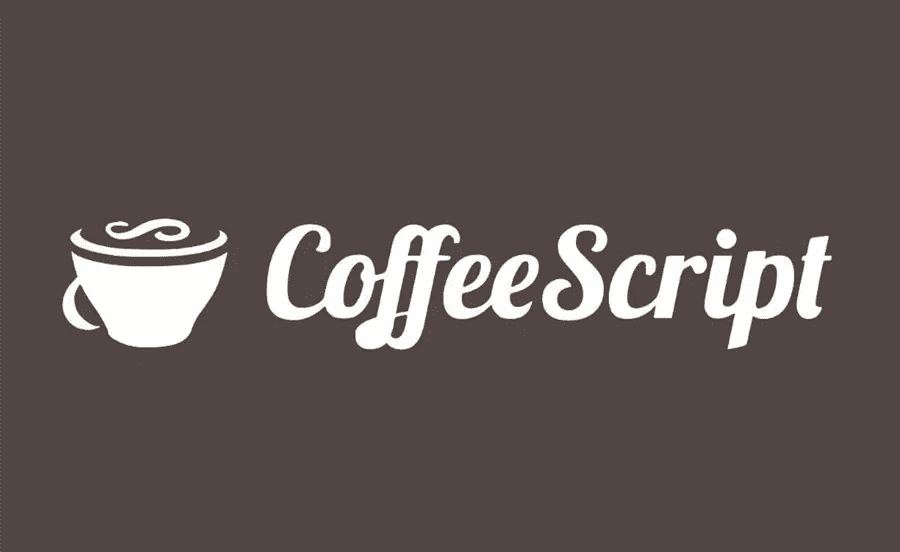
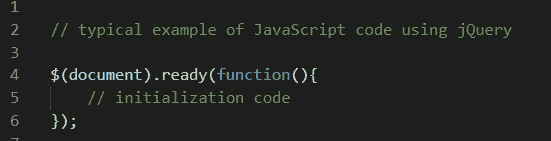
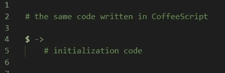
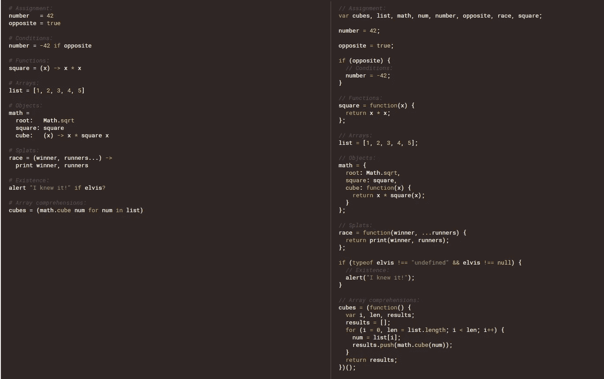

# CoffeeScript 是如何被遗忘的

> 原文：<https://betterprogramming.pub/how-coffeescript-got-forgotten-812328225987>

## CoffeeScript 发布已经超过 10 年了，似乎这个创新的想法已经被完全遗忘了

# **千里眼的想法**

2015 年，ES6 的出现带来了 JavaScript 世界最大的革命之一。它提供了许多新的功能——因此也带来了新的可能性:箭头函数、类、继承、使用`let`定义变量等等。然而，对于像 JS 这样的语言来说，它们真的是新的解决方案吗？

2009 年，杰里米·阿什肯纳斯(现为《纽约时报》的作者)提出了一个相当有趣的想法。在某些情况下，他的想法会修饰并增加相当复杂的 JavaScript 代码的可读性。从 Python 和 Ruby 中汲取灵感，Ashkenas 创建了一种编程语言，可以编译成 JavaScript，称为 CoffeeScript。

它首次提出了创建一个没有多余关键字 function 的函数的概念，用 2015 年成为函数 arrow 的东西来代替它(ES6 中的`=>`，CoffeeScript 中的`->`)。他还去掉了花括号(像 Python 一样)，用缩进代替了它们。通常在 CoffeeScript 中，您可以省略(一旦需要)括号，这通常会不必要地降低代码的可读性。

一开始，就像 JavaScript 等标志性语言的大多数新改进一样，相当多的人带着极大的乐观(说它会取代 JavaScript)或极度的悲观(说不久 CoffeeScript 也会被更好的东西取代，或者说语法改进是不必要的，毫无意义的)对待 CoffeeScript。

然而，尽管 2011 年受到了大量批评，CoffeeScript 仍然是 GitHub 上最受关注的项目之一。当时，它在 Ruby 开发人员社区中享有相对较高的知名度。很大一部分 CS 支持者表示，他们的代码运行速度更快，比 JS 代码短三倍。就连 JavaScript 创始人 Brendan Eich 自己也表示，随着时间的推移，CoffeeScript 对他关于 JavaScript 未来的想法产生了重大影响。

代码长度对比示例(左为 CoffeeScript，右为 Vanilla JS)~[https://cofee script . org #简介](https://cofeescript.org#introduction)

有许多迹象表明 CoffeeScript 将会伴随我们很长一段时间，但在 2015 年 JavaScript 的 ES6 推出后，许多情况都变得不利 ES6 实际上是将 CS 解决方案实现到故事开始的语言中。在 ES6 中，JavaScript 还添加了许多 CoffeeScript 团队的工程师没有想到的有趣的新功能。

# 时间的考验

从那以后，JavaScript 一直在发展，引入并改进了该语言的许多方面。

然后，编程社区的人(主要是前端)意识到 CoffeeScript 已经过时了，开始落后于不断发展的 Javascript 环境。截至今天，2020 年 1 月，CoffeeScript 在市场上已经完全死亡(尽管 GitHub 存储库还活着)。

对程序员来说，这种语言的知识并不是一项抢手的技能，而是一项非常奇特(通常是不必要的)的附加技能，LinkedIn 等平台甚至不再适合添加与这种语言相关的技能。

总之，CoffeeScript 开始是一个奇妙的想法(让编写 JavaScript 代码变得更容易)；然而最终，它没有经受住时间的考验，被 JavaScript 挤出了市场。目前，几乎没有人记得它。大多数前端环境的新人甚至不知道有这样的语言存在。它没有被列入最受欢迎的新编程语言的名单，而是在最难学的语言的名单中名列前茅。

最后，尽管说了这么多好话，我不得不承认我也放弃了 CoffeeScript，转而用 React 做 JS。

# 进一步阅读

你可以在他们的官方[网站](https://coffeescript.org)上了解更多关于 CoffeeScript 的信息。

## 外部链接和来源

*   [杰瑞米·阿什肯纳斯作者页*纽约时报*](https://www.nytimes.com/by/jeremy-ashkenas)
*   CoffeeScript 的维基百科条目
*   [《2019 年最差编程语言》](https://hackernoon.com/worst-programming-languages-7b98c749ec36)
*   [GitHub 上的 coffee script](https://github.com/jashkenas/coffeescript)