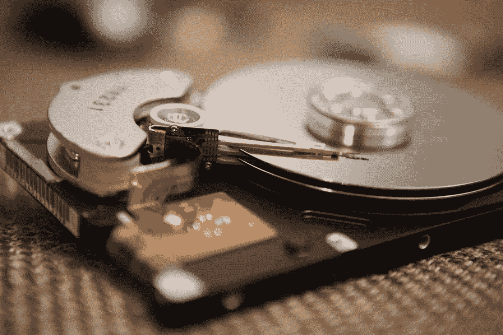
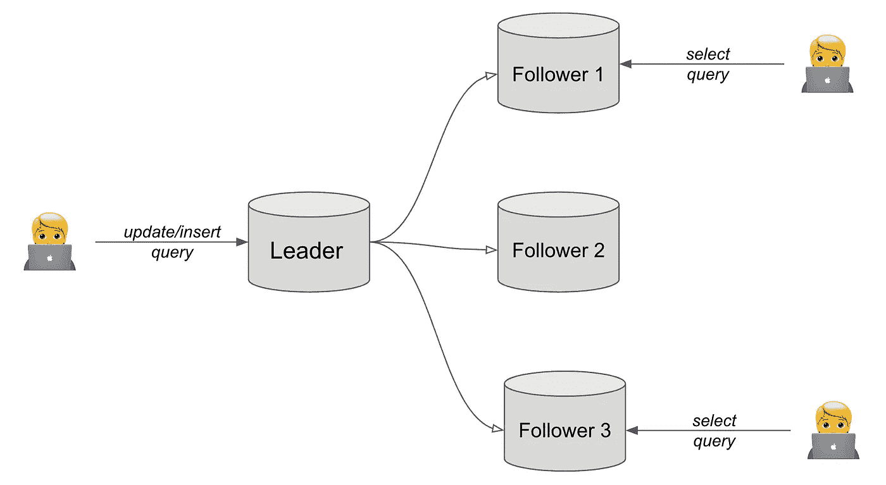
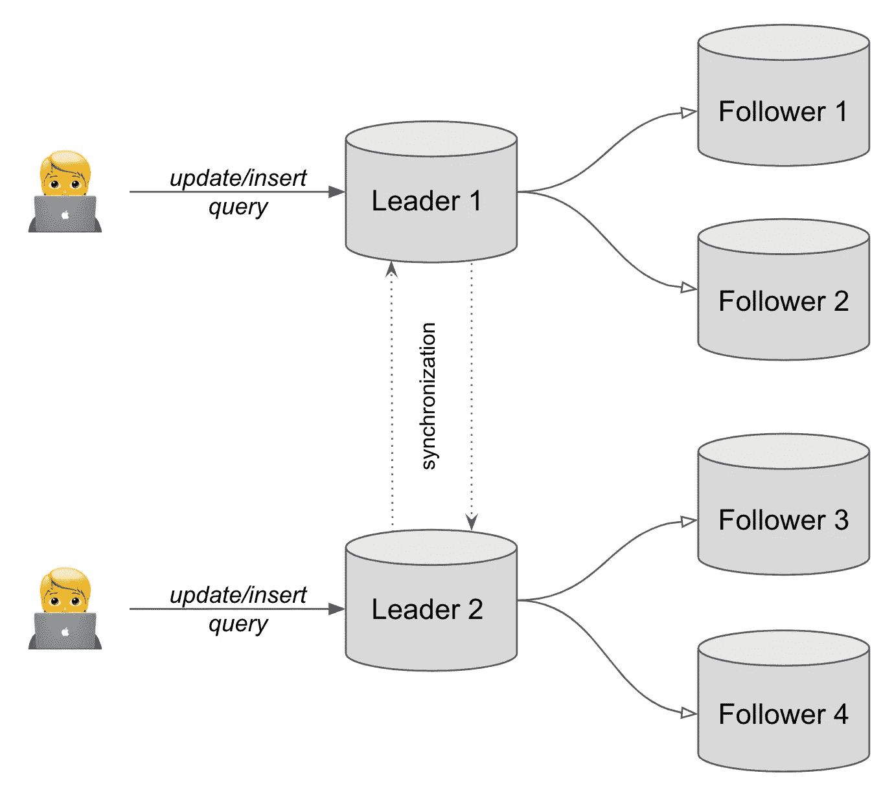

# 数据库复制的工作原理

> 原文：<https://betterprogramming.pub/how-database-replication-works-a92ad191df20>

## 以及为什么它对您的数据至关重要

[艺术墙摄影——在](https://unsplash.com/@artwall_hd?utm_source=unsplash&utm_medium=referral&utm_content=creditCopyText) [Unsplash](https://unsplash.com/s/photos/hard-drive?utm_source=unsplash&utm_medium=referral&utm_content=creditCopyText) 上的 Kittenprint 。

数据库是几乎所有软件产品的重要组成部分。数据库是存储数据的有组织的地方。在某种程度上，每个公司都意识到他们拥有的数据量会随着时间的推移而增加。他们不能丢失所有积累的信息。

定期备份是一个好习惯(不仅仅是数据库)。生成备份是一个漫长的过程，不是每分钟都要执行的。也就是说，丢失自最近一次备份以来收集的用户数据仍有可能。

这就是数据库复制发挥作用的地方。

# 这个想法

一般方法类似于备份—拥有数据的副本。不同之处在于*如何*。与备份不同，复制是在每次数据修改时执行的。这是一个永久的过程。它不仅仅限于这一目的。

事实上，它是数据库的一个完整的工作副本。因此，它非常适合组件位于不同计算机上的分布式系统。每个组件可以包含一个数据库副本。这带来了多重优势:

*   副本可以分布在全球各地，离最终用户更近。这导致了更低的延迟和更满意的客户。
*   可以更快地为读取查询提供服务。平均而言，只读查询的数量远远高于写查询的数量。这将卸载系统并按比例分配查询。
*   分布式系统具有弹性，能够处理故障。如果系统的某个部分没有响应，这个请求就会转到另一台机器上。如果我们试图从数据库中获取信息，但由于内部错误而失败，请求将被重定向到另一台具有工作数据库的机器并继续。

# 实施

虽然想法很明确，但实施起来会带来一些挑战。分布式系统中每台计算机上的数据库角色不能相同。有些数据库只接受写请求，有些只接受读请求。执行写操作的数据库是*领导者*，执行只读操作的数据库是*跟随者*。

数据复制的一个例子。作者照片。

在上面的示例中，我们看到一个写复制副本和三个只读复制副本。随着读取查询出现得越来越频繁，追随者的数量要高于领导者的数量。

当用户更改数据库中的数据时，他们的请求由主副本服务器处理。数据成功更改后，领导者克隆追随者的更新，以便每个追随者都包含更新的信息。

复制过程可以是同步的，也可以是异步的。在同步复制中，领导者等待来自每个跟随者的确认。这保证了强大的数据一致性，但导致处理时间更长。

在异步复制中，领导者不等待从者的响应。在这种情况下，数据可能在短时间内不一致。不同的关注者可能返回不同的数据。这就是所谓的*最终一致性*。这是加快许多系统接受的写查询速度的一种折衷。

如果领导失败了会怎么样？这是否意味着整个系统停止运行并等待其恢复？对于这种不幸的情况，其中一个追随者将被提升为领导者，并开始接受写请求。

# 多领导实施

即使一个追随者可以被提升为领导者，这看起来仍然很脆弱，会降低系统的速度。当查看上面的复制模式时，我们可能会问自己，在有多个领导者的场景中，它将如何工作。让我们看下面的例子:

多领导者复制

当系统中有多个领导者时，领导者之间的额外同步是必要的。当一个用户通过一个领导者更新数据时，其他领导者应该被通知这些变化。

当领导者 1 和领导者 2 修改相同的数据时，这种情况下的冲突是不可避免的。有各种解决冲突的方法。例如，一个领导覆盖了另一个领导的更改，或者最终用户必须手动合并更改。这使得整个系统变得复杂。

另一方面，多领导者复制系统提供了一组独特的功能。重要的一点是容错。如果其中一个领导者失败，请求将被重定向到另一个领导者。该系统保持稳定和高性能。

在像 Google Docs 这样需要协作编辑的产品中，多领导系统会有很大帮助。来自世界不同地方的用户可以同时修改同一文档。他们有责任解决出现的任何冲突。

# 最后的想法

在数字产品和不断增长的流量时代，数据复制成为一种必须。它不仅降低了灾难和数据丢失的风险，还提高了最终解决方案的性能。

所有这些都使得数据库复制如今变得很有价值。