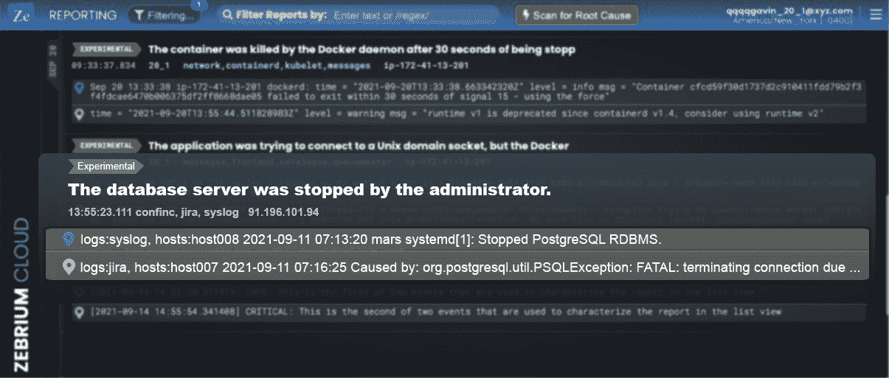
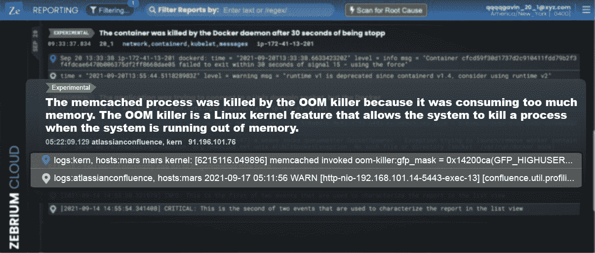
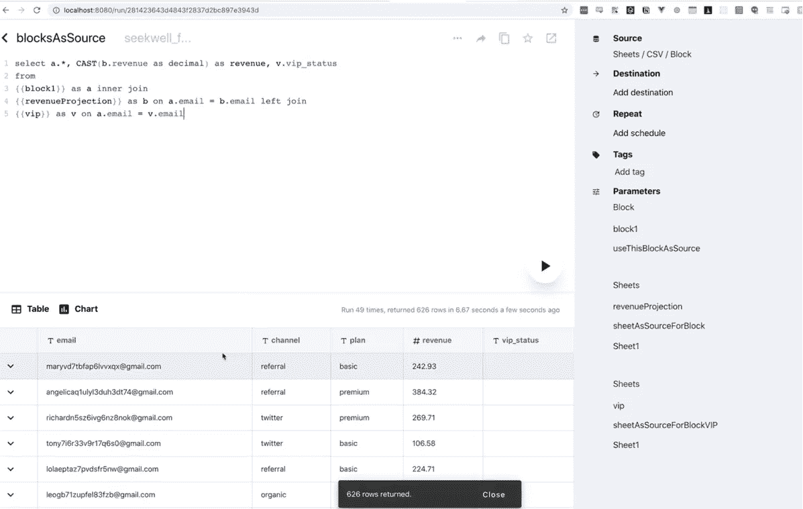

# 开发人员如何在他们的产品中使用 GPT-3-3 现实世界的工具

> 原文：<https://betterprogramming.pub/how-developers-can-use-gpt-3-in-their-products-3-real-world-tools-c69953ea0aba>

## 以有趣的方式使用 GPT-3 的例子

Christof W. 在 [Unsplash](https://unsplash.com/s/photos/three?utm_source=unsplash&utm_medium=referral&utm_content=creditCopyText) 上拍摄的照片

几周前，我和一群开发人员朋友谈论了 GPT-3 用例。他们都喜欢 GPT-3，但我惊讶地发现，他们认为它主要用于营销应用。

当然，我不同意他们的观点。虽然谈论最多的 GPT-3 用例是在市场营销中，但有一些真正有趣的方式来使用 GPT-3 来帮助开发人员。

在这篇文章中，我介绍了 3 种以非常有趣的方式利用 GPT-3 的工具。它们是 100%非市场营销的——它们是为开发人员、DevOps 工程师和 sre 设计的。

希望在读完我的文章后，你会对如何将 GPT-3 应用到你正在从事的项目中有一些工作思路。

让我们开始吧！

# 斑马馆

[Zebrium](https://www.zebrium.com/) 在相当一段时间内一直在使用自己的机器学习，并将其与 GPT-3 相结合，它是名单上最成熟的工具。

## **关于工具**

Zebrium 被 Gartner 评为 [2020 年最酷的供应商](https://www.zebrium.com/blog/zebrium-named-a-2020-gartner-cool-vendor-aiops)，并进入了 Gartner 的[2020 年最值得关注的 25 家企业软件初创公司](https://www.forbes.com/sites/louiscolumbus/2020/07/05/gartners-top-25-enterprise-software-startups-to-watch-in-2020/#2248a8247822)。

## 什么是 Zebrium？

Zebrium 是一个日志异常检测工具。它对日志使用无监督的机器学习(ML)来自动查找原始文件中软件事件的根本原因，然后提供简单的摘要。

这就是 GPT-3 的好处所在。根本原因的摘要用简单的英语提供。

## 产品的功能

Zebrium 应用无监督的机器学习来分析软件生成的海量日志。它无需任何人工操作即可识别并报告事件的根本原因。

根本原因报告以日志事件简短列表的形式提供。典型地，从 5 到 20 个事件的任何地方。然后，GPT-3 引擎将日志内容的技术细节翻译成简短的摘要，以没有日志经验的人也能理解的方式解释问题。

## 它如何使用 GPT-3？

除了通过让 ML 识别关键事件序列来减少故障排除时间的主要目标之外，Zebrium 还致力于以可读和简洁的形式呈现结果。

关键事件序列的列表通过适当的提示传递给 GPT-3 引擎。

其结果是一个简短的，易于理解的简单语言的问题总结。这就是 Zebrium 创建任何人都能理解的根本原因分析(RCA)报告的方式。

# ***实际例子***

让我们来看几个 Zebrium 使用 GPT-3 的例子。

## 示例一:数据库关闭

测试是由管理员关闭备份 Atlassian 软件堆栈的 Postgres 数据库启动的。它在日志中引起了一系列的错误。

Zebrium 的 ML [生成了一个根本原因报告](https://www.zebrium.com/blog/using-gpt-3-with-zebrium-for-plain-language-incident-root-cause-from-logs)，其中包含一小组日志行以及下面的 GPT-3 描述:“数据库服务器被管理员停止了”。这简单的一句话足以立即解释问题的性质。

来源:[zebrium.com](https://www.zebrium.com/blog/using-gpt-3-with-zebrium-for-plain-language-incident-root-cause-from-logs)

## 示例二:内存不足

在这种情况下，Zebrium 的 ML 指出了一组十几个日志行，显示服务器遇到了内存不足的情况。

日志行被传递给 GPT-3，它生成如下描述:“Memcached 进程被 OOM 杀手杀死，因为它消耗了太多内存”。

来源:[zebrium.com](https://www.zebrium.com/blog/using-gpt-3-with-zebrium-for-plain-language-incident-root-cause-from-logs)

## 这对谁有帮助

Zebrium 的技术是为 sre、DevOps 工程师、开发人员和技术经理设计的。这对于撰写根本原因分析报告也很有用。

## 项目状态

Zebrium 是一家快速发展的初创公司。它已经有几十个客户使用该解决方案来减少解决软件事故的平均时间。

GPT-3 简单语言摘要是 Zebrium 产品的标准特性。

## 如何测试

1.  访问他们的网站，按下蓝色大按钮“[免费开始使用](https://www.zebrium.com/sign-up)”。接下来，输入您的数据，并获得免费试用。
2.  在你的应用上部署一个日志收集器，或者使用 Zebrium 的测试应用。
3.  自己破解应用程序，或者等待真正的问题出现。你会对结果感到惊喜。你将获得机器学习生成的 RCA 报告和 GPT-3 生成的简明语言摘要。

# 塞克维尔

来源: [seekwell.io](https://doc.seekwell.io/query-sheets-using-sql)

SeekWell 帮助编写 SQL 并将结果同步到公司使用的其他应用程序。

## 关于工具

作为一个分析和数据可视化工具，SeekWell 充当了 Postgres、Snowflake、Redshift 和 MySQL 等数据库与 Google Sheets、Excel、Slack 和 email 等常见应用程序之间的链接。

## 该产品有什么作用？

SeekWell 使用 SQL 请求将数据库与不同的应用程序连接起来。它有助于同步数据，使团队成员能够协同工作，确保数据的高效流动。

## 它如何使用 GPT-3？

它使用 GPT-3 指令将简单的英语转换成 SQL 请求以进行同步工作。通过给出具体的指示，例如“仅用正确的 SQL 语法响应”，SeekWell 帮助没有 SQL 知识的用户从数据库中获得他们需要的数据。

该工具支持 MySQL、Redshift、MS SQL Server、Postgres 和雪花。SeekWell 处理 SQL 请求。

## 谁会受益？

SeekWell 对于开发人员、产品经理、分析师以及需要将数据库与支持的应用程序同步的任何人都很有用。

## 项目状态

总的来说，该工具功能齐全，但 GPT-3 指令组件仍处于测试阶段。

## 如何测试

如果你想测试 SeekWell，你可以在主页上申请试用或演示。然而，为了测试 GPT-3 的功能，你应该注册[开放 AI API 等待列表](https://share.hsforms.com/1Lfc7WtPLRk2ppXhPjcYY-A4sk30)。

# 帮助中心

下一个工具叫做 [HelpHub](https://www.helphub.io/) ，这是一个简单而现代的知识库。

来源: [helphub.io](https://www.helphub.io/)

## 关于工具

HelpHub 拥有一个功能齐全的知识库，设计友好简洁。该工具为知识库中的文章提供分析，并收集用户反馈。

总的来说，HelpHub 旨在维护一个结构良好的知识库。此外，它的一个主要特点是，它可以用来在几秒钟内创建支持文章！

## 该产品有什么作用？

它是构建和维护全功能知识库的便捷工具。HelpHub 使用人工智能(AI)和 GPT 3 作为创建技术支持文章功能背后的技术。

## 它如何使用 GPT-3？

特别是对于文章，HelpHub 应用了名为 AI 文章作者的技术，该技术由 OpenAI 的 GPT-3 API 提供支持。

## 谁会受益？

在几秒钟内创建支持文章为开发人员、产品经理和技术支持人员节省了时间。通过使用 [HelpHub](https://www.helphub.io/) ，更少的人参与整合全面的内容来帮助他们的用户。

## 项目状态

该项目已经可用，但似乎保持低调。

## 如何测试

1.  你可以在官方网站上找到对[免费试用](https://www.helphub.io/users/sign_up)的请求。输入您的数据并注册。
2.  创建一个部分。它可以被视为基于主题的文章的文件夹。
3.  创建一篇文章并发布它以查看结果。

# 结论

总之，GPT-3 的应用范围比最初想象的要大。

这项技术无疑可以简化开发人员、SREs 和 DevOps 工程师的日常任务。

虽然许多工具仍在测试 GPT-3 的可能性，但我们已经找到了一些成功应用的好例子。

我希望你喜欢这篇文章，并会考虑在你的下一个项目中使用 GPT-3。

你试过 GPT-3 的其他工具吗？

如果有，请分享你的想法和经历。我很想收到你的来信。