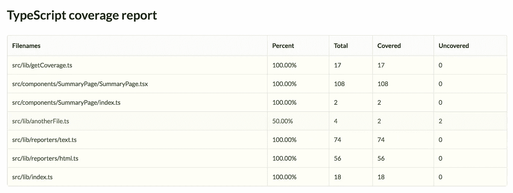
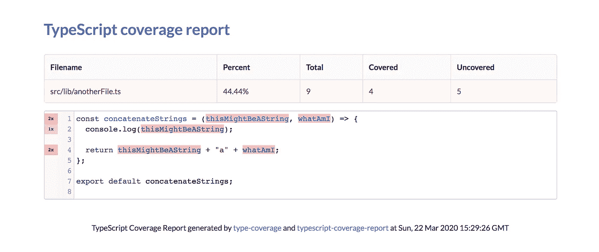
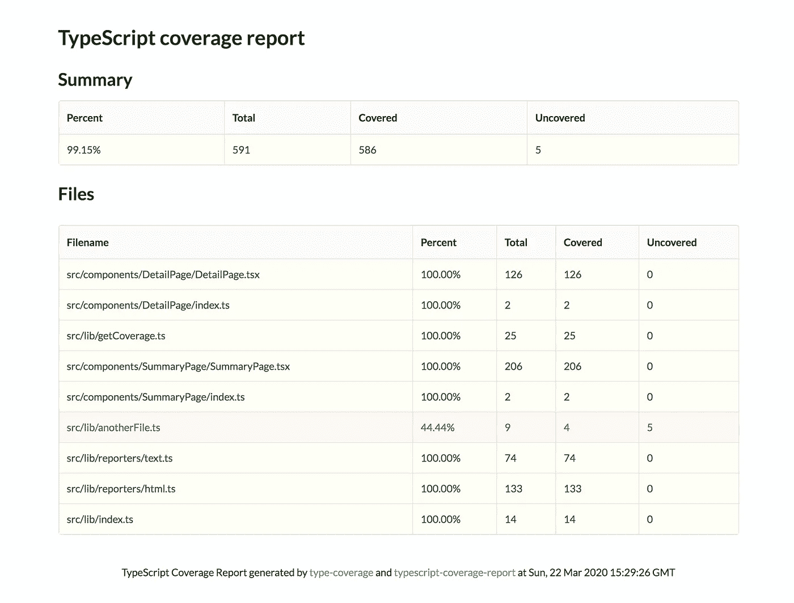

# 我如何构建一个类型覆盖报告工具

> 原文：<https://betterprogramming.pub/how-did-i-build-a-ts-coverage-report-tool-af34e110d02c>

## *冠状病毒隔离期间建立的包裹的故事*


由[absolute vision](https://unsplash.com/@freegraphictoday?utm_source=unsplash&utm_medium=referral&utm_content=creditCopyText)在 [Unsplash](https://unsplash.com/s/photos/announcement?utm_source=unsplash&utm_medium=referral&utm_content=creditCopyText) 上拍摄的照片

# 这个想法

在转换成 TypeScript 之前，我曾经在我的项目中有[流](https://flow.org/)。关于心流，我真正喜欢的是覆盖报告。

有一个名为 [flow-coverage-report](https://github.com/rpl/flow-coverage-report) 的包可以生成文本、JSON 和 HTML 报告。

但是，( [*没有，*至少](https://github.com/alexcanessa/typescript-coverage-report))没有任何东西可供打字。

社区建立的检查 TS 覆盖率的唯一工具是[类型-覆盖率](https://github.com/plantain-00/type-coverage)。这个包使用`tsc`分析代码和覆盖率(有多少`Anys`),并根据`COVERAGE_PERCENTAGE > THRESHOLD || 80`判断成功或失败。

在`README.md`文件的结尾，有一个小小的惊喜:一个 API 部分。

```
import { lint } from 'type-coverage-core'const result = await lint('.', { strict: true })
```

相当酷！所以我有一个鼓舞人心的工具(流量-覆盖-报告)和收集我需要的数据的方法。让我们把它们放在一起。

# 路线图

作为一个受到 Flow 替代方案强烈启发的项目，我希望这个项目支持相同的特性:以 HTML、JSON 和 text(终端上的一个表格)导出和呈现一个覆盖报告。

让我们从数据开始:`type-coverage-core`(由`type-coverage` monorepo 导出)给了我们一个`lint`函数，它返回这种类型的对象:

```
Promise<{
    correctCount: number;
    totalCount: number;
    anys: AnyInfo[];
    program: ts.Program;
    fileCounts: Map<string, {
       totalCount: number;
       correctCount: number;
    };
}>;
```

所以我将简单地创建一个`getCoverage`来收集信息并将其传递给一个报告文件。那很容易！

## 端子台

现在，让我们通过创建第一个记者来形象化它。它必须是简单的，这样我就可以有一些内啡肽释放到我的身体里——就像终端视图中的文本表。

我看到 flow-coverage-report 使用了一个叫做`[terminal-table](https://github.com/zaftzaft/terminal-table)`的模块。听起来很有希望。这是一个数组的数组，它不支持头，这有点糟糕，但不会有问题。此外，我希望同样的外观和感觉，你从流。


很酷，是吧？

## 好了，现在是 HTML 覆盖率报告

我需要在`coverage-ts`文件夹下创建一个小型网站(就像伊斯坦布尔或流量覆盖报告的网站一样)。

在这一点上，我在代码中到处留下了`*// TODO*`注释，主要是针对我想在配置文件中抽象的东西。在配置文件中包含 coverage 文件夹输出路径目前并不重要。

我想使用 [React](https://reactjs.org/) 但是生成静态 HTML 文件。为此，我可以使用导出函数`[renderToStaticMarkup](https://reactjs.org/docs/react-dom-server.html#rendertostaticmarkup)`的`react-dom/server`，但是 JS 和 CSS 都无法工作。

我不打算从头开始构建一个表或任何组件，我喜欢[语义 UI React](https://react.semantic-ui.com/) 。等一下。流量覆盖报告使用的是同一个东西吗？我发誓这是偶然发生的，但如果这两个工具看起来非常相似，那就更好了，在我看来。

所以我有了数据，有了 UI 库，现在可以生成一个`coverage-ts/index.html`文件。我们目前不需要任何客户端 JS，我可以从语义 UI CDN 链接样式。

瞧，我们有相同的表格，但在网页上。



## 现在，当我点击一个文件，我想去一个详细的页面，看看源代码和到底是什么没有涵盖

为了实现详细页面，我需要一个代码编辑器，支持:

1.  只读模式
2.  语法荧光笔
3.  显示行号
4.  允许注释特定的代码行
5.  突出显示行号

我环顾四周，我把它归结为两个选项: [Codemirror](https://github.com/JedWatson/react-codemirror) 和 [Ace](https://github.com/securingsincity/react-ace) 。我最初选择了后者，但是注释实现起来并不简单——所以我决定选择前者。

还有一个问题:由于我们正在创建静态 HTML 页面，我需要通过`script`标签导入 JavaScript，并且不能依赖 React 来处理任何非标记的内容。

此时，我不小心用生成的覆盖文件覆盖了所有的源文件，丢失了我所做的 1/3(幸运的是我提交了我所做的 2/3)。从我的错误中吸取教训:坚持不懈。

为了包含 Codemirror，我必须向页面添加一些资产(到目前为止有几个 JS 资产和一个 CSS 资产)——记住我只使用 React 生成静态标记。

现在，我必须注释源代码。我会分两步做:

1.使用`DetailPage`组件创建一个带有注释的`<pre>`元素(代码中的所有`any`)。

```
// totalCount and correctCount will be needed later on.
const DetailPage = ({
  sourceCode,
  totalCount,
  correctCount,
  annotations
}: Props) => {
  return (
    <>
      <textarea id="editor" value={sourceCode} readOnly />
      <pre id="annotations" style={{ display: "none" }}>
        {JSON.stringify(annotations)}
      </pre>
    </>
  );
};
```

2.将这个脚本注入到单独的页面中，以获得注释并标记特定的字符。

```
const myTextArea = document.getElementById("editor");
const codeMirrorInstance = CodeMirror.fromTextArea(myTextArea, {
  readOnly: true,
  lineNumbers: true,
  mode: "text/typescript",
  gutters: [
    "CodeMirror-linenumbers"
  ]
});
const annotations = JSON.parse(document.getElementById("annotations").textContent);
console.log(annotations);
annotations.forEach((annotation) => {
  codeMirrorInstance.markText(
    { line: annotation.line, ch: annotation.character },
    { line: annotation.line, ch: annotation.character + annotation.text.length },
    {
      className: "uncovered",
    }
  );
})
```

如果我需要注释多行，这可能不起作用，但我现在不考虑这个。


我们现在只需要稍微整理一下页面，并添加行栏上缺少的注释的数量。

我为注释使用了循环，并创建了一个`gutter`对象`{ [line: string]: count: number }`，然后`CM.setGutterMarker()`允许您在线条上注入它。

我基本上使用了来自 flow-coverage-report 的相同的风格(同样，我的目标是在两个覆盖工具之间使用相同的风格)。

```
Object.entries(gutters).forEach(([line, count]) => {
  const gutterMarker = document.createElement("div");gutterMarker.textContent = count + "x";
  gutterMarker.style.textAlign = "center";
  gutterMarker.style.fontSize = "0.6em";
  gutterMarker.style.background = "rgba(255,0,0," + count * 0.2 + ")";

  codeMirrorInstance.setGutterMarker(+line, "TS-lineuncovered", gutterMarker);
});
```

然后嘣！我们有我们的详细信息页面。



这就是我们的摘要页面，已完成。



# 最后几件事

## 资产文件夹

现在一切都正常了，我有时间整理一下我留下的一些东西:首先，将页面 JS 和 CSS 移动到 assets 文件夹中。

我使用 [ncp](https://github.com/AvianFlu/ncp) 将文件夹和文件(我刚刚从注入到单个页面中的内容中抽象出来的)复制到`coverage-ts`文件夹中。然后，我必须为单个文件生成链接，并返回到`coverage-ts/assets`文件夹。

## 选择

我想给 CLI 增加一些选项，我已经知道我要用什么包了: [Commander.js](https://github.com/tj/commander.js/) 。我已经用过几次了，我真的很喜欢它的 API 和结果。

要设置选项，非常简单:

```
#!/usr/bin/env nodeimport { program } from "commander";
import { version, description } from "package.json";program
  .version(version)
  .description(description)
  .option(
    "-o, --outputDir [string]",
    "The output directory where to generate the report.",
    "coverage-ts"
  ) // I also have other options here.
  .parse(process.argv);
```

当我运行代码时，`program`的属性和我们传递的选项一样多。但是它不会自动与`defaultValue`合并，所以我自己创建了自己的 util 函数来做这件事:

```
const getOptionName = (option: CommandOption): string =>
  option.long.replace("--", "");const getOptions = (program: Command) => {
  return (program.options)
    .reduce((carry, option) => {
      if (ignoredOptions.includes(getOptionName(option))) {
         return carry;
      } return {
        ...carry,
        [getOptionName(option)]:
          program[getOptionName(option)] || option.defaultValue
      };
    }, {});
};
```

## 添加 README.md 文件

这是任何项目中最复杂的部分之一，它真的会让你思考你做了什么。

事实上，在我写的时候，我修改了一些在用法上没有意义的东西。

为了给我的`README.md`文件一点结构，我按照[标准自述](https://github.com/RichardLitt/standard-readme/blob/master/spec.md)中的说明进行了操作。

## 添加测试

是的，我把它留在最后。
这是我决定的筹码:

1.  埃斯林特
2.  较美丽
3.  笑话(+巴别塔)
4.  皮棉阶段

然后我用 [Husky](https://github.com/typicode/husky) 在 Git 钩子上运行它们。

对于 Jest，我必须调整一些东西，以便支持 React 代码和通用类型脚本。

# 结论

现在[typescript-coverage-report](https://github.com/alexcanessa/typescript-coverage-report)已经部署完毕，可以使用了！