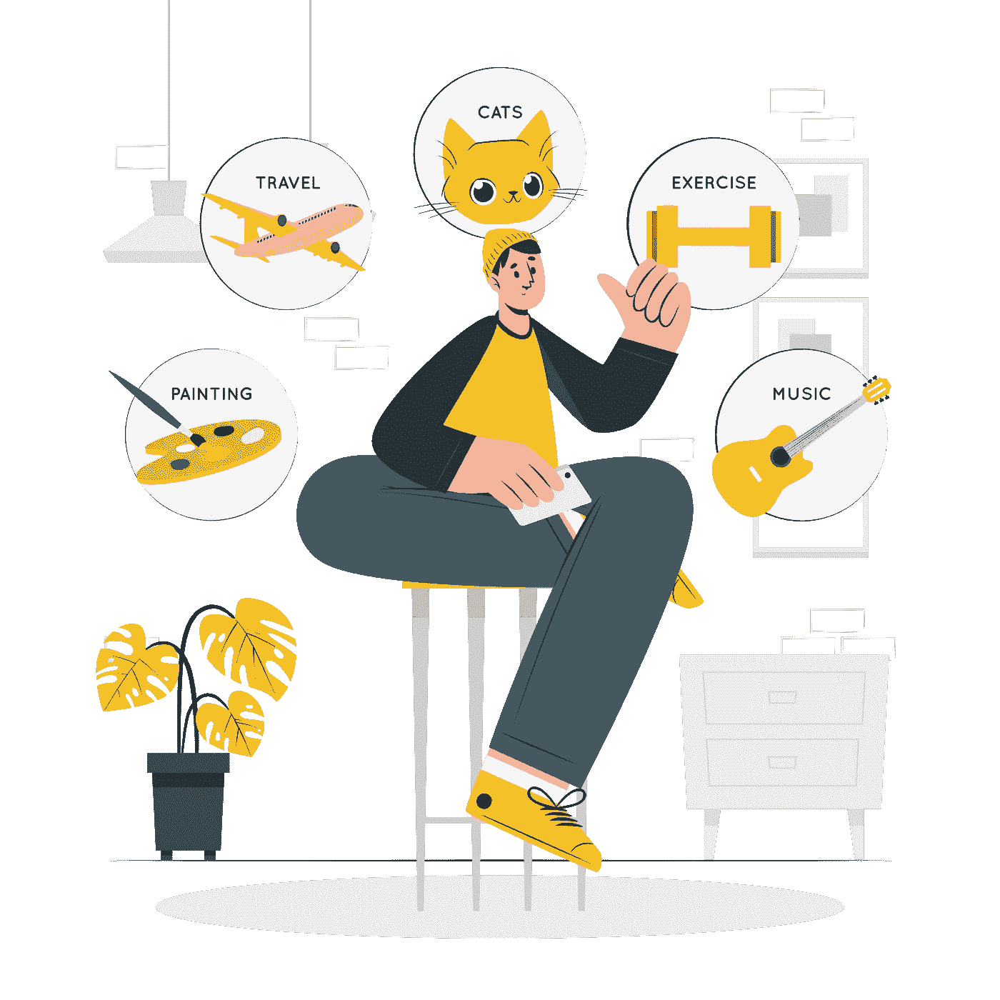

# 我是如何学会专注的？

> 原文：<https://betterprogramming.pub/how-did-i-learn-to-focus-bab6b67ec02a>

一次 1000 件。

我总是被打扰，我的心思被占据。就好像我总是忙忙碌碌，总是有一千件事情要完成。感觉我的时间永远不够。但即使在这期间，我还是看了很多电影，浪费了时间。所以我意识到一件事——我的生产力系统出了问题。我失去了注意力。

我决定放弃我通常的待办事项清单。我必须用新的方式去理解它。我不应该让我的头脑被所有这些想法占据。我拿起一张纸，把我想到的都写了出来。我所有的担心现在都写在纸上了。现在我把它们变成了下一个可操作的项目。那些不可操作的被留到以后处理——但不再是在头上，而是在纸上。这节省了我大脑的空间。大卫·艾伦的《把事情做好》对找出这个窍门很有帮助。

## 下一个可操作项目

我完全专注于那项任务。我也给每项任务添加了一些附加期限。所以完成它会给我压力。然后我有一个不完成事情的习惯。这是一个可怕的问题。因为摆在大脑面前的开放性问题越来越多。所以我决定一劳永逸地完成任务，关闭大脑的开放回路。

我们都知道，无论我们计划什么，其他一些因素都可能是计划外的。这会破坏我们的计划。每当这种情况发生时，我的平静和注意力就会下降。所以我决定灵活安排我的时间。如果有更重要的事情发生，我会把手头的工作推到一边。这需要很长时间才能适应，但却让我们摆脱了计划失败后隐藏的罪恶感。

制定计划而不付诸行动会给人们带来很多罪恶感。它会影响注意力和自信心。所以我给了自己自由。而我的大脑，像一个乖孩子一样，变得更加专注和快乐。我克服了超负荷导致的头晕。

我会用我的工具做同样的事情:

*   概念——适用于所有数据组织。
*   HabitNow 应用——跟踪我的日常习惯和成长。
*   在谷歌旁边——突然记下。
*   白纸——扔掉我的垃圾。