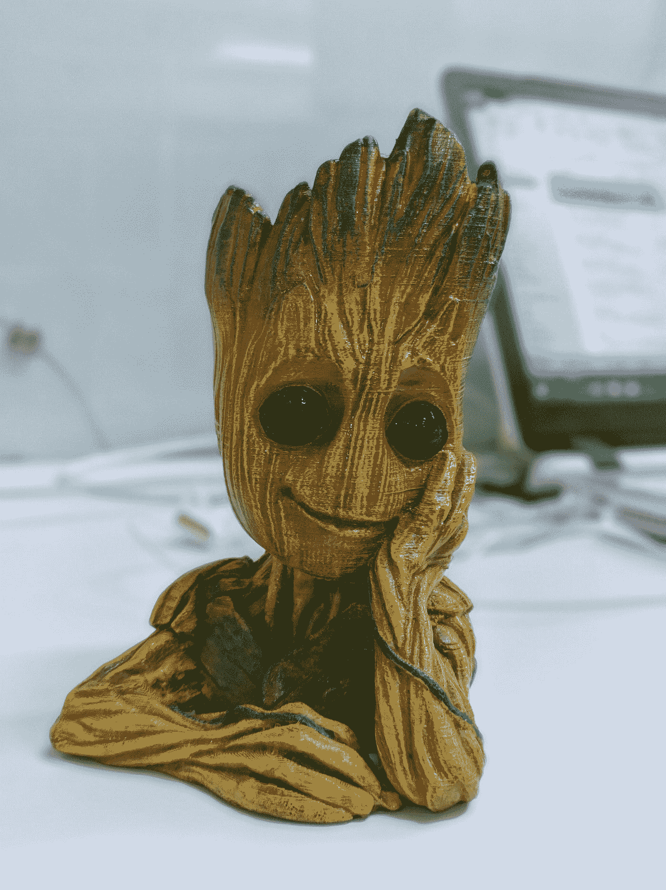

# 迪士尼英雄如何帮助我解决问题

> 原文：<https://betterprogramming.pub/how-disney-heroes-help-me-solve-problems-bc4d3e230bfb>

## 学会使用迪士尼方法解决问题

马特·波波维奇在 [Unsplash](https://unsplash.com?utm_source=medium&utm_medium=referral) 上的照片

每个人都会处理问题。然而，不是每个人都能解决复杂的问题。我们都有必要的脑力和工具去做这件事，但并不是每个人都知道如何去做。人们很容易迷失在复杂的相互依赖的网络中，并感到无法组装一个经过深思熟虑的解决方案。

好消息是解决问题是可以教授的。这是关于[识别问题](https://medium.com/better-programming/learn-to-elicit-requirements-49b556a7cb62)，然后制定适合其目的的解决方案。问题的多维性及其众多参数使得人们很容易忽略一些事情。

大多数人通过头脑风暴解决问题；也就是说，他们通过提出不同的解决方案来解决问题。这是一个不错的方法，但也不是一个完整的框架。

在这篇文章中，我们将介绍罗伯特·迪尔茨在 1994 年提出的解决问题的迪斯尼方法。然后我们将探讨我个人对此的看法。

# 迪士尼方法

迪士尼方法是一种解决问题的技巧，它运用不同的观点，通过讨论和评论来激发创造力和计划构建。它要求相关人员从不同参与者的角度出发。

需要考虑的四个不同角度是:

*   **外人:**什么问题？
*   **梦想家:**最佳方案是什么样的？
*   **现实主义者:**务实的前进方向是什么？
*   批评者:这个计划会出什么问题？

每一种观点都会带来新的东西。它会让你从一个新的角度看待事物，重新审视决策，修正你的分析结果。

迪伦·吉利斯在 [Unsplash](https://unsplash.com?utm_source=medium&utm_medium=referral) 上的照片

## 局外人

局外人的观点要求你站在团队之外的人的立场上。它可能是最终用户、外部顾问，或者仅仅是除了最终结果之外没有既得利益的人。所有确定的参与者都会给表格增加额外的东西，因此需要探索他们的所有观点。

局外人本质上负责问题分析。他们需要检查问题，然后找出围绕问题、竞争等的事实。预计他们会对问题和任何现有的假设提出质疑。

## 梦想家

梦想家的观点要求你考虑可能的最佳解决方案。忽略政治、成本，甚至解决方案的可行性。探索所有的途径，不管它们听起来有多牵强。

他们乐于使用新技术、新概念和新思想。人们期望他们跳出框框思考，挑战界限。他们所有的工作都是建立在局外人进行的问题分析之上的。

## 现实主义者

现实主义者，或者我喜欢称他们为实用主义者，持有这样的观点，他们会考虑梦想家们提出的所有想法，然后选择一个。然后他们需要把它变成一个可实现的计划，一个考虑到所有利益相关者、成本等的计划。

他们将弄清楚解决方案和交付计划的来龙去脉。他们本质上负责选择一个在项目限制内工作的解决方案。

## 批评家们

批评家的观点要求他们用现实主义者确定的解决方案来确定任何问题。问题可能包括遗漏的边缘案例，遗漏的需求，或者任何可能阻碍项目完成的事情。

你希望评论家完成的事情之一是 SWOT(优势、劣势、机会、线索)分析。

# 复仇者联盟解决问题的迪士尼方法

由[阿兹玛图拉·沙克](https://unsplash.com/@azmathulla?utm_source=medium&utm_medium=referral)在 [Unsplash](https://unsplash.com?utm_source=medium&utm_medium=referral) 上拍摄的照片

既然我们已经介绍了迪士尼官方的解决问题的方法，我们可以探索一下我个人对它的改编。我的改编版与原版相差不远——只是更有趣，更容易记住*、*，让你更容易进入不同的思维模式。

最后一点很重要。如果字符是已知的，考虑不同的观点并在它们之间切换要容易得多，而不是一些任意的观点。

那么它是如何工作的呢？简单:我们有四个来自原始方法的观点。我只是建议我们给每个人指定一两个漫威漫画书里的角色。这样，我们就可以利用特定人物的观点。

那个装置。我个人给每个观点分配了以下角色:

## 局外人:首里(黑豹的妹妹)，黑寡妇

首里:从《黑豹》这部电影中，我们看到了她足智多谋、好奇，还是个发明家。她是寻找解决问题的最佳人选。

黑寡妇:黑寡妇曾是俄罗斯的顶级间谍。她会了解情况，了解相关人员，而且凭借她的专业技能，会掌控局面。她还会寻找任何未确定的问题，并使用她的技能(想想她是如何为浩克唱歌的)来吸引利益相关者了解所有必要的细节。

## 梦想家:钢铁侠，汉克·皮姆博士(原版蚁人)

**钢铁侠:**关于托尼·史塔克，我们能说些什么？他在自己的胸腔里建造了医疗设备，并在一个甜点洞穴里建造了最初的钢铁侠套装。然后，他继续创造一种新元素，为他的新西装提供动力。这正是这个阶段所需要的思维类型:创新，突破界限，探索所有的选择。

**蚁人:**Pym 博士，最初的蚁人，发现了 Pym 粒子，这让他可以缩小或放大任何有机体或物品。然后，他继续建造一个能让他与蚂蚁交流的装置。作为一名真正的科学家和发明家，他将是一个设计不同解决方案的伟大人物。

照片由 [Asmi Pai](https://unsplash.com/@lens_witness?utm_source=medium&utm_medium=referral) 在 [Unsplash](https://unsplash.com?utm_source=medium&utm_medium=referral) 上拍摄

## 现实主义者:美国队长，托尔

**美国队长:**美国队长是人民的英雄，是务实的领袖。他没有任何超自然能力(除了增强的人体功能)。他是一个很好的例子，一个提前计划，开动脑筋，权衡利弊的人。他会选择梦想家们提出的最佳解决方案。

**雷神:**来自另一个世界的神。一个正义无畏的战士。他不得不学会如何对付他狡猾的哥哥，如何面对他邪恶的妹妹，以及如何应对他的母星阿斯加德的毁灭。他果断、足智多谋(他造了一把新锤子)，而且意志坚定。他是现实主义者的绝佳人选。

## 评论家:灭霸，浩克

灭霸:正如灭霸喜欢提醒我们的，他是不可避免的。他是一个拥有多种力量的不朽人物，喜欢纠正他认为是错误的事情。在“无限战争”中，他为了“恢复平衡”而杀死半个宇宙，与复仇者展开了较量。他是一个伟大的批评家，他会指出现实主义者计划中的错误。

**浩克:**又一次，浩克是一个强大的神仙。他是一位天才科学家，能够评估所提供的解决方案，并利用他的分析技能找出其中的漏洞。或者如果这不起作用，“绿巨人粉碎！”

# 资源

*   [https://en.wikipedia.org/wiki/Disney_method](https://en.wikipedia.org/wiki/Disney_method)
*   [https://www.youtube.com/watch?v=hE2fZYTdIqA](https://www.youtube.com/watch?v=hE2fZYTdIqA)