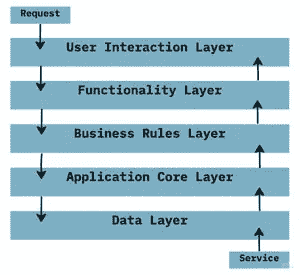
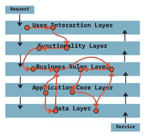
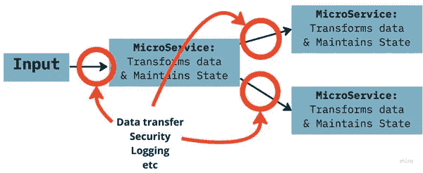
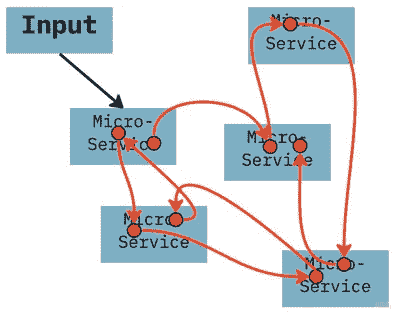
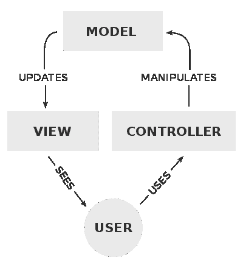
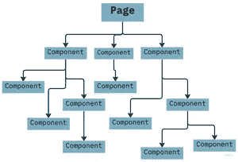
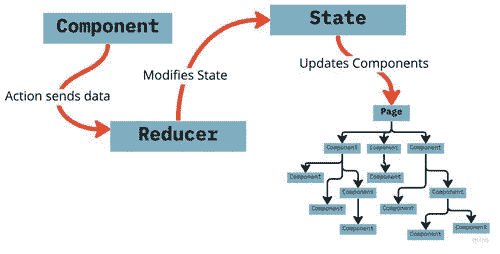

# 应用程序如何扩展？

> 原文：<https://betterprogramming.pub/how-do-applications-scale-3dad5c89df1e>

## 秘诀是将业务逻辑分成独立的单元

朱利亚·梅在 [Unsplash](https://unsplash.com?utm_source=medium&utm_medium=referral) 上的照片

好的代码具有普遍的品质。是[内聚](https://en.wikipedia.org/wiki/Cohesion_(computer_science))和[解耦](https://cloudcomputingtechnologies.com/the-importance-of-decoupling-in-software-development/)。它是[模块化](https://www.toptal.com/software/creating-modular-code-with-no-dependencies)并遵循[关注点分离](https://en.wikipedia.org/wiki/Separation_of_concerns)。

有几本书赞美这些美德，并给出了如何实现它们的具体例子。甚至还有一个首字母缩写要背:[扎实](https://en.wikipedia.org/wiki/SOLID)。

我喜欢 SOLID，但是我发现很多关于如何在实践中实现 SOLID 的建议要么集中在小规模的例子上，要么面向后端架构。对于如何处理我在职业生涯中处理过的那种大型有状态应用程序，也就是视频播放器，几乎没有什么建议。

我知道有一个球员团队几乎崇拜固体。在面试中，他们就坚实的原则拷问未来的工程师。每一个拉货请求都必须展示其可靠的信用，否则就会被踢出俱乐部。

一开始，他们代码库的几乎每一部分都可以被视为闪闪发光的金块，但所有对正确性的渴望并没有阻止这个团队最终打下一个巨大的蒸笼。他们制造了一个控制器管理器混乱，正如我在之前的文章中所描述的。他们建筑的结缔组织无法承受上面大象的重量而倒塌。

我最近听说这个团队正在重建他们的代码库，通过加倍使用相同的基本架构从他们所有的错误中“学习”。当然，他们这次会做对的，对吗？

创建内聚解耦的代码在大规模下看起来与在小规模下有很大的不同，据我所知，没有人真正讨论过如何为播放器这样的应用程序进行可靠的扩展。

这就是我写这些文章的动机！好消息是:其他社区已经摆脱了他们自己版本的控制器管理器混乱。我们可以通过学习他们如何从直接的面向对象设计中转移他们的范例来开始我们自己的旅程。

# 后端:从分层架构到微服务

以分层架构为例。这或多或少是面向对象设计在后端的体现。它看起来像这样:

这个想法是将应用程序的关注点分成不同的层。有数据访问层、业务逻辑层、视图层等等。理论上，这些层中的每一层都可以单独改变。

然而，这种分离在复杂性之下会被打破，因为任何业务逻辑的执行流都是跨层和层内传播的。

如果您想隔离这一特性，会有多容易？因为代码被涂抹在整个应用程序中，无论你多么盲目地遵循坚实的原则，它都会被卡住。

正如我在[中描述的](https://medium.com/better-programming/the-heart-of-software-architecture-is-weirdly-empty-eceff9abfc45)，如果你不能像棋盘上的棋子一样移动你的业务逻辑，那么你就不能改变它们的时机，这使得管理状态变得困难。当我们失去对状态的控制时，扩展应用程序变得越来越困难；这就是我们被复杂性曲棍球棒击中的时候。

对于较小的应用程序、没有太多状态的应用程序或变化不大的应用程序来说，这不是一个问题，但后端通常需要纵向扩展和横向扩展，有时扩展到令人难以置信的程度。

那么，后端社区是如何处理这个问题的呢？他们把分层的巨石拆成越来越小的碎片。他们创造了微服务。

如果使用得当，微服务是漂浮在基础设施海洋中的业务逻辑的解耦部分。

当然，基础设施可能复杂得令人眼花缭乱。围绕部署、分析、安全性等的问题。，使微服务很难做好。不幸的是，微服务的效用通常是根据它们如何与其基础设施交互来解释的；服务可以独立部署和扩展。这是微服务非常重要的一个方面，但是它忽略了一点。

微服务的最大价值在于将业务逻辑封装到解耦的单元中，这些单元可以独立于基础设施进行更改。使用微服务的应用程序伸缩性更好，因为它们允许每个服务按需调整，保持对状态何时产生和消费的控制，避免了复杂的曲棍球杆。

这个道理被毁约的微服务印证了。我见过微服务打其他微服务好像在调用内联函数。这在 Java 中非常容易做到，并导致了“分布式整体”

分布式独石。业务逻辑在服务之间变得模糊。

这种应用重新引入了同样的老的缩放问题。支持微服务的所有基础设施工作都被浪费了。

那么，玩家开发者能从我们的后台兄弟那里学到什么呢？

我们应该知道，我们能够并且应该一直将业务逻辑隔离到自包含的单元中。这使我们能够控制如何以及何时表达业务逻辑，这给了我们修改执行流程的空间，这允许我们重新调整我们的状态和扩展我们的应用程序。

# Web 应用:MVC 反应和还原

当网站开始成为真正的网络应用时，网络历史上出现了一个转折点。我们超越了 blink 标签和 web 表单，增加了交互性。

一切都失控了。似乎 JavaScript 加 HTML 加服务器端模板引擎的每一种可能的组合都像毛球一样被咳了出来，让全世界都去戳穿。

为了处理这种复杂性，开发人员转向了模型视图控制器模式。这是在用户界面中分离关注点的一种方式。

版权所有，公共领域，[https://commons.wikimedia.org/w/index.php?curid=10298177](https://commons.wikimedia.org/w/index.php?curid=10298177)

然而，MVC 模式有一点缺陷。它假设用户将处理业务逻辑。

这种模式是为那些不幸的数据输入员设计的，他们不得不在笨重的 CRT 显示器上一屏接一屏地切换。我记得在 90 年代，去一个医生的办公室，不得不等待疲惫的接待员在他们结实的键盘上点击，小心翼翼地输入我的名字、地址、出生日期等。

视图的工作是向用户显示模型的内容。然后用户将决定做什么。控制器会将这些决策转化为模型的变化。当用户完成后，他们点击“保存”，模型将被刷新到服务器，交易完成。

MVC 不是为处理业务逻辑而构建的，但是当它被重新用于更具交互性的 web 应用程序时，交互性，一种业务逻辑，必须被放在某个地方。

逻辑上，它被放入控制器、模型和视图中。

不清楚业务逻辑应该何去何从。交互性的一些方面自然地进入了视图，一些在模型中，一些在控制器中。为了控制过程，MVC 模式演变成了 MVP 和 MVVM 模式，但是它们都有同样的问题。

我希望你们现在已经很熟悉了。特性在各层之间变得模糊不清，导致状态管理不灵活和伸缩性问题。你设计 MVC 风格的代码有多好并不重要。复杂性最终会敲门。

这个社区是如何找到走出 MVC 迷宫的路的？他们将模型、视图和控制器折叠成两种不同的结构，每种结构处理不同的应用程序规模。

第一，有 React 这样的库。尽管对虚拟 dom 等特性大肆宣传，React 的真正价值在于它使用组件来封装业务逻辑。

现代视图库使用组件来模块化交互性。

每个组件都是独立的。它是模型、视图和控制器的集合。如果你想知道一个特定的按钮是如何工作的，或者一个表格是如何格式化的，那么你就不要在整个应用程序中涂抹代码(除非你有一个制作很差的 React 应用程序，但是嘿，你可以把一匹马带到水边……)。组件可以独立测试，也可以独立更改，从而允许应用程序在复杂程度上进行扩展。

其次，在大型应用程序中，业务逻辑或状态通常需要跨组件边界。像 Redux 这样的库封装了这个功能，所以组件不需要直接处理它们。

当一个组件需要发送一个消息来启动一个外部业务逻辑流程时，它向中央存储发送一个动作，然后就忘记了。

Redux:组件向 Reducer 发送一个动作，Reducer 修改状态并更新组件。

我们中的许多人已经习惯了使用 Redux，所以我们不认为这与普通的面向对象设计有什么根本的不同。

正如我在[中描述的](https://medium.com/better-programming/the-code-complexity-hockey-stick-bd4985d9fc33)，耦合消息传递是控制器管理器混乱的罪魁祸首。当一段代码调用另一段代码，并被期望确保返回值被正确地传递给下一段代码时，执行流在所有这些调用中被冻结。

动作解耦了消息传递。

一个动作表明一个特定的数据已经准备好启动一个特定的业务流程。分派动作的组件负责确保数据是正确的，但是之后，它的职责就结束了。没有返回数据传递给下一个对象。组件不会卡在袋子里。

一个动作启动一个被称为缩减器的函数，等待这个动作被调用。缩减器有一个任务:使用动作提供的数据修改全局状态。一旦状态发生变化，Redux 会将这个状态传递给 React，它会自动用新的状态重新绘制自己。

因此，每个 reducer 都是一个业务逻辑的解耦部分，漂浮在负责所有消息传递的基础设施的海洋中。听起来熟悉吗？(嘶。微服务)

# 结论

面向对象的设计和由此产生的分层体系结构倾向于封装状态，而将业务逻辑放在次要位置。无论你把代码做得多好，你最终都会有伸缩性的问题。

现代架构已经转向封装业务逻辑。状态被具体化，传递到业务逻辑中。这允许应用程序伸缩。

我们如何将这些技术应用到像视频播放器这样的应用程序中呢？我将在我的下一篇文章中探讨这个问题。

感谢阅读。下次见，编码快乐！