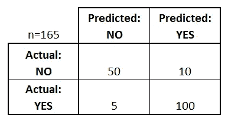

# 机器学习算法如何学习偏差？

> 原文：<https://betterprogramming.pub/how-do-machine-learning-algorithms-learn-bias-555809a1decb>

## 有偏见的风险评估算法产生于根据历史上有偏见的数据训练的模型

在 [Unsplash](https://unsplash.com/s/photos/math?utm_source=unsplash&utm_medium=referral&utm_content=creditCopyText) 上由 [Franck V.](https://unsplash.com/@franckinjapan?utm_source=unsplash&utm_medium=referral&utm_content=creditCopyText) 拍摄的照片

*客串作者* [*丽贝卡*](https://www.linkedin.com/in/rebeccanjeri/)

有一些有趣的事故是由训练不完善的机器学习算法造成的。比如我朋友的 iPhone 把他的狗归类为猫。或者这两个[的家伙](https://www.youtube.com/watch?v=MNuFcIRlwdc)被困在一个声控电梯里，电梯听不懂他们的口音。或者，亚马逊的 Alexa 试图[订购数百个玩具屋](https://qz.com/880541/amazons-amzn-alexa-accidentally-ordered-a-ton-of-dollhouses-across-san-diego/)，因为它混淆了新闻主播对其所有者请求的报道。还有亚马逊全食购上的迷因，真正本着有缺陷算法的精神。

> 贝佐斯:“阿列克谢，给我买点全食超市的东西。”
> Alexa:“购买全食超市。”
> 贝索斯:“等等，什么？”

# **数据科学的顶点**

在我的最后一篇《沉浸式激励数据科学》中，我花了很多时间探索算法偏差的概念。

我曾与一个帮助刑满释放人员重返校园的组织合作。因此，这降低了他们复发的可能性。我的任务是帮助他们计算出监禁的总成本——也就是说，一个人被监禁的显性和隐性成本。

在研究这个概念时，我偶然发现了 ProPublica 的[机器偏见](https://www.propublica.org/article/machine-bias-risk-assessments-in-criminal-sentencing)文章，该文章讨论了风险评估算法如何包含种族偏见。我了解到，一种对非裔美国人返回不成比例的误报的算法正被用来判处他们更长的刑期，并拒绝他们假释，税收正被用于监禁那些本可以在社会上成为社区有用成员的人，父母不应被监禁的儿童被送进了寄养系统。

一种具有不同影响的算法正在导致人们失去工作和社交网络，并确保一旦有人从监狱获释，就会出现最糟糕的冷启动问题。与此同时，未来可能犯罪的人被释放，因为算法对他们的犯罪行为视而不见。

这些假阳性和假阴性是如何发生的，有关系吗？首先，让我们定义与混淆矩阵相关的三个概念:精确度、召回率和准确度。

## **精度**

[精度是正确分类的真阳性占阳性预测的百分比](http://www.datasciencecentral.com/profiles/blogs/precision-vs-significance-accuracy-vs-precision-bias-vs-variance)。高精度意味着尽可能多地正确标记真阳性。例如，医疗诊断工具应该非常精确，因为没有发现疾病会导致疾病恶化。

在这种时间敏感的情况下，目标是最小化返回的假阴性的数量。同样，如果您的一名员工即将违反安全规定，您需要一个精确的模型来预测谁是罪魁祸首，以确保 a)您阻止了违反行为，b)您的员工在我试图找到此人时受到的干扰最小。

## **回忆**

另一方面，Recall 是返回的相关元素的百分比。例如，如果你在谷歌上搜索*哈利波特*书籍，那么 recall 将是返回的*哈利波特*书籍的数量除以 7。

理想情况下，我们将召回 1。在这种情况下，筛选不相关的搜索结果可能是一件麻烦的事情，也是一种糟糕的用户体验。此外，如果用户看不到相关的结果，他们可能不会购买任何东西，这最终可能会损害底线。

## **精度**

[准确度是所有正确预测](http://dataconomy.com/2015/10/improving-the-accuracy-of-big-data-analysis-2/)占总预测的百分比。精确度作为模型性能的衡量标准表现不佳，尤其是当您拥有不平衡的类时。为了使精确度、召回率、准确度和混淆矩阵一开始就有意义，训练数据应该代表总体，以便模型学习如何正确分类。

## **混淆矩阵**

混淆矩阵是成本收益矩阵的基础，也就是底线。对于一个企业来说，通过盈亏分析，底线很容易理解。我认为，要确定涉及到对受保护阶层歧视的底线要复杂得多。

然而，也许做这项工作更为紧迫和必要。我们正在创造的[产品](https://www.racked.com/2016/1/12/10750446/smartwatches-women-apple-huawei-jawbone)受到越来越多的审查，这种偏见将是显而易见的，并对我们的公司产生影响。

## **源数据导致的机器学习偏差**

机器学习的最大部分是收集和清理输入模型的数据。数据管理并不有趣，考虑训练集的采样、异常值和总体分布可能是枯燥乏味的工作。事实上，机器从数据管理过程中出现的疏忽中学习偏差。

随着[每天产生 2.5 艾字节](http://www.northeastern.edu/levelblog/2016/05/13/how-much-data-produced-every-day/)的数据，用于训练我们模型的数据并不短缺。有不同颜色的脸，有戴眼镜的，有不戴眼镜的，[宽眼窄眼](https://medium.com/mit-media-lab/the-algorithmic-justice-league-3cc4131c5148)，还有棕色眼睛和绿色眼睛的人。

有男有女，有口音不同的声音。没有文化意识到数据集的结构可能会导致模型对某些人口统计数据视而不见或充耳不闻，从而边缘化我们的部分使用群体——就像谷歌[错误地将黑人面孔](https://blogs.wsj.com/digits/2015/07/01/google-mistakenly-tags-black-people-as-gorillas-showing-limits-of-algorithms/)标记为大猩猩专辑一样。或者在事故中保护乘客的安全气囊将女性置于死亡的危险之中。这些假阳性——也就是说，当你实际上处于危险中时，你会得到安全的结论——让人们付出了生命的代价。

## **人为偏见**

今年早些时候，我的一位软件工程师朋友问职业顾问，在简历和 LinkedIn 上使用她中性的中间名是否会更好，以便她更容易找到工作。她的担心不是没有根据的；在工作场所有不可逾越的有意识和无意识的性别偏见。甚至有一个案例，一个男人和一个女人在短时间内交换电子邮件，看到他们被对待的方式有很大的不同。

## **如何减少机器学习偏差**

然而，如果我们要教会机器抓取 LinkedIn 和简历，我们就有机会科学地消除我们人类无法克服的歧视。有偏见的风险评估算法产生于根据历史上有偏见的数据训练的模型。可以干预和解决数据中包含的历史偏见，使模型保持对性别、年龄和种族的了解，而不会歧视或惩罚任何受保护的阶层。

播种强化学习模型的数据可能会导致非常优秀或糟糕的结果。指数提升或指数贬值可能会导致性能越来越好的自动驾驶汽车，它们会随着每一次新的乘坐而改善，或者它们可能会让一个[华盛顿的人](https://www.washingtonpost.com/news/local/wp/2016/12/04/d-c-police-respond-to-report-of-a-man-with-a-gun-at-comet-ping-pong-restaurant/?utm_term=.2bd06b4a8d76)相信华盛顿不存在性交易团伙的真相

机器是如何学习偏差的？我们通过有偏见的训练数据来教导机器偏见。