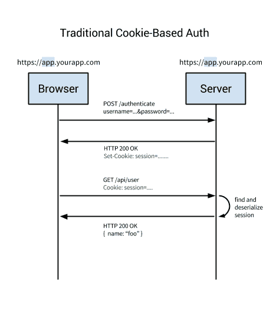
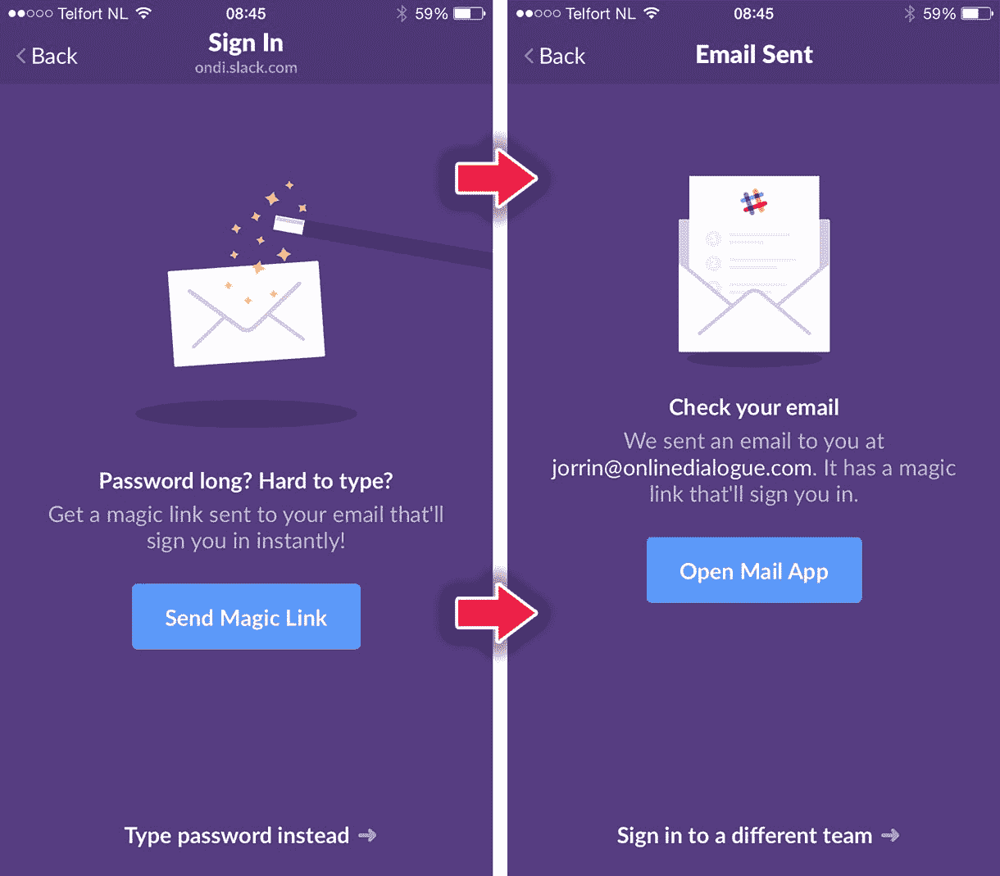
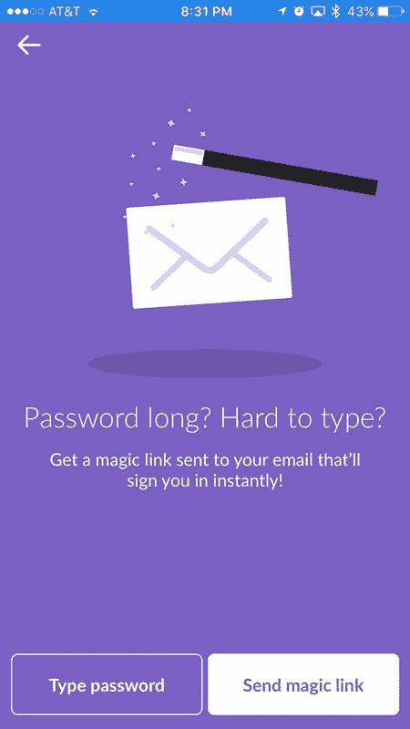
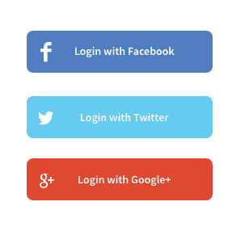
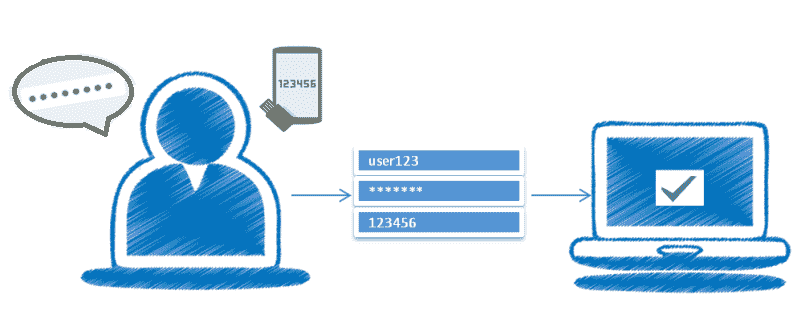

# 你怎么认证的，伙计？

> 原文：<https://betterprogramming.pub/how-do-you-authenticate-mate-f2b70904cc3a>

## 软件开发人员认证权威指南

何塞·丰塔诺在 [Unsplash](https://unsplash.com/search/photos/padlock?utm_source=unsplash&utm_medium=referral&utm_content=creditCopyText) 上拍摄的照片

我们都知道在我们的应用程序中认证用户的一般过程。这是一种老派的注册用户基本信息的方法，比如电子邮件，密码等..

然后，在登录时，将电子邮件和密码与之前存储的数据进行匹配。如果匹配，我们就给他们权限，否则就不给。

但是时代变了，引入了许多其他身份验证方法。作为一名开发人员，要在这个快节奏、不断变化的软件开发世界中保持价值，您需要了解这些新方法。

不可否认的事实是，在任何类型的应用程序或系统中，为了保证用户数据的安全和对信息的正确访问，身份验证都是至关重要的。

要确定哪种身份验证方法最适合您，需要了解身份验证方法、它们的利弊以及它们的工作原理。

我将尝试向您介绍目前使用的最常见和最流行的身份验证方法。

它不会是这些方法的详细技术指南；更像是试图让你熟悉它们。

虽然下面的主题是在考虑“web”的情况下讨论的，但是这些概念并不仅限于 web。这些概念和方法在其他领域也是有用的。

我假设你已经知道大部分互联网是建立在 [HTTP 协议](https://en.wikipedia.org/wiki/Hypertext_Transfer_Protocol)之上的。您还应该已经知道 web 应用程序是如何工作的，向应用程序认证用户意味着什么，以及什么是客户机-服务器架构。

让我们开始吧。

# 基于会话的认证

HTTP 协议是无状态的。这意味着，如果我们用用户名和密码验证一个用户，那么在下一次请求时，我们的应用程序不会知道这与前一次请求是同一个人。

我们必须再次认证。在每个请求中，HTTP 不知道之前发生了什么，它只是携带请求。

因此，对于任何对私人数据的请求，您都必须再次登录，以确保应用程序知道这确实是您。这将是非常恼人的。

为了避免这个问题，引入了基于会话或 cookie 的身份验证。

它使认证过程*成为有状态的*，这意味着认证记录或会话必须同时保存在服务器端和客户端。

服务器需要跟踪数据库或内存中的活动会话，同时在前端创建一个 cookie 来保存会话标识符。这就是为什么它被称为*基于 cookie 的认证*。

这是最常见和最知名的身份验证方法之一，已经使用了很长时间。

# 基于会话的认证的基本流程

1.  在浏览器中，用户输入他们的用户名和密码，请求从客户端应用程序发送到服务器。
2.  服务器检查用户，对其进行身份验证，并向用户的客户端应用程序发送唯一的令牌。(它还将这个唯一的令牌保存在内存或数据库中)
3.  客户端应用程序将令牌存储在 cookies 中，并随每个后续请求一起发回。
4.  服务器接收每个需要身份验证的请求，使用令牌对用户进行身份验证，并将请求的数据返回给客户端应用程序。
5.  当有人注销时，客户端应用程序会删除该令牌，这样来自客户端的后续请求就会变得未经授权。

图片来源: [auth0 博客](https://auth0.com/blog/cookies-vs-tokens-definitive-guide/)

这种身份验证方法存在几个主要问题:

*   每次用户通过身份验证时，服务器都需要在服务器上的某个地方创建一个记录。这通常在内存中完成，当有许多用户进行身份验证时，服务器上的开销会增加。
*   由于会话存储在内存中，这导致了可伸缩性的问题。如果您将您的服务器复制到多个实例，您必须将所有用户会话复制到您的所有服务器，这使得可伸缩性过程变得复杂。(虽然可以通过具有用于会话管理的单个专用服务器来避免这种情况，但是这并不总是可行且容易实现的。)

# 基于令牌的认证

由于单页面应用程序、web APIs 和物联网(IoT)的兴起，基于令牌的身份认证在过去几年中变得越来越流行。

用于基于令牌的认证的令牌大多是 [JSON Web 令牌(JWT)](https://jwt.io/introduction/) 。令牌有不同的实现，但 JWT 已经成为事实上的标准。

基于令牌的身份验证是无状态的。我们不会在服务器或会话中存储任何关于我们用户的信息，甚至不会存储已经发给客户端的 jwt。

# 基于令牌的身份验证的基本流程

1.  用户输入他们的登录凭据。
2.  服务器验证凭证并返回一个签名的令牌(JWT ),它可以包含一些额外的元数据信息，如 user_id、权限等。
3.  该令牌存储在客户端，通常存储在本地存储中，但也可以存储在会话存储或 cookie 中。
4.  对服务器的后续请求包括这个令牌，通常作为一个附加的授权头以*载体*的形式发送，但是它也可以在`POST`请求的主体中发送，甚至作为一个查询参数。
5.  服务器解码 JWT，如果令牌有效，则处理请求。
6.  一旦用户注销，令牌就会在客户端销毁，无需与服务器交互。

图片来源: [auth0 博客](https://auth0.com/blog/cookies-vs-tokens-definitive-guide/)

如果想要更详细的解释，可以试试[这篇文章](https://medium.com/vandium-software/5-easy-steps-to-understanding-json-web-tokens-jwt-1164c0adfcec)。

# 这种方法的好处

## 1.无国籍的

这种方法的最大优点是它是完全无状态的，服务器不需要存储用户令牌/会话的任何记录。

每个令牌都是独立的，包含检查其有效性所需的所有数据，并通过声明传递用户信息。这就是为什么它没有增加任何可伸缩性的复杂性。

## 2.存储任何类型的元数据

使用基于 cookie 的方法，您只需将会话 ID 存储在 cookie 中。另一方面，JWT 允许你存储任何类型的元数据，只要它是有效的 JSON。

## 3.对数据库的单次调用

当使用基于 cookie 的身份验证时，后端必须进行查找，无论是传统的 SQL 数据库还是 NoSQL 数据库，与解码令牌相比，往返可能需要更长的时间。

此外，由于可以在 JWT 中存储额外的数据，例如用户的权限级别，因此可以节省额外的查找调用来获取和处理所请求的数据。

例如，假设您有一个 API 资源`/api/orders`来检索通过您的应用程序下的最新订单，但是只有管理员角色的用户有权查看这些数据。

在基于 cookie 的方法中，一旦发出请求，您将调用一次数据库来验证会话是否有效，调用另一次来获取用户数据并验证用户是否具有 admin 角色，最后调用第三次来获取数据。

另一方面，使用 JWT 方法，您可以将用户角色存储在 JWT 中，因此一旦发出请求并验证了 JWT，您就可以对数据库进行一次调用来检索订单。

## 4.更易于实施

虽然可能，但在移动平台上使用 cookies 有许多限制和注意事项。

另一方面，令牌在 iOS 和 Android 上都更容易实现。对于没有 cookie 存储概念的物联网应用程序和服务，令牌也更容易实现。

由于这些好处和简化的方法，基于令牌的身份认证正在兴起。

# 无密码

对术语*无密码认证*的第一反应可能是:“没有密码，怎么可能有人被认证？”

这是因为我们已经牢牢记住，密码是保护我们账户的最终来源。

然而，一旦你挖掘了一些关于它的信息，你可能会意识到，不仅无密码认证使用安全，它可能比传统的用户名+密码登录更安全。

你可能也听到有人说[密码已经过时了](https://medium.com/@ninjudd/passwords-are-obsolete-9ed56d483eb)。

# **什么是无密码？**

您可能已经猜到了，无密码身份验证是一种无需密码即可配置登录和验证用户身份的方法。

实现无密码身份验证的一般思路如下:

1.  用户只需输入自己的电子邮件地址，而不是给出电子邮件/用户名和密码。
2.  您的应用程序会向他们发送一个指向该电子邮件的一次性链接，用户单击该链接会自动登录到您的网站或应用程序。
3.  在无密码登录的情况下，如果提供的电子邮件确实是你的，应用程序会假设你会从收件箱中获得登录链接。

有一种类似的方法。它不是向电子邮件发送一次性链接，而是通过短信发送代码或一次性密码(OTP)。但是你需要将你的应用程序与短信服务结合起来，比如 [Twilio](https://www.twilio.com/) ，才能让它工作(这也要花钱)。

此外，知道代码或一次性密码也可以发送到电子邮件也很好。

另一个不太受欢迎的(直到现在，只适用于苹果设备)无密码过程是使用[触控 ID](https://en.wikipedia.org/wiki/Touch_ID) ，它使用指纹进行认证。这篇文章是一篇很好的阅读材料。

如果你正在使用 [Slack](https://slack.com/) ，你可能已经尝到了无密码登录的滋味。

图片来源: [auth0 博客](https://auth0.com/blog/how-to-implement-slack-like-login-on-ios-with-auth0/)

此外， [Medium 只允许用户使用电子邮件访问他们的网站](https://blog.medium.com/signing-in-to-medium-by-email-aacc21134fcd)。

我最近发现，如果你想在你的应用中实现一个无密码系统，Auth0 或脸书的 AccountKit 可能是不错的选择。

# 无密码会出什么问题

如果有人可以访问用户的电子邮件帐户，他们也可以访问他们在您的网站或应用程序上的帐户。

作为开发人员，保护用户的电子邮件帐户不是我们的责任；这是用户的责任。此外，如果有人获得了他人电子邮件帐户的访问权限，他们可以使用“重置密码”功能来利用其基于密码的认证应用程序。

由于这是用户的责任，我们将继续。

# 无密码的好处

在回答这个问题之前，我请你想一想你使用“忘记密码”来重置密码的频率。此外，在此之前的几次失败的尝试登录到一个网站或应用程序，因为你不记得密码？

你不是唯一一个。难怪记住密码很难，特别是如果你关心你的账户安全，并为每个网站设置不同的密码，[遵循至少“一个数字，一个大写字母，一个符号，最小 8 个字符长度规则](https://blog.codinghorror.com/password-rules-are-bullshit/)”。

使用无密码认证可以让你免除这个麻烦。(我知道，你可能在想:“我用密码管理器，你个傻逼”。向你致敬。然而，许多用户可能并不精通技术，你需要考虑到这一点。)

这不仅对用户有好处，对开发者也有好处。现在，您不需要实现“忘记密码”、“重置密码”流程。这对所有人都是双赢的。

如果你真的认为一些用户可能仍然想使用古老的电子邮件密码登录，那么你应该像 Slack 那样给出两个选项，这样用户就可以选择加入。

图片来源: [smashingmagazine](https://www.smashingmagazine.com/wp-content/uploads/2016/05/07-slack-opt.png)

不用说，无密码正成为越来越重要的登录选项，并越来越受欢迎。

# 单点登录(SSO)

您是否注意到，如果您从浏览器登录任何谷歌服务，如您的 Gmail 帐户，然后您访问 YouTube 或任何其他基于谷歌的服务，您不需要单独登录。

你自动获得了所有谷歌服务的访问权。很迷人，不是吗？虽然 Gmail 和 YouTube 都是谷歌的产品，但它们是独立的产品，对吗？

那么，他们如何在用户单点登录所有产品后对其进行身份验证呢？

这种方法被称为单点登录(SSO)。

单点登录可以通过多种方式实现。一种方法是利用一个中央服务来协调多个客户端之间的单点登录。

在谷歌的例子中，这个中心服务是[谷歌账户](https://accounts.google.com/)。当用户第一次登录时，Google 帐户会创建一个 cookie，当用户导航到其他 Google 拥有的服务时，cookie 会一直存在。

工艺流程如下:

1.  用户访问第一个 Google 产品。
2.  用户会收到一个由 Google Accounts 生成的 cookie。
3.  用户导航到另一个 Google 产品。
4.  用户再次被重定向到谷歌账户。
5.  Google Accounts 发现用户已经有了一个与身份验证相关的 cookie，因此它将用户重定向到所请求的产品。

单点登录(SSO)可以简单地描述为“用户登录一次，就可以访问所有系统，而不会被提示在每个系统上再次登录”。

这归结为三个不同的实体，它们直接和间接地相互信任。

用户向他们的身份提供商(IDP) 输入密码(或一些其他认证方法)，以便获得对服务提供商(SP)的访问。用户信任 IDP，SP 信任 IDP，所以 SP 可以反过来信任用户。

这看起来很简单，但是定制实现起来会非常复杂。关于 SSO 如何工作的详细解释可以在[这篇文章](https://auth0.com/blog/what-is-and-how-does-single-sign-on-work/)中找到。

# 社交登录

我敢打赌，下面的图片是非常熟悉的，因为你经常在许多网站上看到它。

这就是众所周知的‘社交登录’**或**‘社交登录’。****

****利用这一点，您可以根据用户的社交网络帐户对其进行身份验证。用户不需要在你的应用中单独注册。****

****社交登录从技术上来说并不是一种不同的身份验证方法。相反，它是一种单点登录的形式，简化了用户注册/登录您的应用程序的过程，这就是为什么您应该了解它(作为一名开发人员)。****

# ****社交登录——两全其美****

****首先，对于用户来说，登录您的应用程序只需一次点击，因为他们可以使用他们现有的社交网络帐户，不需要记住用户名或密码。这带来了丰富的用户体验。****

****此外，作为开发人员，您不需要担心保护用户的身份验证凭证，并且您可以确保用户的电子邮件地址已经过验证(由社会服务提供商验证)。****

****又一个加分点；社交提供商将处理密码恢复过程。耶！****

# ****如何添加社交登录****

****作为一名开发人员，您需要对底层流程有更多的了解。大多数社交提供商使用 [OAuth2](https://developer.okta.com/blog/2017/06/21/what-the-heck-is-oauth) (有些使用 OAuth1，例如 Twitter)进行授权，以及幕后的认证机制。****

****在 OAuth 中需要理解的要点是:****

*   ****社交提供者是“资源服务器”。****
*   ****您的应用程序是“客户端”。****
*   ****尝试登录到您的应用程序的用户是“资源所有者”，因为关键的“资源”是用户的配置文件/认证信息。****

****因此，当用户想要使用社交提供商登录您的应用程序时，您的应用程序会将他们重定向到社交提供商进行身份验证(通常会打开一个弹出窗口，显示社交提供商的 URL)。****

****随着身份验证的成功，用户需要批准您的应用程序的权限，以便从社交提供商处访问用户的个人资料信息。****

****然后，社交提供商将使用某种形式的访问令牌将用户重定向回您的应用程序。****

****下一次，使用该访问令牌，您的应用程序可以向社交提供商询问用户的个人资料信息。简单地说，这就是 OAuth 的工作方式(为了清楚起见，跳过了一些技术细节)。****

****要在您的应用程序中实现社交登录，您可能需要在社交提供商的站点中注册您的应用程序，这将为您提供一个`app_id`和其他相关的密钥，以便进行通信配置。****

****您将在各自的社交网站上获得这些信息。****

****还有几个热门库和包(比如[护照](http://passportjs.org/)、[拉勒维尔交际花](https://github.com/laravel/socialite)等。)这可能会简化您的流程，让您不必了解所有细节。****

# ****双因素身份验证(2FA):****

****双因素认证(2FA)通过要求两种方法(也称为*因素*)来验证用户的身份，从而增强了访问安全性。****

****这是一种[多因素认证](https://en.wikipedia.org/wiki/Multi-factor_authentication)，提供了额外的安全层。****

****你以前可能没有意识到，但是当你去 ATM 机或取款机取钱时，你正在被一个双因素认证系统认证。****

****你必须有正确的银行卡(你有的东西)和 PIN(你知道的东西)的组合才能被认证。如果有人偷了你的提款卡，在他们知道你的密码之前，这是没有多大用处的。****

****这意味着，在双因素身份验证系统中，用户只有在成功地向身份验证机制提交了几个单独的证据之后，才被授予访问权限。****

****另一个例子你可能很熟悉，就是[谷歌](https://www.google.com/landing/2step/)、[脸书](https://www.facebook.com/help/148233965247823)等的两步验证。****

****在您的帐户中启用双因素身份验证后，每次您需要登录您的帐户时，首先您需要提供登录凭据，如电子邮件或密码(验证您知道这些凭据)。****

****然后，一次性密码(OTP)会通过短信发送给您(验证您是否拥有该设备)，您必须正确输入该密码才能完成登录过程。****

****如果您的密码已经泄露，您的帐户仍然是安全的，因为攻击者没有验证码就无法完成第二步。****

********

****图片来源:[https://dzone . com/articles/implementing-two-factor-authentic ation-using-authe](https://dzone.com/articles/implementing-two-factor-authentication-using-authe)****

****除了 OTP，另一种常见的方法是使用用户的生物数据，如指纹或视网膜，作为第二个因素。****

****双因素身份验证基于用户提供以下三项中的两项*:*****

1.  *****您知道的东西—帐户的密码或 pin。*****
2.  *****您拥有的东西—可以生成一次性密码的物理设备，如移动电话或软件应用程序。*****
3.  *****你是什么——你在生物学上的独特特征，比如你的指纹、声音或视网膜。*****

*****大多数黑客追求的是找出一个账户的密码或 pin 码。*****

*****访问物理令牌生成器或获取生物特征更加困难，这也是为什么 2FA 可以有效地为用户帐户提供更高的安全性。*****

*****那么，2FA 是万能的解决方案吗？[也许](https://medium.com/@the_economist/where-are-the-flaws-in-two-factor-authentication-5f7a468f41a9) [不是](https://www.theverge.com/2017/7/10/15946642/two-factor-authentication-online-security-mess)。*****

*****但是，它将帮助您加强应用程序中的身份验证安全性。*****

*****您将如何在您的系统中实施 2FA 解决方案？嗯，使用现有的解决方案可能更好，比如 [Auth0](https://auth0.com/learn/two-factor-authentication/) 或 [Duo](https://duo.com/) ，而不是滚动自己的解决方案。*****

# *****附加主题:身份验证与授权*****

*****我们中的一些人可能会错误地互换使用“认证”和“授权”这两个术语。*****

*****然而，它们不是一回事:*****

*   *******认证**就是验证你是谁的过程。当您使用用户名和密码登录应用程序时，您正在进行身份验证。*****
*   *******授权**是验证你有权访问某些东西的过程。这意味着您被允许的权限集。例如，如果您在应用程序中创建了一个资源，您可能是唯一被允许删除它的人(作为所有者)，其他用户没有删除该资源的“授权”。*****

*****恭喜你，你已经成功地读完了这篇冗长乏味的文章。*****

*****希望您对这些主题有一个简要的概述。如果您发现本文有任何错误或认为有任何需要改进的地方，请留下评论。*****