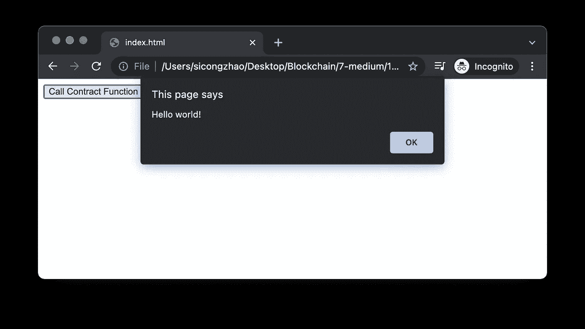
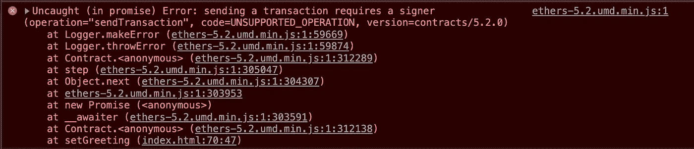

# 网站如何与智能合约交互？

> 原文：<https://betterprogramming.pub/how-does-a-website-interact-with-smart-contracts-397a4e8b35be>

## 用 10 行 JavaScript 解释—区块链开发教程 02


我很难理解网站如何与智能合约交互。许多新信息和术语让我不知所措。所以我希望这个教程足够简单，让每个有基本 web 知识的人都能理解底层机制。

在本文中，我将只使用一个 HTML 文件和普通的 JavaScript 来解释网站如何与智能合约交互。开始了。

## 第一步。部署智能合同

首先，我们需要一个已部署的智能契约。您可以使用现有的智能合约，也可以部署新的智能合约。

对于后者，本教程可能会有所帮助[如何在 5 分钟内部署智能合同](https://medium.com/better-programming/how-to-deploy-a-smart-contract-in-5-minutes-8c924bb702aa)。

对于本教程，让我们只使用我刚刚部署的一个。合同地址为`0x2Bc7A39c22403dA3617b237D42BF0db2C5dcaBA1`，下面是合同代码:

这是一份安全帽项目的合同样本。

上面是一个简单的契约，它跟踪一个字符串变量 greeting。每个人都可以通过 greet()获得这个变量，并通过 setGreeting()改变它。我在孟买部署了这个智能契约(Polygon Testnet)，初始问候设置为' *Hello world！*’。

## 第二步。得到合同 ABI

ABI 代表应用程序二进制接口，合同接口的描述。请参考下面引自[这篇文章的](https://www.quicknode.com/guides/solidity/what-is-an-abi):

> 它非常类似于 API(应用程序接口)，一种人类可读的代码接口表示。ABI 定义了用于与二进制契约交互的方法和结构，就像 API 一样，但在较低的级别上。

[可靠性文档](https://docs.soliditylang.org/en/v0.5.3/abi-spec.html)也有助于你了解 ABI。

从工程的角度来看，ABI 应该包含在网站中，因此 JavaScript 可以使用它来调用合同函数。在下一步中会有更多关于这个主题的内容。

现在我们看到了 ABI 的表面，它在哪里？如果您使用我的教程部署了您的智能合约，那么 ABI 文件位于`artifacts/contracts/<your-contract-name>.json`

对于本教程，您可以在以下步骤中使用这个 ABI 文件。

## 第三步。前端

现在我们有了合同地址和合同 ABI，我们准备创建一个网站来进行函数调用。下面是例子。

从字面上看，不到 10 行 JavaScript，对吗？我们来解释一下这段代码。

*   **line3** 包含了 [ethers.js](https://docs.ethers.io/v5/) 库。这是我们用来与区块链生态系统互动的工具。
*   在 **line5** 中，我们使用最简单的方法将这个 ABI 包含到网站中，通过复制粘贴它的内容并将其赋给变量`Greeter`。
*   **line6** 通过向`ethers.providers.JsonRpcProvider`方法提供[孟买网络的官方 RPC](https://docs.polygon.technology/docs/develop/network-details/network/) 地址来启动提供者。您可能想知道什么是提供者。在 [ethers 文档](https://docs.ethers.io/v5/api/providers/)中，“一个**提供者**是以太坊网络连接的抽象，为标准以太坊节点功能提供一个简洁、一致的接口。”可以把它想象成一个 API 端点，通过它你可以与区块链交互。
*   **第 9 行**是我们通过提供合同地址、ABI 和`ethers.Contract`方法的提供者在区块链和我们的网站之间建立连接的地方。现在，网站可以调用该函数并从孟买区块链检索问候信息。



图 1 网站截图。从区块链回来的问候。

## setGreeting 呢？

现在你可能会想，契约里不是还有一个功能吗？我们能叫那个吗？很棒的问题！

在基于以太坊的区块链，阅读信息一般是免费的，而改变信息成本。在我们的示例中，调用另一个函数`setGreeting`将导致以下错误消息:



图 2 试图调用 setGreeting 函数时的错误信息。

现在我们正在改变价值链，所以我们需要连接我们的钱包，并说服区块链，我们愿意并有能力支付成本。我们不是提供者，而是将一个[歌手](https://docs.ethers.io/v5/api/signer/)传给`ethers.Contract`，这需要钱包整合。我将在这里停止，因为这超出了本教程的范围。如果你想让我以后解释那部分，请告诉我。

# 离别赠言

你有它！我希望这篇教程能帮助你理解网站如何与区块链互动。如果您有任何问题或建议，请随时发表评论。如果你想让我写其他关于区块链发展的话题，也请告诉我！

```
**Want to Connect?**Please feel free to reach out ([my LinkedIn](https://www.linkedin.com/in/zhaosicong/)).
```