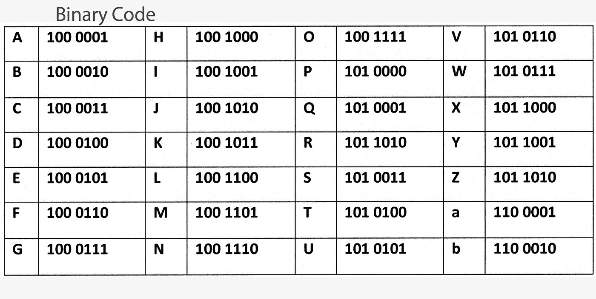
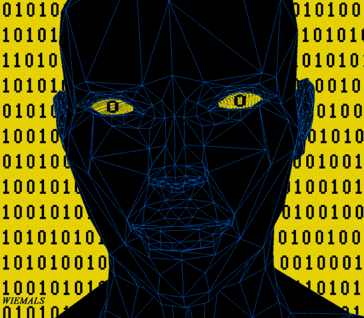
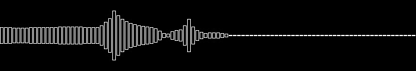

# 二进制代码是如何工作的？

> 原文：<https://betterprogramming.pub/how-does-binary-code-work-f1ac8afb8181>

## 没有人谈论它！

照片由[马库斯·斯皮斯克](https://unsplash.com/@markusspiske?utm_source=medium&utm_medium=referral)在 [Unsplash](https://unsplash.com?utm_source=medium&utm_medium=referral) 拍摄

> 这个世界上有 10 种人——懂二进制的和不懂的！

我们热衷于应用程序、界面、社交媒体——一句话，技术。我们看电影是为了娱乐，探索地图寻找方向，以及你现在在屏幕上看到的每一个字。这是什么？它们是如何产生的？它们在最精细的阶段看起来是什么样的？

只有 1 和 0！想象一下，把这一切都看成是数百万个 1 和 0。很伤脑筋，对吧？但是，这是事实。在粒度级别上，我们在计算机屏幕上看到的都是 1 和 0。

计算机使用二进制存储数据。不仅因为这是存储数据的可靠方式，而且计算机只理解 1 和 0——二进制。计算机的主存储器由晶体管组成，这些晶体管在高电压和低电压之间切换，有时为 5V，有时为 0。根据软件指令，这种读取是由计算机的处理器完成的，它读取晶体管的状态——高或低——以控制计算机的其他设备。

# 二进制数字和文本

二进制数据本身没有预定的含义。相反，每种类型的数据都根据不同的规则以二进制格式进行编码。

例如，数字 10 将以十进制格式表示为`1*10¹ + 0*10⁰`。它将补足到 10 英镑。而同样的数字用二进制表示为`1010`。在二进制中，每个数字都是 2 的幂。因此，二进制中的 10 是由`1*2³ + 0*2² + 1*2¹ + 0*2⁰`构成的。

就字母而言，它们是由 UTF-8 制定的规则定义的，该规则为每个字符分配一组 8 个二进制数字:

字母表二进制代码— [Pinterest](https://in.pinterest.com/pin/455215474815202105/)

因此，姓名“JOHN”在二进制代码中会是这样的:

`J: 1001010, O: 1001111, H: 1001000, and N: 1001110`

# 背景很重要

从单词 JOHN 中取" H"。它也代表十进制的 72。那么，计算机是如何理解它是字母“H”还是十进制数 72 的呢？这一切都归结于上下文！

例如，青蛙的西班牙语术语是“拉纳”，但拉纳在罗马尼亚语和保加利亚语中是“伤口”的意思。现在，如果我们知道上下文，即语言，我们就会知道 rana 是什么意思。

同样，我们需要一个上下文来理解我们是在看二进制数字还是文本。

# 二进制也是复杂数据的来源！

## **图片和视频**

不仅仅是数字和文本，二进制也用于最复杂的数据。从图像到视频帧，在数据的最细粒度级别，它是二进制代码。

例如，一幅图像由成千上万个像素组成，每个像素包含一个以二进制代码存储的 RGB 值。

这些二进制代码填充 RGB，并根据这些代码生成的强度，将强度数字扔给视频驱动程序。这个程序将这些颜色分配到你屏幕上的百万个水晶上——我们看到了一个图像！

## **声音**

我们最喜欢的歌呢？这也是以二进制格式存储的，使用一种叫做脉冲编码调制的技术。连续的声波通过每隔几毫秒拍摄一次振幅的快照而被数字化。这些振幅以二进制数字的形式存储。每秒钟的声音可以有大约 44000 个二进制字符串。当我们的计算机软件读取这些数字时，这些数字决定了扬声器线圈的振动频率，从而产生不同频率的声音。

# **总结**

这都需要数十亿和数万亿比特。我们知道二进制是我们阅读和看到的每一个数据的原子。但是，二进制是计算的终极目标吗？不要！

科学家们研究了三进制计算机，其电路有三种可能的状态——0、1 和 2。如今甚至存在量子计算机，其电路可以同时处于多种状态。到目前为止，没有什么比二进制更能震撼计算机的存储和传输了。

下一次，无论你是在阅读电子书，看电影，还是在笔记本电脑上听歌曲，只要记住一切都来自对或错的来源——1 或 0，亿万次！

和平！