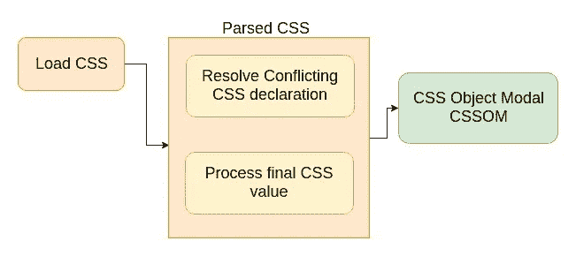
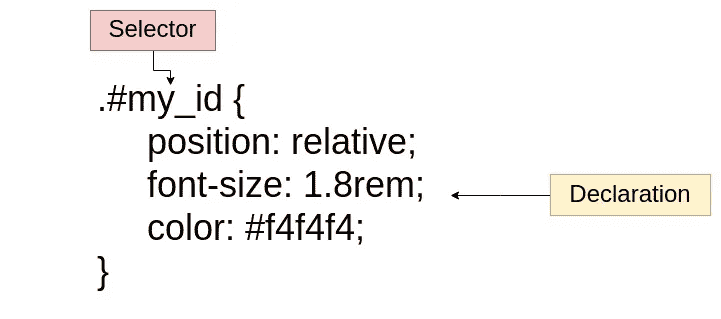
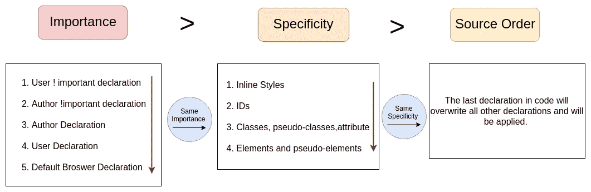
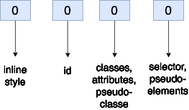
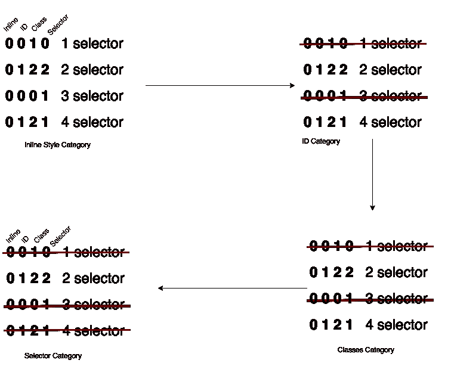

# CSS 是如何在幕后工作的？

> 原文：<https://betterprogramming.pub/how-does-css-works-behind-the-scenes-aca7152b4e7e>

## 看看 HTML 和 CSS 在浏览器中是如何处理的

图片来自发射学院

在本文中，我们将对浏览器中如何处理 HTML 和 CSS 有一个高层次的概述。

在这里，我们将学习 CSS 解析阶段。

乔纳斯·施梅特曼

首先，让我们快速回顾一下 CSS 规则中的术语。规则由选择器和声明块组成:

选择器用于选择一个或多个我们想要样式化的 HTML 元素。每个声明都由一个 CSS 属性及其对应的值组成。我们赋予属性的值称为声明值。

现在我们来谈谈 CSS 解析阶段。

# 解决冲突的 CSS 声明:级联

级联是指当有多个规则适用于某个元素时，组合不同的样式表并解决不同 CSS 规则和声明之间的冲突的过程。

例如，字体大小属性可以出现在几个样式表中，也可以在一个样式表中出现几次。

CSS 有以下不同的来源:

1.*作者声明*(开发者编写的 CSS)
2。*用户声明*(用户在浏览器中创建的设置，例如在浏览器中设置字体大小)
3。*浏览器声明*(也称为用户代理默认浏览器声明)

Cascade 组合了来自所有这些不同来源的 CSS 声明。

但是级联实际上是如何解决冲突的呢？通过查看冲突声明的重要性、特殊性和源代码顺序来确定哪一个优先。

以下是我们查看所有匹配规则的重要性、特异性和来源顺序的顺序:

乔纳斯·施梅特曼

# 重要

具有`!important`指令的规则总是被应用，不管该规则出现在 CSS 文档中的什么地方。

最重要的声明是标有重要关键字的用户声明。第二重要的声明是标有 important 的作者声明。第三是普通的作者声明，最后，最不重要的是默认的浏览器声明。这实际上很有意义，因此我们可以很容易地覆盖这些默认来自浏览器的声明。

让我们看一个例子来更好地理解:

这里我们有两条规则。两者都适用于`.btn`类，并且我们有两个关于`background-color`的冲突声明。两者都是作者声明，但是如果你仔细观察第一个规则声明，`background-color: #000`包含了重要的关键字，因此这个声明更重要，正如我们从上面可以看到的。这意味着该声明将获得优先权。

# 特征

很多时候，我们的作者样式表中只有一堆相互冲突的规则，没有任何重要的关键字。在这种情况下，所有声明都具有相同的重要性。如果是这种情况，级联会计算并比较声明选择器的特异性。

有四个类别定义了选择器的特异性级别:

1.  **内联样式**(最高特异性):内联样式直接附加到要样式化的元素上。例子:`<h1 style=”color: #ffffff;”>`。
2.  **ID**:**ID 是页面元素的唯一标识符，比如`#navbar`。**
3.  ****类、属性、伪类**:该类别包括`.classes`、`[attributes]`和伪类如`:hover`、`:focus`等。**
4.  ****元素和伪元素**(最低特异性):该类别包括元素名称和伪元素，如`h1`、`div`、`::before`、`::after`。**

**我们有四个插槽，每个插槽都从零开始:**

****

*   ***第一选择器* : **0 0 1 0 特异性**，因为它只有一个类选择器。**
*   ***第二选择器* : **0 1 2 2 特异性**，因为它有一个 ID 选择器，两个类选择器，两个元素选择器。**
*   ***第三选择器*:**0 0 1 特异性**，因为它有一个元素选择器。**
*   ***第四个选择器* : **0 1 2 1 特异性**，因为它有一个 ID 选择器，一个类选择器，一个伪元素，一个元素选择器。**

**现在我们有了四个特异性，我们从左到右比较它们。从内嵌样式开始(最具体)。如果有一个内联样式的选择器，这个选择器将胜过所有其他的选择器，因为它是最具体的类别。**

****

**这里的情况不是这样，所以让我们转到 IDs。这里我们可以看到第二个和第四个选择器的 ID 特异性为 1。所以，带零的选择器已经出局了，因为它们没有第二个和第四个那么具体。由于两个选择器在这个类别中都有一个，我们必须继续检查下一个类类别。在 classes 类别中，第二个和第四个选择器都有两个，所以我们转到下一个。**

**在选择器类别中，第二个选择器比第四个具有更高的特异性。第二个选择器是所有选择器中最具体的，所以是`background-color: blue`。**

# **来源订单**

**如果所有声明选择器都具有相同的特性，那么将使用最后一个声明。代码中的最后一个声明将覆盖所有其他声明，并将被应用。**

# **摘要**

*   **CSS 声明用！重要的具有最高优先级。
    (但仅限使用！作为最后手段很重要。)**
*   **内联样式总是优先于外部样式表中的样式。**
*   **通用选择器*具有最小的特异性值(0，0，0，0)。**
*   **比选择器的顺序更依赖于特异性。**
*   **当使用第三方样式表时，总是将作者样式表放在最后。**

**希望这篇文章对你有用。感谢阅读，继续学习！**