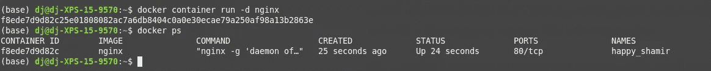
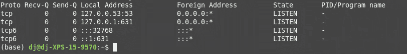
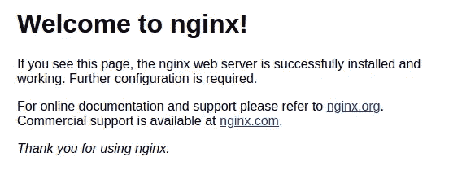

# 如何使用 Docker 端口绑定？

> 原文：<https://betterprogramming.pub/how-does-docker-port-binding-work-b089f23ca4c8>

# 钉这个常见的码头工人面试问题


由 [Masaaki Komori](https://unsplash.com/@gaspanik?utm_source=medium&utm_medium=referral) 在 [Unsplash](https://unsplash.com?utm_source=medium&utm_medium=referral) 上拍摄的封闭港口照片。

你有没有参加过面试，他们希望你知道 Docker 作为初级开发人员是如何工作的？如今，面试官希望你深入了解八项、十项甚至更多的技术。有点疯狂。在大学或学校，他们很可能不会教你任何关于 Docker 的知识。如果你知道这件事，你就能与众不同。

当您开始使用 Docker 时，您将遇到的第一个问题是您无法连接到容器。这篇文章将告诉你为什么会这样。我还将解释端口绑定是如何工作的。

即使你是一个经验丰富的开发人员，你也应该知道什么是端口绑定。否则，你会在求职面试中显得很傻。如果你没有主意，给自己拿杯咖啡。我会确保把你需要知道的关于这个话题的一切都灌输到你的脑子里。这只需要你六分钟！

# 让我们从 Nginx Docker 容器开始

如果你对 Docker 了解不多，也不用担心。我会尽量详细解释一切。首先，我需要确保您理解 Docker 容器和 Docker 图像之间的区别。

您可以将 Docker 映像视为一个文件，其中包含运行特定程序所需的所有依赖项和配置。这是为什么呢？Docker 试图解决的一个问题是安装噩梦。

我们都遇到过在 Windows、Mac 或 Linux 上安装程序的情况。每次都提示您缺少另一个程序。令人沮丧。我想我还是装吧？

您也想安装它吗？呃…

你最终会有很多不同的程序，并且经常需要配置系统变量等等。在最糟糕的情况下，它可能会搞乱你的系统。

你不希望你组织中的每个人都经历这种麻烦，对吗？

Docker 映像包含了安装程序所需的一切，而 Docker 容器是映像的运行实例。

Docker 为你解决安装噩梦。Docker 容器包含它运行所需的一切，仅此而已。您可以在 Windows、Linux 或 Mac 上运行它。只要你安装了 Docker，你就可以在任何地方运行它。

关于 Docker 的优点就说得够多了。我们是来让码头集装箱运作起来的。

所以让我们从 Nginx Docker 容器开始。Nginx 是一个运行在 80 端口的 web 服务器。我将使用 [Nginx Docker 映像](https://github.com/nginxinc/docker-nginx/blob/5c15613519a26c6adc244c24f814a95c786cfbc3/mainline/buster/Dockerfile)立即启动一个 Docker 容器(在分离模式下):

```
docker container run -d nginx
```

Docker 容器生成后，您会看到新 Docker 容器的 UUID。如果你不知道什么是 UUID，请阅读我之前的文章。您将看到 Docker 容器通过 Docker 容器 ps 命令处于活动状态:



现在，如果你试图使用 [curl](https://curl.haxx.se/) 或你的浏览器直接连接 Docker 容器，将会失败。您不能直接连接到 Docker 容器。但是为什么不呢？Docker 文件甚至说 80 端口暴露…我就不明白了。别急，我会在下面的部分解释！

```
**curl -I 127.0.0.1:80**
curl: (7) Failed to connect to 127.0.0.1 port 80: Connection refused
```

# 为什么我不能直接连接到 Docker 容器？

Docker 容器无需任何配置即可与外界连接。这太好了，因为我们不需要改变任何我们以前已经编程过的东西。

但是默认情况下，外界无法连接到 Docker 容器。

啊，我明白了。所以不是反过来。那么，您应该如何连接到 Docker 容器呢？好吧，这样做有多种选择。让我们来探索它们。

## 1.暴露所有 Docker 端口

```
docker container run -P -d nginx
```

`-P`命令打开容器暴露的每个端口。Docker 标识了 [Dockerfile](https://medium.com/better-programming/what-goes-into-a-dockerfile-ff0ace591060?source=friends_link&sk=6a4bdaf97cb6e7e76afe8fc733a1023f) 公开的每个端口，以及使用 Docker 容器构建`--expose`参数公开的端口。每个暴露的端口都直接绑定在主机的“随机”端口上。

听起来不错，但是我现在该怎么找到这个港口呢？别担心，我们会找到你心爱的港口。甚至有多种方法可以帮你找回它们。我将向您展示两种不同的方法:

*   码头集装箱港口
*   `netstat`

让我们从 Docker 命令开始。只需使用上面的命令，然后使用容器 UUID。您将看到 Docker 容器的端口 80 被绑定到主机 IP 地址 0.0.0.0 和主机端口 32768(如果您自己尝试该命令，也可以是不同的端口)。

```
docker container port ***insert container_uuid*** 80/tcp -> 0.0.0.0:32768
```

我们的另一个选择是使用`netstat`命令。要查找所有打开的端口，您还可以执行以下命令。注意到你在别人之间找到了你心爱的港口。你要找的那个可以在第三行找到。

```
netstat -ntlp
```



netstat 命令找到的所有打开的端口。

## 2.公开特定端口


端口绑定的例子:将 Docker 容器的端口 80 绑定到主机的端口 8080。

公开所有 Docker 端口通常不是一个好主意，因为默认情况下根本不公开任何端口。我这样做的理由仅仅是为了安全。你不想暴露一切，因为那根本没有任何意义，对吗？

要仅公开一个端口，请执行以下行:

```
docker container run -p 8080:80 -d nginx
```

Nginx 容器的端口 80 在主机端口 8080 上对外界开放。现在，您可以通过多种方式连接到容器。例如，使用 curl 或您的浏览器。厉害！

恭喜你，你现在理解了 Docker 端口绑定最重要的部分！我将向您展示 curl 命令的结果。

```
**curl -I 0.0.0.0:8080**
HTTP/1.1 200 OK
Server: nginx/1.17.9
Date: Sun, 08 Mar 2020 11:38:47 GMT
Content-Type: text/html
Content-Length: 612
Last-Modified: Tue, 03 Mar 2020 14:32:47 GMT
Connection: keep-alive
ETag: "5e5e6a8f-264"
Accept-Ranges: bytes
```

让我也向您展示一下如果您访问 0.0.0.0:8080，它在您的浏览器中会是什么样子。



用您的浏览器连接到 0.0.0.0:8080。

# 还有一点

默认情况下，Docker 将容器端口暴露给 IP 地址 0.0.0.0(这匹配系统上的任何 IP)。还可以告诉 Docker 绑定哪个 IP。这可能是 127.0.0.1 或不同的 IP 地址。

要将 Docker 容器端口 80 绑定到主机系统端口 8000 和 IP 地址 127.0.0.1(也称为 localhost)，只需运行以下命令:

```
docker run -d -p 127.0.0.1:8000:80 nginx
```

# 结论

如果使用容器，Docker 端口绑定是一个需要理解的重要概念。一开始可能会令人困惑，并提出为什么需要配置传入连接的问题。但是 Docker 出色地提供了所有需要的文档。

> 答案是:Docker 默认不公开端口，每个公开的端口你都要自己配置！

作为开发人员，有些 Docker 概念比其他概念更难理解。我希望这篇文章清楚地说明了端口绑定。如果没有，请在下面发表评论！