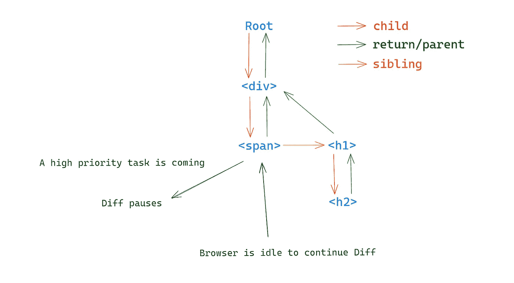

# React 的可中断更新是如何工作的？

> 原文：<https://betterprogramming.pub/how-does-reacts-interruptible-updates-work-5340bcaadb1a>

## Vue 为什么不用光纤架构？


照片由在 [Unsplash](https://unsplash.com?utm_source=medium&utm_medium=referral) 上拍摄

React 18 发布，最重要的变化是支持纤程架构。它帮助 React 实现异步的、可中断的更新。这篇文章将向你揭示它是如何工作的。

# 为什么反应纤维？

因为在 17 版本之前，虚拟 DOM 的 Diff 是以递归的方式完成的，递归的过程是不能中断的。这是因为一旦中断，当它再次开始时，它不知道当前的处理在哪里。

使用 identity 也是一个禁忌，因为 DOM 中的操作可能很复杂，并且 DOM 树的结构可能会发生巨大的变化。

不间断的递归过程会导致 JavaScript 代码执行时间过长。浏览器的渲染工作和 JavaScript 的执行在同一个线程上。这就导致页面不能及时变化，让用户有卡顿感。

所以 React 团队采用了纤程架构。

# 什么是反应纤维？

React Fiber 可以理解为 React 内部实现的一组状态更新机制。

首先，它可以被中断和恢复。并且恢复后，之前的计算结果和中间状态可以重复使用。

其次，它还支持更新任务的不同优先级。它允许那些高优先级的任务(如用户输入、动画等。)尽可能早地呈现在页面上。

具体到代码，它是一个类似链表的数据结构。那么我们来看看[源代码](https://github.com/facebook/react/blob/main/packages/react-reconciler/src/ReactFiber.new.js#L122)中 FiberNode 的定义:

```
**// Instance**
this.tag = tag;
this.key = key;
this.elementType = null;
this.type = null;
this.stateNode = null;**// Fiber**
// Connect with other fibers
this.return = null;
this.child = null;
this.sibling = null;
this.index = 0;this.ref = null;**// Properties of a unit of work**
this.pendingProps = pendingProps;
this.memoizedProps = null;
this.updateQueue = null;
this.memoizedState = null;
this.dependencies = null;this.mode = mode;**// Effects
// Markup after Diff, used to map to the real DOM**
this.flags = NoFlags;
this.subtreeFlags = NoFlags;
this.deletions = null;**// Update schedule priority**
this.lanes = NoLanes;
this.childLanes = NoLanes;**// Current Fiber backup from last update
// It will be compared with the current latest Fiber, which is Diff**
this.alternate = null;
```

我添加了额外的注释，源代码是[这里是](https://github.com/facebook/react/blob/main/packages/react-reconciler/src/ReactFiber.new.js#L122)。

这里我重点解释一下纤程节点的连接信息。



如上所示，它们是按照这种类似链表的逻辑链接在一起的。

每个节点都被视为一个“工作单元”，当浏览器空闲时，每次只处理一个“工作单元”。因为分割的工作单元足够小，所以 JavaScript 的执行时间相当短。所以这并不妨碍浏览器的渲染工作。

更具体地说，用伪代码表示这个过程如下:

接下来，让我们分析一下 Fiber 节点在挂载阶段和更新阶段是如何工作的。

# 增加

这种情况下的纤程节点树实际上经历了 Diff 算法。但是，由于之前的纤程节点不存在，因此该 Diff 将使用替换标志来标记所有纤程节点。

然后在提交阶段，将根据标识修改真正的 DOM。这是附加物。

# 更新

在更新期间，还将生成一个纤程节点树。此时会比较之前已经映射到真实 DOM 的纤程节点树，标记出变化的纤程节点。

然后在提交阶段，将根据标识修改真正的 DOM。这可能是添加、删除、修改属性等。

这种技术被称为双重缓存。但是 Vue.js 为什么不用双缓存呢？

因为和 Vue 相比，React 并不确切知道一个更新(状态改变)会影响哪个 DOM(组件)。所以需要从头(根)到尾计算，并且在计算过程中尽可能重用之前的 DOM。

递归计算在此过程的早期使用。尽管执行 JS 的时间稍长，但直接操作 DOM 仍然有性能优势。

现在使用纤程结构代替递归。核心思想是将计算成本平摊到每个渲染帧中。同时，还添加了优先级模型，允许那些优先级较高的更新提前呈现在页面上。

感谢阅读。我希望这有所帮助。如果你有兴趣，可以看看[我的其他媒体文章](https://medium.com/@islizeqiang/index-of-my-stories-published-in-2022-3c6e3cb94c07)。