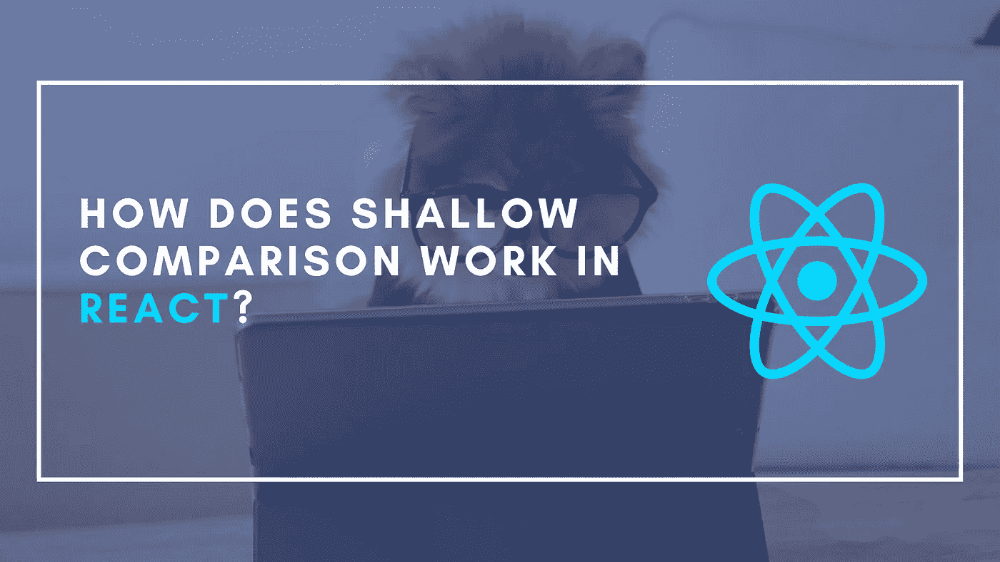

# 浅层比较在 React 中是如何工作的？

> 原文：<https://betterprogramming.pub/how-does-shallow-comparison-work-in-react-74b018fd39ac>

## 还有一些你不知道的有趣外卖。



浅薄的比较作为一个概念是完全反动的发展。它在不同的流程中起着关键作用，也可以在 React 组件生命周期的几个地方找到。想想决定类组件是否应该更新的机制，React 钩子的依赖数组，通过`React.memo`的记忆，等等。

如果您曾经通读过 React 官方文档，那么您很可能已经看到过经常提到的术语“浅层比较”。但大多数时候，它只是一个关于其存在的小说明，很少涉及到其他内容。因此，这篇文章将探究浅层比较的概念，它到底是什么，它是如何工作的，并以一些你很可能还不知道的有趣的要点结束。

# 陷入肤浅的比较

理解浅层比较最直接的方法是深入研究它的实现。相应的代码可以在`shared`子包中的 [React Github 项目](https://github.com/facebook/react)中找到。在那里，您将找到包含我们正在寻找的代码的`shallowEqual.js`文件。

事情还挺多的，我们把它拆分一下，一步一步的过函数。

从函数定义开始，该函数接受两个相互比较的实体。与 TypeScript 相反，这段代码使用 Flow 作为类型检查系统。这两个函数参数都是使用特殊的`mixed`流类型键入的，类似于 TypeScript 的`unknown`。它表明参数可以是任何类型的值，函数会找出其余的并使其工作。

之后，首先使用 React 内部的`objects`函数`is`比较函数参数。导入的函数只不过是 JavaScript 的`[Object.is](https://developer.mozilla.org/en-US/docs/Web/JavaScript/Reference/Global_Objects/Object/is)` [函数](https://developer.mozilla.org/en-US/docs/Web/JavaScript/Reference/Global_Objects/Object/is)的多填充版本。这个比较函数基本上等同于普通的`===`运算符，但有两个例外:

*   `Object.is`认为相反的带符号零(`+0`和`-0`)不相等，而`===`认为它们相等。
*   `Object.is`认为`Number.NaN`和`NaN`相等，而`===`认为它们不相等。

基本上，第一个条件语句处理了所有简单的情况:如果两个函数参数对于基本类型具有相同的值，或者对于数组和对象引用相同的对象，那么通过浅层比较，它们被认为是相等的。

在处理了两个函数参数的值相等或引用同一个对象的所有简单情况之后，我们想进入更复杂的结构(对象和数组)。然而，如果任一参数是原始值，前面的条件语句仍然可以留给我们原始值。

因此，为了确保我们从现在开始处理两个复杂的结构，代码检查任一参数是否不属于类型`object`或者是否等于`null`。前一个检查确保我们处理的是对象或数组，而后一个检查是过滤掉`null`值，因为它们的类型也是`object`。如果任何一个条件成立，我们肯定是在处理不相等的参数(否则前面的条件语句会把它们过滤掉)，所以浅层比较返回`false`。

既然已经确定我们只处理数组和对象，我们就可以把重点放在浅层比较那些数据结构上了。为此，我们必须深入复杂数据结构的值，并在两个函数参数之间进行比较。

但是在这之前，我们可以做一个简单的检查，确保两个参数有相同的值。如果不相等，通过浅层比较，它们肯定不相等，这样可以节省我们一些精力。为此，我们使用参数的关键字。对于对象，键数组将由实际的键组成，而对于数组，键数组将由字符串中原始数组中被占用的索引组成。

最后一步，我们通过键迭代两个函数参数的值，并逐个验证它们，以确定它们是否等价。为此，代码使用上一步中生成的键数组，使用`hasOwnProperty`检查键是否实际上是参数的属性，并在比较值之前使用相同的`Object.is`函数。

如果结果是任何键在两个参数之间没有相等的值，那么通过浅层比较可以肯定它们不相等。因此，我们缩短了 for 循环，从`shallowEqual`函数返回`false`。如果所有的值都相等，那么我们可以通过浅层比较来调用相等的函数参数，并从函数中返回`true`。

# 有趣的外卖

既然我们理解了浅层比较及其背后的实现，我们可以从这些知识中获得一些有趣的东西:

*   浅层比较不使用严格的等式操作符`===`，而是使用`Object.is`函数。
*   通过浅层比较，空对象和数组是等价的。
*   通过浅层比较，以索引作为键的对象相当于在各个索引处具有相同值的数组。例如`{ 0: 2, 1: 3 }`相当于`[2, 3]`。
*   由于`Object.is`的用法超过了`===`，`+0`和`-0`不等价，同样`NaN`和`Number.NaN`也不等价。如果在一个复杂的结构内部进行比较，这同样适用。
*   当两个内联创建的对象(或数组)通过浅比较相等时(`{}`和`[]`是浅相等的)，具有嵌套内联对象的内联对象不相等(`{ someKey: {} }`和`{ someKey: [] }`不是浅相等的)。

```
**Want to Connect?**If you liked this article, consider checking out the other entries in the [Uncommon React](https://www.getrevue.co/profile/chakshunyu) newsletter and my [Twitter](https://twitter.com/keraito) for future updates.
```