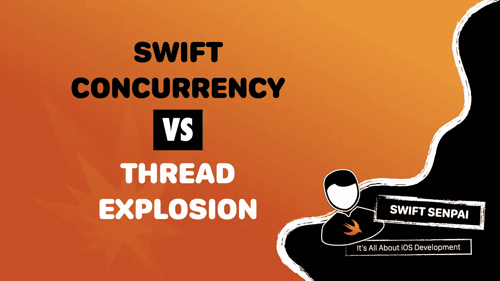
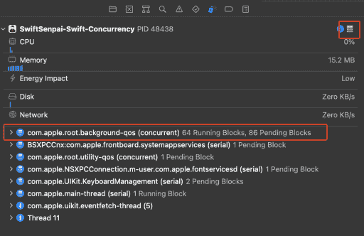
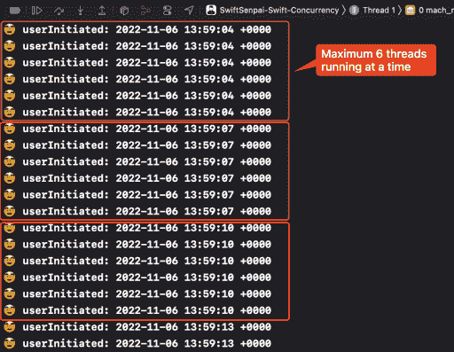
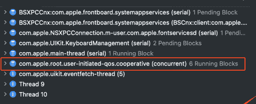
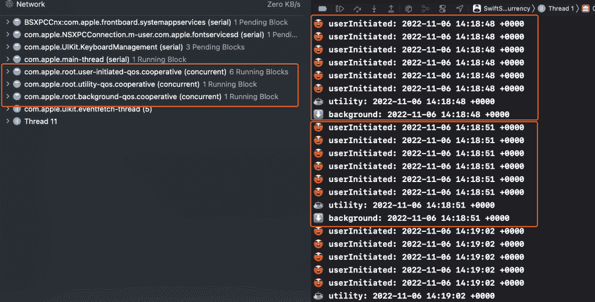
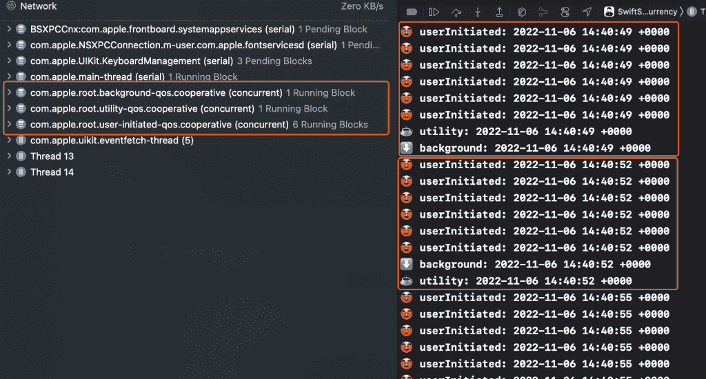
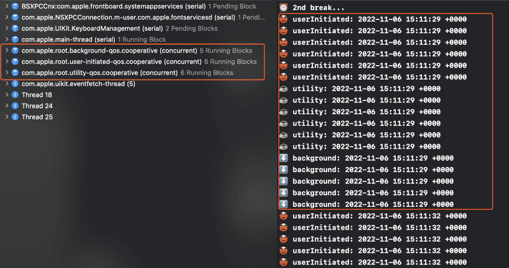

# 如何通过快速并发避免线程爆炸

> 原文：<https://betterprogramming.pub/how-does-swift-concurrency-prevent-thread-explosions-40b3140d1b56>

## 我发现的东西相当迷人！

几周前，我读了 Wojciech Kulik 的一篇文章，他谈到了 Swift 并发框架中的一些陷阱。在其中一节中，Wojciech 简要地提到了线程爆炸，以及快速并发如何通过限制我们过度使用多于 CPU 内核的线程来防止它的发生。

这让我很好奇……真的是这样吗？这在幕后是如何工作的？我们能设法欺骗系统来创建比 CPU 内核更多的线程吗？

我们将在本文中回答所有这些问题。所以事不宜迟，让我们直接开始吧。

# 理解线程爆炸💥

那么，什么是线程爆炸呢？线程爆炸是指大量线程在系统中并发运行，最终导致性能问题和内存开销。

对于多少线程被认为是太多，没有明确的答案。作为一个通用基准，我们可以参考这个 [WWDC 视频](https://developer.apple.com/videos/play/wwdc2021/10254/?time=514)中给出的例子，根据这个例子，一个系统运行的线程数是其 CPU 内核数的 16 倍，就被认为正在经历线程爆炸。

因为 Grand Central Dispatch (GCD)没有防止线程爆炸的内置机制，所以使用调度队列创建一个机制非常容易。考虑以下代码:

一旦执行，上面的代码将产生总共 150 个线程，导致线程爆炸。这可以通过暂停执行并检查调试导航器来验证。

显示线程展开的调试导航器

既然您已经了解了如何触发线程爆炸，让我们尝试使用 Swift 并发执行相同的代码，看看会发生什么。

# 并发管理线程的速度有多快

众所周知，Swift 并发中有 3 个级别的任务优先级，主要是`userInitiated`、`utility`和`background`，其中`userInitiated`优先级最高，其次是`utility`和`background`优先级最低。因此，让我们继续相应地更新我们的`HeavyWork`类:

每次创建任务时，我们都会打印出创建时间。然后我们可以用它来想象场景背后发生的事情。

更新后的`HeavyWork`类就绪后，让我们开始第一个测试。

## 测试 1:创建具有相同优先级的任务

这个测试基本上与我们之前看到的调度队列示例相同，但是我们将使用 Swift Concurrency 中的`Task`来创建一个线程，而不是使用 GCD。

以下是从 Xcode 控制台捕获的日志。

快速并发，一次最多运行 6 个线程

正如你所看到的(从任务创建时间来看)，线程的创建在线程数达到 6 时停止，这与 my6 核 iPhone 12 的 CPU 核数完美匹配。只有在其中一个正在运行的任务完成执行后，任务的创建才会继续。因此，一次最多只能有 6 个线程同时运行。

> 注意:
> 
> 无论选择什么设备，iOS 模拟器总是将最大线程数限制为 1。因此，确保使用真实设备运行上述测试，以获得更准确的结果。

为了更清楚地了解幕后到底发生了什么，让我们暂停执行。

在并发队列中运行的优先级为“用户启动”的任务

似乎我们刚才看到的一切都是由一个名为“*com . apple . root . user-initiated-QoS . cooperative*”的并发队列控制的。

基于上述观察，可以有把握地说，这就是 Swift 并发防止线程爆炸发生的方式:拥有一个专用的并发队列来限制线程的最大数量，使其不会超过 CPU 核心。

## 测试 2:一次从高到低创建任务

现在，让我们深入一点，向测试中添加不同优先级的任务。

注意，我们首先创建优先级最高的任务(`userInitiated`)，然后是`utility`和`background`。根据我们之前的观察，我期望看到 3 个队列，每个队列中有 6 个线程并发运行，这意味着我们将看到总共产生 18 个线程。令人惊讶的是，事实并非如此。看看下面的截图:

从高到低优先级同时开始时的任务分配

如您所见，当高优先级队列(`userInitiated`)饱和时，`utility`和`background`队列都将允许的最大线程数限制为 1。换句话说，我们在这个测试中可以拥有的最大线程数是 8。

这是一个非常有趣的发现！使高优先级队列饱和会以某种方式抑制其他低优先级队列产生更多线程。

但是，如果我们颠倒优先级的顺序，会发生什么呢？让我们来了解一下！

## 测试 3:一次创建从低到高优先级的任务

首先，让我们更新执行代码:

结果来了:

从低到高优先级同时开始时的任务分配

我们得到的结果和“测试 2”一模一样。

看起来系统足够聪明，即使我们先启动优先级最低的任务，它也会让优先级较高的任务先运行。最重要的是，系统仍然限制我们创建 8 个以上的并发线程，因此我们仍然不能为这个测试创建一个线程爆炸。干得好苹果！👍🏻

## 测试 4:从低到高优先级创建任务，中间有间隔

在现实生活中，我们不太可能同时开始一堆不同优先级的任务。因此，让我们通过在每个 for 循环之间添加一个小的中断来创建一个更真实的条件。请注意，在这个测试中，我们仍然使用从低到高的顺序。

我们得到的结果很有趣。

从低到高优先级开始，中间有间隔时的任务分配

如您所见，在第二次中断后，所有 3 个队列都在运行多线程。似乎如果我们首先启动低优先级队列并让它运行一段时间，高优先级队列就不会抑制低优先级队列的性能。

我已经执行了几次这个测试，线程的最大数量可能会有一点变化，但它或多或少等于 CPU 内核的 3 倍。

这算不算线程爆炸？

我不这么认为，因为线程数是 CPU 内核数的 3 倍仍然比我前面提到的 16 倍的阈值要低。事实上，我认为苹果故意让这种情况发生，以便在执行性能和多线程开销之间取得更好的平衡。如果你有其他观点，请在[推特](https://twitter.com/Lee_Kah_Seng)上联系我，我真的很想听听你的想法。

# 结论

Swift concurrency 在防止线程爆炸方面做得非常好，但是我们不能否认这样一个事实，如果我们继续使`userInitiated`队列饱和，它将会导致一个非常严重的瓶颈(我将很快深入探讨这个问题，敬请关注)。

基于我们在“测试 4”中得到的结果，可以肯定地说，我们应该更经常地使用`background`和`utility`队列，并且只在必要的时候使用`userInitiated`队列。

想尝试一下示例代码吗？给你！

如果您喜欢这篇文章，请务必访问我的网站，查看其他与 Swift 并发相关的文章。你也可以在[推特](https://twitter.com/Lee_Kah_Seng)上关注我，这样你就不会错过我即将发布的任何文章。

感谢阅读。