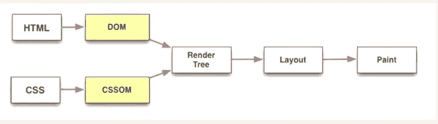
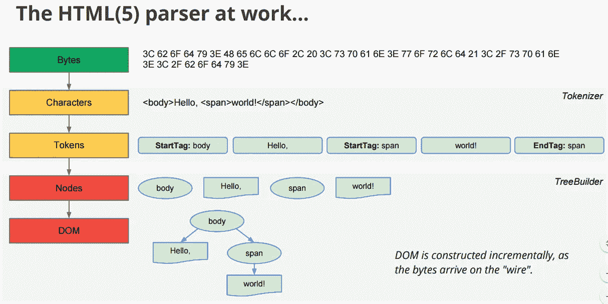
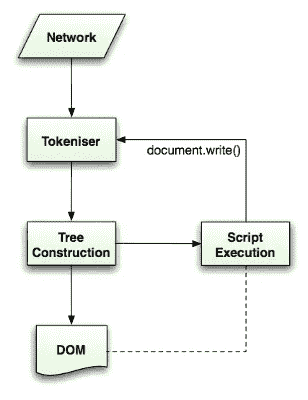

# 浏览器如何渲染网页？

> 原文：<https://betterprogramming.pub/how-does-the-browser-render-a-webpage-75cdb53ba49d>

## 理解浏览器的内部工作方式以及它们一直在做的事情:DOM、CSSOMs、渲染树、布局和绘画


[Hanson Lu](https://unsplash.com/@hansonluu?utm_source=medium&utm_medium=referral) 在 [Unsplash](https://unsplash.com?utm_source=medium&utm_medium=referral) 上的照片

我从 2018 年开始专业做网站，贡献了很多基于网络的应用。问题是，我在一个非常小的范围内工作，在这个范围内，事情没有我现在工作的范围那么重要。

我的拉动式请求在工作中经历了许多变化，这让我感到沮丧。有一天，我决定解决浏览器如何呈现 HTML 页面的秘密，并使用它来编写更好的 CSS、HTML 和 JS。

为了在网上创造流畅的体验，你需要了解浏览器是如何工作的。要呈现页面，当您访问网站时，浏览器需要遵循许多步骤:

1.  查阅你的资源。
2.  在服务器和客户端之间创建连接。
3.  增量下载资源。
4.  解析 HTML。
5.  解析 CSS。
6.  创建 DOM。
7.  创建 CSSOM。
8.  从 DOM 和 CSSOM 创建渲染树。
9.  开始页面布局，然后绘画。



来源:[https://www . html 5 rocks . com/en/tutorials/internals/howsbrowserswork/](https://www.html5rocks.com/en/tutorials/internals/howbrowserswork/)

我们将从第 3 点开始深入理解浏览器是如何工作的。

# 下载资源

当在服务器和客户机之间建立 TCP 连接时，数据以小块的方式递增发送。为了理解这一点，让我们举个例子:

假设这是你要做的 app。您有一个类似于这样的`style.css`样式表:

您可能希望这在纳秒内呈现，但是如果您了解浏览器的内部工作方式，您就会理解这些问题——并且您可能是提出解决这些问题的解决方案的人。

有几件事要记住:

1.  HTML 是增量呈现的。最好将 HTML 响应流式传输到客户端，而不是等待整个页面准备就绪。(spa 就不是这样了。)
2.  CSS 是渲染阻塞的。尽快把 CSS 放到浏览器里。

当我们开始接收 HTML 时，我们开始解析它。这看起来很简单，但是它有很多复杂性。假设它遇到下面这条线:

```
<link rel="stylesheet" href="style.css">
```

它将停止解析 HTML 并发出请求调用来获取文件。它会下载文件并解析文件。同样的情况也发生在`<script>`标签上。没有 CSS，浏览器不会呈现页面。如果是这样，它会显示一个难看的页面，当 CSS 无法加载时，您可能已经看到了。

这就是你把 CSS 链接放在头部的原因，因为没有 CSS 的页面看起来很糟糕。如果你的脚本标签在底部，就在结束的 body 标签的正上方，它们不会打断页面的呈现，你可以在页面上看到一些东西来吸引用户。

对于我们的例子，我们已经下载了资源，或者我们已经开始将 HTML 流式传输到浏览器。让我们看看接下来会发生什么。

# 解析 HTML 和 CSS

解析 HTML 基本上是对 HTML 的每一部分进行标记，使之有意义。HTML 解析器非常宽容，倾向于自己完成很多事情，比如插入缺少的结束标记等等。

在 HTML5 之前，没有构建 DOM 的标准，所以不同的浏览器最终会得到不同外观的 DOM。现在大家都按照标准来。这里有一个 HTML 解析的例子:



来源:[https://developers . Google . com/web/fundamentals/performance/critical-rendering-path/render-tree-construction](https://developers.google.com/web/fundamentals/performance/critical-rendering-path/render-tree-construction)

在这一步之后，我们最终得到了一个 DOM 树。我们仍然有一个显示给最终用户的空白屏幕。

CSS 不像 HTML。由于其级联属性，不能对其进行增量解析。它必须被解析一次，所以要记住你在初始加载时发送的 CSS 的大小。解析完 CSS 之后，我们就有了一个 CSSOM。现在让我们进入下一步，创建一个渲染树。

# 渲染树


来源:[https://developers . Google . com/web/fundamentals/performance/critical-rendering-path/render-tree-construction](https://developers.google.com/web/fundamentals/performance/critical-rendering-path/render-tree-construction)

渲染树省略了所有不需要的节点，比如`display:none`、`<script>`、`<meta>`。

你可能遇到的一个重要区别是`display:none`和`visibility: hidden`。渲染树不包含带有`display: none`的节点，但包含了`visibility:hidden`。

这张图片给出了一个清晰的例子，展示了如何将 DOM 和 CSSOM 合并在一起创建一个渲染树。这是浏览器开始布局节点之前的最后一步。

# 布局

我们还没有在屏幕上画任何东西。在这一步中，我们将计算树中节点的大小和位置。它非常擅长它所做的事情，所以这里没有什么可探索的。我们将在接下来的部分中研究这个问题。

# 绘画

布局完成后，我们最终开始在屏幕上绘制像素。这是我们开始在浏览器上看到东西的地方。

# 丢了什么吗？

我们已经经历了很多，但是我们缺少现代 web 应用程序最重要的部分:JavaScript。*JS 如何融入整个画面？让我们进一步探索。*

*每当我们遇到一个`<script>`，解析就完全停止。我们获取文件，解析文件，运行 JavaScript，然后继续一点一点地解析 HTML。如果我们在脚本中使用`document.write()`，解析将再次开始。下图可以更好地解释这一点。*

**

*JS 执行，来源:[https://www . html 5 rocks . com/en/tutorials/internals/howsbrowserswork/](https://www.html5rocks.com/en/tutorials/internals/howbrowserswork/)*

*这就是为什么人们倾向于将脚本放在结束 body 标签的上方。这样，所有的解析都已经完成，文档节点可以通过 JavaScript 获得。*

# *结论*

*现在，您对浏览器的工作原理有了一个大致的了解。现在，您可以更深入地研究如何以最佳方式构建代码，并避免所有的反模式。*

# *资源*

*   *[告别要点](https://gist.github.com/faressoft/36cdd64faae21ed22948b458e6bf04d5)*
*   *[developer.google.com](https://developers.google.com/web/fundamentals/performance/critical-rendering-path)*