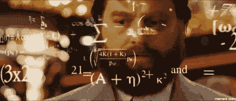
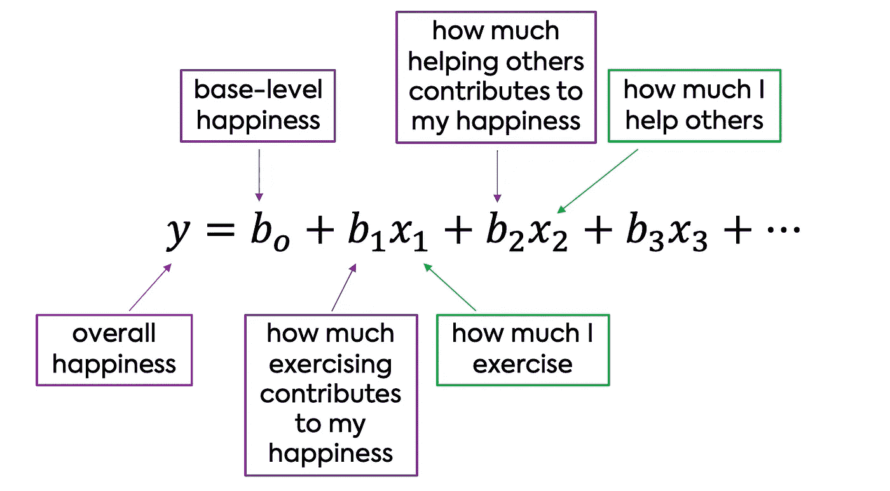
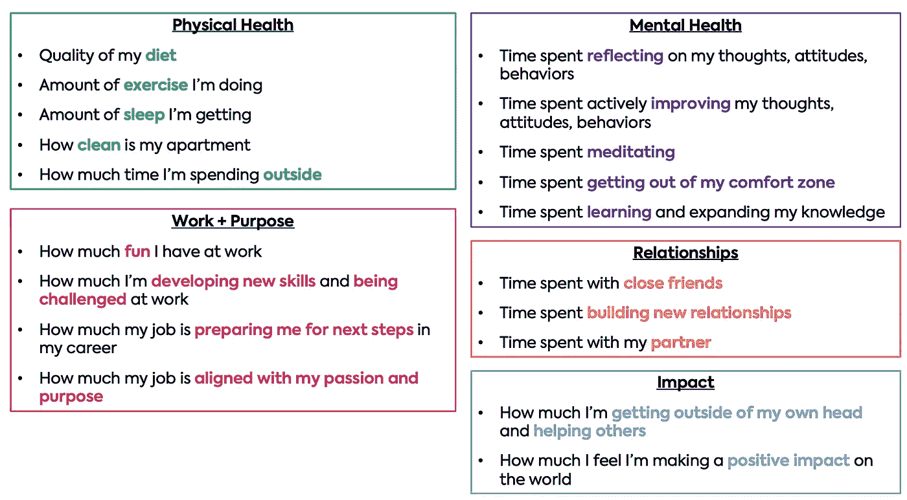
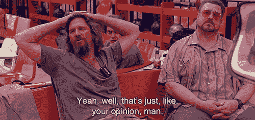

# 工程学如何教会我比治疗更好地管理自己的情绪

> 原文：<https://betterprogramming.pub/how-engineering-taught-me-to-manage-my-emotions-better-than-therapy-4faf8c533e69>

## 幸福的解决问题框架。

在 [Unsplash](https://unsplash.com/s/photos/emotions?utm_source=unsplash&utm_medium=referral&utm_content=creditCopyText) 上由 [Lidya Nada](https://unsplash.com/@lidyanada?utm_source=unsplash&utm_medium=referral&utm_content=creditCopyText) 拍摄的照片

今年夏天，我开始和我见过的一些[最聪明的年轻人](https://theksociety.com/students/)一起工作。

他们飞往世界各地发表关于创新和新兴技术的主题演讲。他们[因创立指数公司而被全球品牌](https://theksociety.com/news/awards/vogue-riya-karumanchi-october-2019/)认可，他们[在世界上最具影响力的公司担任机器学习开发人员](https://globalnews.ca/news/4932115/ananya-chadha-brain-controlled-technology/)——18 岁之前都是如此。

今年早些时候，我在多伦多接受培训时遇到了他们中的许多人。在我们一对一的会谈中，几乎所有人都问过我一个问题:

“海莉，你是怎么变得如此热情和自信的？你一直都是这样吗？”

对此我会回答:

“不，我肯定不是一直这样。你眼前所看到的是我多年来推导和验证我个人的多元幸福方程式的结果😄."

# 好吧，好吧…我知道你在想什么

但是请听我说完。

我不是每天都特别开心，特别自信。大多数时候，我在这方面感觉不是 100%。事实上，今年夏天，当我被如此频繁地问到这个问题时，我有点吃惊。在过去的十年里，建立可持续的自尊和快乐一直是我生活的基石。

在我的生活中有两个关键时刻引导我建立了我的幸福方程式。

# 🔑时刻# 1

## 我发现实现自己的幸福是可能的

当我十几岁的时候，我的自我价值几乎不为零。过多的经历把我带到了一个令人难以置信的低谷，谢天谢地，我再也没有回来过。

在我情绪最低落的一天，当我自我感觉特别糟糕的时候，一个女人问我，“海莉，你到底想要什么？”

在把所有的废话都浓缩之后，我对她说:“我只想开心。”

那时，我从根本上相信我永远不会对自己满意。于是她说:“好吧，那你也没什么损失了！按照我向你展示的过程，放下你所有的期望，最坏的情况是，你又回到了起点。”

很难否认。

所以我就是这么做的。我花了整整两年的时间专注于一件事，而且只专注于一件事。我人生中第一次明白了如何实现自己的幸福。

吸取的教训💪。我能做到！

# 🔑时刻# 2

## 我去了工程学校

一晃几年过去了，大三的时候，我从大学转到了哥伦比亚大学，攻读化学工程学位。

我在这个国家的另一边离开了我最好的朋友，我参加了一个更难的项目，这是我一生中第一次在学业上挣扎。当我在一门课上得了 B --时，我的自尊心彻底垮了。我意识到我在学术成就上押了多少自我价值。我所认为的自尊的坚实基础，实际上只是一个纸牌屋。我又一次处于低谷。

后来有一天，在我的化学动力学课上，我们在解线性方程组，寻找化学反应的速率。在反应动力学中，任何时间点的产物量简单地是不同反应物的浓度乘以它们各自的速率常数的线性组合。

当我半听半想的时候，我终于明白了一些事情。我想，天哪，如果我可以用解这些方程的同样方法来解我自己的幸福会怎么样呢？如果我能把快乐归结为一个定制的身体、精神和情感投入的等式，会怎么样？

繁荣💥

短短几个月内快乐 10 倍

对于像我这样过度思考的人来说，这是革命性的。从那时起，我开始把我作为化学工程师学到的解决问题的框架应用到我的情绪中，我开始把我的快乐当成一个大的优化问题。

吸取的教训👩‍🔬:我可以建立一个系统的框架来保持和改善我的情绪健康。

# 构建幸福的多元方程

意识到这一点后，我开始定义我的方程式。因为我有一个很好的优化问题，我开始尝试如何用多元线性回归模型来预测我的自我价值和快乐。

这里的关键是从科学家的角度，而不是从治疗师的角度来看待我的情绪反应。这种心态使我能够客观地评估在我追求快乐的过程中什么是有效的，什么是无效的。

## 先不说数学

运行线性回归的数学细节对于建立情感框架并不重要。你需要知道的只是一些基础知识。

[多元线性回归](https://towardsdatascience.com/understanding-multiple-regression-249b16bde83e)解释了一个因变量或目标变量(y)与两个或更多自变量(x1，x2，x3，…)之间的关系。

这些独立变量中的每一个都有一个系数或权重，与它们相关联(b1，b2，b3，…)。)表示该变量对预测结果(y)的重要性。

幸福的多元线性回归

幸福的组成部分:

*y* =总体幸福感

*b0* =基本水平的快乐——也就是说，你不做任何事，自然会有多快乐

*x1，x2 等。* =投入量——即你花了多少时间锻炼，花了多少时间冥想，或者你的工作有多少与你的激情相符

*b1、b2 等。* =每项投入对你整体幸福感的贡献

希望你能从高层次上理解我的想法。接下来，我将深入四个简单但不一定容易的步骤，来发展你自己的自我实现方程式。

# 第一步:定义你的幸福

幸福是一个宽泛的术语，它对每个人都有不同的含义。

为了给自己推导出一个有用的等式，你需要了解你最快乐的时候是什么感觉。对我来说，我意识到这与成功感直接相关。

进一步来说，我在以下情况下会感到成功和快乐:

1.  我醒来的时候会感到一天真正的兴奋
2.  在我的脑海中有清晰的、令人满意的目标
3.  我知道我需要做什么来实现这些目标，我相信我自己能够实现这些目标
4.  我不断地成长、学习和挑战自己
5.  我与朋友和家人有着牢固的爱情关系
6.  我在帮助他人，对世界产生积极的影响

请注意，无论是金钱还是成就都不在这个清单上！当我第一次开始这段旅程时，我以为这些东西会是我幸福的基石。剧透:我大错特错了。

想想你生命中最快乐的时光，深入挖掘为什么你在那些时刻感到如此充实。我说的不是短暂的、一次性的快乐时刻；我说的是持续的自信、内心平静和目标感。

如果你从未有过这种感觉，没关系！想象一个最理想、最实用的自己。这是一个完全接受他们的自己的版本。你认为是什么让他们感到快乐和满足？

当你实验时，如果你对自己保持好奇，你会发现什么对你来说是重要的。我个人是从零开始的，之所以成功是因为我不懈地致力于弄清楚如何快乐。

# 步骤 2:确定你的输入

我将我的变量分为 5 类:

1.  体格健康
2.  心理健康
3.  工作+目的
4.  关系
5.  影响

为了节省空间，请查看下面我的变量👇

现在，你可能会想，亲爱的上帝！太多了，海莉。

对此我要说:

我明白了。再说一遍，这完全是个人实验。任何了解我的人都知道我喜欢深入挖掘本质细节，所以最好保持在高水平。去找出什么对你有用！

如果你不知道从哪些变量开始，那就去约你认识的三个最快乐、最自信的人喝杯咖啡，问问他们是如何保持心态的！

从那里开始，然后添加和删除变量，这样你就能更多地了解是什么让你成功了。

# 第三步:找出每个变量的重要性

这是我最喜欢的部分！！😍

这就是为什么我喜欢把我的快乐分解成几个部分。当你获得关于你自己的新数据或者当你的生活环境变得不一样时，权重(系数)可以改变。这让你更容易适应生活抛给你的一切。

例如，现在我和另一半共度时光的系数基本为零，因为我在这方面没有任何前景。我们在这里冷静😎。

作为另一个例子，我帮助别人的系数比以往任何时候都低。这是因为我从目前的工作中获得了满足感，指导了 65 名不可思议的天才高中生。

因此，我不需要像过去那样在工作之外做太多的事情来帮助别人。它被合并到其他变量中，我们现在不想要[多重共线性](https://www.statisticssolutions.com/multicollinearity/)，不是吗？数学笑话。

# 步骤 4:重复步骤 1-3！

迭代，迭代，迭代！

我对自己了解得越多，我的方程式就变得越多。对我来说，这是一个长达数年的过程，我保证我的等式将在我的一生中继续发展。即使在过去的 6 个月里，我的输入和系数也发生了巨大的变化。

但这就是这个框架的美妙之处。

你对自己越客观地好奇，你收集的关于什么让你有目标感的数据越多，你就越能调整等式来优化你自己的幸福。

所以尝试新事物吧！生活是循环的，幸福不是永恒的。每当我认为我已经想通了一切，我将不可避免地经历另一次低迷，挑战我对幸福和成功的所有信念。然后我会重新设计我的方程式。

即使当我感觉最好的时候，我也经常努力遵循自己的建议，而且完全诚实地说，我几乎从来没有十分之一的快乐或自信。

但是因为我一直试图优化我的幸福框架，每次我经历艰难的事情时，我不会跌得太多，也不会停留太久。