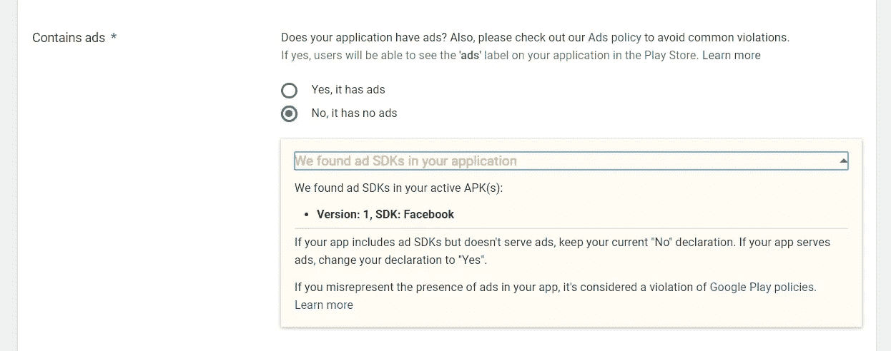
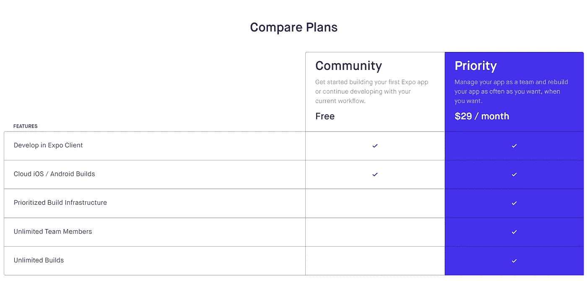

# 世博会是如何愚弄所有人的

> 原文：<https://betterprogramming.pub/how-expo-is-fooling-everyone-adf7f34d7528>

## 使用 Expo 不向开发人员展示的隐藏“宝石”

照片由[菲南阿克巴](https://unsplash.com/@finan?utm_source=medium&utm_medium=referral)在 [Unsplash](https://unsplash.com?utm_source=medium&utm_medium=referral) 上拍摄

React Native 已经出现了一段时间，并且积累了相当多的追随者。仅仅看一下 GitHub 库，数字就令人震惊:

看看这些数字

有了框架本身，一个新的工具也被创造出来，叫做[博览会](https://expo.io/)。现在，您可能会在这一点上感到困惑，因为 React Native 和 Expo 之间的差异并不明显。

基本上，Expo 是 React Native 之上的一个模糊层，允许用户构建应用程序，而不必真的编写本机代码。

它本质上是一个 SDK(软件开发工具包),通过向开发人员公开本机组件和各种库，简化了开发本机应用程序的过程。它还有一个内置的 CLI(命令行界面)，允许各种操作(创建、日志、发布)。

所以，我们知道 React Native 是由脸书开发的，但 Expo 应该与它没有任何联系，对吗？

这就是事情变得有趣的地方，因为有许多隐藏的“宝石”没有向使用 Expo 的开发人员展示。

如果您已经使用 Expo 开发并发布了一个应用程序，这可能不会让您感到惊讶。但是，如果您正在考虑这样做，您需要了解我将在本文中介绍的“特性”。

# 完全公开

如果你去世博会的网站，点击链接，你会看到一个标题为 [*为什么不去世博会？*](https://docs.expo.io/versions/latest/introduction/why-not-expo/) 。

在文档中，给出了不应该使用 Expo 的各种原因:

*   对所有类型的后台代码执行的支持是有限的。
*   增加的应用程序大小。
*   使用与 Expo 不同的推送通知服务。
*   支持的操作系统的最低版本。

看起来很合法，对吧？他们愿意向我们展示他们的名片，并分享他们工具的一些缺点。

对你来说这是诚实。

问题是，他们没有亮出他们所有的底牌，我来这里是要让他们亮出底牌。

# 脸书 SDK

您将使用 Expo 开发的每个应用程序都将包含脸书 SDK。

如果这没有吓到你，应该会的。没有理由明确地将脸书的 SDK 推给一个应用程序(有人说是手电筒吗？)而这背后的原因在我看来并不无辜。

众所周知，脸书是一家数据驱动的公司，还有什么更好的方法来收集数据呢？使用 Expo 时应用程序很大是有原因的，包括脸书的 SDK 就是其中的一部分。

我是怎么偶然发现这个的？当我将 Expo 应用程序发布到 Google Play 商店时，系统通知我，虽然我已经标记了我的应用程序不包含广告，但它确实包含脸书的 SDK。

你说什么

如果这对您来说仍然不令人担忧，那么考虑一下开发一个应用程序并且不知道有人在您不知情的情况下向代码库插入了一些东西的想法。

# 广告？谁说广告了？

除了前一点，Expo 应用程序还会收集大量的用户数据。如果公开声明，这可能没问题，但目前的现实是，这种情况发生时没有让开发人员知道。

特别是，所有 Expo 应用程序都从用户那里收集[广告 ID](http://www.androiddocs.com/google/play-services/id.html) 。

为什么这是一个问题？

如果我们忽略对开发者隐瞒这一事实，这也使得 Expo 应用的发行商违反了[谷歌的开发者分发协议](https://play.google.com/about/developer-distribution-agreement.html)。特别是违反 Android 广告 id 政策和第 4.8 节的使用。

引用第 4.8 节:

> “您同意，如果您通过 Google Play 提供您的产品，您将保护用户的隐私和合法权利。如果用户向您提供或您的产品访问或使用用户名、密码或其他登录信息或个人信息，您同意让用户知道您的产品可以使用这些信息，并且您同意为这些用户提供法律上充分的隐私声明和保护。此外，您的产品只能将该信息用于用户允许您使用的有限目的。如果您的产品存储了用户提供的个人信息或敏感信息，您同意安全地存储这些信息，并且仅在需要时存储。但是，如果用户选择与您签订单独协议，允许您或您的产品存储或使用与您的产品直接相关的个人或敏感信息(不包括其他产品或应用程序)，则该单独协议的条款将约束您对此类信息的使用。如果用户向您的产品提供 Google 帐户信息，您的产品只能在用户允许您访问该用户的 Google 帐户时使用该信息，并且只能用于有限的目的。”

如果您正在收集有关用户的数据，您必须为您的应用程序提供隐私策略。

但是，如果你不知道这一点，你的应用程序将从 Google Play 商店中删除，并且你会收到一封来自 Google 的可怕的电子邮件。

再说一次，大多数开发者甚至不知道 Android 的广告 id 是什么，所以这是 Expo 使用的一个相当糟糕的策略。

# 获得 APK/国际音标

要获得应用的 APK/IPA，您必须使用 Expo Dev Tools 中的*发布*按钮，或者使用 CLI 并运行命令`expo publish`。

关于这个过程，他们没有告诉你的是，无论你的原始应用程序的大小，这一步可能需要很长时间。多久了？一个多小时。

相比之下，在 Android Studio/Xcode 中创建一个 APK/IPA，你不会明白为什么要花那么长时间。

现在，世博会的前提是免费的。甚至在他们的 [FAQ](https://docs.expo.io/versions/latest/introduction/faq/) 中也有说明。但是，你会注意到，当构建运行并且花费太长时间的时候，你会得到一个提示来升级(意思是，付费)Expo 中的一个高级服务，这将使你的构建运行得更快。

世博会开发商服务

这个链接将带你到一个名为[*Expo Developer Services*](https://expo.io/developer-services)的页面，每月花费 29 美元，可以让你的构建时间更快(以及其他服务)。

我不反对 Expo 从服务中赚钱，也不反对高级服务的概念，但当开发人员的构建时间太长时通知他们这个选项似乎是不太好的。

# 结论

到目前为止，你可能会认为我对世博会有某种怨恨，但说实话，我没有。

他们为开发者建立了一个很棒的工具，它是免费的，允许更多的人进入移动应用开发世界。

类似于生活中大多数免费的东西，你不能认为其背后的动机是清白的。生活中没有什么是没有缺点的，作为一名开发人员，了解这些缺点也是很重要的。

所以，下一次你在寻找一个免费服务的时候，在你把它添加到你的项目之前，请三思。