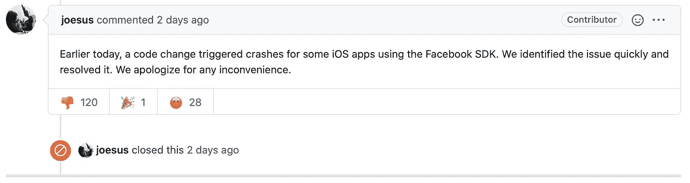
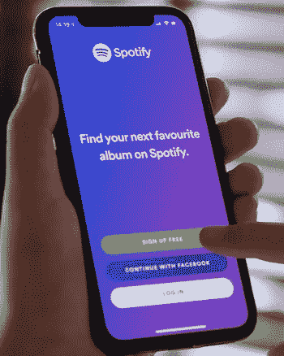
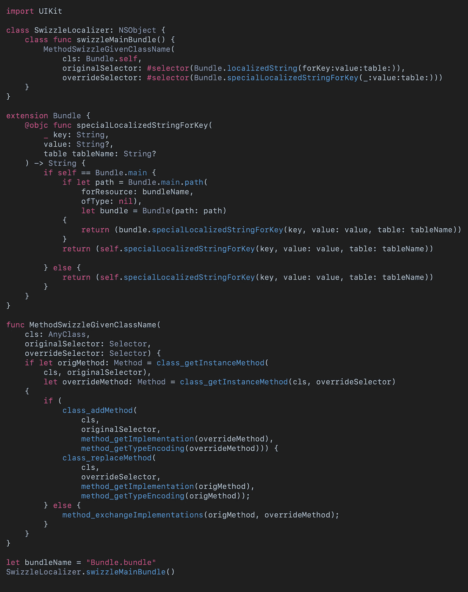

# 脸书如何搞垮 Spotify:一位 iOS 开发者的解释

> 原文：<https://betterprogramming.pub/how-facebook-broke-spotify-an-ios-developers-explanation-69b828b95804>

## 对 Spotify、Pinterest 或 Waze 没有帮助的代码

亚历克斯·哈尼在 [Unsplash](https://unsplash.com?utm_source=medium&utm_medium=referral) 上的照片

这不仅仅适用于 Spotify。本周，Pinterest、Waze 和许多其他应用程序开始崩溃。

在本文中，我们将研究原因，以及导致这种情况的代码类型。

# 原因

脸书[承认](https://developers.facebook.com/status/issues/1739188102911114/)7 月 10 日星期五【FBSDKEventDeactivationManager updateDeactivatedEvents】中的代码变更[导致使用 iOS SDK 的崩溃数量激增](https://developers.facebook.com/support/bugs/329763701368293/)

[https://github.com/facebook/facebook-ios-sdk/issues/1427](https://github.com/facebook/facebook-ios-sdk/issues/1427)

他们很抱歉，所以这看起来像是结案了。当然，开发人员需要考虑为什么会发生这种情况，这样他们就可以选择是否在未来使用像脸书 SDK 这样的东西。

# Spotify 为什么要用脸书的 SDK？

对大多数人来说，Spotify 似乎做了一件蠢事，当然，它与脸书没有面向消费者的联系，但当你打开 Spotify 时，你会看到:

图片由作者提供。

你能看见它吗？

图片由作者提供。

使用一个简单的按钮会导致应用程序停止运行吗？

答案是肯定的。

# 问题是

用户希望使用他们现有的脸书登录来访问服务。

作为他们[平台政策](https://github.com/expo/expo/issues/3230)的一部分，你必须使用 developer SDK，你不能简单地使用 OAUTH 而没有收回脸书服务的风险。

这意味着如果你想使用那个讨厌的按钮，你需要将脸书软件开发工具包整合到你的应用程序中，这意味着当你启动应用程序时，他们会使用一些必需的方法，这意味着没有简单的方法来关闭软件开发工具包。

# 痛饮？

方法 swizzling 在运行时改变选择器的实现。

我之前实现了一些代码，这些代码支持更改将在应用程序中使用的本地化包。

[点击查看要点](https://gist.github.com/stevencurtis/102fa540db6835d987944ef18766cc2f)

这意味着任何引用`localizedString(forKey:value:table:)`的代码都将指向`specialLocalizedStringForKey(**_**:value:table:))`,后者具有完全不同的实现。

一旦你痛饮，就没有回头路了。如果你使用的方法有问题，你的应用程序将无法运行

问题？swizzled 是危险的，如果你使用了一个 swizzled 方法而没有意识到它，功能可能已经改变，你不再得到你期望的功能。

# 所以…

脸书正在重组`UIButton`，和其他的[重组](https://github.com/facebook/facebook-ios-sdk/search?q=swizzle&unscoped_q=swizzle)他们的 SDK。

现在只需轻轻搅动`UIButton`，他们就能以意想不到的方式改变你的应用程序的行为，也许不是恶意的，但如果脸书的某人碰巧在他们的代码中犯了一个错误，作为一名开发者，你没有办法关闭它。

换句话说，如果 Spotify 没有使用`[UIButton](https://github.com/facebook/facebook-ios-sdk/search?q=swizzle&unscoped_q=swizzle)`并以某种方式破坏了它，看起来他们[加载了由强制`plist`控制的应用程序启动](https://github.com/facebook/facebook-ios-sdk/blob/91bfedba5e10184c7e8236148e6abe3a5cd1341c/FBSDKCoreKit/FBSDKCoreKit/FBSDKApplicationDelegate.m#L64)，任何开发者都无法关闭任何破坏了应用程序代码的东西，这是一场灾难！

# 脸书现在控制了应用经济吗？

这不仅仅包括“用脸书登录”功能的实现，开发者也经常使用脸书分析来收集他们用户的数据。

问题的一部分是，如上所述，一旦你使用了 SDK 的一个功能，就没有办法“关闭”那些你不使用的功能，可能会使你的应用程序崩溃，用户会责怪他们正在使用的应用程序公司，而不是他们一无所知的不透明 SDK。

# 结论

有其他选择吗？当然有，但最终这是一个关于在你的应用中使用第三方框架的警告，即使它们是由非常大的公司创建的。

每当你使用其他开发者的代码时，你都依赖于他们的质量控制和测试程序。你确定它们是符合标准的吗？你确定你正在按照预期的方式使用 SDK 和公共 API 吗？

警告是明确的，而且:这不是第一次发生在脸书 iOS SDK 用户身上。

一朝被蛇咬，十年怕草绳。

保持安全，小心编码。