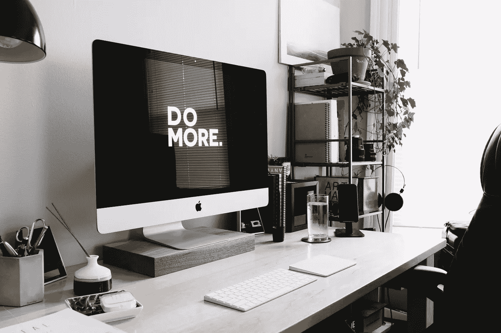
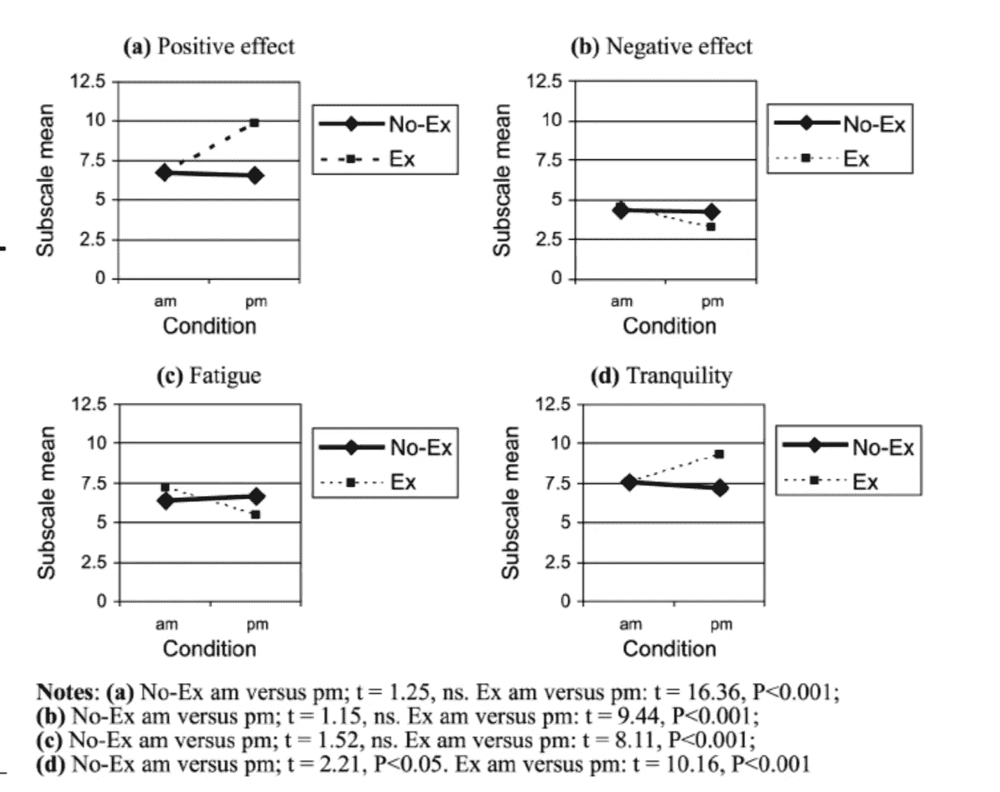

# 健身如何让我成为一名更好的网络开发人员

> 原文：<https://betterprogramming.pub/how-fitness-transformed-me-into-a-better-web-developer-ac51a2b08cb4>

## 运行以获得更好的运行时间

卡尔·海尔达尔在 [Unsplash](https://unsplash.com/search/photos/productivity?utm_source=unsplash&utm_medium=referral&utm_content=creditCopyText) 上拍摄的照片

> "一些最成功的人早上醒来的第一件事就是锻炼。"
> 
> 劳拉·凡德卡姆

如果你了解我，你可能听过我一两次谈论健身。好吧，我喜欢它，虽然我不是超级运动员，也不是健身模特；我只是把自己看作一个健身倡导者。即使在我参加熨斗学校的全栈软件工程项目时，我也优先安排时间进行某种锻炼或身体活动，因为我知道这对我的心智健全、思维清晰、遵守纪律和生产力管理至关重要。我甚至创建了两个网络应用程序[来帮助用户建立一个常规和健康的生活方式。需要注意的是，我并不是一直这样的(问问我父母就知道了)；大学毕业后，我发现了健身，它让我变成了今天的我。](http://rachelelum.com/personal-website)

锻炼是我成功过渡到软件开发的主要因素之一。在我深入研究锻炼如何让你成为一名更好的程序员之前，我将提供一点我在健康、生产力和代码方面的旅程的背景。

# **健身救了我**

> 我爱上了健身，但回想起来，我爱上了这段健身之旅对我的影响。

我偶然发现了健身。我毕业时获得了舞蹈学士学位，并渴望与当代舞蹈团一起表演。我报名参加了一家健身房，为的是在试演时保持身材，因为纽约的舞蹈课不便宜，也不容易去，而且我还在新泽西州的一家数学辅导中心兼职。

作为一个喜欢解决问题的人，这种情况需要改善。我总是在寻找更有效的做事方法。因此，尽管我很年轻很天真，我还是决定成为一名私人教练，通过和我的客户一起锻炼来节省时间(顺便说一句，我在这一点上大错特错，见[这里](https://twitter.com/lumrachele/status/1129221533342285831))，并通过在健身房工作获得报酬来节省我的健身房会员费用。此外，我认为我的舞蹈背景会让我成为一名优秀的教练，因为舞蹈是关于技巧和意图的。

在六个月的时间里，我读了一整本个人训练教材，做了大量笔记，阅读了无数文章，观看了数小时的教育视频，每天锻炼，练习我学到的任何新练习，并通过了个人训练考试。我爱上了健身，但回想起来，我爱上了这段健身之旅对我的影响。

很长时间以来，我第一次重新发现了自己对学习的热爱，并有了充分利用一天的新愿望。我建立了一个惯例:早起，锻炼，训练，辅导，放松，睡觉。我很高兴用新的锻炼来挑战我的身心，也喜欢结识新的人，包括其他教练、健身爱好者和新客户。下午，我仍然精力充沛，为繁忙的工作日做好了心理准备，向家长和老师发表演讲，辅导学生解决具有挑战性的数学概念。每天都很忙，但我对一整天的工作很满意。现在，让我们深入研究这一现象背后的原因。

> 提示 1:计划好你的一天
> 
> 我的意思是，真正计划好你一天的时间，甚至是几分钟，你会发现你有多少时间。你可以使用手机上的日历或书面计划，关键是让你的锻炼像会议或活动一样有价值。在弗里德曼的文章“定期锻炼是你工作的一部分”中，他说，当人们说他们没有时间锻炼时，这意味着他们没有优先考虑它。如果它能激励你在工作中做得更好，那么就把你的锻炼看作是另一项工作职责。通过锻炼，你为你的工作增加了大量的价值。

# **科学**

> “中等强度到高强度的锻炼可以提高注意力，增强记忆力，延长精神耐力，增强创造力，加快学习速度，减轻压力。”

健身融入我的生活后，我所经历的事情有一个科学的解释。毫不奇怪，锻炼对身体有很多好处，包括心血管健康、增强力量、增加骨密度和预防疾病。但可能不那么明显的是锻炼对认知的大量益处。

最近的研究(参考下文)表明，进行中等强度到高强度的锻炼可以提高注意力，增强记忆力，延长精神耐力，增强创造力，加快学习速度，减轻压力。在这项研究中，研究人员得出结论，即使是 15 分钟的中等强度的自行车运动，使用埃里克森侧翼任务也能取得更好的结果，这基本上是一种测量反应抑制和反应时间的测试。

[图一。锻炼日和非锻炼日的情绪量表](https://www.researchgate.net/publication/235275530_Exercising_at_work_and_self-reported_work_performance)

在生物学上，体育锻炼“诱导大脑的结构和功能变化”，导致“额叶和海马区灰质体积增加”以及“神经营养因子的释放……”，促进[神经可塑性](https://en.wikipedia.org/wiki/Neuroplasticity) ( [*“体育锻炼的影响……”，2018*](https://www.ncbi.nlm.nih.gov/pmc/articles/PMC5934999/) )。这与认知益处“提高记忆能力、注意力过程和执行控制过程的效率”相关。

偶尔喜欢听*句法，*一个 web 开发播客。在他们的剧集“远程工作时保持理智的 9 种方法”中，他们说一个人有能力集中注意力 90 分钟。超过这个时间会导致工作质量和思维清晰度的下降。建议在每 90 分钟的工作间隔后休息一会儿，呼吸一下新鲜空气，甚至进行一次短暂的锻炼。

例如，在英国利兹城市大学进行的这项研究根据自我报告的工作表现研究了工作中锻炼的效果。他们要求志愿者在工作日参加大约 30 到 45 分钟的锻炼，每周几次。这项研究的总体结果是，参与者在他们锻炼的日子里，在工作表现、社会互动和对轻微挫折的容忍方面感受到了积极的变化。

> 提示 2:找一项你喜欢做的活动
> 
> 无论是骑自行车，跳舞，交叉健身，足球，瑜伽，慢跑等。，你将更倾向于坚持你喜欢的事情，而不是让锻炼成为一件苦差事。我相信一个人在任何给定的时间内所能发挥的意志力是有限的，所以选择一项理想的活动可以为一天中的其他挑战保留你的意志力。此外，你将被激励继续在你的活动中取得更多成就。我个人喜欢创建基于表现的目标，因为看到人体有多大潜力真的很酷。

# **将认知优势与编写更好的代码联系起来**

> 锻炼可以提高记忆力，帮助你更彻底地剖析复杂的问题。

在构建我的 web 应用程序[项目](http://rachelelum.com/personal-website)的过程中，我发现前面提到的认知优势对于简化构建过程至关重要。测试、调试、定位你的代码在你庞大的文件树中的位置、应用逻辑和设计算法，然后记住你下一步要处理什么，这些都是很困难的工作。锻炼可以提高记忆力，帮助你更彻底地剖析复杂的问题。它会让你更愿意继续在工作中寻找解决方案。

作为一名网络开发人员，你最有可能和其他人一起工作，研究发现，参与者在锻炼的日子里有更多积极的社交互动。这有利于[的软件工程师调试](https://en.wikipedia.org/wiki/Rubber_duck_debugging)和与同事合作交流想法(查看我的[文章](https://medium.com/@lumrachele/finding-the-middle-ground-between-developers-and-ux-designers-5e24dbc78a1b)关于设计师和开发者之间的合作)。

很多时候，我缺乏开始一个项目和开始编码的信心，因为我害怕不知道在这个过程中会遇到什么问题。但像任何事情一样，第一步是开始，体育锻炼可以导致“自我效能、任务目标定向和感知能力[……]更好的情绪和自我概念”( [*“体育锻炼的效果……”，2018*](https://www.ncbi.nlm.nih.gov/pmc/articles/PMC5934999/) )。

> **技巧 3:破解你的潜意识**
> 
> 你知道你是怎么操作的。如果你像我一样，知道自己更倾向于在早上做事，那么就在早上做最累人的工作。我的信念是，当我醒来时，我几乎没有时间对任何事情形成看法。把你的想法放在一边，只需**做**就可以显著减少决策疲劳。所以在我一天的前几个小时，我锻炼身体，听播客，收拾房间，练习一些算法问题。我个人喜欢安静的早晨，因为那是我效率最高的时候。

# **结论**

照片由[伊万·托里斯](https://unsplash.com/@iavnt?utm_source=unsplash&utm_medium=referral&utm_content=creditCopyText)在 [Unsplash](https://unsplash.com/search/photos/fitness?utm_source=unsplash&utm_medium=referral&utm_content=creditCopyText) 拍摄

纳入日常锻炼可以在生产力和编程方面带来大量的好处。锻炼和编程都可以是冥想。无论是长期还是短期旅行，它们都是耐心、耐力和挑战自己最大潜力的练习。当你的代码没有像预期的那样工作时，或者如果你不能像上周一样举起同样的重量时，你很容易感到沮丧。如果你花时间去彻底思考，并耐心地对待一个项目，那么你会大大减少压力和粗心的错误。定义清晰的目标和意图，在代码中，在健身中，在生活中。确定你需要采取哪些小步骤来实现你的目标。小心考虑小的障碍。坚持不懈，相信这个过程。过程比结果更有价值。

## 资源

[“远程工作时保持理智的 9 种方法”——语法播客](https://depts.washington.edu/bhdept/facres/CurrSports%20Med%20Reports.pdf)

[“定期锻炼是你工作的一部分”——罗恩·弗里德曼博士，HBR](https://hbr.org/2014/10/regular-exercise-is-part-of-your-job)

[“工作中的锻炼和自我报告的工作表现”——调查研究](https://www.researchgate.net/publication/235275530_Exercising_at_work_and_self-reported_work_performance)

[“锻炼对年轻人和老年人的情感和认知有立竿见影的效果”——调查研究](https://www.ncbi.nlm.nih.gov/pmc/articles/PMC3768113/)

[“体育锻炼对认知功能和健康的影响:生物和心理益处”——调查研究](https://www.ncbi.nlm.nih.gov/pmc/articles/PMC5934999/)