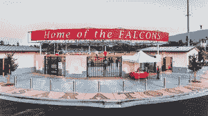
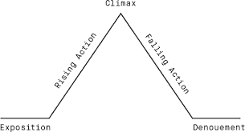
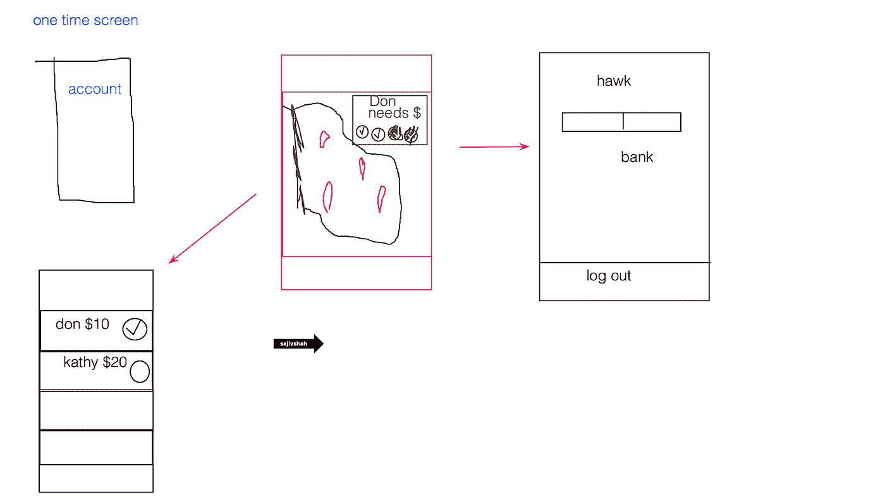
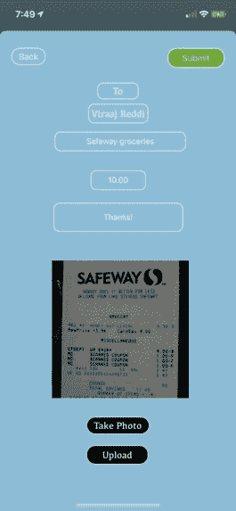
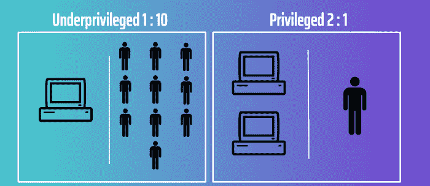
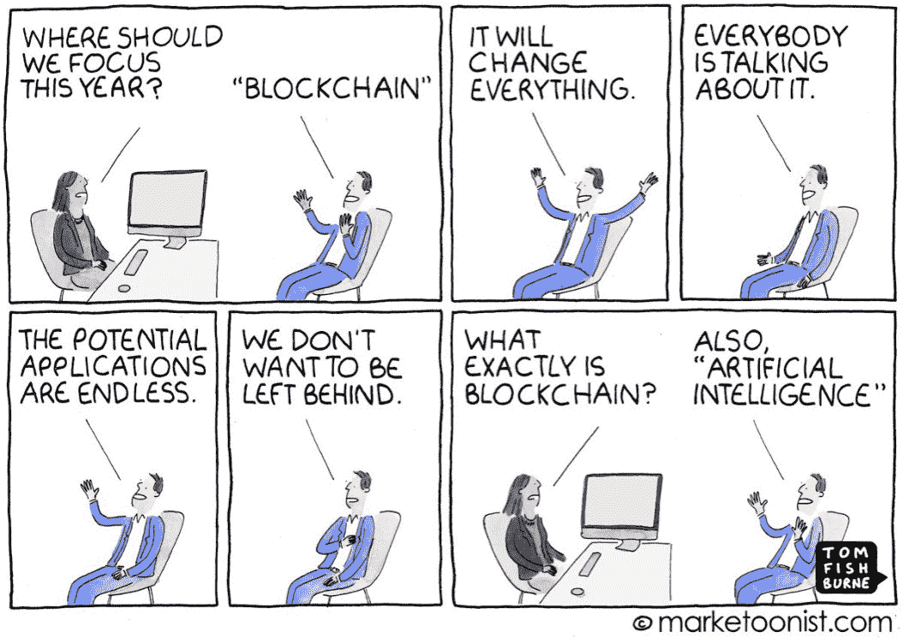
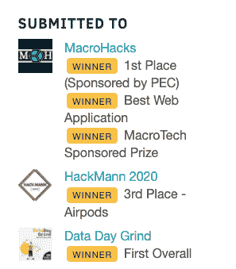
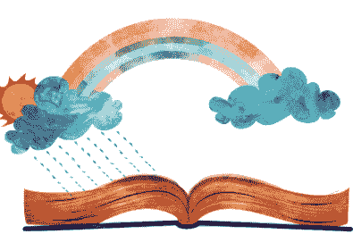

# 五个高中生如何在一个夏天从黑客马拉松中赢得 95000 美元

> 原文：<https://betterprogramming.pub/how-five-high-schoolers-won-9-5k-from-hackathons-in-one-summer-8130e21cce55>

## *编码、赢得奖品、证明自己*

图片来自 [Unsplash](https://unsplash.com/photos/NeTPASr-bmQ)

*作者阿雅安·哈克、*[*aditya Peruvemba*](https://medium.com/@adithya.peruvemba)*、*[*vira aj Reddi*](https://medium.com/@vishraj55)*、*[*Sajiv Shah*](https://medium.com/@sajiv.shah)*、*[*Ishaan Bhandari*](https://medium.com/@ishaanbhandari0)*。*

# **背景**

先来一个快速免责声明:我们说 9.5k 美元，但大部分奖品实际上是各种科技公司的虚拟积分。在有形的奖品方面，(例如 AirPods)，我们赢得了大约 3k 美元。

我们夸大的数字已经说得够多了！让我们进入故事。

我们去萨拉托加高中。作为湾区学校和全国排名前 15 的 STEM 高中，它以其竞争力和高学术水平而闻名。

我们的高中

这种竞争创造了一个高度有害的环境，学生们将大学录取置于一切之上，包括心理健康和友谊。这种激烈的文化导致人们拒绝与他人合作，仅仅是因为他们不希望他们的同龄人在大学应用程序中占据优势。我们的团队非常厌恶这种文化。虽然我们欣赏竞争精神，但我们发现人们的优先事项如此倾斜是很疯狂的。Ayaan 以前有过黑客马拉松的经验，他建议我们作为一个团队去赢得比赛，只是为了表明我们可以成功，同时不助长有毒的文化。

这似乎是一种奇怪的心态，但这是事实。我们的肩膀上有一个芯片，想证明我们不必牺牲我们的友谊和合作精神来提高我们的成就。

我们不知道接下来会发生什么，只需要一点努力和直觉思维。我们决定反思我们的夏天，讨论我们个人如何从我们的经历中成长，同时提供一些关于如何作为团队和黑客马拉松参赛者成长的提示和技巧。

我们的故事和这篇文章的结构

# **博览会**

我们的故事开始于四月的一个下午，在网上学校度过了单调的一天。Ayaan 之前有过黑客马拉松的经历，他联系了我们这些对 CS 有点兴趣的人。我们五个人同意在一个名为 StanHacks 的相对较小的黑客马拉松上一起工作一个周末。通过参与，我们没有什么损失，尽管我们的编码技能不是很好，但我们认为除了向上走，没有别的地方可去。

我们将 Discord 服务器重新用作隔离编码空间。经过一场头脑风暴，我们想出了一个相对体面的主意:Grantlink，一个 iOS 应用程序，允许捐赠者只需按一下按钮就可以向无家可归者捐款。回想起来，这只不过是对无家可归者的报复，但事后诸葛亮。我们对这个想法感到兴奋，并渴望在接下来的两天里将它变成真正的产品。

我们的第一个头脑风暴草图

在我们努力工作的第一个周末后，我们对我们的项目结果相对满意。当我们获得荣誉奖时，我们的低期望得到了满足，我们对结果非常满意。

我们的第一个用户界面——字体甚至不匹配

# **上升动作**

在我们的第一个项目之后，我们没有未来的计划。虽然荣誉奖并不坏，但它并不保证对未来的努力感到兴奋。无论如何，我们决定在 AI4ALL COVID 挑战赛上再给我们的团队一次机会。Sajiv 建议我们参加一个不需要任何实际编码的比赛。相反，我们必须简单地创建一个教育提案，以应对疫情期间影响国家的广泛问题。TecConnect 就是在这里诞生的，这是一个将设备从相对优越的学校转移到那些缺乏设备的学校的计划。点击[此处](https://medium.com/illumination/tecconnect-the-greatest-covid-education-proposal-that-ever-failed-6ebea230259e)了解关于该项目的更多信息。我们最终获得了第一名，总共获得了 300 美元，这给了我们开始新任务的动力。

我们政策提案中的一张图片

在我们的提案获得第一名后，我们决定首先构建一个软件应用程序来启动这个想法。我们认为黑客马拉松可以作为一个完美的媒介，因为我们已经作为一个团队参加了一次。然而，我们知道我们必须改变我们的方法来适应黑客马拉松的风格。我们需要更聪明地工作，从 Grantlink 的错误中吸取教训。

我们注意到几乎每个获奖项目都是一个网络应用。这些网络应用拥有漂亮的用户界面，我们想知道它们是否让用户体验如此之好。深入研究后，我们意识到他们只是简单地使用模板，将时间集中在应用程序的实际引擎上，从而同时实现了良好的产品设计和复杂的代码库。Web Dev 是一条出路。

我们在由美国黑客大联盟(MLH)举办的下一次黑客马拉松“RookieHacks”中，用我们自称的“辉煌”项目:TecConnect 继续做了这件事。我们的黑客马拉松生涯的下一步就是在这里进行的，因为我们获得了“MongoDB 最佳使用”的迷人奖项，并获得了一个无线充电器。这是我们成功的第一个标志。

这种最初的获胜体验给了我们动力去彻底改造我们的黑客马拉松方法，以便获胜。从 Ayaan 之前的黑客马拉松经验来看，他注意到创建人工智能(AI)和机器学习(ML)项目经常获胜。在看了更多的黑客马拉松后，我们致力于构建 AI 和 ML web 应用。一开始我们很害怕，因为我们对曼梯·里的团队了解不多。不管怎样，因为这些项目经常获胜，我们开始学习人工智能课程来学习基础知识。我们渴望开始使用 ML，因为这无疑是取胜之道。

我们使用 AI/ML 的思考过程

我们的第一个 ML 项目是 [SuiSense](https://codeburst.io/suisense-an-innovative-approach-to-suicide-prevention-19cbdf150575) ，这是一个网络应用程序，可以让担心的家人和朋友确定他们苦苦挣扎的爱人是否走上自杀之路。我们项目的核心是一个 ML 模型，它将某人所说的短语分类为自杀或抑郁。我们意识到按照技能组合划分团队是一个我们以前没有尝试过的有效策略。我们的团队有五个人，我们分成两个前端，两个后端开发人员，一个设计 UI 和构思。

经过一个周末的努力工作，我们对结果感到兴奋。在第一次黑客马拉松上，我们只获得了荣誉奖，我们很失望。我们确信使用 ML 和创建一个 web 应用程序将帮助我们获胜，所以我们对我们的结果感到有点惊讶。然而，当天晚些时候，我们得到了更好的消息，因为我们发现我们在 Geomhacks 获得了第二名。我们欣喜若狂，因为这是我们有史以来最好的表现——我们的努力终于有了回报！

我们第一次站在虚拟讲台上

# **高潮**

在瑞士之后，我们比以往任何时候都渴望赢得第一名。我们意识到我们有持续获胜的潜力，但是我们相信我们需要一个更好的主意。进入周末，我们决定创建 PreDent，一个预测车祸热点的项目。这个项目令人生畏，老实说，我们不知道如何完成如此复杂的项目。在黑客马拉松期间，当我们开始构建我们的项目时，我们很快意识到我们不能完全实现它。我们意识到，最终，法官可能不会太在意模型的有效性，我们可以通过创建一个伟大的 UI 和演示来掩盖模型的无效性。这似乎是值得的，因为我们的结果是惊人的。周日早上，我们在 MLH 黑客马拉松比赛中赢得了第一名，这是我们整个夏天参加的最大的一次比赛。几个小时后，我们再次获得了第一名。最后，我们在上次的黑客马拉松中获得了第三名，赢得了我们最喜欢的奖品 AirPods！

我们获胜者的徽章

普雷登教会了我们很多。最重要的是，它证明了一个想法和陈述比实现更重要。在 24 小时内，没有人指望你有一个伟大的或完美的产品，但有了一个非凡的想法，评委更有可能选择你。此外，拥有一个好的 UI 通常意味着好的程序员和好的项目。这给法官们创造了一种感觉，如果一个 UI 是好的，那么这个项目可能也是好的。

# **下落动作(但不是真的)**

*我们的炒作滋生了无能。*

进入下一个周末，我们感觉自己站在世界之巅，我们的自我膨胀到难以置信的程度。我们决定放弃做严肃项目的想法，转而考虑一个更花哨的项目。我们认为一个有趣的项目会吸引那个周末的黑客马拉松。因此，我们建立了 Resurrect，这是一个允许用户创建像失去亲人一样说话的人工智能聊天机器人的应用程序。我们获得了两个赞助商的奖项，这在初夏是相当惊人的。然而，现在我们的期望更高了，我们非常失望。我们很惊讶，因为我们认为改变策略是个好主意。这个周末帮助我们认识到，当创建一个项目时，想法实际上就是一切，我们没有一个伟大的想法。

一只双峰骆驼很好地描述了我们的经历

在这次糟糕的演出之后，我们本可以轻松地结束这个夏天，因为我们已经取得了超出预期的成绩。相反，我们决心以胜利结束这个夏天，激励我们完成最后一个项目。我们将这个项目命名为 Tempest，从一开始，我们就爱上了这个想法。Tempest 使用 ML 来预测龙卷风、飓风和洪水等特定自然灾害造成的损失。我们知道这种类型的高影响力项目可能会取得某种成功，至少比我们复活的努力要好。

虽然有点小家子气，我们决心结束我们的连败，并声称某种程度的成功。我们的希望在“掠夺”中得到满足。在现场闭幕式上，一个接一个地宣布了所有的奖项，我们一次也没有听到《暴风雨》的鸣谢。当我们失去所有希望的时候，最后的奖项宣布了:第一名。当我们终于听到自己的名字被叫到时，一个多月来，我们第一次感到了巨大的宽慰和兴奋。周末剩下的时间里，我们又获得了第一名和第三名，这是结束我们夏天的一个很好的方式。

# **结局**

所有的故事都有篇章，而这一篇章已经落下帷幕

现在学校开学了，夏天结束了，我们不能像以前那样在黑客马拉松比赛中竞争了。作为竞争激烈的高中的高三学生，参加如此多的黑客马拉松比赛根本不可行。

这并不意味着我们已经结束了黑客马拉松——相反，我们希望达到下一个成功水平。有了另一个令人兴奋的想法，我们相信我们可以在大规模的黑客马拉松中竞争，如 HackMIT 和我们最近注册的国会应用程序挑战。面对如此高水平的竞争无疑具有挑战性，但我们很高兴能测试我们到底走了多远。

老实说，回顾我们的进步令人振奋。三个月前，我们因为一个小规模的黑客马拉松而感到紧张，并且很高兴获得了一个荣誉奖。现在，作为一个团队，我们总共赢得了 17 场比赛，并获得了超过 9.5k 美元的奖金。通过更聪明地工作，而不是更努力地工作，我们破解了赢得黑客马拉松的密码，并开始持续地取得良好的名次。最重要的是，我们证明了我们最初的想法。我们证明了成功和快乐并不像我们社区中的许多人认为的那样相互排斥，这是我们最引以为豪的。最棒的是，我们在一起玩得很开心，这就是夏天的意义！

如果你感兴趣，这是我们的项目。演示和描述可以在回复中找到:

*   格兰特链接:[https://github.com/ayaanzhaque/Grantlink](https://github.com/ayaanzhaque/Grantlink)
*   tec connect:【https://github.com/ayaanzhaque/TecConnect 
*   瑞士:【https://github.com/ayaanzhaque/SuiSense】T4
*   预测:[https://github.com/ayaanzhaque/PreDent](https://github.com/ayaanzhaque/PreDent)
*   复活:[https://github.com/ayaanzhaque/Resurrect](https://github.com/ayaanzhaque/Resurrect)
*   暴风雨:[https://github.com/ayaanzhaque/Tempest](https://github.com/ayaanzhaque/Tempest)