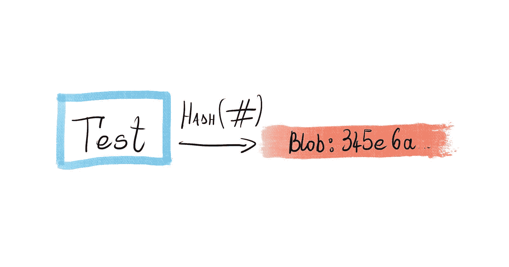
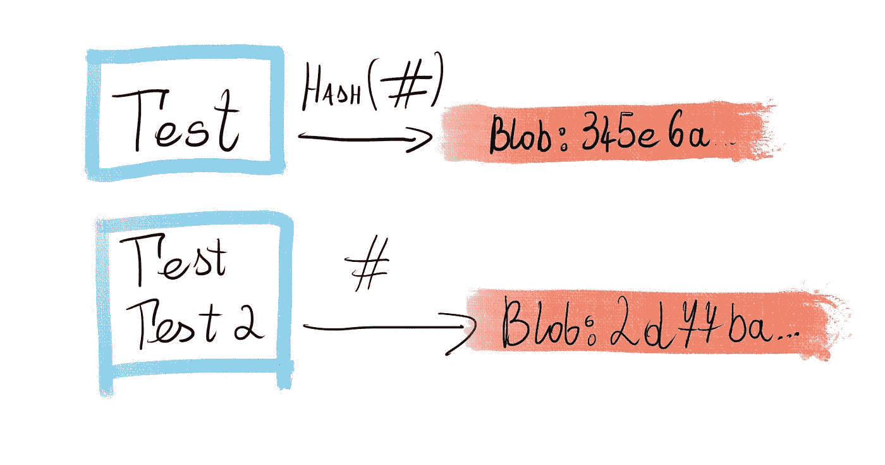
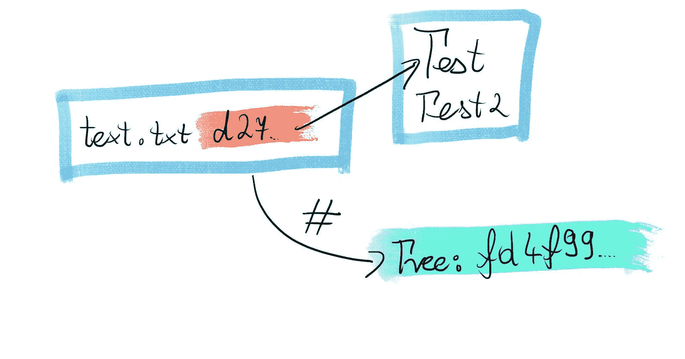
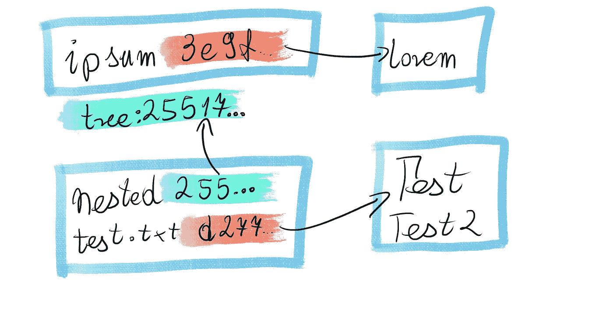
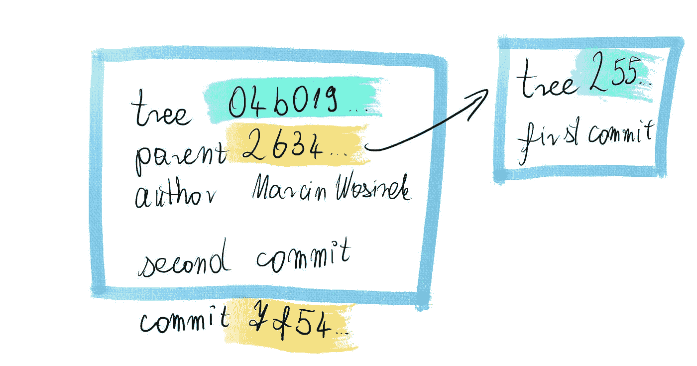
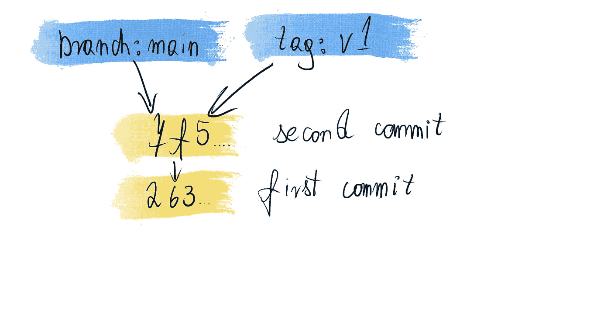

# Git 如何存储数据

> 原文：<https://betterprogramming.pub/how-git-stores-data-dd1107debcb6>

## Blob、树和提交


当我开始使用 Git 时，我做了大多数人做的事情。我记住了完成工作的命令，但并没有真正理解引擎盖下发生了什么。在大多数情况下，我得到了我想要的结果。但我仍然感到沮丧，因为我偶尔会“破坏”回购协议——让它进入我没有预料到的状态，而且不知道如何修复它。

你们的经历相似吗？

使用存储库的捷径是尝试使用一个工具，而不做必要的功课去了解它是如何工作的。在我的例子中，当我读到 Git 使用的内部数据模型时，一切都“点击”了。你看，Git 是一种数据库，例如，如果不知道什么是表、记录等等，你就永远无法使用 SQL。是。让我们来填补知识空白，了解一下 Git 存储库的内部情况。

Git 是一个分布式版本控制软件，这意味着您不需要外部服务器来使用它。Git 需要的所有数据都存储在`.git`文件夹中。作为 Git 用户，您无权更改这些文件，但是出于本文的目的，我们将深入了解 Git 是如何存储数据的。

在用`git init`创建存储库之后，您会发现:

```
$ ls -R .git
HEAD            config          description     hooks           info            objects         refs

.git/hooks:
applypatch-msg.sample           pre-applypatch.sample           pre-rebase.sample               update.sample
commit-msg.sample               pre-commit.sample               pre-receive.sample
fsmonitor-watchman.sample       pre-merge-commit.sample         prepare-commit-msg.sample
post-update.sample              pre-push.sample                 push-to-checkout.sample

.git/info:
exclude

.git/objects:
info    pack

.git/objects/info:

.git/objects/pack:

.git/refs:
heads   tags

.git/refs/heads:

.git/refs/tags:
```

现在，它几乎是空的:我们有几个文件夹，大部分是钩子的示例文件。我们会忽略这些；在本文中，我们将主要关注`.git/objects`内容 Git 中的主要数据存储。

# 一滴

Git 将它跟踪的每个文件的每个版本都存储为一个 blob。Git 通过 blobss 内容的散列来识别 blob，并将它们保存在`.git/objects`中。对文件内容的任何更改都会生成一个全新的 blob 对象。

创建对象最简单的方法是将对象添加到*阶段*。该阶段中的内容将是下一次提交的一部分。Staging 是 git 中的“预提交”状态。它是我们保存尚未提交但已经被 Git 跟踪的文件的地方。

# 例子

让我们创建一个简单的文件，并用一个 blob 来表示它:

```
$ echo "Test" > test.txt
```

使用这个命令，我们将“测试”写到`test.txt`文件中。要使它成为 blob，我们只需通过运行以下命令将其添加到舞台:

```
$ git add .
```

在将我们的新文件添加到 stage 之后，在`.git/objects`中，我们有:

```
$ ls -R .git/objects
34      info    pack

.git/objects/34:
5e6aef713208c8d50cdea23b85e6ad831f0449

.git/objects/info:

.git/objects/pack:
```

我们有一个新文件夹`34`，在这个文件夹中有一个文件`5e6aef713208c8d50cdea23b85e6ad831f0449`。这是因为内容散列是`345e....`:前面的两个字符被用作目录。这个文件的内容是:

```
$ cat .git/objects/34/5e6aef713208c8d50cdea23b85e6ad831f0449
xKOR0I-.
```

它被压缩以提高存储效率。我们可以通过运行以下 Git 命令来查看里面的内容:

```
$ git cat-file blob 345e6aef713208c8d50cdea23b85e6ad831f0449
Test
```

我们只有*里面的*内容——没有文件的元数据。



# 修改示例

让我们看看如果我们对文件进行一些更改并添加更新版本会发生什么:

```
$ echo "Test 2" >> test.txt
```

该命令向现有文件`test.txt`添加一个新行“测试 2”。

让我们将当前版本添加到舞台:

```
$ git add .
```

看看`.git/objects`文件夹里有什么:

```
$ ls -R .git/objects
34      d2      info    pack

.git/objects/34:
5e6aef713208c8d50cdea23b85e6ad831f0449

.git/objects/d2:
77ba2806ce99d418b0b5d6c28643deca0e36dc

...
```

现在我们有两个对象，第二个在`d2`子文件夹中。其内容是:

```
$ git cat-file blob d277ba2806ce99d418b0b5d6c28643deca0e36dc
Test
Test 2
```

和我们更新的`text.txt`一样:

```
$ cat test.txt
Test
Test 2
```

正如我们所看到的，Git 存储了每个版本的完整文件。



# 树

树对象是 Git 存储文件夹的方式。他们引用其他东西作为他们的内容:

*   文件是通过它们的 blob 添加的
*   子文件夹按其树添加

对于每个引用，树存储:

*   文件或文件夹名称
*   blob 或树哈希
*   对象类型
*   许可

和 blobs 一样，Git 通过内容的散列来识别每棵树。因为树引用它所包含的每个文件的散列，所以对文件内容的任何更改都将导致创建一个全新的树对象。

类似地，因为同一个文件的不同版本将有多个 blobs，Git 将为每个文件夹版本创建另一个树对象。

# 创建树

通常，在提交过程中会创建一棵树。我们将在本文稍后讨论提交，但同时，让我们使用`git write-tree`——一个*管道*命令，它基于我们的 staging 中的内容创建一个树。

管道和瓷器命令来自 Git 中的一个类比:

*   瓷器——面向最终用户的用户友好命令。与浴室的淋浴头或水龙头一样。
*   管道——让瓷器工作所需的内部命令。和你家的水管一样。

除非你在做高级的东西，否则你不需要知道管道命令。

# 例子

和以前一样，我们运行:

```
$ git write-tree
fd4f9947de2805e460bfeeca3346e3d36d617d37
```

返回值是新树对象的 ID。要查看内部，您可以运行:

```
$ git cat-file -p fd4f9947de2805e460bfeeca3346e3d36d617d37
100644 blob d277ba2806ce99d418b0b5d6c28643deca0e36dc    test.txt
```

尽管它与 blobs 是不同的数据类型，但它们的值存储在相同的位置:

```
$ ls -R .git/objects
34      d2      fd      info    pack

.git/objects/34:
5e6aef713208c8d50cdea23b85e6ad831f0449

.git/objects/d2:
77ba2806ce99d418b0b5d6c28643deca0e36dc

.git/objects/fd:
4f9947de2805e460bfeeca3346e3d36d617d37

…
```

所有数据都在同一个文件夹结构中。



# 嵌套示例

现在，我们将在其中添加另一个文件夹，以查看嵌套树是如何存储的:

```
# create a new folder
$ mkdir nested ## add a file & it’s content
$ echo 'lorem' > nested/ipsum# adding it to the stage
$ git add .
```

现在创建一棵树会给我们一个新的 ID:

```
$ git write-tree
25517090ae5d0eb08f694de6d38d613615fe99e4
```

其内容:

```
$ git ls-tree 25517090ae5d0eb08f694de6d38d613615fe99e4
040000 tree bc9a36d27aa303a3b1cab543b64c6944fea5ce8b    nested
100644 blob d277ba2806ce99d418b0b5d6c28643deca0e36dc    test.txt
```

我们可以看到`nested`是作为树引用添加的。让我们看看里面是什么:

```
$ git ls-tree bc9a36d27aa303a3b1cab543b64c6944fea5ce8b
100644 blob 3e9ffe066cd7b2ce4c6fb5c8f858496194e1c251    ipsum
```

如您所见，这是另一个描述文件夹内容的树对象。使用许多树对象，您可以描述任何嵌套的文件夹结构。



# 承诺

提交是对存储库状态的完整描述。它包含以下信息:

*   描述最顶层文件夹的树对象的引用
*   提交作者、提交者和时间
*   父提交-我们提交所基于的提交

大多数提交只有一个父级，以下情况除外:

*   历史上第一次提交没有父级
*   合并提交有多个

和以前一样，Git 通过内容的散列来识别每个提交。因此，对文件、文件夹或提交元数据的任何更改都将创建新的提交。

# 第一次提交

我们可以使用标准提交命令创建第一个提交:

```
$ git commit -m 'first commit'
[main (root-commit) 26349a2] first commit
 2 files changed, 3 insertions(+)
 create mode 100644 nested/ipsum
 create mode 100644 test.txt
```

输出显示了截断的提交 ID。让我们找到一个完整的值:

```
$ git show
commit 26349a25253f9b316db1a5d3c3f23c1ca5ca4e0e (HEAD -> main)
Author: Marcin Wosinek <marcin.wosinek@gmail.com>
Date:   Thu Apr 28 18:18:07 2022 +0200

    first commit
…
```

要查看提交对象的内容，我们可以使用:

```
$ git cat-file -p 26349a25253f9b316db1a5d3c3f23c1ca5ca4e0e
tree 25517090ae5d0eb08f694de6d38d613615fe99e4
author Marcin Wosinek <marcin.wosinek@gmail.com> 1651162687 +0200
committer Marcin Wosinek <marcin.wosinek@gmail.com> 1651162687 +0200

first commit
```

树引用与我们在前一个例子中的树引用相同。我们可以看到提交与其他对象位于同一个文件夹中:

```
$ ls -R .git/objects
25      26      34      3e      bc      d2      fd      info    pack

…

.git/objects/26:
349a25253f9b316db1a5d3c3f23c1ca5ca4e0e

…
```


# 下一次提交

让我们恢复第一个版本的`test.txt`文件:

```
$ echo "Test" > test.txt
```

该命令用“Test”覆盖现有文件。

```
$ git add .
```

将更新版本添加到暂存中。

```
$ git commit -m 'second commit'
[main 7f54a43] second commit
 1 file changed, 1 deletion(-)
```

提交更改。

让我们找到完整的 ID:

```
$ git show
commit 7f54a437d87cd1f241cfb893c4823bc7e60c19ec (HEAD -> main)
Author: Marcin Wosinek <marcin.wosinek@gmail.com>
Date:   Thu Apr 28 18:37:55 2022 +0200

    second commit
…
```

因此，提交内容是:

```
$ git cat-file -p 7f54a437d87cd1f241cfb893c4823bc7e60c19ec
tree 04b0192c1c88ac1c1a96f386e84e5388ef8a509a
parent 26349a25253f9b316db1a5d3c3f23c1ca5ca4e0e
author Marcin Wosinek <marcin.wosinek@gmail.com> 1651163875 +0200
committer Marcin Wosinek <marcin.wosinek@gmail.com> 1651163875 +0200

second commit
```

Git 已经添加了*父*行，因为我们在另一个提交的之上提交*。*



Git 保存的其他重要数据只是对最近一次提交的引用。所以我的*主*分支存储在`.git/refs/heads/main`中，它的内容是

```
$ cat .git/refs/heads/main
7f54a437d87cd1f241cfb893c4823bc7e60c19ec
```

或其最顶层提交的 ID。我们可以从不断扩展的提交树中找到所有相关信息:

*   提交消息告知的分支历史
*   谁做了更改，何时做的
*   不同分支和标签之间的关系

当我创建一个简单的标签时:

在`.git/refs/tags`创建一个文件:

```
$ cat .git/refs/tags/v1
7f54a437d87cd1f241cfb893c4823bc7e60c19ec
```

如您所见，标记和分支都是对提交的显式引用。它们之间唯一的区别是当我们创建一个新的提交时 Git 如何对待它们:

*   当前分支被移动到新提交
*   标签保持不变



# 摘要

blob、树和提交是 Git 存储存储库完整历史的方式。它通过对象散列进行所有的引用:没有办法在不破坏关系的情况下操作存储库中跟踪的历史或文件。

你觉得这篇文章有帮助吗？订阅以便在我发布关于编程和 JavaScript 的新文章时得到通知。

*最初发布于*[*https://how-to . dev*](https://how-to.dev/how-git-stores-data)*。*