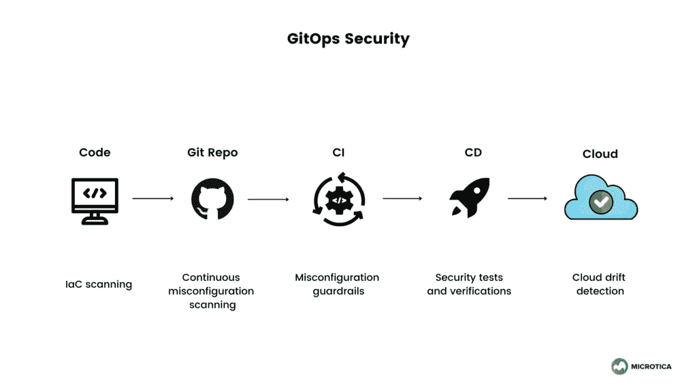

# GitOps 如何帮助防止安全错误配置

> 原文：<https://betterprogramming.pub/how-gitops-can-help-prevent-security-misconfigurations-8b506dcd89e1>

## 云原生开发有其自身的安全风险。知道如何解决它们

伊留扎·明加佐娃在 [Unsplash](https://unsplash.com?utm_source=medium&utm_medium=referral) 上的照片

根据 Snyk 的[云原生应用安全报告 2021，云安全错误配置是云原生应用中的头号事件类型。在采用云原生技术时，错误配置也是运营团队最担心的问题。](https://snyk.io/state-of-cloud-native-application-security/?utm_campaign=CNAS-SC-2021&utm_medium=Report-Link#misconfiguration-and-known)

当您的设置无法为您的云资源提供基础架构和应用程序安全性时，就会发生云错误配置。您通常会发现这些错误配置是偶然发生的，是由于缺乏对云安全的认识，或者是由于缺乏策略和足够的监督。

这可能导致任何类型的安全错误配置漏洞，从用户权限到不受限制的出站访问。漏洞使您面临可能危及您的系统的错误配置攻击和可能造成数十亿美元损失的违规行为。

本文将讨论安全错误配置中最重要的问题，并提供解决方案。

# 问题#1:安全性不是开发人员的首要任务

在云计算中引入安全性的最大挑战之一是，开发人员并不真的想考虑安全性。这降低了他们的速度，因为他们的主要焦点是交付应用程序。

有了这样的截止日期和快速上市流程，安全性成为发布的障碍就不足为奇了。不幸的是，编写安全代码的代价很高，这剥夺了开发人员想要的大量自主权和专业知识。

开发人员和安全性之间经常存在巨大的鸿沟。安全专家很晚才参与开发运维流程。因此，他们只提供急需修复的漏洞报告。

公司需要以一种开发人员不必担心的方式来处理安全性，而不是玩指责游戏。安全漏洞应该以一种帮助开发人员解决问题的方式呈现。立刻看到它，明白接下来要怎么做才能摆脱它。

# 问题#2:软件发布第一，安全第二

另一个巨大的挑战是，在开发过程中，安全问题常常发现得太晚。通常是在准备阶段，但在生产阶段更是如此。审查过程结束后，开发人员将获得修补他们几周前开发的某个功能的安全漏洞问题的入场券。这导致需要切换回该环境，并脱离他们当前的优先事项。

即使开发人员较早发现了问题，他们也不知道需要做什么来消除问题，或者因为发布的截止日期紧迫而没有时间。

# 问题 3:云原生安全性

Gartner 最近的一项研究预测，到 2025 年，[超过 99%的云漏洞](https://www.gartner.com/smarterwithgartner/is-the-cloud-secure/)将是由于用户配置不当造成的。随着越来越多的企业采用原生云，导致违规的人为错误的预期将大幅上升。

云原生应用在开发和交付过程的几乎每个部分都围绕着自动化。他们主要通过实施每天运行大量构建和部署的 CI/CD 系统来做到这一点，这意味着繁重、可靠的工作负载。

由于这种自动化，今天的应用程序可以更快地创新和更有效地扩展。但是随着这种变化而来的是保护云原生应用的挑战。传统的安全模式无法提供必要的机制来保护基础设施和应用程序的代码安全。

通过定义容器和服务，基础设施现在是应用程序的一部分。因此它应该作为应用程序安全性的一部分受到保护。安全工具和见解应该贯穿整个软件开发生命周期。像源代码的自动扫描和容器图像的[安全扫描](https://microtica.com/blog/feature-announcement-built-in-container-scan-reports/?utm_source=medium&utm_medium=referral_link&utm_campaign=gitops&utm_content=security_misconfiguration)应该是这个过程的一部分。

实现“左移”方法(开发过程早期的安全程序)是应对安全错误配置风险的常见方法。

# 问题#4:保护容器和 Kubernetes

大量的云错误配置问题也会影响 Kubernetes 和 Docker 容器。攻击者试图利用漏洞来访问容器。他们还可能在容器环境中移动，访问其他容器并窃取敏感信息。他们可能用恶意代码感染容器，这些恶意代码可能被打包到一个图像中，并感染下载该图像的其他人。

至于 Kubernetes，可以通过应用一个阻止 pods 相互通信的策略来防止错误配置攻击。不幸的是，默认情况下不会应用此策略，因此攻击者可能会破坏单个 pod 并与所有其他 pod 通信以获取组织的数据。

通过手动方式检测可能的错误配置并不总是可行的。这就是为什么最好将安全性纳入开发运维流程的原因。将自动化配置管理策略创建为代码，并使用最佳实践来识别配置违规。

# GitOps 作为解决方案

最简单的形式是，GitOps 是一个由 Git 流程管理的 IaC。如果我们可以将基础设施视为代码，我们就可以将软件开发质量保证实践应用于云基础设施，就像我们处理应用程序代码一样。此外，我们还可以为云基础架构定义和执行自动化测试和安全性测试。

该工作流允许将配置和安全策略视为代码，在 Git 中受版本控制。做出更改后，将在自动化管道中创建、检查和推送一个拉请求。然后，管道测试和验证代码，部署代码，并监控更改。

GitOps 安全。作者图片

GitOps 是一个促进安全环境的模型。开发人员不需要直接访问基础设施或 Kubernetes 集群就可以直接在那里执行。通过 GitOps，CD 现在可以将这些更改应用到云中。开发人员可以提出变更，然后由高级 DevOps 工程师、QA 开发人员和安全专家进行审查。检查通过后，开发人员可以将变更合并到主分支中。

GitOps 还可以提高修改管道的速度。如果管道被渗透，您可以通过识别 IaC 存储库中的管道漏洞来快速解决安全问题。您可以找到导致问题的确切提交，评估攻击的规模，并预测恢复需要多少时间。

GitOps 模型在实现“作为代码的策略”时也能工作，这是一种自动化安全过程的方法。策略使运营团队能够定义基础设施的防护栏，从访问控制和限制到管理基础设施的运行方式。这为开发人员提供了在部署到云之前所开发内容的安全级别的即时反馈。

如果 GitOps 得到了充分的实现，它将成为一种将安全性进一步左移的成功技术。在开发过程的早期捕捉安全错误配置、bug 和其他任何类型的代码质量问题。

# 结论

随着云原生开发的采用，安全风险成比例增加。也出现了新的方法和工具来帮助解决这些问题。

使用 GitOps 方法，组织可以提高云基础架构的安全性并增加可见性。这降低了云错误配置违规的风险。

重要的是在整个软件开发生命周期中集成安全检查点，并在此过程中使用支持您的平台。