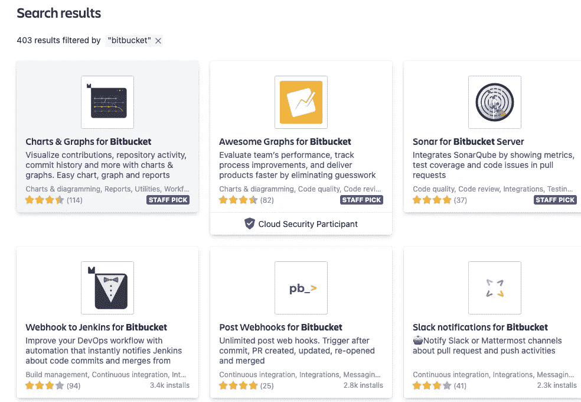
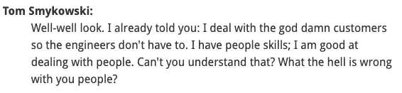

# 10 年后回到编码行业几乎让我崩溃

> 原文：<https://betterprogramming.pub/how-going-back-to-coding-after-10-years-almost-crushed-me-88c85ceb5376>

## 十年内，软件工程的一切都发生了变化

在 [Unsplash](https://unsplash.com?utm_source=medium&utm_medium=referral) 上由 [Ugi K.](https://unsplash.com/@wizzyfx?utm_source=medium&utm_medium=referral) 拍摄的照片。

20 年前，我是一名实干的技术专家，10 年前转向管理，现在我再次成为一名实干的顾问。我对一些变化感到惊讶，对另一些变化感到惊讶。这是一个基本纲要，它几乎导致了我的早逝。

# **Unix 对开发者来说又回来了(一线希望)**

在 80 年代和 90 年代初，许多专业软件是在昂贵的 Unix 工作站上开发的，如 Sun Sparc 或 NeXT Station。到了 90 年代，WinTel 接管了，每个人都用 MS Visual Studio 等大型供应商工具或 Eclipse 等少数开放产品在 Windows 上编码，而 Linux 在桌面上仍然有点业余爱好者。

2001 年，我在一家初创公司工作，其中一名开发人员使用 Linux，在无法使用源代码管理(SCM)工具和 Outlook 电子邮件的情况下，不得不苦苦挣扎。他曾经用电子邮件给我们发送代码，让我们帮他签入代码。我记得当时我用的是 XEmacs 是的，经典时代。

快进到现在。Unix 是一个非常流行的开发平台——特别是在 Mac 上，因为它的 Unix 核心 Windows 上的 Linux 也存在(WSL)。这是我很容易重新进入的一个领域。有趣的是，我的一些年轻同龄人几乎不知道如何使用 Windows，但在 Linux/Unix 上却强得多！

# 发布经理走了

过去，分支、合并和解决冲突是一项可怕的工作，有时需要发布经理的专业知识。当 goliath SCM ClearCase 流行时，需要一个庞大的团队来维护和管理分支、合并和发布(至少基于我 2002 年在 HP 的经验)。

自我管理的拉请求(PR)的概念实际上是相当新的，显然来自 Linux dev 和新一波分布式 SCMs，如 BitKeeper 和 Git。能够在工作流中请求合并是 ClearCase、CVS、SVN 和 PerForce 等老系统所没有的。您有一个回购负责人或发布经理，他们可能已经这样做了，或者每个开发人员自己也这样做了。这确实简化了用户的工作，并使他们能够独立协作。

# QA 团队在哪里？(单元测试/CI)

我第一次了解单元测试和持续集成(CI)是通过 Kent Beck，敏捷宣言的创始人之一和 [*极限编程*](https://en.wikipedia.org/wiki/Extreme_programming) 的创造者。它在 20 年前是革命性的，但花了一些时间才在开发工作流中达到当前的标准化。

我发现 CI 在敏捷和 Scrum 中没有得到更多的强调是很不幸的，但是我很高兴看到它在这一点上被很好地采用。

我参加了一个软件开发会议，记得在一个讨论单元测试的小组上，我看到了 Java Collections 的作者 Josh Bloch。他说，“谢谢你(敏捷或 JUnit)让测试变得性感。”

如此真实。在过去，编写测试既无聊又不受欢迎，所以组织雇佣 QA 工程师专门为你找出所有的错误！哇，多么轻松的生活啊…

单元测试和 CI 几乎消除了对黑盒 QA 测试人员的需求，因为开发人员现在拥有测试编写，CI 基础设施运行并报告测试。它确实使软件更加可靠，开发周期更快。这也促使程序员更全面地思考，以测试友好的方式编写代码。

# 开发->测试->生产不再有问题？(码头工人)

容器，即 Docker，在你将代码从 QA 转移到生产时，真正简化了打包并减少了与 env 相关的问题(代价是让一个优秀的 DevOps 工程师建立 Docker 生态系统)。

在过去，你会在一个完全不同于部署系统的系统中进行开发(例如，在 Windows 上编写代码，然后部署到 Unix 上)，这不可避免地会导致错误和每个测试和发布周期中更多的工作。

此外，在过去，发布、QA 或 DevOps 工程师会从 SCM 标签中获取代码，并弄清楚如何编译、测试和迁移它——通常会发现一大堆硬编码的路径和变量，或者缺少需要返工或修改才能工作的库和文件。

Docker 通过再次授权程序员自己构建和测试，真正简化了流程，并允许 CI 和持续部署(CD)。

# 开源软件(OSS)选项太多？

今天，在这个开放源码软件的世界里，有太多的选择。我当时正在设置 Jenkins，想要集成到 BitBucket，插件搜索“bitbucket”得到了 400+选项(很多是开源的)。

来源:大西洋搜索[参考](https://marketplace.atlassian.com/search?query=bitbucket)

这产生了两个问题:

1.  可供选择的方案太多了。
2.  有这么多的选择，许多人会死去，失去支持。

好的一面是你几乎不需要构建基本的基础设施和工具——你只需要找到合适的来重用。

20 年前，构建基本的库和数据结构有点“有趣”。今天，每种语言都有框架和库，因此 99%的开发人员不应该编写 b 树、hashmap，甚至 OAUTH 连接器。

# 敏捷和 Scrum 已经接管了

虽然敏捷在 20 年前还活着(敏捷宣言可以追溯到 2001 年)，但是它的广泛采用是最近的事——甚至是在软件之外，有时是以扭曲的方式。这已经成为高管 CxO 的一个流行词(“你的业务必须敏捷才能生存”)。

我记得发布周期相当长(初创公司长达三个月)。在参加了规范会议，一行一行地理解了需求之后，开发人员可以去他们的办公桌前玩几个星期的游戏，而不必发布关于他们在哪里的可怕的更新。现在，你有了每日站立和两周冲刺，所以不能再懈怠了！

随着敏捷的发展，BA 的角色也减少了，因为开发人员现在直接面对用户或产品经理。你不能再躲起来不说话了。因此，沟通技巧比过去重要多了。

引自 Tom，BA/经理—来源:[办公空间](https://www.youtube.com/watch?v=RAY27NU1Jog)

敏捷使得开发的节奏大大加快了。不仅仅是 Scrum 惯例和日常站立。工具更加简化了，JIRA 板、拉式请求和 CI/CD 都让您走得更快。虽然日常工作有点忙，但更快、更全面地构建东西也是非常令人满意的。

# 结论

如果你正在考虑一个类似的旅程，去吧，祝你好运！我很享受刷新技能的过程(虽然差点把我压垮)。SWE 的基本原理是一样的，所以我认为我可以生存下来，但是工具已经发生了巨大的变化，这极大地影响了生产率。

您可能在本文中感受到的一个主题是，与 20 年前相比，今天的开发人员面临着更广泛的任务。他们编码、管理 SCM、与用户交谈、测试他们的代码、构建和部署容器等等。这可能令人难以置信，但至少你不用再写链表了。

# 参考

1.  XP—【https://en.wikipedia.org/wiki/Extreme_programming 
2.  敏捷—[https://www . McKinsey . com/business-functions/organization/our-insights/the-journey to-a-a-agile-organization](https://www.mckinsey.com/business-functions/organization/our-insights/the-journey-to-an-agile-organization)