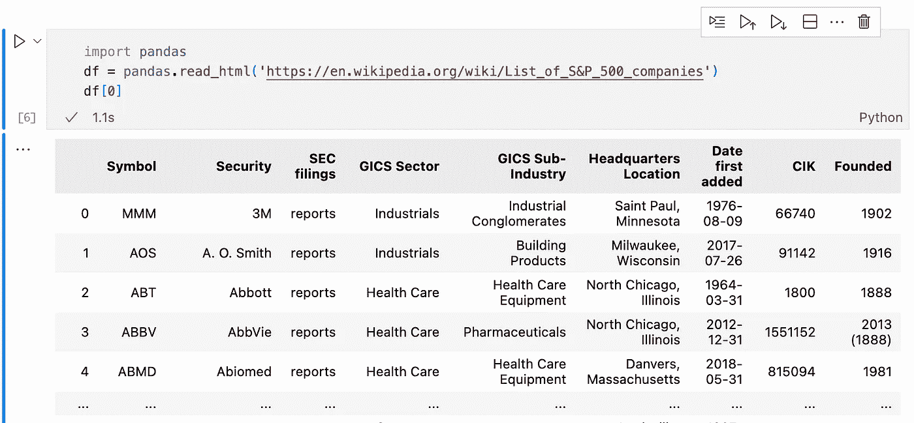
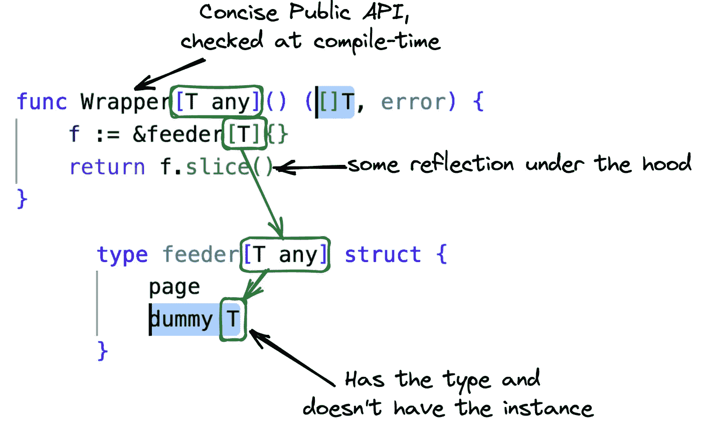

# Golang 泛型如何增强简洁 API

> 原文：<https://betterprogramming.pub/how-golang-generics-empower-concise-api-html-table-extraction-case-study-e2f4050bbb7d>

## HTML 表格抽取案例研究


[疲惫的地鼠](https://www.deviantart.com/quasilyte/art/Tired-gopher-783302842)*正在将表格提取到内存中*

*你可能听说过并读过许多关于 Go 中关于普通切片和地图的[泛型的故事，但是还没有想到一个有趣的方法来应用这个特性。让我们实现](https://go.dev/doc/tutorial/generics) [pandas.read_html](https://pandas.pydata.org/docs/reference/api/pandas.read_html.html) 的对等体，它将 html 表映射成结构的切片！如果用 [Rust](https://docs.rs/table-extract/latest/table_extract/) 也能实现，那为什么不能用 Go 呢？！这篇文章将向您展示一个令人兴奋的反射和泛型的组合，为您的库获得简洁的外部 API。*

*首先，让我们看看这篇文章的直接灵感——最受欢迎的交互式数据分析库， [Pandas](https://pandas.pydata.org/) :阅读 HTML 似乎如此普遍，以至于它被视为一种商品，因此可以开箱即用:*

**

*从 [Jupyter](https://jupyter.org/) 笔记本中使用 [pandas.read_html](https://pandas.pydata.org/docs/reference/api/pandas.read_html.html) 的示例。*

*为了遵循惯用的表解析示例，让我们从维基百科获取[的& P 500 列表](https://en.wikipedia.org/wiki/List_of_S&P_500_companies)，并将其转换成一片`Ticker`实例，在这里我们用一个表头名称来注释每一列:*

*在围棋中，事情甚至可以变得简洁*

*这里我们要注意的是来自`NewSliceFromURL**[Ticker]**(URL)`的`[**Ticker**]`和*。*这个名为[类型参数](https://go.dev/ref/spec#TypeParameters)的 Go 1.18+特性是我们告诉`NewSliceFromURL`类型名称的理想方式，反射将帮助我们发现头文件的名称。在泛型之前，你可能已经写了一个类似于`NewSliceFromURL(**Ticker{},** URL)` *，*的 API，尽管我总是觉得它有点令人困惑:*

> *如果我们的目标只是传递类型，为什么我们需要传递类型的空实例？*

*花了很多年编写 Java 代码，我已经习惯了来自像 [Jackson](https://github.com/FasterXML/jackson-databind/blob/3bae019c8c91def310ed9679806217cff52e8c52/src/main/java/com/fasterxml/jackson/databind/ObjectMapper.java#L3560-L3584) 这样的库中的*对象映射*的概念。但是这个博客是关于围棋的，你可能已经登陆到这里来弄清楚如何实现类似的事情。你可能认为 Go generics " *只是工作，*"但是你的享受程度取决于你对其他编程生态系统的亲和力。在撰写本文时，[方法还不能有类型参数](https://github.com/golang/go/issues/49085)，而类型参数为 API 设计打开了创造性的闸门。下面是插图:*

**

*不需要公共 API 用类型参数初始化空结构*

*这看起来有点像魔术，但下面是简化的思考方式:当我们调用`NewSliceFromURL**[Ticker]**()`、*、*时，编译器用实际类型替换类型参数引用，`feeder[T]`类型中的`dummy T`变成了`dummy Ticker`、*。*还是很难跟上，但是惊心动魄？请看几篇[入门](https://benjiv.com/golang-generics-introduction/) [文章](https://benjiv.com/generic-programming-in-software-engineering/)(或[更多](https://planetscale.com/blog/generics-can-make-your-go-code-slower) [进阶](https://www.dolthub.com/blog/2022-04-01-fast-generics/)的)。*

*所以，现在我们有了一个`dummy Ticker`，需要从中读取一些元数据。首先，我们从我们的`dummy Ticker`中获取`[reflect.Value](https://pkg.go.dev/reflect#ValueOf)`，然后我们[将](https://pkg.go.dev/reflect#Value.Type)`[Ticker](https://pkg.go.dev/reflect#Value.Type)`类型获取到`elem`变量中，从中我们可以发现一个类型的[个字段](https://pkg.go.dev/reflect#Value.NumField)并对它们进行迭代。*

*现在我们需要将 Ticker 字段绑定到表头。在 Java 中，你可能已经创建了一个`@Header`注释，并围绕它使用了一个[完整的结构化框架](https://medium.com/edureka/annotations-in-java-9847d531d2bb)。*

*尽管如此，在 Go 中，我们必须遵循一个约定，编写可选空格分隔的`key:"value”`对的*标记字符串*，我们可以通过 struct 字段的`Tag`属性的`[Get](https://pkg.go.dev/reflect#StructTag)` [方法](https://pkg.go.dev/reflect#StructTag)来读取。*

*结构字段标记的典型解析*

*一旦我们得到了结构字段的位置映射，我们必须将它与表格标题列的位置进行匹配，这一点我们将在本文后面讨论:*

*将我们的结构理解的内容与 HTML 表中的内容结合起来*

*映射和数据都在那里，我们准备在我们创建的切片上反映出来。这里有趣的一点是制作一个切片并将这个切片转换成具体类型。*

*假设我们在内存中已经有了所有的表数据，我们可以使用预定义的容量和长度来避免片不必要的动态增长。`MakeSlice`返回一个*切片值*，我们将使用它通过切片的位置来访问单个项目。*

*这个代码片段假设字符串是表格单元格唯一支持的数据类型。一旦我们将所有的表行添加到我们的切片中，我们就必须对其进行转换:`Interface()`方法将把反射值转换成`**any**`，`.([]T)`将得到`**[]Ticker**`。*

*反思。MakeSlice()创建一个值，您可以通过 Index()方法在其中添加新元素。*

*你在页面开头看到的漂亮的 API 是由大致如下导出的包函数支持的，它只负责编译器的类型引用传播，并为一些事情调用初始化器:*

*需要包级包装器来隐藏虚拟变量的复杂性*

> **记住:与其他语言中的反射不同，你通过字段在结构中的位置来引用它，而不是名字*。场顺序*有时会影响*的性能，但是我们在这里使用反射，所以无论如何性能会稍受影响。*

*但是在这种情况下，它没有公共 API 的清晰那么重要。*

****总结:*** 每次我们处理带注释的类，都要解析带注释的字段。*

*既然我们已经玩够了反射，让我们得到一些数据。您也可能倾向于在没有任何自定义类型创建的情况下使用表，并使用普通的旧回调。作为一个库作者，您可以添加像`Each`、`Each2`、`Each3`等方法。对于 Java 来说，方法重载是很常见的。看看 log4j 来源就知道了。但是对于 GoLang，我们必须非常健谈:*

*迭代的普通回调*

*将数据路由到回调相对简单，因为我们只需要找出表头的位置，并将其与提供的列名匹配。比反射方法更具体，但是它只能扩展到几列。您不希望在单一类型中维护太多冗长的方法，为了简单起见，我们将只有`Each`、`Each2`和`Each3`:*

*在 Go 中维护简洁的 API 和错误传播几乎需要复制粘贴。*

*我们如何理解在 HTML 页面上选择哪个表格？它可能有多个。而熊猫库也没有很好的解决“*开发者体验*的问题。因此，让我们添加一些简单的试探法，通过列名来匹配表。它应该在 99%的情况下工作，因为以*表格作为数据*的页面平均有一个表格标签，偶尔有两个，很少有三个。现在是 21 世纪的第二个十年，几乎没有人使用 HTML 进行布局。*

*大量的错误信息对于模糊匹配是必不可少的。*

*我们通过制作一个简单的递归解析器，通过`[golang.org/x/net/html](https://pkg.go.dev/golang.org/x/net/html)`包获得最底层的表数据。当然，我们可以用`[goquery](https://github.com/PuerkitoBio/goquery)`(它也构建在`x/net/html`之上)来做这件事，但是我们可以通过避免两个额外的传递依赖来使代码更简单。如果你，作为一名观众，对技术比较的文章感兴趣，请在下面留下评论，我会看看我们能做些什么。*

*Go 标准(实验)库中 HTML 表格的简单解析*

# *资源*

*   *Go 中符合 HTML5 的[标记器和解析器](https://pkg.go.dev/golang.org/x/net/html)*
*   *[goquery](https://github.com/PuerkitoBio/goquery) —类似 jQuery，但是在 Go 中*
*   *[Java 注释简介](https://medium.com/edureka/annotations-in-java-9847d531d2bb)*
*   *[在 Go 中反映](https://pkg.go.dev/reflect)包*
*   *[Go 中的泛型介绍:类型参数、类型推理和约束](https://benjiv.com/golang-generics-introduction/)*
*   *[Golang 中的泛型和值类型](https://www.dolthub.com/blog/2022-04-01-fast-generics/)*
*   *[科技书评:Go](https://nf-x.medium.com/tech-book-reviews-go-bb589fd3e108)*

*[](https://github.com/nfx/go-htmltable) [## GitHub - nfx/go-htmltable:从几乎没有…

### htmltable 支持从 HTML 表格和 URL 中提取结构化数据，几乎不需要外部依赖…

github.com](https://github.com/nfx/go-htmltable) 

```
**Want to Connect?**Does everything you’ve read in this post look good? Follow [@nf_x](https://twitter.com/nf_x) on Twitter, and check out [the source](https://github.com/nfx/go-htmltable), which implements all of these ideas — feel free to use it as you see fit. Looking forward to your pull requests that take these ideas even further!
```