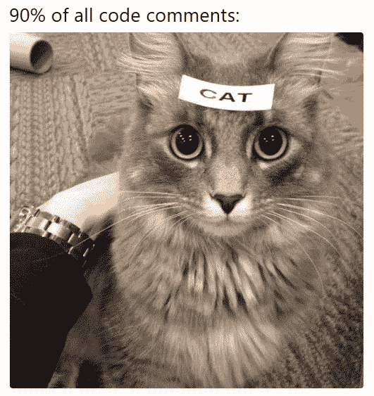

# 谷歌开发者如何不写评论

> 原文：<https://betterprogramming.pub/how-google-developers-do-not-write-their-comments-b1e597655c4e>

## 编写文档是编码的一个重要部分。这里有一些我们在谷歌写代码注释时“不”遵循的实践。


*照片由* [*Cess Idul*](https://unsplash.com/@cessjin) *上*[*Unsplash*](https://unsplash.com/photos/k8hNYh5ymZ8)*。*

这个题目不是我自己想出来的。我一直认为这是一个相当主观的话题。现在依然如此——但是，几天前我看到了下面这篇文章:

[](https://paigeshin1991.medium.com/comments-how-google-developers-write-their-comments-5443657ecc4b) [## 评论:谷歌开发者如何写评论

### 代码越写越有感觉。“简单总比复杂好。”对…更有利

paigeshin1991.medium.com](https://paigeshin1991.medium.com/comments-how-google-developers-write-their-comments-5443657ecc4b) 

通读这篇文章后，我觉得——这与任何谷歌内部或[外部准则](https://google.github.io/styleguide/)无关。作者也没有提供任何我们可以交叉检查的参考资料(截至 2022 年 5 月 1 日)。在我看来，作者的一些建议似乎是“反惯例的”。

 [## 我们推荐的另一种更简单的方法是将变量命名为“usSocialSecurityPattern”。

minhazav.medium.com](https://minhazav.medium.com/another-easier-approach-we-recommend-is-naming-the-variable-as-ussocialsecuritypattern-6f143d7d0c1a) 

我确实在评论区支持这些观点，这似乎引起了其他读者的共鸣。但是，尽管如此，这篇文章仍然存在。所以，我想就同一个话题写一篇我的看法。

这篇文章基于来自 Google 的外部可用的开源文档指南、其他一些在线可用的开源资源以及我自己为这些组织工作的个人经验。我希望你觉得我的研究是值得的。

> 免责声明:这篇文章与我工作的任何组织都没有关系，纯粹是我的想法、个人研究和经验的反映。

> *糟糕的评论比没有评论更糟糕——来源*[*stack overflow*](https://stackoverflow.blog/2021/12/23/best-practices-for-writing-code-comments/)

# *如何不为代码编写文档*


*图片由* [*作者(Minhaz)*](https://unsplash.com/@mebjas) *上* [*未泼*](https://unsplash.com/photos/gSPWCTDS1cY) *。*

> 编写计算机能理解的东西很容易，但编写计算机和人类都能理解的东西就难多了
> 
> *—我们都知道的谚语*

这里列出了一些不应该为代码编写文档的方法。

对于每一点，我也在添加我的真实建议/推荐，前缀为[RS]=[真实建议]。

开始了。

## *解释每一行代码！*

你不应该假设将来谁会阅读你的代码。因此，解释每一行代码是可取的。这里有一个例子

```
// Assign a as inverse of input and then b as a ^ (1/2.2f).
int a = 1 / input_value;
int b = pow(a, 1.0f/2.2f);// Now return half of b.
return b / 2.0f;
```



Meme:代码注释应该像这样。来源: [reddit](https://www.reddit.com/r/ProgrammerHumor/comments/8w54mx/code_comments_be_like/) 。我在 Ellen Spertus **的 [StackOverflow 博客的源文章中看到了这张图片。](https://stackoverflow.blog/2021/12/23/best-practices-for-writing-code-comments/)**

[RS]行内注释的主要目的是提供代码本身不能包含的信息，例如“为什么”要以这种方式编写。

一般来说，我更喜欢先为人类写代码，然后才是计算机。这当然是一个有例外的规则(比如有时我们因为性能原因需要编写难以阅读的代码)。

上面链接的文章中给出了一个例子:

```
// matches US social security number
let pattern = Pattern("^\\{3}-\\d{2}-\\d{4}$")
```

我认为这个文档很大程度上是多余的。相反，您可以像这样编写代码:

```
let socialSecurityPatternUS = Pattern("^\\{3}-\\d{2}-\\d{4}$")
```

这是另一个来自 [StackOverflow 博客文章](https://stackoverflow.blog/2021/12/23/best-practices-for-writing-code-comments/)的例子

```
private static Node getBestChildNode(Node node) {
    Node n; // best child node candidate
    // rest of the code below to find the best node.
}
```

文档不应该被用作糟糕代码的借口。您可以随时替换代码，使其易于阅读，如下所示:

```
private static Node getBestChildNode(Node node) {
    Node bestNode;
    // rest of the code below to find the best node.
}
```

尽管如此，在编写文档时，有一种情况是非常有用的——当您为接口中的方法(或类中的公共方法)编写文档时。

在这一点上，文档应该共享更多关于

*   这个方法是做什么的？
*   它期望什么样的输入？尤其是在对输入做出某些假设的情况下。
*   期望什么样的输出？
*   如果这个方法会失败，在什么条件下会失败？

以至于读者不必阅读实现代码就能理解所有这些。

## 文档必须完美，即使代码不完美

文档是一件严肃的事情！把写文档想象成在介质上写一篇文章。

写下你的第一份草稿>为你自己大声朗读>如果可能的话，让同事审阅(在实际的代码审阅之前) >修改语法>发送给代码审阅(尝试获得 3 次以上的批准) >在提交之前再读一遍。

事实上，在 sprint 规划期间，您应该添加额外的故事条目，仅仅是为了编写文档。

[RS]你的文档应该在合理的时间框架内尽可能的好。在写文档的时候，遵循好过于完美的原则。文档永远不可能是完美的，随着时间的推移逐渐改进它们是可以的。

## 把文档写得这么好，你永远不需要更新它！

代码可能来来去去！我们写下它们，修改它们，有时还会删除它们。但是文档是不同的——无论如何它们都不应该改变。

让它成为你成功的衡量标准——当你改变代码时，你不改变文档的频率。


如果文档没有用代码更新，就会发生这种情况。来自[9gag.com](https://9gag.com/gag/axzEMRp)的迷因

[RS]文档应该保持新鲜——如果代码中有与文档相矛盾的重大变化，文档应该用代码更新。

## 删除代码时不要删除文档！

类似于上面的观点，一旦你写了这么好的文档，以后再删除它们就太可惜了。

如果您必须删除实际的代码，只需将您的文档放在那里，以便同事们阅读和吸收！这是一个让别人了解你的伟大的机会！

[RS]不用说，文档随着代码的消失而消失。

## 如果你从一些外部链接获得了代码，那就不要告诉别人

在网上找到解决问题的重要部分的代码示例需要做大量艰苦的工作。它通常带有额外的上下文。但是其他的不需要知道！将来，如果有事情发生，其他人可以随时联系你！

不要！重用代码是明智之举。如果分叉的代码有非平凡的逻辑，比如使用神奇的常量，那么将源代码添加到文档、外部链接或代码路径中总是一个好主意。看这个例子

```
// Converts YUV to RGB.
//
// Magic constants from [https://en.wikipedia.org/wiki/YUV](https://en.wikipedia.org/wiki/YUV)
void yuv2rgb(uint8_t y, uint8_t u, uint8_t v) {
    int r = y + (1.370705 * (v - 128));
    int g = y - (0.698001 * (v - 128)) - (0.337633 * (u - 128));;
    int b = y + (1.732446 * (u - 128));
    r = clamp(r, 0, 255);
    g = clamp(g, 0, 255);
    b = clamp(b, 0, 255);
    return r, g, b;
}
```

这通常也适用于自己编写的代码。如果您有从研究、调查或调整中获得的神奇常数，请添加源文件的链接，以便读者获得更多上下文。

## 准则是针对代码的，文档是个人的

在团队或公司层面，拥有编写代码的指导方针是有意义的。它有几个优点。但是文档是个人的事情，应该是代码作者的选择。

[RS]虽然这在某种程度上是正确的，但是通用文档指南应该是组织所遵循的风格指南的一部分。这有几个好处，从一致性一直到减少代码审查和提交时间。

然而，文档审查的标准应该不同于代码审查的标准。评论者可以也应该要求改进，但一般来说，作者应该总是能够援引“好优于完美的规则”。

如果您对了解代码审查感兴趣，您可以阅读下面的文章:

[](/the-purpose-of-code-review-c9942ee551e2) [## 代码评审的目的是什么？

### 代码评审(通常称为同行评审或拉式请求)是软件开发中非常基础的部分…

better 编程. pub](/the-purpose-of-code-review-c9942ee551e2) 

## 自动化是为了仓库，文档是像诗一样手写的

自动化设备在仓库里很有用。如果你真的渴望，自动化可以在代码审查工具中帮助减少提交的时间。但是如上所述，文档是个人的。没有计算机或自动化应该告诉我们如何写文档！

[RS]如上所述，如何用代码编写文档需要更多的灵活性。接受关于某个代码注释应该是什么样子的主观意见并不有趣。但是使用静态分析工具也有好处——尤其是可以发现拼写或语法错误的工具。这将有助于你写出更准确的评论，让更多的读者阅读和理解！

> 程序必须是为人们阅读而写的，并且只是附带地为机器执行而写的。

麻省理工学院著名教授哈尔·阿伯尔森。没错——机器不在乎这些评论，它们一有机会就会删除它们！

# 参考

*   [文档最佳实践](https://google.github.io/styleguide/docguide/best_practices.html) —谷歌开源。
*   [编写代码注释的最佳实践](https://stackoverflow.blog/2021/12/23/best-practices-for-writing-code-comments/) — StackOverflow 博客

# 结束语！

再说一次，对于这个话题，这是一个边缘的主观领域。很难定义一套适用于所有人的规则。尽管如此，拥有一些共同认可的准则有助于确保一致性。

过去，我试图揭开另一位自称是 Google lead 的作者的类似作品的神秘面纱，它受到了媒体读者的欢迎:

[](/the-best-programming-language-to-learn-in-2022-senior-engineer-at-google-explains-5abcbc5f6556) [## 谷歌的一名高级工程师揭示了“2022 年最值得学习的编程语言”

### 我是谷歌新加坡公司的高级软件工程师，经常有人问我应该学习哪种编程语言

better 编程. pub](/the-best-programming-language-to-learn-in-2022-senior-engineer-at-google-explains-5abcbc5f6556) 

*感谢阅读！期待听到大家的意见*