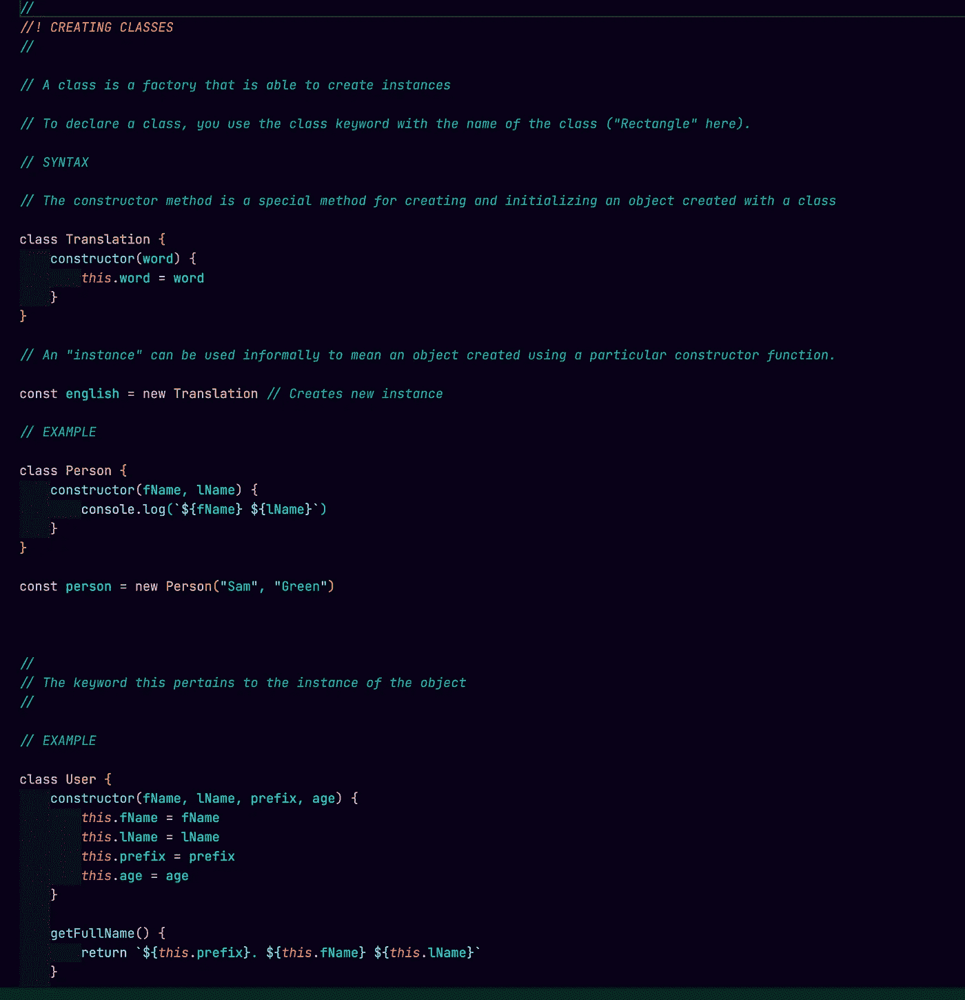
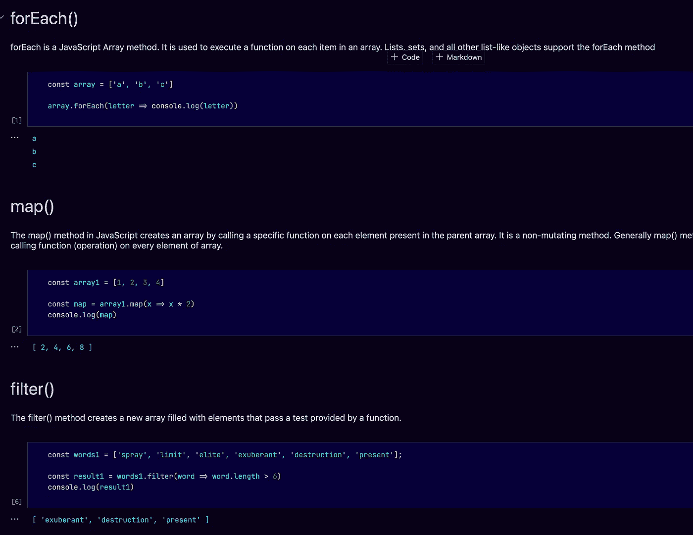
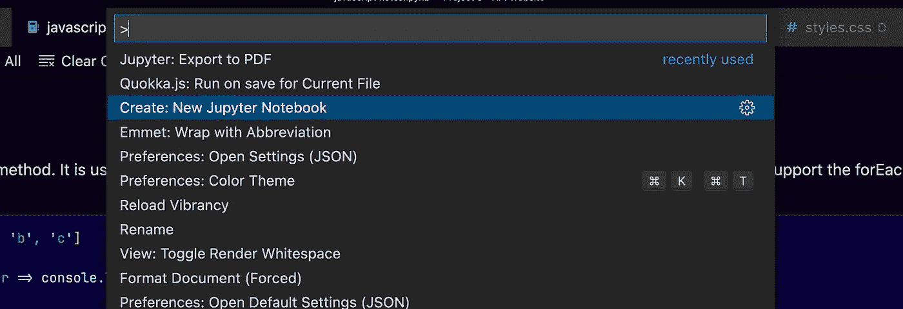
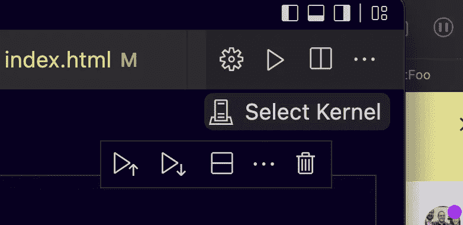
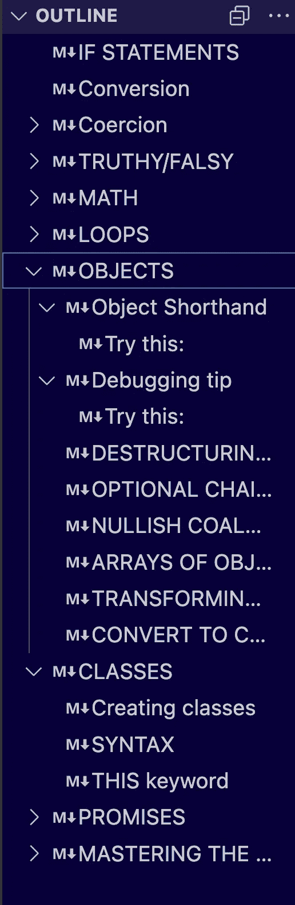
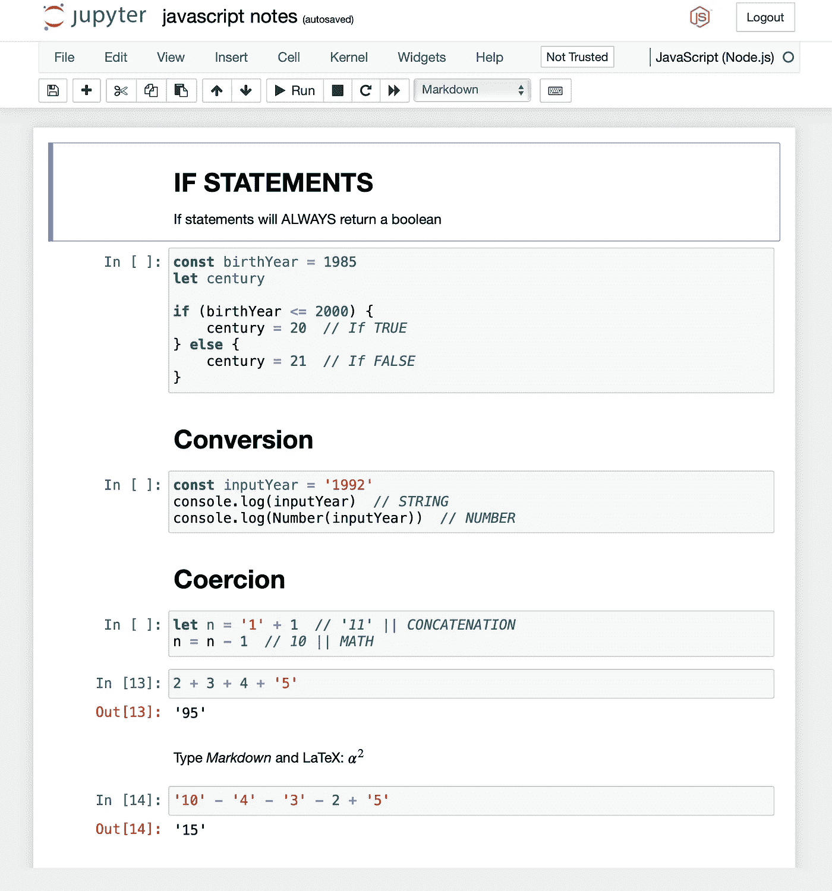

# 我如何在有学习障碍的情况下学习 JavaScript

> 原文：<https://betterprogramming.pub/how-i-am-navigating-learning-javascript-with-learning-disabilities-4212e45ad36>

## 使用 Jupyter 笔记本做 JavaScript 笔记！

马库斯·斯皮斯克在 [Unsplash](https://unsplash.com?utm_source=medium&utm_medium=referral) 上的照片

这不是我第一次尝试 JavaScript (JS)。

早在 2009 年，我进入了南佛罗里达大学的研究生院。

在研究生课程的第一学期，我决定注册一门 JavaScript 课程。该计划要求你完成一门编程语言课程。有两种选择:Flash 和 JavaScript。因为我知道 flash 即将过时，所以我选择了 JavaScript 作为我唯一可行的选择。

我鄙视 JavaScript！我们每周见面一次，每次两小时，持续了 16 周。最后，我差点没通过这门课。不知何故，我设法通过了这门课！

我告诉自己我再也不会学习另一种语言了！

13 年后，我发现自己在一个编码学院学习 MERN 堆栈(Mongo、Express、React、Node)加上 HTML/CSS/JS，强迫自己掌握概念。

我想重点谈谈 JS 和笔记。

在 JS 中，可以用//进行单行注释。对于多行注释，可以使用/* */

当我意识到我需要回去放慢学习 JS 的速度时，我决定我需要自己做笔记。是的，网上已经有很多笔记了，用我能理解的方式写下来对我帮助很大。

我的 VSCode JS notes 文件的屏幕截图

我不知道你怎么想，但是上面说的并不太吸引人。没有什么突出的…

我见过/听说过 Jupyter 笔记本。我一直认为这个概念很酷，将格式化文本和代码块与输出混合在一起！

长话短说，我发现了一种在 VSCode 和 JS 中使用 Jypyter 笔记本的方法！！

我会告诉你怎么做:

VSCode 中的 Jupyter 笔记本

(说明适用于 mac)

1.  使用 npm 在您的系统上安装[JavaScript](https://github.com/n-riesco/ijavascript#:~:text=IJavascript%20is%20a%20Javascript%20kernel%20for%20the%20Jupyter%20notebook.,a%20number%20of%20programming%20languages)
2.  安装 VSCode Python [扩展](https://marketplace.visualstudio.com/items?itemName=ms-python.python)
3.  在你的 mac 上安装 Python 解释器。
4.  在 VSCode 中，打开命令选项板，并搜索“创建:新 Jupyter 笔记本”。

5.在窗口的右上方，您会看到“选择内核”

6.一旦你点击它，命令面板将重新打开，你需要选择 Javascript (node.js)内核。

7.就是这样！用你的新笔记本做功能笔记！！

VSCode 会自动创建一个树状目录，以便于导航

导出到 PDF(不能在 VSCode 中完成):

1.  确保将文件保存为. ipynb 文件
2.  在你的终端，输入 jupyter 笔记本。它将在你的机器上运行 Python 和 Jupyter。
3.  找到并打开。浏览器中的 ipynb

4.选择文件，然后下载为-> PDF

最终的 PDF 表单！