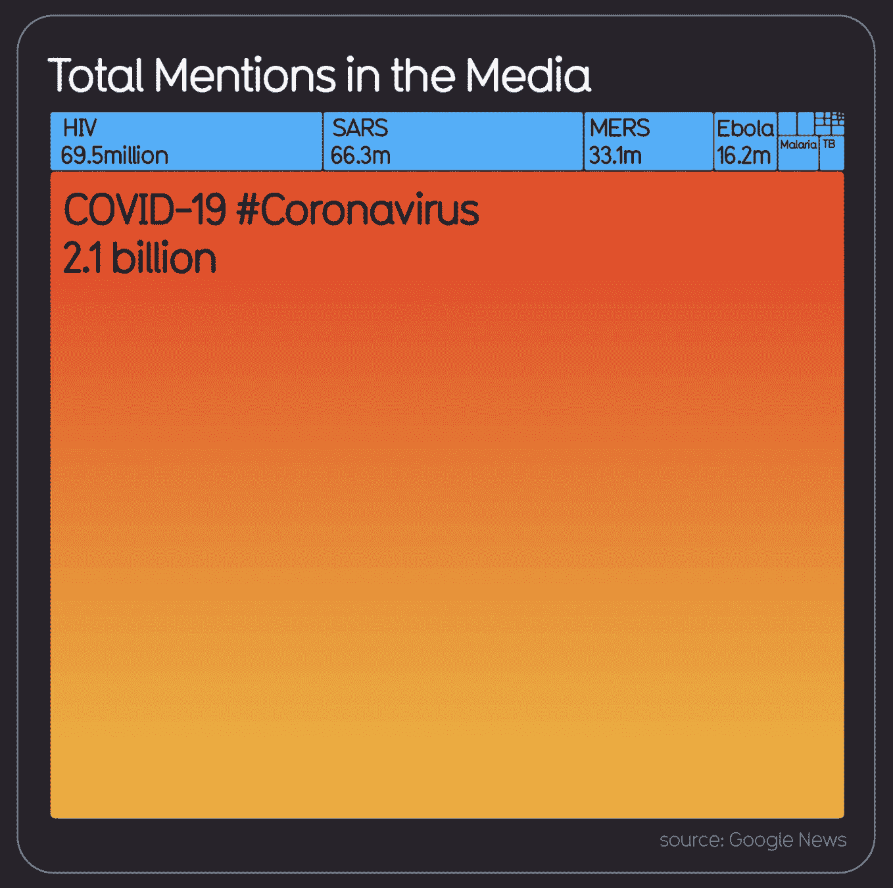
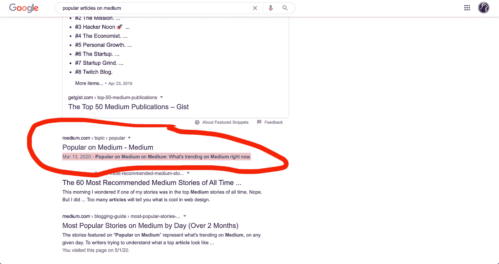
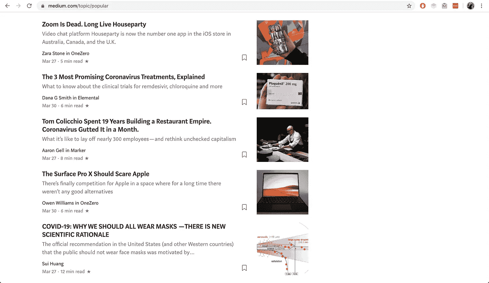
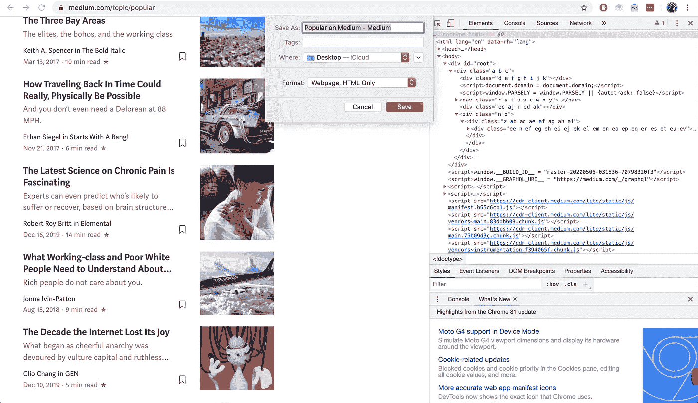
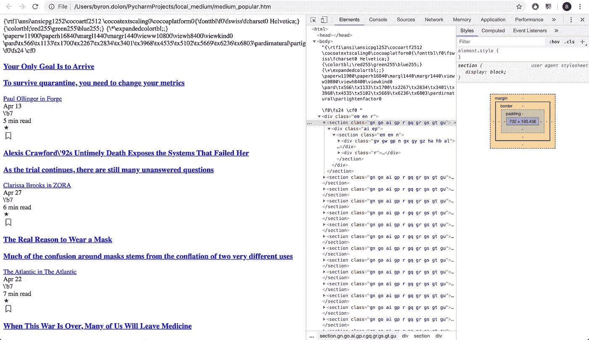
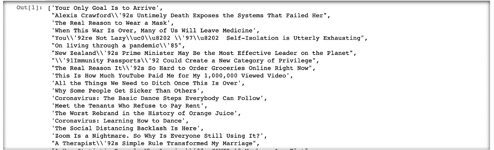
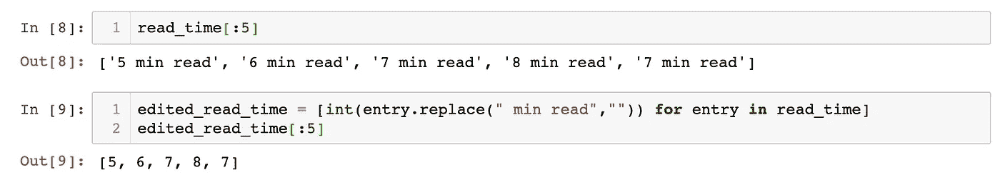
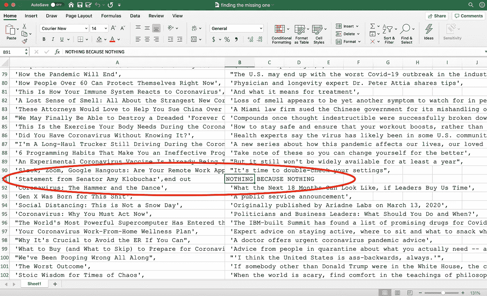
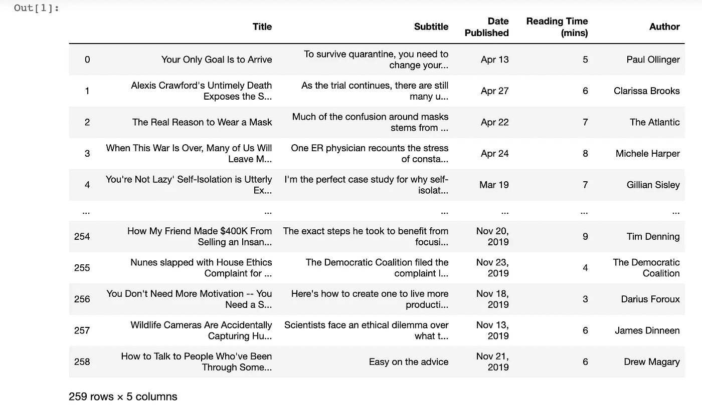

# 我如何用 Python 分析 Medium 的流行页面(第 1 部分)

> 原文：<https://betterprogramming.pub/how-i-analyzed-mediums-popular-page-with-python-part-1-8b81e81ae298>

## 数据收集和预处理:用 XPath 解析 HTML，处理数据，创建熊猫数据框架


照片由[玛格丽特·韦尔](https://unsplash.com/@margotd1?utm_source=medium&utm_medium=referral)在 [Unsplash](https://unsplash.com?utm_source=medium&utm_medium=referral) 拍摄。

关于新冠肺炎的讨论像病毒本身一样迅速传播。它成为历史上被提及最多的疫情。



*照片来自* [*信息漂亮*](https://informationisbeautiful.net/visualizations/covid-19-coronavirus-infographic-datapack/) *。*

在我看到那张照片后，我有一个问题:新冠肺炎在媒体上有多受欢迎？

在我的个人推荐和我关注的出版物上，我看到了很多关于这方面的文章。然而，我不确定我是否坐在回音室里，或者整个媒体是否真的在谈论病毒。

几天前，我在媒体上发表了我的发现。现在，我将再次展示我的发现——只是这一次，我还将展示我回答主要问题的过程中的每一步。这部分是该过程的第一部分，即数据收集和预处理。第二部分将着重分析。本文介绍的完整代码在最下面。

# 准备好数据

## 我应该从哪里获取数据？

第一步是找出如何最好地跟踪媒体上的热门文章。刮掉每一篇文章是不可能的。我谷歌了一下“媒体上的流行文章”,得到的回复是这样的:



谷歌搜索

我最近才开始使用 Medium，所以我不知道有一整页都在讨论“Medium 现在的趋势是什么”是的，我知道它在 Medium 页面顶部的栏上，但我以前从未点击过它。当我看到这个页面时，它正是我所需要的:一个在 Medium 上有趋势的文章列表。

我还注意到页面不是静态的。页面顶部是最近发表的文章，向下滚动可以看到更早发表的文章。



在 Medium 的热门页面向下滚动

## 我应该如何获取数据？

早在 2019 年 11 月，新冠肺炎在社交媒体上真正爆发之前，我就想收集数据。现在，我已经在过去使用 Python 的 [Scrapy](https://scrapy.org/) 库进行了一个[简单的项目](https://bit.ly/byronown3)，所以这就是我想到的用来抓取中等文章数据的方法。

然而，我对网络抓取的了解仍然相当有限。我知道有几种不同的方法来滚动网页，这样你就可以抓取下面的数据(例如，Splash 和 Selenium)。在过去，我没有这样做过，因为我的项目只需要一个简单的爬虫来抓取静态站点。

我不想花太多时间去弄清楚如何做到这一点，因为我主要想专注于数据的分析。我决定走一条捷径，一路向下滚动热门页面，直到 2019 年 11 月。然后，我将该页面的副本保存到我的桌面上。



在介质上保存页面

现在，我可以使用 Python 来抓取我保存的本地 HTML 文件。



媒体流行页面的本地 HTML 副本

为了选择标题、副标题、出版日期、作者和阅读时间，我需要编写相关的 XPath 选择器。这个[堆栈溢出问题](https://stackoverflow.com/questions/11465555/can-we-use-xpath-with-beautifulsoup)的第一个答案给了我一些初始代码，让我可以用 XPath 解析 HTML:

HTML 类有空格，所以我必须在 XPath 选择器中使用`contains`来获取类。为了获得所有的元素，我只需将鼠标悬停在网页上我需要的每个元素上，Chrome inspector 就会为我高亮显示。这允许我编写我需要的所有 XPath 选择器。`Title`的输出是一个如下所示的列表:



“标题”HTML 解析的输出

字幕看起来与此类似，所以我得到了关键字分析所需的所有原始元数据。

## 处理数据的步骤

问题是像`\\’92`这样的随机文本字符串，我认为它们是用来表示特殊字符的。现在，如果你有脑子，你就不会做我接下来做的事情:

我在 list comprehension 中将一串`.replace()`串在一起，创建一个新的列表，手动删除不需要的字符。输出是这样的:


编辑列表输出以删除多余的字符

我并不以此为荣，但这只花了两分钟就成功了。

如果我想分析数字，我还重新格式化了`read_time`,使它只有一个整数。解析的当前输出类似于`5 min read time`，我希望只有`5`。所以我写了另一个快速列表理解，去掉了多余的文本，只留下一个整数值:

```
edited_read_time = [int(entry.replace(" min read","")) for entry in read_time]
```



编辑的读取时间输出只有整数

我的下一步是通过将列表组合在一起创建一个[熊猫](https://pandas.pydata.org/)数据框架。所有列表的长度必须相同。否则，pandas 会引发一个 ValueError 错误，指出数组的长度必须相同。我相当肯定他们应该已经准备好装载到熊猫，但只是为了再次检查，我看了每个列表的长度。


为什么少了一个？

我必须想办法解决这个问题。我不引以为豪的事情的第二部分是我提取标题和副标题列表。只少了一个，所以我想不会花太多时间。我把这些列表并排放在一起，只寻找哪个副标题不见了:



这一个花了大约三分钟，所以不太坏。

我看到缺失项的索引是“91”(Python 中的`90`)，就简单地把`N/A`插入到提取的字幕列表中:

```
edited.subtitle.insert(90, 'N/A')
```

现在，所有的列表都对齐了。为了创建数据帧，我创建了一个指定列名和值的字典:

最终的 DataFrame 输出如下所示:



熊猫数据框上显示的中流行页面文章

精彩！现在我可以开始分析了。

差不多了。我在这个项目上工作了两天，第二天，我注意到流行页面上又多了一篇文章。我想将它包含在我的数据集中，所以我只是手动插入它:

现在，数据集是完整的，我可以开始我的分析。

# 概述

概括地说，数据收集和处理:

1.  保存中等流行页面的本地 HTML 副本。
2.  用`lxml etree` XPath 选择器解析 HTML。
3.  通过删除多余的字符、填充缺失的数据以及将读取时间调整为整数值来处理数据。
4.  将所有提取的元数据列表合并到一个 pandas 数据帧中。

您现在可以查看[第 2 部分](https://medium.com/better-programming/how-i-analyzed-mediums-popular-page-with-python-part-2-c1952583061e?source=friends_link&sk=df8aa7dc2e719fb46446b35d65a7daa7)中关于数据分析和可视化的熊猫和画面！

## 用于第 1 部分的代码

完整的数据收集和处理[代码](https://gist.github.com/survivorchicken9/db3b017200655ceff7e99bbfb1ed786a)