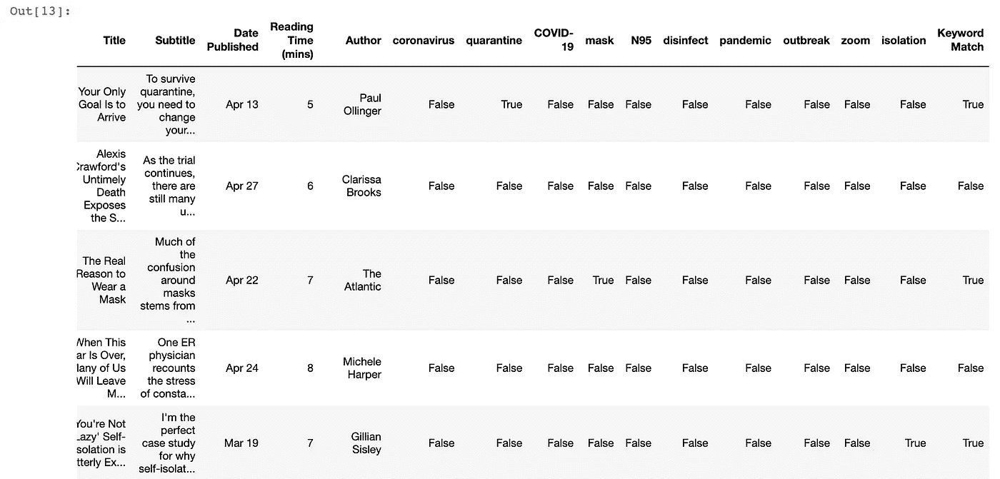
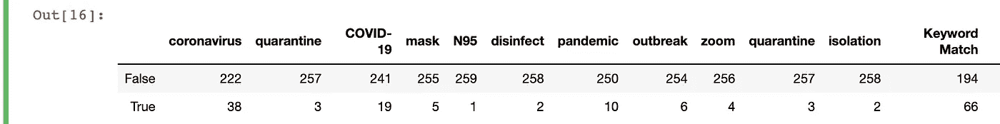
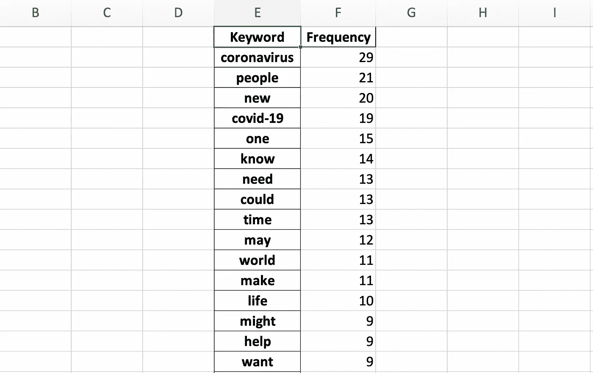
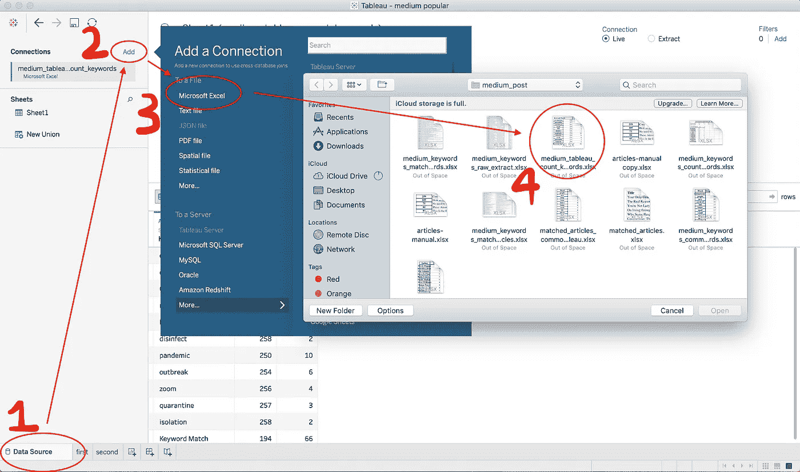
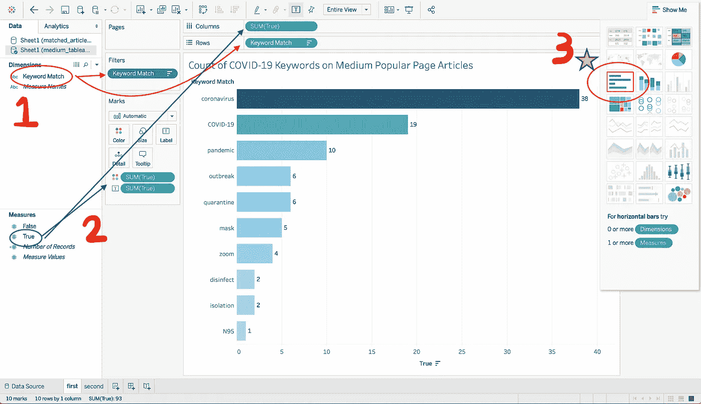
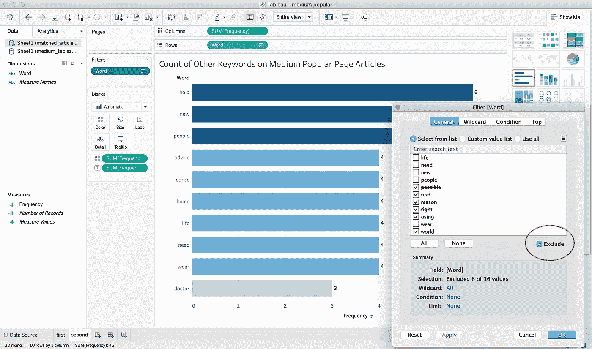
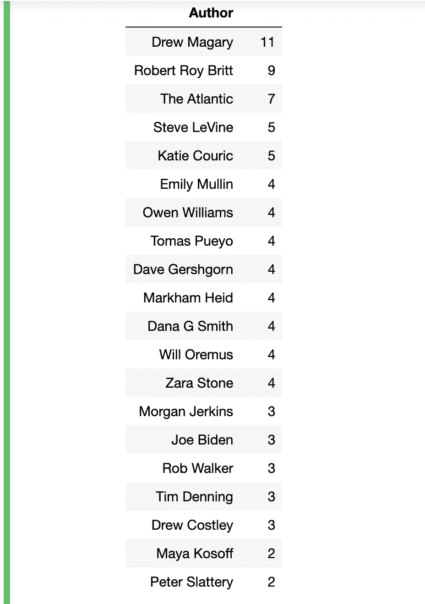

# 我如何用 Python 分析 Medium 的流行页面(第 2 部分)

> 原文：<https://betterprogramming.pub/how-i-analyzed-mediums-popular-page-with-python-part-2-c1952583061e>

## 用熊猫理解数据，用 Tableau 可视化数据


卢克·切瑟在 [Unsplash](https://unsplash.com/s/photos/data?utm_source=unsplash&utm_medium=referral&utm_content=creditCopyText) 上拍摄的照片

这是一系列分析媒体的流行页面的第二部分，涵盖了分析的工具和输出。有关数据收集和预处理步骤，请查看[第 1 部分](https://medium.com/better-programming/how-i-analyzed-mediums-popular-page-with-python-part-1-8b81e81ae298)。

让我们回顾一下我们在第 1 部分学到的内容。为了准备好数据，我们有:

*   成功拿下热门页面的 HTML。
*   用 Python 搜集了必要的元数据。
*   处理了这些数据，这样就可以进行分析了。
*   将数据载入一只熊猫`DataFrame`。

现在，我们准备好回答主要问题了:

*新冠肺炎在媒体上有多受欢迎？*

# 分析数据

首先要做的是设置我想要搜索的关键词。如果我只搜索“冠状病毒”和“新冠肺炎”，我不太可能在热门页面上找到所有与新冠肺炎相关的文章我浏览了一下`DataFrame`的标题和副标题，列出了一个我认为能抓住大部分相关内容的列表:

```
# define keywords to look for
keywords = ['coronavirus',
            'quarantine',
            'COVID-19',
            'mask',
            'N95',
            'disinfect',
            'pandemic',
            'outbreak',
            'zoom',
            'quarantine',
            'isolation']
```

接下来，我编写了一个循环来检查`DataFrame`的每一行的关键字。这意味着将行组合在一起，将输出转换为字符串，并检查每个关键字是否都在字符串中。如果关键字在字符串中，`True`将被添加到`DataFrame`中的关键字列。

```
# search rows for keywords and show True if there is a match
for keyword in keywords:
    df[keyword] = df.astype(str).sum(axis=1).str.contains(keyword, case=False)
```

我还希望有一行显示是否有任何关键字匹配，有一列显示该作品是否与新冠肺炎有关。我添加了另一行来检查`df[keyword]`列是否为真。

```
df['Keyword Match'] = df.astype(str).sum(axis=1).str.contains('True', case=False)
```

`DataFrame`现在看起来是这样的:



检查标题或副标题中是否有关键词

此时，我可以直接转到 Tableau 进行更多的分析和可视化。但是因为我已经和熊猫一起工作了，我决定在我的笔记本上做更多的处理来获得更多的练习。

下一步是统计每个关键词被使用的次数，以及文章是如何与新冠肺炎相关的。我创建了一个新的`DataFrame`,其中只有包含 true 或 false 值的关键字。然后，我用`value_counts`来统计`True`和`False`在每一列出现的次数。`apply` so `the value_counts`功能可沿数据帧的轴应用。

```
# add to existing keywords list for the total count column created
keywords.append('Keyword Match')# define count of keywords df and get count of each column
count_of_keywords = df[keywords]
count_of_keywords = count_of_keywords.apply(pd.Series.value_counts)
```

结果`DataFrame`给出了每个关键词出现的次数，以及包含新冠肺炎相关关键词的文章总数。



关键词计数输出

此时，我有了主要的发现。我可以说，根据我定义的关键词，中等流行页面上的 260 篇文章中有 66 篇与新冠肺炎有关。(在我发表的主要文章中，我写道这是 262 篇文章中的一篇，因为有两篇文章被添加到了热门页面。)这意味着:

换句话说，中等流行页面上 66/262 ≈ 25%的文章是关于冠状病毒的。

接下来，我想看看其他主题或关键词是否频繁出现在中等流行的页面上。这将是一个二级指标，以确定新冠肺炎的话题有多受欢迎。也许我只是通过寻找新冠肺炎关键词来偏向我的分析。所以我做了第二次检查，找出标题和副标题中所有最常见的单词。

我使用了 `nltk`模块的`stopwords`来过滤掉常见的单词，如“by”、“for”和“with”然后，我将标题和副标题转换为文本和 Python 的`Counter`和`.most_common`，以找出每个单词出现的次数。(如果您以前没有遇到过这些，请查看[文档](https://docs.python.org/3/library/collections.html)。)我将结果加载到一个`DataFrame`中，并将结果导出到 Excel。

```
# Generate DF out of Counter
rslt = pd.DataFrame(Counter(words).most_common(100),columns=['Keyword', 'Frequency']).set_index('Keyword')
```



标题和副标题中所有最常见的单词

我立刻觉得不对劲。“冠状病毒”的数量是 29，而我之前的分析显示是 38。但是向下滚动的时候，我看到还有另外一个关键词“冠状病毒 **:** ，补齐了剩下的缺失值。“新冠肺炎”关键词计数与我最初的关键词匹配，所以我继续分析。

根据新的关键词，看起来没有任何其他的主要趋势。没有一个被提及超过 10 次的词是指向任何其他热门话题的名词。因此，我提出的前提是，从 2019 年 11 月到 2020 年 5 月，新冠肺炎是媒体上最受欢迎的话题。我准备好继续观察结果了。

# 数据可视化

因为我已经完成了熊猫的大部分处理，所以我准备在 Tableau 上创建我的图形。本节演示了使用 Tableau 创建图形是多么容易——它不包括任何复杂的 Tableau 功能。

点击四次，我导入了包含新冠肺炎相关关键词计数的 Excel 导出。



Tableau 数据导入流程



Tableau 图形创建

Tableau 非常适合拖放。为了创建这个图表，我将`Keyword Match`(在 Excel 表格中是一个关键字列表)移动到`Rows`，然后将`True`(即如果一个关键字在标题或副标题中)移动到`Columns`。这应该会自动为您创建一个图表。如果你点击右上角的`Show Me`，你可以自由选择你想要的任何一种图形。我选择了水平条形图，因为它看起来是可视化数据的最佳方式。我在为所有其他常见关键字创建图表时重复了这个过程。



Tableau 上的其他常用关键字图形

在这里，我做了更多的处理，删除了那些我觉得对理解媒体上流行的东西没有帮助的词。例如“可能的”、“正确的”和“使用”也出现了不止一次，但并不指向任何特定的趋势。你可以通过添加一个过滤器来排除关键词，正如你在上面的截图中看到的，或者通过单击图中的任何单个栏，你会看到一个从结果中排除它的选项。

# 人工阅读

为了进一步分析，我想从专门关于新冠肺炎的文章中提取最常见的主题。我无法从之前提取的关键词中做到这一点，因为所有文章中唯一常见的词是“冠状病毒”和“新冠肺炎”因此，我决定浏览整个书目列表，并手动随机抽取五个样本。

本着在 Python 上保持东西的精神，我写了这个快捷行来选择文章:

```
# Random article index generator
import randomfor i in range(0,5):
    print(random.randint(0,68))
```

然后，我去读了这五篇文章，并写了一个简短的总结。最常见的话题是:

*   时事。
*   健康和安全。
*   个人经历。

现在你知道我写《新冠肺炎在媒体上有多受欢迎》的所有步骤了文章！

# 那么，新冠肺炎在媒体上有多受欢迎呢？

我不认为这只是我不断看到我的饲料冠状病毒相关的作品。我在分析中纳入了早在 2019 年 11 月的文章，因为(据称)第一例新冠肺炎病例是在 12 月 1 日。这就是我如何得出统计数据的，即在中等受欢迎的页面上，有四分之一的文章与 corona 有关(总共 262 篇文章中的 66 篇匹配)。

有趣的是，如果我们从第一篇关于新冠肺炎的文章发表的时间算起，我们在热门页面上的文章总数达到了 121 篇。所以，*从 3 月 2 日到 5 月 1 日，Medium 热门页面上 54%的文章都与冠状病毒有关。*

当我说我所读的一半是关于新冠肺炎的时候，我想我并没有说得太离谱。这并不是说这个趋势是好是坏。这只是看看媒体上的每个人都在读什么。

# 局限性和后续行动

我想指出的第一点是，所有这些分析都充斥着我根据自己的判断对数据进行的额外处理。这包括在我统计与新冠肺炎相关的文章时出现误报的可能性。我手动查看了许多积极的文章，这样我就可以宣称 1/4 的文章是关于新冠肺炎的。然而，我定义的关键词可能包括一篇使用了“面具”或“隔离”这样的词而没有讨论疫情的文章。这也包括我在展示 Tableau 中的图表时删除其他“常用关键字”的选择。

我发现做这样的项目暴露了我知识上的很多空白。之后，我学习了使用 Python 的新方法，比如利用 lxml 使用 XPath 选择器，这样我就可以解析 HTML。和往常一样，StackOverflow 给了我一些问题的答案和如何开始的想法(以及一些值得复制粘贴的代码)。然而，其中一个重要的收获是留出更多的时间来学习 T4。我想我最近已经做了很多边做边学的事情，但是我也需要在这和*边学边学*之间取得平衡。

一些个人后续学习思路:

*   创建一个不断更新的数据库，其中包含来自 Medium 热门页面的元数据。
*   回顾熊猫的一些核心功能以及如何最好地使用它。
*   深入了解`nltk`的能力。

我希望这清楚地告诉你我是如何在 Medium 的流行页面上做一个快速而肮脏的研究项目的。这肯定不是完美的，但我认为记录我现在所做的事情意味着一年后，我可以回头看看这个，并做出质量更好的东西。

# 额外收获:经常访问媒体热门页面的作者

因为我已经有了数据，我想我可以展示谁一直在 Medium 的流行页面上名列前茅。我想我可以试着从他们的写作中找到一个秘密公式，但我真正学到的只是“哇，他们是好作家”。这是一行代码，显示了作者的名字和他们出现在热门页面上的次数(从 2019 年 11 月到 2020 年 5 月):

```
# authors to hit the popular page most
popular_authors = df[['Author','Title']].groupby(['Author']).count().sort_values(by='Title',ascending=False).head(20)
```



我想再次感谢在新冠肺炎疫情期间在医疗部门工作的每一个人。一些国家看起来正在复苏，这给受病毒影响的人带来了急需的希望和安慰。正是因为你们的努力，我们才有了希望，所以非常感谢你们每天冒着风险抗击这种疾病。