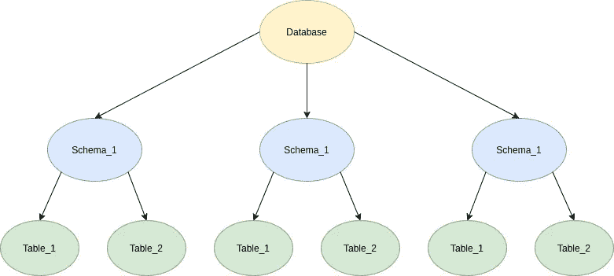

# 我如何在多租户数据库模型中自动化数据库模式迁移

> 原文：<https://betterprogramming.pub/how-i-automated-database-schema-migrations-in-a-multi-tenant-database-model-using-liquibase-f75f9683ee06>

## *我如何使用 Liquibase、Docker、Gradle、Jenkins 和 Shell 脚本在 PostgreSQL 数据库中自动化数据库模式迁移*


照片由 [Sai Kiran Anagani](https://unsplash.com/@_imkiran?utm_source=medium&utm_medium=referral) 在 [Unsplash](https://unsplash.com?utm_source=medium&utm_medium=referral) 上拍摄

在我目前正在开发的一个应用程序中，有一个将数据库迁移到管道中的自动化需求。我们的数据库模型基于多租户数据库设计。这意味着在同一个数据库中，您可以找到许多模式。数据库结构将如下所示。



**多租户数据库模型**

当需要进行数据库迁移时，我们通常针对每个模式运行迁移脚本，这是一项繁琐的任务。

例如，假设我们要添加一个新列，`column_A`到`table_1`。为此，我们应该编写以下 SQL 语句。

```
Alter table table_1 Add Column column_A varchar(255)
```

因为我们使用多租户数据库设计，所以需要对数据库中的每个模式进行相同的更改，因为每个模式中都有`table_1`。

然后，我们开始使用如下所示的 PL/PGSQL 脚本来完成这项工作。

这将根据数据库中的每个模式更新我们的 DB 更改。然而，这必须手动完成。如果我们能够将它与我们的构建管道集成，将会节省很多时间。

首先，我想到手动实现一个解决方案。但是我在网上搜索了一个已经为我解决了这个问题的解决方案。然后我就有了一个叫做 [Liquibase](https://www.liquibase.org/) 的东西。

# 为什么使用 Liquibase 而不是手动解决方案

使用 Liquibase 代替手动解决方案的主要好处是可以获得支持。由于 Liquibase 库在全世界已经被下载了超过 3000 万次，当出现问题时，可以很容易地找到解决方案。

而 Liquibase 社区版(免费版)几乎支持我们所有的需求。按照现在的情况，没有必要使用专业版。pro 版本的一个主要好处是 Liquibase 本身的直接支持。但由于 Liquibase 在开发人员社区中很受欢迎，大多数时候只需在网上查找就能找到解决方案。

## Liquibase 的工作原理

Liquibase 管理一个叫做`changelog`的文件。看起来是这样的。

您可以向这个`changelog`文件添加任意数量的`changesets`，如上面的代码片段所示。

当您从 Liquibase 运行`update`命令时，它将更新您的数据库中的特定数据库模式。(我们如何运行`update`将在后面讨论)。

在`changelog`文件中，`--changeset author.name::tracking_number`是重要的。通过这个 SQL 注释，Liquibase 识别出它是一个新的`changeset`。Liquibase 在一个名为`databasechangelog`的表中跟踪这些`changesets`。你可以通过下面的链接找到更多关于`databasechangelog`表和 Liquibase 如何工作的信息。

[](https://www.liquibase.org/get-started/how-liquibase-works) [## 开始使用 Liquibase 如何工作| Liquibase.org

### Liquibase 使用一个 changelog 来显式地按顺序列出数据库更改。变更日志充当变更的分类帐，并且…

www.liquibase.org](https://www.liquibase.org/get-started/how-liquibase-works) 

通过与上表比较，Liquibase 可以识别应该运行的新`changesets`和已经执行的。

除了`databasechangelog`表，Liquibase 还在 DB 模式中维护了另一个表，用于同步目的。那叫`databasechangeloglock`。如果您针对您的模式并行运行迁移脚本，这个表会很方便。

Liquibase 只是一个 Java 库。如果您使用 [Gradle](https://gradle.org/) 作为构建工具，您可以在您的`build.gradle`文件中添加 Liquibase 依赖项，或者如果您使用 [Maven](http://maven.apache.org/) ，您可以在您的`pom.xml`文件中添加 liqui base 依赖项。我将解释这应该如何集成到 Gradle 任务中，因为我们使用 Gradle 作为我们的构建工具。Liquibase 官方文档描述了如果使用 Maven 作为构建工具，如何在 Maven 中集成 Liquibase。

 [## 专家

### Liquibase 可以通过一个 Maven 插件来控制，这个插件可以从中央 Maven 存储库中获得。你可以找到…

docs.liquibase.com](https://docs.liquibase.com/tools-integrations/maven/home.html) 

# 如何将 Liquibase 更新作为梯度任务运行

以下代码片段显示了如何在`build.gradle`文件中使用 Liquibase。

1.  添加 Liquibase 作为依赖项，并将其作为插件应用。

2.定义一个 Gradle 任务来运行 Liquibase `update`作为构建的一部分。

您可以在`activities`块中添加任意数量的 DB 模式来运行`changesets`。这里我添加了两个模式。您必须提供`changelog`文件路径、数据库模式 URL、数据库用户名和数据库密码作为 Liquibase 属性。(像我在这里所做的那样将`username`和`password`存放在户外不是一个好习惯。您应该将这些凭证存储在类似 AWS 参数存储的地方。这是如何做到的将在后面讨论。)

当您构建项目时，`dev`任务将会运行，并且由于 build `dependsOn`既有`dev`任务又有`update`任务，Liquibase `update`命令也将作为 Gradle 任务的一部分运行。

然后通过查看 DB 模式中的`databasechangelock`表，您可以确保`changesets`已经运行。新的一行应该已经添加到`databasechangelock`表中。


**grad le 任务已成功运行**

这样做了之后，需求就改变了。该要求坚持认为，这一进程应包括在詹金斯管道。所以我从 Gradle 构建中删除了这个任务，并把它放到了`Jenkinsfile`中。

如果你还不知道什么是`Jenkinsfile`，下面的教程会给你一个很好的概述。

[](https://www.jenkins.io/doc/book/pipeline/jenkinsfile/) [## 使用 Jenkinsfile

### 本节以《Pipeline 入门》中介绍的信息为基础，介绍了更多有用的步骤…

www.jenkins.io](https://www.jenkins.io/doc/book/pipeline/jenkinsfile/) 

`Jenkinsfile`使用 [Groovy](https://groovy-lang.org/) 来定义管道中应该做什么。您可以在`Jenkinsfile`中定义阶段来运行不同的程序。例如，您可以定义一个阶段来构建您的代码。然后，您可以定义另一个阶段来将您的代码部署到服务器。你可以通过我上面提到的 Jenkins 官方网站找到如何做到这一点。

所以我的第一个方法是在 Jenkins 运行的 Linux EC2 实例中安装 Liquibase，并编写一个 shell 脚本来更新 DB 模式。但是这是不可能的，因为这个 Jenkins 设置是由第三方供应商创建的，他们不愿意给我`pem`文件来访问特定的 EC2 实例。没有通过`ssh`访问 EC2 机器，我不得不寻找另一种方法从`Jenkinsfile`运行 Liquibase，而不在机器上安装 Liquibase。

然后我发现 Liquibase 有自己的 Docker 镜像。您可以使用 Docker 映像运行任何 Liquibase 命令。您应该提供`changelog`文件和凭证来访问数据库。对于一个 [PostgreSQL](https://www.postgresql.org/) DB，可以这样做。

```
docker run --rm -v <PATH TO CHANGELOG DIR>:/liquibase/changelog liquibase/liquibase --url="jdbc:postgresql://<IP OR HOSTNAME>:5432/<DATABASE>?currentSchema=<SCHEMA NAME>" --changeLogFile=/liquibase/changelog/<CHANGELOG NAME ie: "changelog.xml"> --username=<USERNAME> --password=<PASSWORD> update
```

上面的命令所做的是将`<PATH TO CHANGELOG DIR>`挂载到 Docker 容器中的`/liquibase/changelog`目录，并从那里运行命令。

现在，这更新了一个模式的更改。但是因为我的数据库模型是多租户的，所以应该为每个模式运行。我应该遍历数据库的每个模式。问题是从哪里获取模式和凭证。一个非常简单的方法是在`Jenkinsfile`本身的环境变量中定义模式和 DB 凭证。然而，保持 DB 凭证公开并不是一个好的做法。正如我前面提到的，我可以很容易地将这些细节存储在 AWS 参数存储中。

您需要做的是使用 AWS CLI 从 AWS 参数存储中检索这些细节，并遍历模式，使用 Liquibase Docker 映像为每个模式运行 DB 迁移。可以通过使用 Shell 脚本来完成，如下所示。

上面的代码片段是实际`Jenkinsfile`的一部分。第一阶段暂停管道，并询问用户是否希望在运行单元测试之前运行迁移。如果他们确认要运行迁移，则只运行第二阶段。否则，将跳过第二阶段。

第二阶段检查用户是否希望运行数据库迁移，并相应地运行 Shell 脚本。在这里，`withAWS`属性的作用是使用凭证连接到特定的 AWS 帐户。然后使用 AWS CLI 从 AWS 参数存储中检索模式列表、用户名和密码。

然后，它遍历模式列表，并对每个模式执行`liquibase update`命令。

在流程完成后，您可以通过查看`databasechangelog`来验证更新是否已经正确运行。

这是在多租户数据库模型中自动化数据库迁移的一种方式。也许还有其他更有效的方法。也许 Liquibase 并不是一个好的解决方案。请在评论区告诉我你对此的建议和想法。我认为这可能在某种程度上帮助某人。

最后，由于这是我第一篇关于 Medium 的文章，所以可能还有很多东西我应该学习。我希望将来能写更多这样的文章，你对此的想法将是无价的。

*感谢阅读！*