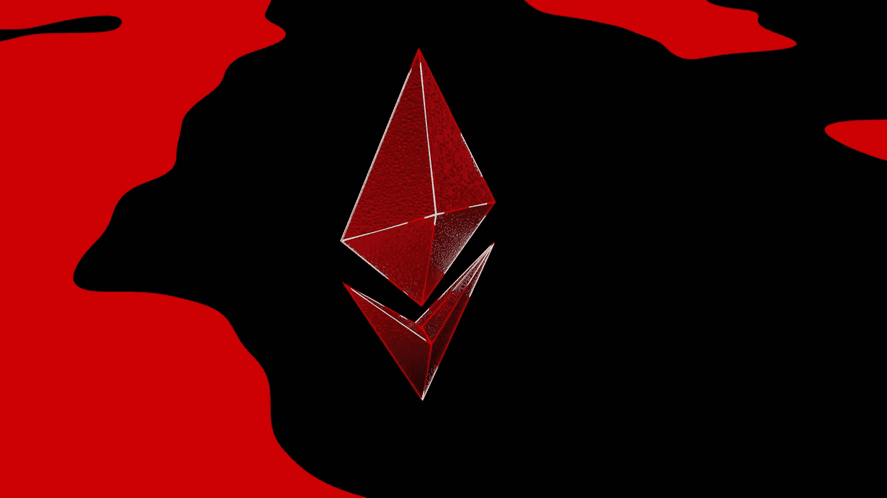
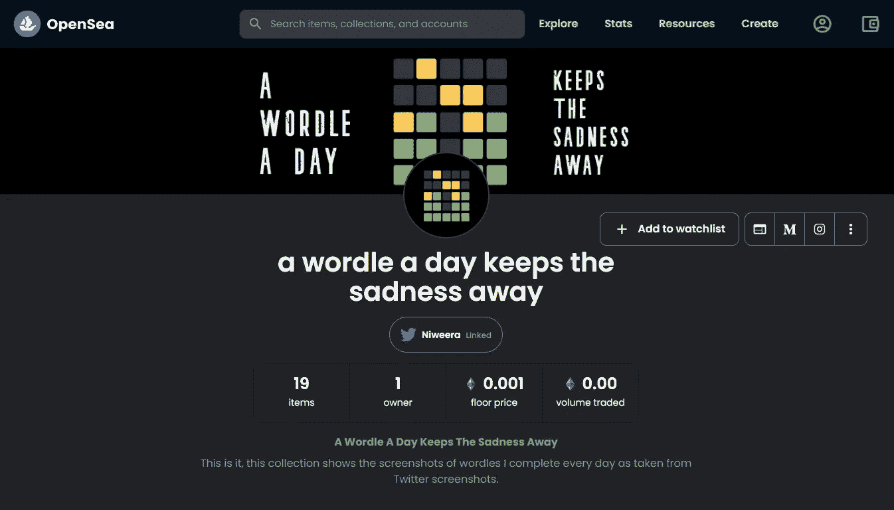
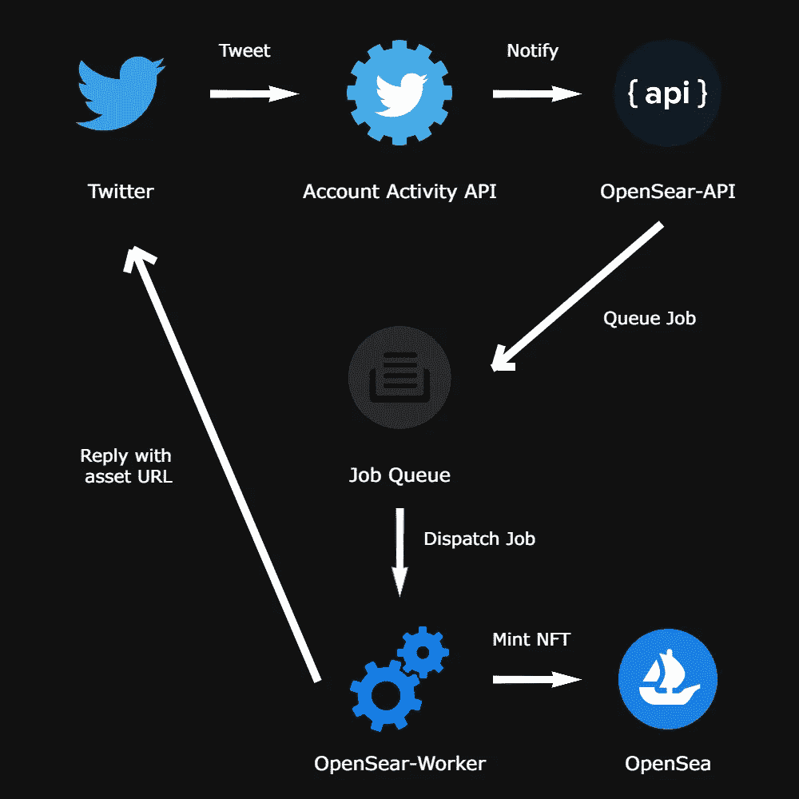

# 我如何在 OpenSea 上自动将我的推文制作成非功能性文件

> 原文：<https://betterprogramming.pub/how-i-automated-minting-my-tweets-as-nfts-on-opensea-854c50a44467>

## 下面是我如何创建自己的系统来上市和铸造非功能性交易



由 [Unsplash](https://unsplash.com/s/photos/ethereum?utm_source=unsplash&utm_medium=referral&utm_content=creditCopyText) 上的 [Shubham Dhage](https://unsplash.com/@theshubhamdhage?utm_source=unsplash&utm_medium=referral&utm_content=creditCopyText) 拍摄的照片

在这篇文章中，我讨论了我是如何通过去中心化 web 应用程序( [dApps](https://ethereum.org/en/dapps/#what-are-dapps) )的 UI 自动化的一些试验和磨难将我疯狂的想法变成现实的。

这一切都是从有一天我偶然看到一个关于 [**Web3**](https://web3.foundation/) 应用和 minting [**NFTs**](https://en.wikipedia.org/wiki/Non-fungible_token) 的 [YouTube 视频](https://www.youtube.com/watch?v=meTpMP0J5E8)开始的。我很好奇什么是 NFT，为什么我还要担心 Web3(我知道这有点晚了)。我看了杰夫·德莱尼 ( [Fireship.io](https://fireship.io) )的视频，了解了 NFTs 以及什么是 Web3 和 dApps。

现在我有一个大问题:我应该把什么做成非功能性食物？因为我不是艺术家，我不知道该做什么。所以思考的部分来了。

我知道了一个网站，在那里你可以制作并出售你的推文，名为[贵重物品](https://v.cent.co/)(他们正在做的是抓取推文的截图，并根据它制作一个 NFT 代币)。很自然的，我在那个平台上铸造并出版了我的第一个 NFT。令人惊讶的是，我了解到我不需要贵重物品平台来将我的推文铸造成 NFT，我可以使用 [OpenSea.io](https://opensea.io/) 平台将我的推文铸造成 NFT。

OpenSea 是最大的 NFT 市场，它是一个运行在以太坊区块链上的分散式 web 应用程序。在[学会如何去做](https://support.opensea.io/hc/en-us/articles/1500003113761-What-are-the-key-terms-to-know-before-I-get-started-)之后，我在 OpenSea】创建了我的第一个 NFT 收藏，并在市场上上市。



来自:【https://opensea.io/collection/wordle-keeps-sadness-away 

因此，正如我之前提到的，手工铸造 NFT 是一项乏味的工作。如果你有数以千计的图片，你仍然需要手动上传它们，手动提供必要的元数据，并铸造令牌。所以我想，嗯如果我能做到，电脑肯定也能做到。

然后我为 OpenSea 平台寻找一个[开发者 API](https://docs.opensea.io/reference/api-overview) 。不幸的是，您只能查看资产，而不能使用 API 创建资产。所以我打开了 UI 自动化，这是按照所有的手动步骤铸造一个 NFT，但使用一个自动化的浏览器。以下是我在 OpenSea 上手动制作 NFT 的步骤。

1.  首先，我完成一个 [Wordle](https://www.nytimes.com/games/wordle/index.html) 谜题，并在推特上分享结果。
2.  使用 [TweetPik 应用](https://tweetpik.com/#app)对推文进行截图。
3.  给截图加一些润色(如果你懂我意思的话)。
4.  进入 [OpenSea.io](https://opensea.io) marketplace，进入[添加资产页面](https://opensea.io/collection/wordle-keeps-sadness-away/assets/create)。
5.  上传截图。
6.  添加一个唯一的名称(这是非常必要的)。
7.  添加一个外部链接(这个链接可以是与资产相关的任何东西，但是这里我放的是截图的 tweet URL)。
8.  添加描述。
9.  添加与资产相关的元数据(作为元数据，我添加等级和统计数据，其中等级是我完成 Wordle [try/6]的尝试次数，作为统计数据，我添加来自 Wordle 的黑色、绿色和黄色块的数量)。
10.  最后，我通过点击*创建*按钮来创建 NFT。

这是我要自动化的过程。然而，还有最后一步，你可以在市场上列出 NFT 的售价。

但是我不打算自动化它，因为那是我不应该自动化的东西。*没有人应该让一台机器为你报价*。这对每个人都不利，因为任何资产的价格都是基于对该资产的感知价值。

机器不能感知任何东西，因为它不是人类。想要了解更多关于事物如何被估价的信息，请看由[克利奥·艾布拉姆](https://medium.com/u/959596deae41?source=post_page-----854c50a44467--------------------------------)制作的[视频纪录片](https://www.youtube.com/watch?v=451V-lBLfuo&t=222s)。

**讲故事讲够了；给我看看代码！**

好了，我终于开始写代码了。首先，我们需要对我们试图构建的东西有一个高层次的理解。让我展示一个我正在构建的系统的高层架构图。让我们称之为 OpenSear 系统(好吧，这个名字可能已经被其他人取了，但当时我想了一个机智的名字，我没有想到)。实际上，名字并不重要，重要的是它能做什么，对吗？



使用[https://pixlr.com/](https://pixlr.com/)创建的所有标志都符合“合理使用”的规定。

**我如何使用 Twitter 账户活动 API 实时收听我的推文？**

我必须自动化的第一项任务是，每当我发布一条 Wordle tweet 时就进行监听，并创建一个新的作业，将其放入作业队列中。为此，我使用了 [Twitter 账户活动 API](https://developer.twitter.com/en/docs/twitter-api/premium/account-activity-api/overview) ,它提供了一个 webhook 功能，一旦我发布了消息，它就会点击一个给定的 API 端点。我所要做的就是设置一个 webhook API，它可以被 Twitter 帐户活动 API 命中。

首先，让我们设置 Twitter 帐户活动 API，以便它可以向我的 webhook API 发送一个有效负载。

1.  如果您没有 Twitter 开发者 API 密钥，请获取一个。
2.  遵循 Twitter 提供的官方指南[来设置网页挂钩。](https://developer.twitter.com/en/docs/twitter-api/premium/account-activity-api/guides/getting-started-with-webhooks)

下面是我用来设置 webhooks 的文章。

[](https://dev.to/alexluong/comprehensive-guide-to-twitter-webhook-1cd3) [## Twitter Webhook 综合指南

### 在过去的 3 个月里，我用 Twitter API 做了一些开发探索。结果是(不要脸的塞)我的…

开发到](https://dev.to/alexluong/comprehensive-guide-to-twitter-webhook-1cd3) 

我们需要创建六个函数来设置 Twitter webhooks。为此，我为 NodeJS 使用了 [Twitter API v2 客户端](https://github.com/PLhery/node-twitter-api-v2)。

首先，让我们为这个任务创建一个基类。我们姑且称之为`TwitterCLIService`吧，因为它将通过一个终端来调用。

TwitterCLIService 基类(我们将相应地更新这个类)

为了创建`TwitterCLIService`基类，我们需要四个键。您可能知道，我们需要以下 Twitter API 键。

1.  `TWITTER_CONSUMER_KEY`
2.  `TWITTER_CONSUMER_SECRET`
3.  `TWITTER_ACCESS_TOKEN`
4.  `TWITTER_ACCESS_TOKEN_SECRET`

这些令牌[可以从](https://developer.twitter.com/en/docs/twitter-api/getting-started/getting-access-to-the-twitter-api) [Twitter 开发者仪表板](https://developer.twitter.com/en/portal/dashboard)中获取。观看下面的视频，了解如何创建一个 Twitter 应用程序并获得上述 API 令牌。

[https://youtu.be/V7LEihbOv3Y](https://youtu.be/V7LEihbOv3Y)

在上面的要点中，`this.actions`是我们将调用的与我们正在构建的 TwitterCLI 相关的函数的常量。首先，我们将创建端点来获取现有的 webhooks。对于一个免费账户， [Twitter 允许](https://developer.twitter.com/en/pricing/aaa-all)一个 webhook 和 15 个订户(15 个不同的 Twitter 账户可以访问那个 webhook)。

对于这个函数，我们需要获得一个 Twitter 不记名令牌。它可以像其他 API 令牌一样从 Twitter 开发人员仪表板中获得。跟随[这篇文章](https://communalytic.com/video-tutorials/how-to-request-twitter-bearer-token/)学习如何做。

getWebhooks 函数

如果我们已经配置了一个现有的 webhook，当我们调用`TwitterCLIService.getWebhooks()`函数时，将会提供以下输出。

getWebhooks 函数的响应 JSON

现在让我们添加创建 webhook 函数。

createWebhook 函数

在创建 webhook 之前，您需要从 [Twitter 开发人员仪表板](https://developer.twitter.com/en/account/environments)为帐户活动 API/沙箱设置一个开发环境。这非常简单明了。现在，记住您为您的环境设置的名称(对于免费帐户，Twitter 只允许一个环境)。我把这个名字存为`TWITTER_WEBHOOK_ENV`。

记住，Twitter 只接受没有端口的 **HTTPS** 网页挂钩 URL。所以当你在开发和测试的时候，你可以使用 [ngrok](https://ngrok.com/) 来建立一个临时的 HTTPS 端点。成功创建 webhook(在 Twitter API 中注册一个 webhook URL)后，将提供以下结果。

createWebhook 函数的响应 JSON

现在让我们添加删除 webhook 端点。

deleteWebhook 函数

在`deleteWebhook()`函数中，我们正在做两件事。首先，我们检查现有的网页挂钩，如果有，我们就删除。如果 webhook 删除成功，我们不会从 Twitter API 得到任何结果，只会得到一个 HTTP 204(无内容)响应。

现在，让我们继续讨论与订阅相关的功能。首先，我们创建了 webhooks。现在，Twitter API 知道向哪些 API 端点发送通知。但 Twitter API 仍然不知道该听哪些用户的。因此，我们将创建一些函数来告诉 Twitter API 应该听哪些用户的声音。

首先，让我们创建`getSubscriptions()`函数。

getSubscriptions 函数

当我们调用`TwitterCLIService.getSubscriptions()`函数时，如果有已有的订阅，它会显示如下结果。

getSubscriptions 函数的结果 JSON

现在让我们添加创建订阅功能。

创建订阅功能

如果订阅创建成功，我们不会从 Twitter API 得到任何结果，只会得到一个 HTTP 204(无内容)响应。然而，重要的是要注意，在我的例子中，我们只订阅我们自己。

现在 Twitter 账户活动 API 监听我们的 tweets(拥有 Twitter 开发者账户的 API ),如果有活动，它将向注册的 webhook 发送一个有效载荷。

现在，如果我们需要取消订阅 Twitter 帐户活动 API，我们需要实现以下函数。

删除订阅功能

在这个函数中，我们做两件事。首先，我们获取 Twitter 用户 ID。这不是 Twitter 用户名。Twitter 用户 ID 是每个 Twitter 帐户都有的唯一值。你可以从下面的网站找到你自己的 Twitter 用户 ID。

[](https://tweeterid.com/) [## Twitter ID 和用户名转换器

### 在下面输入任何 Twitter ID 或@handle，它将被转换成右边相应的 ID 或用户名…

tweeterid.com](https://tweeterid.com/) 

获得 Twitter 用户 ID 后，我们删除该特定用户的订阅。如果订阅删除成功，我们不会从 Twitter API 得到任何结果，只会得到一个 HTTP 204(无内容)响应。

现在，我们可以继续创建 CLI 脚本了。但在此之前，看看我们开发的最终产品。

TwitterCLIService 类

上面的文件也可以从 GitHub 上托管的[源代码](https://github.com/Niweera/opensear/blob/main/services/twitter-cli-service.js)中查看。

现在让我们创建 CLI 脚本来调用我们在`TwitterCLIService`中创建的函数。下面的文件也可以从 GitHub 上托管的[源代码](https://github.com/Niweera/opensear/blob/main/services/twitter-cli.js)中查看。

Twitter-CLI 脚本

调用这个 CLI 脚本非常简单。如果您不熟悉在 NodeJS 中使用 ES6 语法，不要担心，它们与您在 React 或任何其他前端 JS 框架中使用的语法是一样的。

但是我们唯一需要记住的是，NodeJS 并不支持这个，我们需要传递一个参数来激活这个强大的特性。出于测试目的，我在开发环境中使用了 NodeJS v16.14.0 和 NPM v8.3.1。

要调用 CLI 脚本，我们需要发出以下命令。

1.  获取 Webhooks

```
$ node --experimental-specifier-resolution=node twitter-cli.js get-webhooks 
```

2.创建 Webhook

```
$ node --experimental-specifier-resolution=node twitter-cli.js create-webhook
```

3.删除 Webhook

```
$ node --experimental-specifier-resolution=node twitter-cli.js delete-webhook
```

4.获取订阅

```
$ node --experimental-specifier-resolution=node twitter-cli.js get-susbscriptions
```

5.创建订阅

```
$ node --experimental-specifier-resolution=node twitter-cli.js create-susbscription
```

6.删除订阅

```
$ node --experimental-specifier-resolution=node twitter-cli.js delete-susbscription
```

现在我们已经完成了构建 OpenSear 系统的第一步。但是，我们仍然不能测试这些命令，因为我们没有启动和运行我们的 OpenSear-API。

所以我们必须开始开发我们的 OpenSear-API，我们需要设置它来监听 Twitter 账户活动 API webhook 事件。但是如果我继续写下去，这篇文章将会非常大，没有人会读它(我知道它有多难读，所以我有一个同情的耳朵)。

在本文中，我将暂时停止，在下一篇文章中，我将讨论如何创建 OpenSear-API，以及如何开始监听 Twitter 帐户活动 API webhook 事件并相应地响应它们。

这是本文的 GitHub repo，我添加这个只是为了防止您对最终产品感兴趣:

[](https://github.com/Niweera/opensear) [## GitHub-Niweera/open sear:open sear 是一个帮助我创建并列出我的 NFT 的系统…

### OpenSear 是一个帮助我在 opensea.io marketplace 上创建和列出我的 NFT 的系统。看看我的 NFT 收藏吧

github.com](https://github.com/Niweera/opensear) 

所以，直到我们再次看到本文的第二部分，快乐编码，快乐铸造…

```
**Want to Connect?**Shoot me on queries [here](https://niweera.gq).
```